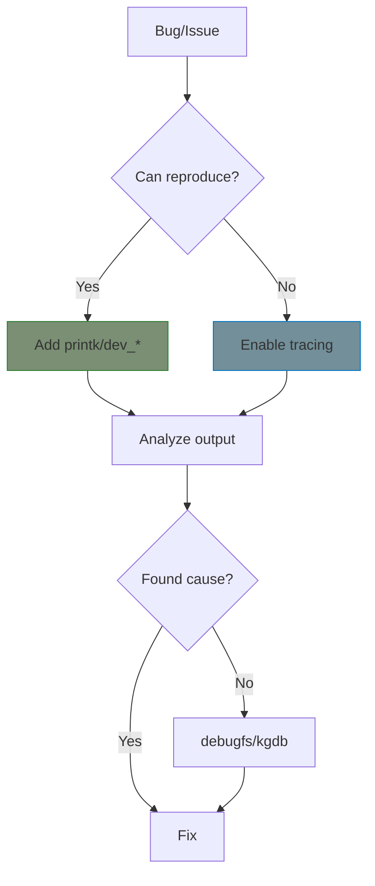

# Appendix A: Debugging

Practical debugging techniques for kernel driver development.

## Debugging Strategy



## Tools Overview

| Tool | Use For | Overhead |
|------|---------|----------|
| `printk`/`dev_*` | Quick debugging, always available | Low |
| Dynamic debug | Enable/disable at runtime | Very low |
| ftrace | Function flow, latency | Medium |
| kprobes | Inspect without recompile | Medium |
| KGDB | Interactive debugging | High |
| kdump/crash | Post-mortem analysis | None (captures on crash) |

## Chapters

| Chapter | What You'll Learn |
|---------|-------------------|
| [Logging]() | printk, dev_*, dynamic debug |
| [Tracing]() | ftrace, kprobes |
| [Crash Analysis]() | kdump and crash tool |

## Quick Reference

```bash
# View kernel log
dmesg -w

# Filter by driver
dmesg | grep my_driver

# Enable dynamic debug
echo 'module my_driver +p' > /sys/kernel/debug/dynamic_debug/control

# View function trace
echo function > /sys/kernel/debug/tracing/current_tracer
cat /sys/kernel/debug/tracing/trace
```

## Further Reading

- [Kernel Debugging](https://docs.kernel.org/dev-tools/index.html) - Official docs
- [Dynamic Debug](https://docs.kernel.org/admin-guide/dynamic-debug-howto.html)
- [ftrace](https://docs.kernel.org/trace/ftrace.html)
