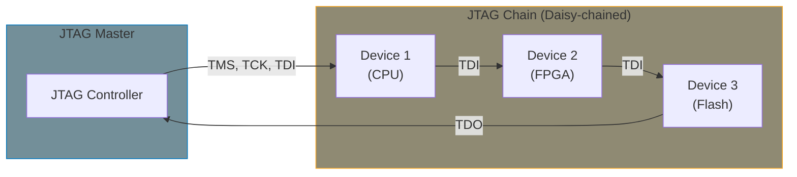
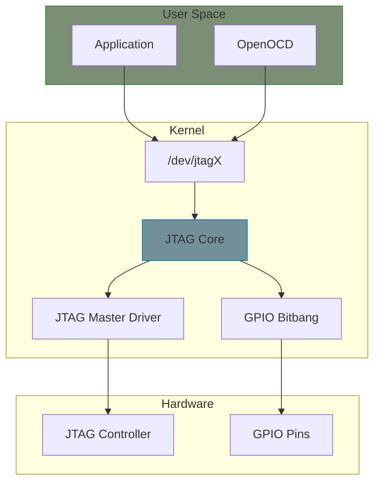

# JTAG Master and Device Drivers

This appendix covers JTAG (Joint Test Action Group) drivers in Linux: master controllers that drive the JTAG interface and device drivers that communicate with targets on the JTAG chain.

## JTAG Overview

JTAG is a serial interface for debugging, programming, and boundary-scan testing:



### JTAG Signals

| Signal | Direction | Purpose |
|--------|-----------|---------|
| **TCK** | Master → Device | Test Clock |
| **TMS** | Master → Device | Test Mode Select (state machine) |
| **TDI** | Master → Device | Test Data In |
| **TDO** | Device → Master | Test Data Out |
| **TRST** | Master → Device | Test Reset (optional) |

### TAP State Machine

```
                    ┌──────────────────┐
        ┌──────────►│   Test-Logic-   │◄──────────┐
        │           │     Reset       │           │
        │           └────────┬────────┘           │
        │                    │ TMS=0              │ TMS=1
        │           ┌────────▼────────┐           │
        │           │   Run-Test/     │───────────┤
        │           │     Idle        │           │
        │           └────────┬────────┘           │
        │                    │ TMS=1              │
        │     ┌──────────────┴──────────────┐     │
        │     │                             │     │
        │  DR Path                       IR Path  │
        │     │                             │     │
```

## Linux JTAG Subsystem

The Linux JTAG subsystem (added in kernel 5.x) provides:



## JTAG Master Driver

### Core Structures

```c
#include <linux/jtag.h>

struct jtag_ops {
    int (*freq_get)(struct jtag *jtag, u32 *freq);
    int (*freq_set)(struct jtag *jtag, u32 freq);
    int (*status_get)(struct jtag *jtag, u32 *state);
    int (*status_set)(struct jtag *jtag,
                      struct jtag_tap_state *endstate);
    int (*xfer)(struct jtag *jtag, struct jtag_xfer *xfer,
                u8 *tdio);
    int (*mode_set)(struct jtag *jtag, struct jtag_mode *mode);
    int (*bitbang)(struct jtag *jtag, struct tck_bitbang *tck);
    int (*enable)(struct jtag *jtag);
    int (*disable)(struct jtag *jtag);
};

struct jtag {
    struct device dev;
    int id;
    const struct jtag_ops *ops;
    struct mutex lock;
    /* Private data follows */
};
```

### Registering a JTAG Master

```c
#include <linux/jtag.h>
#include <linux/platform_device.h>

struct my_jtag_master {
    struct jtag *jtag;
    void __iomem *regs;
    struct clk *clk;
    u32 freq;
};

static int my_jtag_freq_get(struct jtag *jtag, u32 *freq)
{
    struct my_jtag_master *master = jtag_priv(jtag);
    *freq = master->freq;
    return 0;
}

static int my_jtag_freq_set(struct jtag *jtag, u32 freq)
{
    struct my_jtag_master *master = jtag_priv(jtag);

    /* Configure hardware clock divider */
    u32 div = clk_get_rate(master->clk) / freq;
    writel(div, master->regs + JTAG_CLK_DIV);

    master->freq = freq;
    return 0;
}

static int my_jtag_status_get(struct jtag *jtag, u32 *state)
{
    struct my_jtag_master *master = jtag_priv(jtag);

    /* Read current TAP state from hardware */
    *state = readl(master->regs + JTAG_TAP_STATE);
    return 0;
}

static int my_jtag_status_set(struct jtag *jtag,
                               struct jtag_tap_state *endstate)
{
    struct my_jtag_master *master = jtag_priv(jtag);

    /* Navigate TAP state machine */
    writel(endstate->endstate, master->regs + JTAG_TAP_TARGET);
    writel(endstate->reset, master->regs + JTAG_CTRL);

    /* Wait for state transition */
    return readl_poll_timeout(master->regs + JTAG_STATUS,
                               val, val & JTAG_READY,
                               10, 1000);
}

static int my_jtag_xfer(struct jtag *jtag, struct jtag_xfer *xfer,
                         u8 *tdio)
{
    struct my_jtag_master *master = jtag_priv(jtag);
    int i;

    /* Configure transfer */
    writel(xfer->length, master->regs + JTAG_XFER_LEN);
    writel(xfer->type, master->regs + JTAG_XFER_TYPE);
    writel(xfer->direction, master->regs + JTAG_XFER_DIR);
    writel(xfer->endstate, master->regs + JTAG_XFER_END);

    /* Write TDI data */
    for (i = 0; i < DIV_ROUND_UP(xfer->length, 8); i++)
        writel(tdio[i], master->regs + JTAG_TDI_DATA);

    /* Start transfer */
    writel(JTAG_START, master->regs + JTAG_CTRL);

    /* Wait for completion */
    if (wait_for_completion_timeout(&master->xfer_done,
                                     msecs_to_jiffies(1000)) == 0)
        return -ETIMEDOUT;

    /* Read TDO data */
    if (xfer->direction == JTAG_READ_XFER ||
        xfer->direction == JTAG_READ_WRITE_XFER) {
        for (i = 0; i < DIV_ROUND_UP(xfer->length, 8); i++)
            tdio[i] = readl(master->regs + JTAG_TDO_DATA);
    }

    return 0;
}

static const struct jtag_ops my_jtag_ops = {
    .freq_get = my_jtag_freq_get,
    .freq_set = my_jtag_freq_set,
    .status_get = my_jtag_status_get,
    .status_set = my_jtag_status_set,
    .xfer = my_jtag_xfer,
};

static int my_jtag_probe(struct platform_device *pdev)
{
    struct my_jtag_master *master;
    struct jtag *jtag;

    master = devm_kzalloc(&pdev->dev, sizeof(*master), GFP_KERNEL);
    if (!master)
        return -ENOMEM;

    master->regs = devm_platform_ioremap_resource(pdev, 0);
    if (IS_ERR(master->regs))
        return PTR_ERR(master->regs);

    master->clk = devm_clk_get(&pdev->dev, NULL);
    if (IS_ERR(master->clk))
        return PTR_ERR(master->clk);

    clk_prepare_enable(master->clk);

    /* Allocate and register JTAG device */
    jtag = jtag_alloc(&pdev->dev, sizeof(*master), &my_jtag_ops);
    if (!jtag)
        return -ENOMEM;

    master->jtag = jtag;
    jtag_set_drvdata(jtag, master);
    platform_set_drvdata(pdev, master);

    return jtag_register(jtag);
}

static int my_jtag_remove(struct platform_device *pdev)
{
    struct my_jtag_master *master = platform_get_drvdata(pdev);

    jtag_unregister(master->jtag);
    jtag_free(master->jtag);
    clk_disable_unprepare(master->clk);

    return 0;
}
```

## GPIO Bitbang JTAG

For systems without dedicated JTAG hardware:

```c
#include <linux/gpio/consumer.h>
#include <linux/jtag.h>
#include <linux/delay.h>

struct gpio_jtag {
    struct jtag *jtag;
    struct gpio_desc *tck;
    struct gpio_desc *tms;
    struct gpio_desc *tdi;
    struct gpio_desc *tdo;
    struct gpio_desc *trst;
    u32 freq;
    u32 delay_ns;
};

static void gpio_jtag_clock(struct gpio_jtag *gjtag)
{
    gpiod_set_value(gjtag->tck, 1);
    ndelay(gjtag->delay_ns);
    gpiod_set_value(gjtag->tck, 0);
    ndelay(gjtag->delay_ns);
}

static void gpio_jtag_tms_seq(struct gpio_jtag *gjtag,
                               u32 bits, u32 count)
{
    int i;

    for (i = 0; i < count; i++) {
        gpiod_set_value(gjtag->tms, (bits >> i) & 1);
        gpio_jtag_clock(gjtag);
    }
}

static int gpio_jtag_xfer(struct jtag *jtag, struct jtag_xfer *xfer,
                           u8 *tdio)
{
    struct gpio_jtag *gjtag = jtag_priv(jtag);
    int i, bit;
    u8 tdo_byte = 0;

    /* Move to appropriate state (Shift-DR or Shift-IR) */
    if (xfer->type == JTAG_SIR_XFER) {
        /* Run-Test/Idle -> Select-DR -> Select-IR -> Capture-IR -> Shift-IR */
        gpio_jtag_tms_seq(gjtag, 0b0011, 4);
    } else {
        /* Run-Test/Idle -> Select-DR -> Capture-DR -> Shift-DR */
        gpio_jtag_tms_seq(gjtag, 0b001, 3);
    }

    /* Shift data */
    for (i = 0; i < xfer->length; i++) {
        int byte_idx = i / 8;
        int bit_idx = i % 8;
        int is_last = (i == xfer->length - 1);

        /* Set TDI */
        if (xfer->direction != JTAG_READ_XFER)
            gpiod_set_value(gjtag->tdi, (tdio[byte_idx] >> bit_idx) & 1);

        /* TMS=1 on last bit to exit Shift state */
        gpiod_set_value(gjtag->tms, is_last ? 1 : 0);

        /* Clock */
        gpiod_set_value(gjtag->tck, 1);
        ndelay(gjtag->delay_ns);

        /* Sample TDO */
        if (xfer->direction != JTAG_WRITE_XFER) {
            bit = gpiod_get_value(gjtag->tdo);
            if (bit)
                tdo_byte |= (1 << bit_idx);
            if (bit_idx == 7 || is_last) {
                tdio[byte_idx] = tdo_byte;
                tdo_byte = 0;
            }
        }

        gpiod_set_value(gjtag->tck, 0);
        ndelay(gjtag->delay_ns);
    }

    /* Move to end state */
    /* Exit1 -> Update -> Run-Test/Idle */
    gpio_jtag_tms_seq(gjtag, 0b01, 2);

    return 0;
}

static int gpio_jtag_freq_set(struct jtag *jtag, u32 freq)
{
    struct gpio_jtag *gjtag = jtag_priv(jtag);

    gjtag->freq = freq;
    gjtag->delay_ns = 1000000000UL / (2 * freq);

    return 0;
}

static const struct jtag_ops gpio_jtag_ops = {
    .freq_get = gpio_jtag_freq_get,
    .freq_set = gpio_jtag_freq_set,
    .status_get = gpio_jtag_status_get,
    .status_set = gpio_jtag_status_set,
    .xfer = gpio_jtag_xfer,
};

static int gpio_jtag_probe(struct platform_device *pdev)
{
    struct gpio_jtag *gjtag;
    struct jtag *jtag;

    gjtag = devm_kzalloc(&pdev->dev, sizeof(*gjtag), GFP_KERNEL);

    /* Get GPIOs */
    gjtag->tck = devm_gpiod_get(&pdev->dev, "tck", GPIOD_OUT_LOW);
    gjtag->tms = devm_gpiod_get(&pdev->dev, "tms", GPIOD_OUT_HIGH);
    gjtag->tdi = devm_gpiod_get(&pdev->dev, "tdi", GPIOD_OUT_LOW);
    gjtag->tdo = devm_gpiod_get(&pdev->dev, "tdo", GPIOD_IN);
    gjtag->trst = devm_gpiod_get_optional(&pdev->dev, "trst", GPIOD_OUT_HIGH);

    /* Default frequency */
    gjtag->freq = 1000000;  /* 1 MHz */
    gjtag->delay_ns = 500;

    jtag = jtag_alloc(&pdev->dev, sizeof(*gjtag), &gpio_jtag_ops);
    jtag_set_drvdata(jtag, gjtag);

    return jtag_register(jtag);
}
```

### Device Tree Binding

```dts
jtag-gpio {
    compatible = "linux,jtag-gpio";
    tck-gpios = <&gpio0 0 GPIO_ACTIVE_HIGH>;
    tms-gpios = <&gpio0 1 GPIO_ACTIVE_HIGH>;
    tdi-gpios = <&gpio0 2 GPIO_ACTIVE_HIGH>;
    tdo-gpios = <&gpio0 3 GPIO_ACTIVE_HIGH>;
    trst-gpios = <&gpio0 4 GPIO_ACTIVE_LOW>;
};
```

## User-Space Interface

### /dev/jtagX Character Device

```c
/* User-space JTAG access */
#include <linux/jtag.h>
#include <sys/ioctl.h>
#include <fcntl.h>

int fd = open("/dev/jtag0", O_RDWR);

/* Get current frequency */
u32 freq;
ioctl(fd, JTAG_IOCFREQ, &freq);

/* Set frequency */
freq = 10000000;  /* 10 MHz */
ioctl(fd, JTAG_SIOCFREQ, &freq);

/* Get TAP state */
u32 state;
ioctl(fd, JTAG_IOCSTATE, &state);

/* Move to specific state */
struct jtag_tap_state tap_state = {
    .endstate = JTAG_STATE_IDLE,
    .reset = 0,
};
ioctl(fd, JTAG_SIOCSTATE, &tap_state);

/* Perform IR scan */
struct jtag_xfer xfer = {
    .type = JTAG_SIR_XFER,
    .direction = JTAG_WRITE_XFER,
    .length = 4,  /* 4-bit IR */
    .endstate = JTAG_STATE_IDLE,
};
u8 ir_data = 0x0E;  /* IDCODE instruction */
ioctl(fd, JTAG_IOCXFER, &xfer);
write(fd, &ir_data, 1);

/* Perform DR scan to read IDCODE */
xfer.type = JTAG_SDR_XFER;
xfer.direction = JTAG_READ_XFER;
xfer.length = 32;  /* 32-bit IDCODE */
ioctl(fd, JTAG_IOCXFER, &xfer);
u32 idcode;
read(fd, &idcode, 4);
printf("IDCODE: 0x%08x\n", idcode);

close(fd);
```

### JTAG IOCTL Commands

| Command | Direction | Description |
|---------|-----------|-------------|
| `JTAG_IOCFREQ` | Read | Get clock frequency |
| `JTAG_SIOCFREQ` | Write | Set clock frequency |
| `JTAG_IOCSTATE` | Read | Get current TAP state |
| `JTAG_SIOCSTATE` | Write | Set TAP state |
| `JTAG_IOCXFER` | R/W | Configure transfer |
| `JTAG_SIOCMODE` | Write | Set JTAG mode |
| `JTAG_IOCBITBANG` | R/W | Direct pin control |

## OpenOCD Integration

OpenOCD can use Linux JTAG drivers:

```cfg
# OpenOCD configuration for Linux JTAG
adapter driver linuxjtag
linuxjtag device /dev/jtag0

# Target configuration
transport select jtag
adapter speed 1000

# Example: ARM Cortex-M target
source [find target/stm32f4x.cfg]
```

### Custom OpenOCD Interface

```c
/* OpenOCD interface driver for custom JTAG master */
#include <jtag/interface.h>

static int linux_jtag_init(void)
{
    fd = open("/dev/jtag0", O_RDWR);
    if (fd < 0)
        return ERROR_JTAG_INIT_FAILED;
    return ERROR_OK;
}

static int linux_jtag_quit(void)
{
    close(fd);
    return ERROR_OK;
}

static int linux_jtag_speed(int speed)
{
    u32 freq = speed * 1000;
    return ioctl(fd, JTAG_SIOCFREQ, &freq);
}

static int linux_jtag_execute_queue(void)
{
    struct jtag_command *cmd;

    for (cmd = jtag_command_queue; cmd; cmd = cmd->next) {
        switch (cmd->type) {
        case JTAG_SCAN:
            linux_jtag_scan(cmd);
            break;
        case JTAG_STATEMOVE:
            linux_jtag_statemove(cmd);
            break;
        /* ... other commands ... */
        }
    }
    return ERROR_OK;
}

struct adapter_driver linux_jtag_adapter = {
    .name = "linuxjtag",
    .init = linux_jtag_init,
    .quit = linux_jtag_quit,
    .speed = linux_jtag_speed,
    .jtag_ops = &linux_jtag_jtag_ops,
};
```

## JTAG Device Drivers

For devices accessible via JTAG (e.g., CPLDs, FPGAs):

```c
struct jtag_device {
    struct device dev;
    struct jtag *master;
    u32 idcode;
    u8 ir_length;
    /* Position in chain */
    u8 chain_pos;
    u8 devices_before;  /* IR bits before this device */
    u8 devices_after;   /* IR bits after this device */
};

/* Read device IDCODE */
static int jtag_device_read_idcode(struct jtag_device *jdev, u32 *idcode)
{
    struct jtag_xfer xfer;
    u8 ir = JTAG_IR_IDCODE;
    int ret;

    /* Scan IR with IDCODE instruction */
    xfer.type = JTAG_SIR_XFER;
    xfer.direction = JTAG_WRITE_XFER;
    xfer.length = jdev->ir_length;
    xfer.endstate = JTAG_STATE_IDLE;

    ret = jtag_xfer(jdev->master, &xfer, &ir);
    if (ret)
        return ret;

    /* Scan DR to read IDCODE */
    xfer.type = JTAG_SDR_XFER;
    xfer.direction = JTAG_READ_XFER;
    xfer.length = 32;

    return jtag_xfer(jdev->master, &xfer, (u8 *)idcode);
}

/* Program FPGA via JTAG */
static int jtag_fpga_program(struct jtag_device *jdev,
                              const u8 *bitstream, size_t len)
{
    struct jtag_xfer xfer;
    u8 ir;
    int ret;

    /* CFG_IN instruction */
    ir = FPGA_IR_CFG_IN;
    xfer.type = JTAG_SIR_XFER;
    xfer.direction = JTAG_WRITE_XFER;
    xfer.length = jdev->ir_length;
    ret = jtag_xfer(jdev->master, &xfer, &ir);
    if (ret)
        return ret;

    /* Send bitstream */
    xfer.type = JTAG_SDR_XFER;
    xfer.direction = JTAG_WRITE_XFER;
    xfer.length = len * 8;
    ret = jtag_xfer(jdev->master, &xfer, (u8 *)bitstream);
    if (ret)
        return ret;

    /* JSTART instruction */
    ir = FPGA_IR_JSTART;
    xfer.type = JTAG_SIR_XFER;
    xfer.length = jdev->ir_length;
    ret = jtag_xfer(jdev->master, &xfer, &ir);

    return ret;
}
```

## JTAG over USB Adapters

Many JTAG adapters connect via USB:

```c
/* USB JTAG adapter driver combining USB and JTAG subsystems */
struct usb_jtag_adapter {
    struct usb_device *udev;
    struct usb_interface *intf;
    struct jtag *jtag;

    u8 bulk_in;
    u8 bulk_out;

    struct mutex lock;
};

static int usb_jtag_xfer(struct jtag *jtag, struct jtag_xfer *xfer,
                          u8 *tdio)
{
    struct usb_jtag_adapter *adapter = jtag_priv(jtag);
    u8 cmd[64];
    int ret, actual;

    /* Build adapter-specific command */
    cmd[0] = USB_JTAG_CMD_XFER;
    cmd[1] = xfer->type;
    cmd[2] = xfer->direction;
    cmd[3] = xfer->length & 0xff;
    cmd[4] = (xfer->length >> 8) & 0xff;
    memcpy(&cmd[5], tdio, DIV_ROUND_UP(xfer->length, 8));

    /* Send command */
    ret = usb_bulk_msg(adapter->udev,
                       usb_sndbulkpipe(adapter->udev, adapter->bulk_out),
                       cmd, 5 + DIV_ROUND_UP(xfer->length, 8),
                       &actual, 1000);
    if (ret)
        return ret;

    /* Receive response */
    if (xfer->direction != JTAG_WRITE_XFER) {
        ret = usb_bulk_msg(adapter->udev,
                           usb_rcvbulkpipe(adapter->udev, adapter->bulk_in),
                           tdio, DIV_ROUND_UP(xfer->length, 8),
                           &actual, 1000);
    }

    return ret;
}

static int usb_jtag_probe(struct usb_interface *intf,
                           const struct usb_device_id *id)
{
    struct usb_jtag_adapter *adapter;
    struct jtag *jtag;

    adapter = kzalloc(sizeof(*adapter), GFP_KERNEL);
    adapter->udev = interface_to_usbdev(intf);
    adapter->intf = intf;

    /* Find endpoints... */

    jtag = jtag_alloc(&intf->dev, sizeof(*adapter), &usb_jtag_ops);
    jtag_set_drvdata(jtag, adapter);
    adapter->jtag = jtag;

    usb_set_intfdata(intf, adapter);

    return jtag_register(jtag);
}
```

## Summary

| Component | Purpose |
|-----------|---------|
| **JTAG Master** | Drives TCK, TMS, TDI; samples TDO |
| **JTAG Core** | Provides `/dev/jtagX` interface |
| **GPIO Bitbang** | Software JTAG via GPIO pins |
| **USB Adapter** | JTAG over USB (FT2232, etc.) |
| **Device Driver** | Communicate with specific targets |

### Key APIs

| Function | Purpose |
|----------|---------|
| `jtag_alloc()` | Allocate JTAG master |
| `jtag_register()` | Register with subsystem |
| `jtag_xfer()` | Perform IR/DR scan |
| `jtag_priv()` | Get driver private data |

## Further Reading

- [Linux JTAG Subsystem](https://docs.kernel.org/driver-api/jtag.html) - Kernel documentation
- [IEEE 1149.1](https://standards.ieee.org/standard/1149_1-2013.html) - JTAG standard
- [OpenOCD](https://openocd.org/) - Open On-Chip Debugger
- [JTAG Boundary Scan](https://www.asset-intertech.com/resources/jtag-boundary-scan-tutorial) - Tutorial
