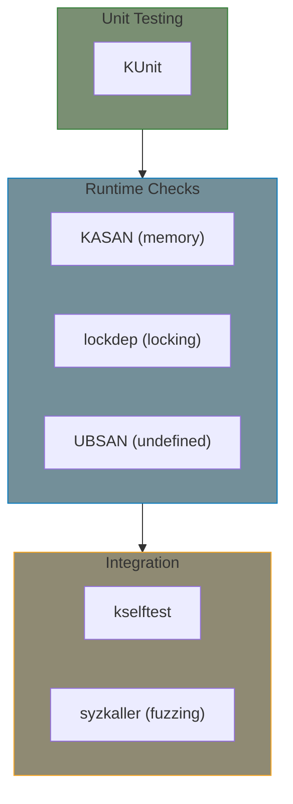

# Appendix E: Testing

Testing strategies for kernel drivers.

## Testing Layers



## Quick Start

| Tool | Purpose | Enable |
|------|---------|--------|
| KUnit | Unit tests | `CONFIG_KUNIT=y` |
| KASAN | Memory bugs | `CONFIG_KASAN=y` |
| lockdep | Lock issues | `CONFIG_PROVE_LOCKING=y` |
| UBSAN | Undefined behavior | `CONFIG_UBSAN=y` |

## Chapters

| Chapter | What You'll Learn |
|---------|-------------------|
| [KUnit]() | Writing unit tests |
| [Runtime Checks]() | KASAN, lockdep, UBSAN |

## Example

- **[KUnit Test](../examples/appendices/kunit-test/)** - Example test module

## Recommended Config

```kconfig
# Debug options
CONFIG_DEBUG_INFO=y
CONFIG_DEBUG_KERNEL=y

# Memory debugging
CONFIG_KASAN=y
CONFIG_KASAN_INLINE=y

# Lock debugging
CONFIG_PROVE_LOCKING=y
CONFIG_DEBUG_LOCK_ALLOC=y

# Undefined behavior
CONFIG_UBSAN=y

# Unit testing
CONFIG_KUNIT=y
```

## Further Reading

- [Kernel Testing Guide](https://docs.kernel.org/dev-tools/testing-overview.html)
- [KUnit](https://docs.kernel.org/dev-tools/kunit/index.html)
- [KASAN](https://docs.kernel.org/dev-tools/kasan.html)
