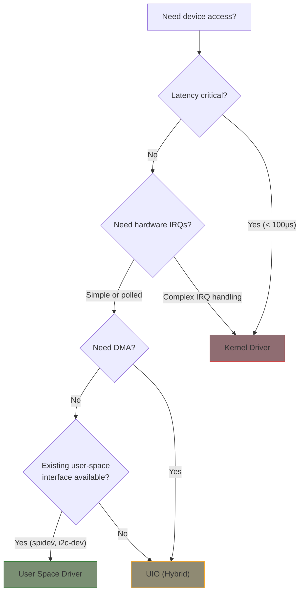

# User Space Drivers

Not every device needs a kernel driver. User space drivers offer faster development, easier debugging, and no risk of kernel crashes — at the cost of higher latency and limited interrupt access.

## When to Use User Space vs Kernel



## Comparison

| Feature | Kernel Driver | UIO | spidev/i2c-dev | libgpiod |
|---------|--------------|-----|----------------|----------|
| Latency | Lowest | Low | Medium | Medium |
| Debugging | Hard (printk, KGDB) | Easy (gdb) | Easy | Easy |
| Crash impact | Kernel panic | Process crash | Process crash | Process crash |
| IRQ support | Full | Notification only | None | Edge events |
| Language | C only | Any | Any | Any (C, Python) |
| Deployment | Recompile kernel/module | Module + app | Config only | Userspace only |

## UIO (Userspace I/O)

UIO provides the minimum kernel stub needed to expose device memory and interrupt notification to user space. The kernel module handles only what *must* be in kernel space (memory mapping, IRQ acknowledgment), while the actual driver logic runs in user space.

### Kernel Side

```c
#include <linux/module.h>
#include <linux/platform_device.h>
#include <linux/uio_driver.h>

struct my_uio_dev {
    struct uio_info info;
    void __iomem *regs;
};

static irqreturn_t my_uio_irq_handler(int irq, struct uio_info *info)
{
    struct my_uio_dev *dev = info->priv;

    /* Acknowledge the interrupt in hardware */
    writel(0x1, dev->regs + IRQ_ACK_OFFSET);

    return IRQ_HANDLED;  /* UIO core notifies user space */
}

static int my_uio_probe(struct platform_device *pdev)
{
    struct my_uio_dev *dev;
    struct resource *res;

    dev = devm_kzalloc(&pdev->dev, sizeof(*dev), GFP_KERNEL);
    if (!dev)
        return -ENOMEM;

    res = platform_get_resource(pdev, IORESOURCE_MEM, 0);
    dev->regs = devm_ioremap_resource(&pdev->dev, res);
    if (IS_ERR(dev->regs))
        return PTR_ERR(dev->regs);

    dev->info.name = "my-uio-device";
    dev->info.version = "1.0";
    dev->info.irq = platform_get_irq(pdev, 0);
    dev->info.handler = my_uio_irq_handler;
    dev->info.priv = dev;

    /* Expose device memory to user space */
    dev->info.mem[0].addr = res->start;
    dev->info.mem[0].size = resource_size(res);
    dev->info.mem[0].memtype = UIO_MEM_PHYS;

    return devm_uio_register_device(&pdev->dev, &dev->info);
}
```

### User Space Side

```c
#include <stdio.h>
#include <fcntl.h>
#include <sys/mman.h>
#include <unistd.h>
#include <stdint.h>

int main(void)
{
    int fd;
    void *regs;
    uint32_t irq_count;

    /* Open UIO device */
    fd = open("/dev/uio0", O_RDWR);
    if (fd < 0) {
        perror("open");
        return 1;
    }

    /* Map device registers */
    regs = mmap(NULL, 4096, PROT_READ | PROT_WRITE,
                MAP_SHARED, fd, 0);
    if (regs == MAP_FAILED) {
        perror("mmap");
        close(fd);
        return 1;
    }

    /* Access hardware registers directly */
    uint32_t status = *(volatile uint32_t *)(regs + 0x00);
    printf("Device status: 0x%08x\n", status);

    /* Write to device */
    *(volatile uint32_t *)(regs + 0x04) = 0x01;

    /* Wait for interrupt (blocks until IRQ fires) */
    read(fd, &irq_count, sizeof(irq_count));
    printf("Interrupt #%u received\n", irq_count);

    munmap(regs, 4096);
    close(fd);
    return 0;
}
```

UIO is commonly used for FPGA devices, custom accelerators, and hardware where the register interface is simple but the protocol logic is complex.

## spidev and i2c-dev (User Space Bus Access)

These generic kernel drivers expose SPI and I2C buses directly to user space — useful for prototyping and devices that already have user space libraries.

### i2c-dev: User Space I2C

```c
#include <linux/i2c-dev.h>
#include <sys/ioctl.h>
#include <fcntl.h>
#include <unistd.h>

int read_i2c_register(int bus, int addr, uint8_t reg)
{
    char path[20];
    int fd;
    uint8_t val;

    snprintf(path, sizeof(path), "/dev/i2c-%d", bus);
    fd = open(path, O_RDWR);
    if (fd < 0)
        return -1;

    /* Set slave address */
    if (ioctl(fd, I2C_SLAVE, addr) < 0) {
        close(fd);
        return -1;
    }

    /* Write register address, then read value */
    write(fd, &reg, 1);
    read(fd, &val, 1);

    close(fd);
    return val;
}
```

Enable in device tree:
```dts
&i2c1 {
    status = "okay";
    /* No specific device node needed — i2c-dev exposes the bus */
};
```

### spidev: User Space SPI

```c
#include <linux/spi/spidev.h>
#include <sys/ioctl.h>

int spi_transfer(int fd, uint8_t *tx, uint8_t *rx, size_t len)
{
    struct spi_ioc_transfer xfer = {
        .tx_buf = (unsigned long)tx,
        .rx_buf = (unsigned long)rx,
        .len = len,
        .speed_hz = 1000000,  /* 1 MHz */
        .bits_per_word = 8,
    };

    return ioctl(fd, SPI_IOC_MESSAGE(1), &xfer);
}
```

Device tree binding:
```dts
&spi0 {
    spidev@0 {
        compatible = "linux,spidev";
        reg = <0>;
        spi-max-frequency = <10000000>;
    };
};
```

{: .warning }
`spidev` and `i2c-dev` bypass the kernel's driver model — no power management, no proper device binding. Use for prototyping; write a proper kernel driver for production.

## libgpiod: Modern User Space GPIO

libgpiod is the modern interface for GPIO access from user space, replacing the deprecated sysfs GPIO interface.

### Command-Line Tools

```bash
# List GPIO controllers
gpiodetect

# Show all lines on a chip
gpioinfo gpiochip0

# Read a GPIO value
gpioget gpiochip0 5

# Set a GPIO value
gpioset gpiochip0 5=1

# Monitor GPIO events (rising/falling edges)
gpiomon gpiochip0 5
```

### C API

```c
#include <gpiod.h>

int main(void)
{
    struct gpiod_chip *chip;
    struct gpiod_line *line;
    int val;

    chip = gpiod_chip_open("/dev/gpiochip0");
    if (!chip)
        return 1;

    line = gpiod_chip_get_line(chip, 5);
    if (!line) {
        gpiod_chip_close(chip);
        return 1;
    }

    /* Request as input */
    gpiod_line_request_input(line, "my-app");
    val = gpiod_line_get_value(line);
    printf("GPIO 5 = %d\n", val);

    /* Or request as output */
    gpiod_line_request_output(line, "my-app", 0);
    gpiod_line_set_value(line, 1);

    gpiod_chip_close(chip);
    return 0;
}
```

### Python

```python
import gpiod

chip = gpiod.Chip('gpiochip0')
line = chip.get_line(5)
line.request(consumer='my-app', type=gpiod.LINE_REQ_DIR_IN)
print(f"GPIO 5 = {line.get_value()}")
line.release()
```

libgpiod supports edge event monitoring, bulk operations, and works with any language that can call C libraries. See [GPIO Consumer API]() for the kernel-side counterpart.

## FUSE (Filesystem in Userspace)

FUSE lets you implement filesystem operations in user space. While not a traditional "driver," it's useful for virtual device interfaces:

```c
/* Minimal FUSE example (simplified) */
#include <fuse.h>

static int my_read(const char *path, char *buf, size_t size,
                   off_t offset, struct fuse_file_info *fi)
{
    const char *data = "Hello from device\n";
    size_t len = strlen(data);

    if (offset >= len)
        return 0;
    if (offset + size > len)
        size = len - offset;

    memcpy(buf, data + offset, size);
    return size;
}

static struct fuse_operations ops = {
    .read = my_read,
    /* .write, .open, .getattr, etc. */
};

int main(int argc, char *argv[])
{
    return fuse_main(argc, argv, &ops, NULL);
}
```

FUSE is best for network filesystems, archive browsers, and debugging tools. For device I/O, prefer UIO or bus-specific interfaces.

## Summary

| Approach | Best For |
|----------|----------|
| **UIO** | Custom hardware with simple register interfaces (FPGA, accelerators) |
| **spidev / i2c-dev** | Prototyping and devices with existing user-space libraries |
| **libgpiod** | GPIO control from scripts, applications, or non-C languages |
| **FUSE** | Virtual filesystems and debug interfaces |
| **Kernel driver** | Production devices needing low latency, DMA, or interrupt handling |

## Further Reading

- [UIO Documentation](https://docs.kernel.org/driver-api/uio-howto.html) - UIO HOWTO
- [spidev Documentation](https://docs.kernel.org/spi/spidev.html) - User space SPI access
- [i2c-dev Documentation](https://docs.kernel.org/i2c/dev-interface.html) - User space I2C access
- [libgpiod](https://git.kernel.org/pub/scm/libs/libgpiod/libgpiod.git/) - GPIO library source
- [FUSE Documentation](https://libfuse.github.io/doxygen/) - FUSE library reference
