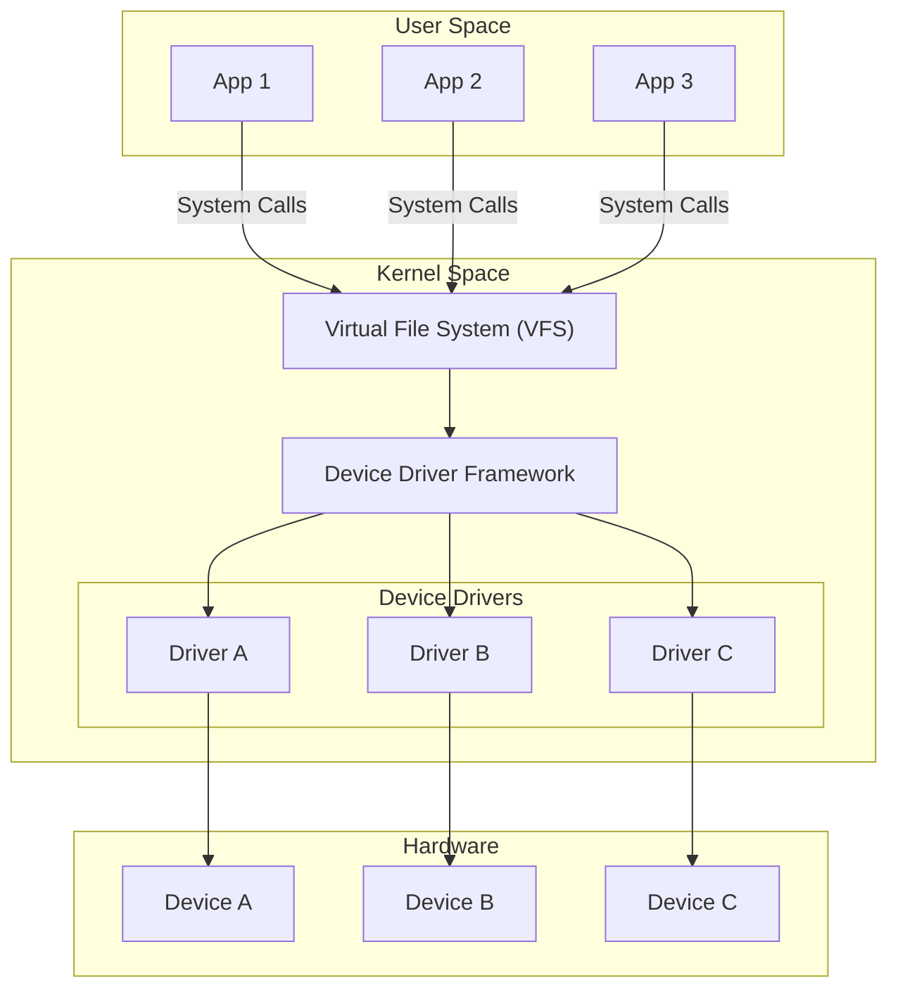

# Introduction to Linux Driver Development

Linux kernel drivers are the bridge between hardware and the operating system. They enable the kernel to communicate with everything from simple LEDs to complex network cards and storage devices.

## Why Learn Driver Development?

Driver development skills are valuable because:

- **Embedded systems**: IoT devices, automotive systems, and industrial equipment all need custom drivers
- **Hardware enablement**: New hardware requires driver support before it can be used
- **Performance optimization**: Custom drivers can outperform generic ones for specific use cases
- **Career opportunities**: Driver developers are in high demand across industries

## The Linux Kernel Driver Landscape

Linux supports various types of drivers:

### Character Devices
- Sequential data streams (serial ports, keyboards, sensors)
- Accessed via `/dev/` nodes (e.g., `/dev/ttyS0`)
- Simple interface: open, read, write, close, ioctl

### Block Devices
- Random-access storage (hard drives, SSDs, SD cards)
- Handles data in fixed-size blocks
- Supports filesystems and partitions

### Network Devices
- Network interfaces (Ethernet, WiFi)
- Packet-based communication
- Integration with networking stack

### Subsystem Drivers
- Specialized frameworks for common hardware types:
  - **I2C/SPI**: Low-speed serial peripherals
  - **GPIO**: Digital I/O pins
  - **PWM**: Pulse-width modulation outputs
  - **IIO**: Analog sensors (ADCs, accelerometers)
  - **HWMON**: Temperature, voltage, fan sensors
  - And many more...

## Kernel vs User Space

Understanding the boundary between kernel and user space is fundamental:

### Key Differences

| Aspect | User Space | Kernel Space |
|--------|-----------|--------------|
| Memory access | Own process memory only | All physical memory |
| Crashes | Process dies | System panic (usually) |
| Debugging | GDB, print statements | printk, ftrace, KGDB |
| Libraries | Full C library (glibc) | Kernel API only |
| Preemption | Freely preemptible | Must manage carefully |
| Floating point | Available | Not available |

## This Guide's Approach

We take a practical, hands-on approach:

1. **Every concept has working code**: No abstract theory without implementation
2. **Docker-based environment**: Reproducible setup that works everywhere
3. **QEMU testing**: Test drivers without physical hardware
4. **Modern APIs**: Focus on kernel 6.x, not legacy interfaces
5. **Progressive learning**: Build complexity gradually

## Target Kernel Version

This guide targets **Linux 6.6 LTS** (Long Term Support), with notes for 6.1 LTS and 6.12 LTS where APIs differ.

{: .note }
LTS kernels are maintained for several years with security updates, making them ideal for production driver development.

## What You'll Build

By the end of this guide, you'll have built drivers covering:

- Character devices with full file operations
- I2C and SPI sensor drivers
- GPIO controllers and consumers
- IIO (Industrial I/O) data acquisition
- Platform drivers with device tree integration
- And much more...

## Next Steps

Let's get your development environment set up. Continue to [Environment Setup]().
