# PWM Subsystem

Pulse Width Modulation (PWM) is used to control motors, LEDs, fans, and other devices by varying the duty cycle of a signal. The Linux PWM subsystem provides a unified interface for PWM controllers and consumers.

## PWM Basics

```mermaid
flowchart LR
    subgraph Signal["PWM Signal"]
        direction TB
        P["Period (T)"]
        D["Duty Cycle"]
        H["High Time (ton)"]
        L["Low Time (toff)"]
    end

    subgraph Formula["Duty Cycle = ton / T × 100%"]
        DC25["25% Duty"]
        DC50["50% Duty"]
        DC75["75% Duty"]
    end

    P --> DC25
    P --> DC50
    P --> DC75

    style Signal fill:#738f99,stroke:#0277bd
    style Formula fill:#738f99,stroke:#0277bd
```



- **Period**: Time for one complete cycle (high + low)
- **Duty Cycle**: Percentage of time the signal is high
- **Frequency**: 1/Period (Hz)
- **Polarity**: Normal (high during duty) or inverted

## Linux PWM Architecture


## Key Structures

### pwm_chip

The `pwm_chip` represents a PWM controller:

```c
#include <linux/pwm.h>

struct pwm_chip {
    struct device *dev;           /* Parent device */
    const struct pwm_ops *ops;    /* PWM operations */
    int base;                     /* First PWM number (-1 for dynamic) */
    unsigned int npwm;            /* Number of PWM channels */
    struct pwm_device *pwms;      /* Array of PWM devices */
    struct list_head list;        /* List entry */
};
```

### pwm_device

Represents a single PWM channel:

```c
struct pwm_device {
    const char *label;            /* Name for debugging */
    unsigned long flags;          /* PWM flags */
    unsigned int hwpwm;           /* Hardware PWM index */
    struct pwm_chip *chip;        /* Parent chip */
    void *chip_data;              /* Private chip data */
    struct pwm_state state;       /* Current state */
    struct pwm_state last;        /* Last applied state */
};
```

### pwm_state

Holds the configuration of a PWM channel:

```c
struct pwm_state {
    u64 period;                   /* Period in nanoseconds */
    u64 duty_cycle;               /* Duty cycle in nanoseconds */
    enum pwm_polarity polarity;   /* Normal or inverted */
    bool enabled;                 /* PWM enabled flag */
};
```

### pwm_ops

Operations implemented by PWM providers:

```c
struct pwm_ops {
    int (*request)(struct pwm_chip *chip, struct pwm_device *pwm);
    void (*free)(struct pwm_chip *chip, struct pwm_device *pwm);
    int (*capture)(struct pwm_chip *chip, struct pwm_device *pwm,
                   struct pwm_capture *result, unsigned long timeout);
    int (*apply)(struct pwm_chip *chip, struct pwm_device *pwm,
                 const struct pwm_state *state);
    int (*get_state)(struct pwm_chip *chip, struct pwm_device *pwm,
                     struct pwm_state *state);
};
```

## PWM Consumer API

### Getting a PWM

```c
#include <linux/pwm.h>

/* From Device Tree */
struct pwm_device *devm_pwm_get(struct device *dev, const char *con_id);

/* Optional variant */
struct pwm_device *devm_of_pwm_get(struct device *dev,
                                   struct device_node *np,
                                   const char *con_id);

/* Example usage */
static int my_probe(struct platform_device *pdev)
{
    struct pwm_device *pwm;

    pwm = devm_pwm_get(&pdev->dev, NULL);  /* Default PWM */
    if (IS_ERR(pwm))
        return dev_err_probe(&pdev->dev, PTR_ERR(pwm),
                             "Failed to get PWM\n");

    /* Or with a specific name */
    pwm = devm_pwm_get(&pdev->dev, "backlight");
    if (IS_ERR(pwm))
        return PTR_ERR(pwm);

    return 0;
}
```

### Configuring PWM

```c
/* Modern API using pwm_state */
struct pwm_state state;

/* Get current state */
pwm_get_state(pwm, &state);

/* Modify state */
state.period = 1000000;      /* 1ms = 1MHz */
state.duty_cycle = 500000;   /* 50% duty cycle */
state.polarity = PWM_POLARITY_NORMAL;
state.enabled = true;

/* Apply new state */
ret = pwm_apply_state(pwm, &state);
if (ret)
    return ret;
```

### Helper Functions

```c
/* Initialize state from current hardware */
pwm_init_state(pwm, &state);

/* Calculate duty cycle for percentage */
static inline u64 pwm_get_duty_cycle(unsigned int percent, u64 period)
{
    return DIV_ROUND_UP_ULL(percent * period, 100);
}

/* Enable/disable shortcuts */
int pwm_enable(struct pwm_device *pwm);
void pwm_disable(struct pwm_device *pwm);
```

## Device Tree Binding

### PWM Controller

```dts
pwm0: pwm@10000000 {
    compatible = "vendor,my-pwm";
    reg = <0x10000000 0x100>;
    #pwm-cells = <3>;     /* pwm-specifier: channel, period, flags */
    clocks = <&clk_pwm>;
};
```

### PWM Consumer

```dts
backlight {
    compatible = "pwm-backlight";
    pwms = <&pwm0 0 5000000 0>;  /* channel 0, 5ms period, no flags */
    brightness-levels = <0 4 8 16 32 64 128 255>;
    default-brightness-level = <6>;
};

fan {
    compatible = "pwm-fan";
    pwms = <&pwm0 1 40000 0>;    /* channel 1, 25kHz */
    cooling-levels = <0 102 170 230 255>;
};
```

### PWM Cell Formats

```dts
/* 2 cells: channel, period (ns) */
#pwm-cells = <2>;
pwms = <&pwm0 0 1000000>;

/* 3 cells: channel, period (ns), flags */
#pwm-cells = <3>;
pwms = <&pwm0 0 1000000 PWM_POLARITY_INVERTED>;
```

## sysfs Interface

PWM devices are exposed in `/sys/class/pwm/`:

```bash
# List PWM chips
ls /sys/class/pwm/

# Export a PWM channel
echo 0 > /sys/class/pwm/pwmchip0/export

# Configure PWM
echo 1000000 > /sys/class/pwm/pwmchip0/pwm0/period      # 1ms
echo 500000 > /sys/class/pwm/pwmchip0/pwm0/duty_cycle   # 50%
echo normal > /sys/class/pwm/pwmchip0/pwm0/polarity
echo 1 > /sys/class/pwm/pwmchip0/pwm0/enable

# Read current config
cat /sys/class/pwm/pwmchip0/pwm0/period
cat /sys/class/pwm/pwmchip0/pwm0/duty_cycle

# Unexport
echo 0 > /sys/class/pwm/pwmchip0/unexport
```

## Common Use Cases

### Backlight Control

```c
struct backlight_device {
    struct pwm_device *pwm;
    unsigned int max_brightness;
};

static int set_brightness(struct backlight_device *bl, int brightness)
{
    struct pwm_state state;

    pwm_get_state(bl->pwm, &state);

    state.duty_cycle = DIV_ROUND_UP_ULL(brightness * state.period,
                                        bl->max_brightness);
    state.enabled = brightness > 0;

    return pwm_apply_state(bl->pwm, &state);
}
```

### Fan Speed Control

```c
static int set_fan_speed(struct fan_device *fan, unsigned int percent)
{
    struct pwm_state state;

    if (percent > 100)
        percent = 100;

    pwm_get_state(fan->pwm, &state);
    state.duty_cycle = DIV_ROUND_UP_ULL(percent * state.period, 100);
    state.enabled = percent > 0;

    return pwm_apply_state(fan->pwm, &state);
}
```

## Summary

- PWM subsystem provides unified interface for PWM hardware
- `pwm_chip` represents a controller, `pwm_device` a channel
- Use `pwm_state` and `pwm_apply_state()` for configuration
- `devm_pwm_get()` for automatic resource management
- Device Tree specifies channel, period, and flags
- sysfs interface for userspace control

## Further Reading

- [PWM Framework Documentation](https://docs.kernel.org/driver-api/pwm.html) - Official kernel docs
- [PWM Subsystem](https://elixir.bootlin.com/linux/v6.6/source/drivers/pwm) - Kernel source
- [Device Tree PWM Bindings](https://docs.kernel.org/devicetree/bindings/pwm/pwm.html) - DT bindings

## Next

Learn how to implement a [PWM provider]() (pwm_chip).
