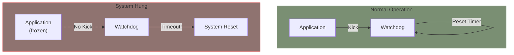
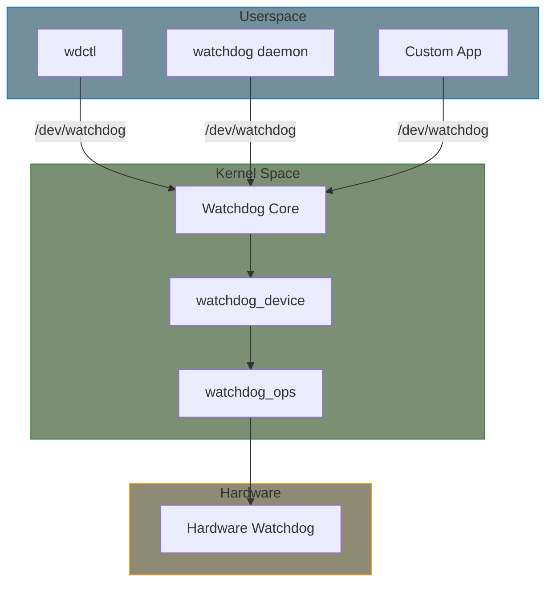

# Watchdog Subsystem

A watchdog timer is a hardware timer that resets the system if not periodically "kicked" (refreshed). This ensures system recovery from software hangs. The Linux watchdog subsystem provides a unified interface for watchdog hardware.

## Watchdog Basics



### Key Concepts

- **Timeout**: Time before watchdog triggers reset
- **Kick/Ping**: Refresh the watchdog timer
- **Pretimeout**: Optional warning before actual timeout
- **Nowayout**: Prevent watchdog from being stopped once started

## Linux Watchdog Architecture



## Key Structures

### watchdog_device

```c
#include <linux/watchdog.h>

struct watchdog_device {
    int id;                              /* Watchdog ID */
    struct device *parent;               /* Parent device */
    const struct attribute_group **groups; /* sysfs attribute groups */
    const struct watchdog_info *info;    /* Watchdog info */
    const struct watchdog_ops *ops;      /* Watchdog operations */
    const struct watchdog_governor *gov; /* Watchdog governor */
    unsigned int bootstatus;             /* Boot status flags */
    unsigned int timeout;                /* Current timeout (seconds) */
    unsigned int pretimeout;             /* Pretimeout (seconds) */
    unsigned int min_timeout;            /* Minimum timeout */
    unsigned int max_timeout;            /* Maximum timeout */
    unsigned int min_hw_heartbeat_ms;    /* Minimum hw heartbeat */
    unsigned int max_hw_heartbeat_ms;    /* Maximum hw heartbeat */
    struct notifier_block reboot_nb;     /* Reboot notifier */
    struct notifier_block restart_nb;    /* Restart notifier */
    void *driver_data;                   /* Driver private data */
    unsigned long status;                /* Internal status bits */
};
```

### watchdog_info

```c
struct watchdog_info {
    __u32 options;           /* Options the watchdog supports */
    __u32 firmware_version;  /* Firmware version */
    __u8  identity[32];      /* Watchdog identity string */
};

/* Option flags */
#define WDIOF_OVERHEAT      0x0001  /* Reset due to CPU overheat */
#define WDIOF_FANFAULT      0x0002  /* Fan failed */
#define WDIOF_EXTERN1       0x0004  /* External relay 1 */
#define WDIOF_EXTERN2       0x0008  /* External relay 2 */
#define WDIOF_POWERUNDER    0x0010  /* Power bad/undervoltage */
#define WDIOF_CARDRESET     0x0020  /* Card reset */
#define WDIOF_POWEROVER     0x0040  /* Power over limit */
#define WDIOF_SETTIMEOUT    0x0080  /* Can set timeout */
#define WDIOF_MAGICCLOSE    0x0100  /* Magic close character */
#define WDIOF_PRETIMEOUT    0x0200  /* Pretimeout supported */
#define WDIOF_ALARMONLY     0x0400  /* Alarm only, no reboot */
#define WDIOF_KEEPALIVEPING 0x8000  /* Keepalive ping reply */
```

### watchdog_ops

```c
struct watchdog_ops {
    struct module *owner;
    /* Start the watchdog */
    int (*start)(struct watchdog_device *wdd);
    /* Stop the watchdog */
    int (*stop)(struct watchdog_device *wdd);
    /* Ping/kick the watchdog */
    int (*ping)(struct watchdog_device *wdd);
    /* Get remaining time */
    unsigned int (*get_timeleft)(struct watchdog_device *wdd);
    /* Set timeout */
    int (*set_timeout)(struct watchdog_device *wdd, unsigned int timeout);
    /* Set pretimeout */
    int (*set_pretimeout)(struct watchdog_device *wdd, unsigned int timeout);
    /* Restart the system */
    int (*restart)(struct watchdog_device *wdd, unsigned long action,
                   void *data);
    /* ioctl handler */
    long (*ioctl)(struct watchdog_device *wdd, unsigned int cmd,
                  unsigned long arg);
};
```

## Userspace Interface

### Device Node

Watchdog is accessed via `/dev/watchdog` or `/dev/watchdog0`:

```c
#include <linux/watchdog.h>
#include <fcntl.h>
#include <unistd.h>
#include <sys/ioctl.h>

int fd = open("/dev/watchdog", O_RDWR);
if (fd < 0) {
    perror("Failed to open watchdog");
    return -1;
}

/* Start watchdog by opening the device */
/* Kick the watchdog */
write(fd, "k", 1);  /* Any write kicks */

/* Or use ioctl */
int dummy;
ioctl(fd, WDIOC_KEEPALIVE, &dummy);

/* Get timeout */
int timeout;
ioctl(fd, WDIOC_GETTIMEOUT, &timeout);
printf("Timeout: %d seconds\n", timeout);

/* Set timeout */
timeout = 30;
ioctl(fd, WDIOC_SETTIMEOUT, &timeout);

/* Magic close (allows closing without reset) */
write(fd, "V", 1);  /* Magic character */
close(fd);
```

### ioctl Commands

| Command | Description |
|---------|-------------|
| `WDIOC_GETSUPPORT` | Get watchdog_info |
| `WDIOC_GETSTATUS` | Get status |
| `WDIOC_GETBOOTSTATUS` | Get boot status |
| `WDIOC_KEEPALIVE` | Kick watchdog |
| `WDIOC_SETTIMEOUT` | Set timeout |
| `WDIOC_GETTIMEOUT` | Get timeout |
| `WDIOC_SETPRETIMEOUT` | Set pretimeout |
| `WDIOC_GETPRETIMEOUT` | Get pretimeout |
| `WDIOC_GETTIMELEFT` | Get time left |

### sysfs Interface

```bash
# View watchdog devices
ls /sys/class/watchdog/

# Watchdog info
cat /sys/class/watchdog/watchdog0/identity
cat /sys/class/watchdog/watchdog0/timeout
cat /sys/class/watchdog/watchdog0/timeleft
cat /sys/class/watchdog/watchdog0/state   # active/inactive

# Using wdctl tool
wdctl /dev/watchdog0
```

## Watchdog Daemon

For production systems, use a watchdog daemon:

```bash
# Install watchdog daemon
sudo apt-get install watchdog

# Configure /etc/watchdog.conf
watchdog-device = /dev/watchdog
watchdog-timeout = 60
interval = 30

# Enable and start
sudo systemctl enable watchdog
sudo systemctl start watchdog
```

## Device Tree Binding

```dts
watchdog@10000000 {
    compatible = "vendor,my-watchdog";
    reg = <0x10000000 0x100>;
    clocks = <&wdt_clk>;
    timeout-sec = <30>;              /* Default timeout */
};

/* With pretimeout interrupt */
watchdog@10001000 {
    compatible = "vendor,my-watchdog";
    reg = <0x10001000 0x100>;
    interrupts = <GIC_SPI 45 IRQ_TYPE_LEVEL_HIGH>;
    timeout-sec = <60>;
};
```

## Status Flags

```c
/* Status bits in watchdog_device.status */
#define WDOG_ACTIVE             0  /* Watchdog is running */
#define WDOG_NO_WAY_OUT         1  /* Nowayout enabled */
#define WDOG_STOP_ON_REBOOT     2  /* Stop on reboot */
#define WDOG_HW_RUNNING         3  /* Hardware is running */
#define WDOG_STOP_ON_UNREGISTER 4  /* Stop on unregister */

/* Helper macros */
static inline bool watchdog_active(struct watchdog_device *wdd)
{
    return test_bit(WDOG_ACTIVE, &wdd->status);
}

static inline bool watchdog_hw_running(struct watchdog_device *wdd)
{
    return test_bit(WDOG_HW_RUNNING, &wdd->status);
}
```

## Nowayout Mode

When nowayout is set, the watchdog cannot be stopped:

```c
static bool nowayout = WATCHDOG_NOWAYOUT;
module_param(nowayout, bool, 0444);
MODULE_PARM_DESC(nowayout, "Watchdog cannot be stopped once started");

/* In probe */
if (nowayout)
    watchdog_set_nowayout(wdd, nowayout);
```

The kernel config `CONFIG_WATCHDOG_NOWAYOUT` sets the default.

## Pretimeout

Pretimeout provides a warning before the actual timeout:

```c
static irqreturn_t pretimeout_handler(int irq, void *data)
{
    struct my_wdt *wdt = data;

    /* Notify watchdog core */
    watchdog_notify_pretimeout(&wdt->wdd);

    return IRQ_HANDLED;
}
```

Pretimeout governors can take different actions:
- `noop`: Do nothing
- `panic`: Trigger kernel panic
- `pretimeout_notifier`: Call notifier chain

## Summary

- Watchdog timers ensure system recovery from hangs
- `/dev/watchdog` provides userspace interface
- `watchdog_device` structure describes hardware capabilities
- Support for timeout, pretimeout, and nowayout
- Use watchdog daemon for production systems

## Further Reading

- [Watchdog Timer Driver Core](https://docs.kernel.org/watchdog/watchdog-kernel-api.html) - Kernel API docs
- [Watchdog Interface](https://docs.kernel.org/watchdog/watchdog-api.html) - Userspace API
- [Watchdog Drivers](https://elixir.bootlin.com/linux/v6.6/source/drivers/watchdog) - Driver implementations

## Next

Learn how to implement a [Watchdog driver]().
