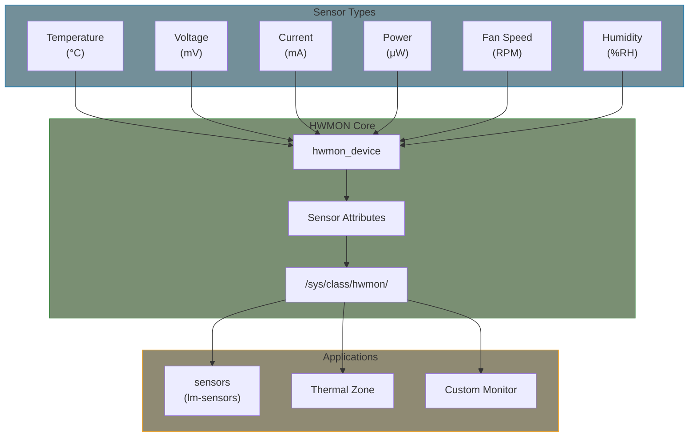
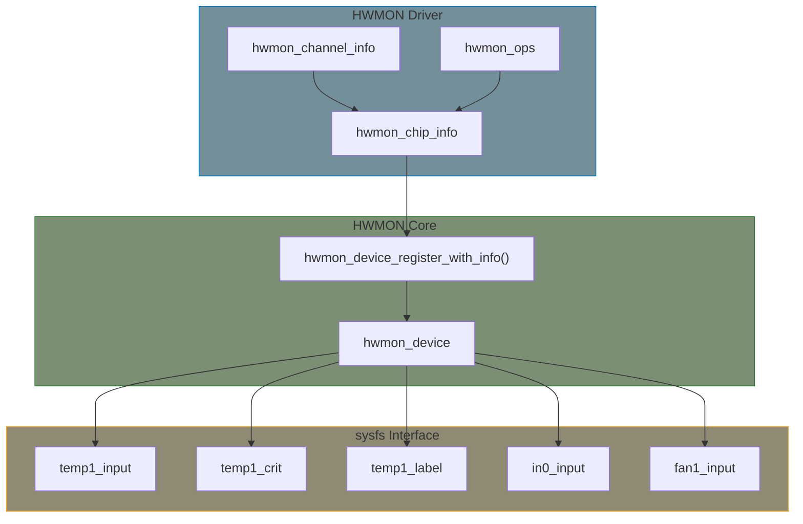

# HWMON Subsystem

The Hardware Monitoring (HWMON) subsystem provides a unified interface for monitoring hardware sensors: temperature, voltage, current, power, fan speed, and humidity.

## HWMON Basics



## Sensor Types and Units

| Type | sysfs Prefix | Unit | Scale |
|------|-------------|------|-------|
| Temperature | `temp` | °C | millidegree (1000 = 1°C) |
| Voltage | `in` | V | millivolt |
| Current | `curr` | A | milliamp |
| Power | `power` | W | microwatt |
| Fan Speed | `fan` | RPM | 1 RPM |
| Humidity | `humidity` | %RH | milli %RH (1000 = 1%) |
| Intrusion | `intrusion` | - | boolean |

## Linux HWMON Architecture



## Key Structures

### hwmon_chip_info

```c
#include <linux/hwmon.h>

struct hwmon_chip_info {
    const struct hwmon_ops *ops;
    const struct hwmon_channel_info * const *info;
};
```

### hwmon_channel_info

```c
struct hwmon_channel_info {
    enum hwmon_sensor_types type;
    const u32 *config;  /* Array of attribute configs */
};

/* Sensor types */
enum hwmon_sensor_types {
    hwmon_chip,
    hwmon_temp,
    hwmon_in,
    hwmon_curr,
    hwmon_power,
    hwmon_energy,
    hwmon_humidity,
    hwmon_fan,
    hwmon_pwm,
    hwmon_intrusion,
    hwmon_max,
};
```

### hwmon_ops

```c
struct hwmon_ops {
    umode_t (*is_visible)(const void *drvdata,
                          enum hwmon_sensor_types type,
                          u32 attr, int channel);
    int (*read)(struct device *dev, enum hwmon_sensor_types type,
                u32 attr, int channel, long *val);
    int (*read_string)(struct device *dev, enum hwmon_sensor_types type,
                       u32 attr, int channel, const char **str);
    int (*write)(struct device *dev, enum hwmon_sensor_types type,
                 u32 attr, int channel, long val);
};
```

## Channel Configuration Flags

### Temperature Attributes

```c
/* Temperature sensor attributes */
HWMON_T_INPUT        /* Current temperature */
HWMON_T_MAX          /* Maximum threshold */
HWMON_T_MAX_HYST     /* Maximum hysteresis */
HWMON_T_MIN          /* Minimum threshold */
HWMON_T_MIN_HYST     /* Minimum hysteresis */
HWMON_T_CRIT         /* Critical threshold */
HWMON_T_CRIT_HYST    /* Critical hysteresis */
HWMON_T_EMERGENCY    /* Emergency threshold */
HWMON_T_EMERGENCY_HYST
HWMON_T_LOWEST       /* Historical lowest */
HWMON_T_HIGHEST      /* Historical highest */
HWMON_T_LABEL        /* Sensor label */
HWMON_T_ALARM        /* Alarm status */
HWMON_T_FAULT        /* Fault status */
HWMON_T_OFFSET       /* Temperature offset */
```

### Voltage/Current/Power Attributes

```c
/* Voltage (in) */
HWMON_I_INPUT, HWMON_I_MIN, HWMON_I_MAX, HWMON_I_LABEL,
HWMON_I_ALARM, HWMON_I_CRIT, HWMON_I_LCRIT

/* Current (curr) */
HWMON_C_INPUT, HWMON_C_MIN, HWMON_C_MAX, HWMON_C_LABEL,
HWMON_C_ALARM, HWMON_C_CRIT, HWMON_C_LCRIT

/* Power */
HWMON_P_INPUT, HWMON_P_MIN, HWMON_P_MAX, HWMON_P_LABEL,
HWMON_P_ALARM, HWMON_P_CRIT
```

### Fan Attributes

```c
HWMON_F_INPUT        /* Current RPM */
HWMON_F_MIN          /* Minimum RPM */
HWMON_F_MAX          /* Maximum RPM */
HWMON_F_TARGET       /* Target RPM */
HWMON_F_LABEL        /* Fan label */
HWMON_F_ALARM        /* Alarm status */
HWMON_F_FAULT        /* Fault status */
HWMON_F_DIV          /* Fan divisor */
HWMON_F_PULSES       /* Pulses per revolution */
```

## sysfs Interface

```bash
# List HWMON devices
ls /sys/class/hwmon/

# Read sensor values
cat /sys/class/hwmon/hwmon0/name
cat /sys/class/hwmon/hwmon0/temp1_input   # millidegrees
cat /sys/class/hwmon/hwmon0/temp1_label
cat /sys/class/hwmon/hwmon0/in0_input     # millivolts
cat /sys/class/hwmon/hwmon0/fan1_input    # RPM

# Set thresholds (if writable)
echo 80000 > /sys/class/hwmon/hwmon0/temp1_max  # 80°C max

# Using lm-sensors
sensors
sensors -j  # JSON output
```

## sysfs Attribute Naming

```
<type><index>_<attribute>

Examples:
temp1_input    - Temperature sensor 1 input
temp2_max      - Temperature sensor 2 maximum
in0_input      - Voltage sensor 0 input
curr1_input    - Current sensor 1 input
fan1_input     - Fan 1 speed
```

## Common Use Cases

### System Temperature Monitoring

```bash
# Find CPU temperature
for hwmon in /sys/class/hwmon/hwmon*; do
    name=$(cat $hwmon/name 2>/dev/null)
    if [ "$name" = "coretemp" ] || [ "$name" = "k10temp" ]; then
        echo "CPU Temperature:"
        for temp in $hwmon/temp*_input; do
            val=$(cat $temp)
            echo "  $(basename $temp): $((val/1000))°C"
        done
    fi
done
```

### Thermal Zone Integration

HWMON devices can be thermal zone sources:

```dts
thermal_zones {
    cpu_thermal {
        polling-delay = <1000>;
        polling-delay-passive = <100>;

        thermal-sensors = <&temp_sensor 0>;

        trips {
            cpu_alert: cpu-alert {
                temperature = <80000>;  /* 80°C */
                hysteresis = <2000>;
                type = "passive";
            };
            cpu_crit: cpu-crit {
                temperature = <100000>; /* 100°C */
                hysteresis = <2000>;
                type = "critical";
            };
        };
    };
};
```

## Device Tree Binding

```dts
temp_sensor: sensor@48 {
    compatible = "vendor,temp-sensor";
    reg = <0x48>;
    #thermal-sensor-cells = <1>;
};

hwmon@4a {
    compatible = "vendor,power-monitor";
    reg = <0x4a>;
    shunt-resistor-micro-ohms = <10000>;  /* 10 mΩ */
};
```

## Summary

- HWMON provides unified sensor monitoring interface
- Uses specific units (millidegree, millivolt, etc.)
- `hwmon_chip_info` defines sensor configuration
- sysfs attributes follow `<type><n>_<attr>` naming
- Can integrate with thermal framework
- `lm-sensors` provides userspace tools

## Further Reading

- [HWMON Kernel API](https://docs.kernel.org/hwmon/hwmon-kernel-api.html) - Driver API documentation
- [HWMON sysfs Interface](https://docs.kernel.org/hwmon/sysfs-interface.html) - Attribute reference
- [HWMON Drivers](https://elixir.bootlin.com/linux/v6.6/source/drivers/hwmon) - Driver examples
- [lm-sensors](https://github.com/lm-sensors/lm-sensors) - Userspace tools

## Next

Learn how to implement an [HWMON driver]().
