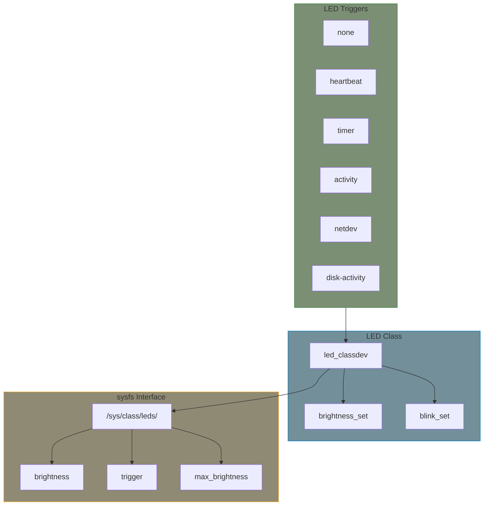

# LED Subsystem

The Linux LED subsystem provides a unified interface for controlling LEDs, supporting various features like brightness control, blinking patterns, and triggers.

## LED Basics



## Key Structures

### led_classdev

```c
#include <linux/leds.h>

struct led_classdev {
    const char *name;                  /* LED name in sysfs */
    unsigned int brightness;           /* Current brightness */
    unsigned int max_brightness;       /* Maximum brightness */
    int flags;                         /* LED flags */

    /* Set brightness (required) */
    void (*brightness_set)(struct led_classdev *led_cdev,
                          enum led_brightness brightness);

    /* Set brightness (blocking variant) */
    int (*brightness_set_blocking)(struct led_classdev *led_cdev,
                                   enum led_brightness brightness);

    /* Get brightness */
    enum led_brightness (*brightness_get)(struct led_classdev *led_cdev);

    /* Hardware blink support */
    int (*blink_set)(struct led_classdev *led_cdev,
                     unsigned long *delay_on,
                     unsigned long *delay_off);

    /* Pattern support */
    int (*pattern_set)(struct led_classdev *led_cdev,
                       struct led_pattern *pattern,
                       u32 len, int repeat);
    int (*pattern_clear)(struct led_classdev *led_cdev);

    struct device *dev;
    const struct attribute_group **groups;
    struct list_head node;
    const char *default_trigger;       /* Default trigger */
    struct led_trigger *trigger;
    /* ... */
};
```

### LED Brightness Levels

```c
enum led_brightness {
    LED_OFF     = 0,
    LED_ON      = 1,
    LED_HALF    = 127,
    LED_FULL    = 255,
};
```

### LED Flags

```c
#define LED_CORE_SUSPENDRESUME  BIT(0)  /* Core handles suspend/resume */
#define LED_SYSFS_DISABLE       BIT(1)  /* Disable sysfs interface */
#define LED_DEV_CAP_FLASH       BIT(2)  /* Has flash capability */
#define LED_HW_PLUGGABLE        BIT(3)  /* LED is hot-pluggable */
#define LED_PANIC_INDICATOR     BIT(4)  /* Indicate kernel panic */
#define LED_BRIGHT_HW_CHANGED   BIT(5)  /* Hardware changed brightness */
#define LED_RETAIN_AT_SHUTDOWN  BIT(6)  /* Keep LED state at shutdown */
```

## Simple LED Driver

```c
#include <linux/module.h>
#include <linux/platform_device.h>
#include <linux/leds.h>
#include <linux/gpio/consumer.h>

struct my_led {
    struct led_classdev cdev;
    struct gpio_desc *gpio;
};

static void my_led_brightness_set(struct led_classdev *cdev,
                                  enum led_brightness brightness)
{
    struct my_led *led = container_of(cdev, struct my_led, cdev);

    gpiod_set_value(led->gpio, brightness != LED_OFF);
}

static int my_led_probe(struct platform_device *pdev)
{
    struct my_led *led;
    int ret;

    led = devm_kzalloc(&pdev->dev, sizeof(*led), GFP_KERNEL);
    if (!led)
        return -ENOMEM;

    led->gpio = devm_gpiod_get(&pdev->dev, NULL, GPIOD_OUT_LOW);
    if (IS_ERR(led->gpio))
        return PTR_ERR(led->gpio);

    led->cdev.name = "my-led";
    led->cdev.brightness_set = my_led_brightness_set;
    led->cdev.max_brightness = 1;
    led->cdev.default_trigger = "heartbeat";

    ret = devm_led_classdev_register(&pdev->dev, &led->cdev);
    if (ret)
        return ret;

    platform_set_drvdata(pdev, led);
    return 0;
}

static const struct of_device_id my_led_of_match[] = {
    { .compatible = "vendor,my-led" },
    { }
};
MODULE_DEVICE_TABLE(of, my_led_of_match);

static struct platform_driver my_led_driver = {
    .probe = my_led_probe,
    .driver = {
        .name = "my-led",
        .of_match_table = my_led_of_match,
    },
};
module_platform_driver(my_led_driver);

MODULE_LICENSE("GPL");
```

## PWM LED Driver

```c
#include <linux/module.h>
#include <linux/platform_device.h>
#include <linux/leds.h>
#include <linux/pwm.h>

struct pwm_led {
    struct led_classdev cdev;
    struct pwm_device *pwm;
    unsigned int max_brightness;
};

static int pwm_led_brightness_set(struct led_classdev *cdev,
                                  enum led_brightness brightness)
{
    struct pwm_led *led = container_of(cdev, struct pwm_led, cdev);
    struct pwm_state state;

    pwm_get_state(led->pwm, &state);

    state.duty_cycle = DIV_ROUND_UP_ULL(brightness * state.period,
                                        led->max_brightness);
    state.enabled = brightness > 0;

    return pwm_apply_state(led->pwm, &state);
}

static int pwm_led_probe(struct platform_device *pdev)
{
    struct pwm_led *led;
    struct pwm_state state;
    int ret;

    led = devm_kzalloc(&pdev->dev, sizeof(*led), GFP_KERNEL);
    if (!led)
        return -ENOMEM;

    led->pwm = devm_pwm_get(&pdev->dev, NULL);
    if (IS_ERR(led->pwm))
        return dev_err_probe(&pdev->dev, PTR_ERR(led->pwm),
                             "Failed to get PWM\n");

    /* Initialize PWM */
    pwm_init_state(led->pwm, &state);
    state.period = 1000000;  /* 1ms = 1kHz */
    state.duty_cycle = 0;
    state.enabled = false;
    pwm_apply_state(led->pwm, &state);

    led->max_brightness = 255;

    led->cdev.name = "pwm-led";
    led->cdev.brightness_set_blocking = pwm_led_brightness_set;
    led->cdev.max_brightness = led->max_brightness;
    led->cdev.default_trigger = "none";

    ret = devm_led_classdev_register(&pdev->dev, &led->cdev);
    if (ret)
        return ret;

    platform_set_drvdata(pdev, led);
    return 0;
}

static const struct of_device_id pwm_led_of_match[] = {
    { .compatible = "pwm-leds" },
    { }
};
MODULE_DEVICE_TABLE(of, pwm_led_of_match);

static struct platform_driver pwm_led_driver = {
    .probe = pwm_led_probe,
    .driver = {
        .name = "pwm-leds",
        .of_match_table = pwm_led_of_match,
    },
};
module_platform_driver(pwm_led_driver);

MODULE_LICENSE("GPL");
```

## Hardware Blink Support

```c
static int my_led_blink_set(struct led_classdev *cdev,
                            unsigned long *delay_on,
                            unsigned long *delay_off)
{
    struct my_led *led = container_of(cdev, struct my_led, cdev);

    /* If hardware doesn't support requested timing, return -EINVAL
     * and the core will use software blinking */
    if (*delay_on < 50 || *delay_off < 50)
        return -EINVAL;

    /* Configure hardware blink */
    writel(*delay_on, led->regs + REG_BLINK_ON);
    writel(*delay_off, led->regs + REG_BLINK_OFF);
    writel(BLINK_ENABLE, led->regs + REG_CTRL);

    /* Return actual timing if adjusted */
    return 0;
}

/* In initialization */
led->cdev.blink_set = my_led_blink_set;
```

## LED Triggers

### Using Built-in Triggers

```bash
# List available triggers
cat /sys/class/leds/my-led/trigger
# [none] kbd-scrollock kbd-numlock kbd-capslock kbd-kanalock ...

# Set trigger
echo heartbeat > /sys/class/leds/my-led/trigger
echo timer > /sys/class/leds/my-led/trigger

# Configure timer trigger
echo 500 > /sys/class/leds/my-led/delay_on
echo 500 > /sys/class/leds/my-led/delay_off
```

### Creating a Custom Trigger

```c
#include <linux/leds.h>

static struct led_trigger my_trigger;

static int my_trigger_activate(struct led_classdev *led_cdev)
{
    /* Called when trigger is activated */
    led_set_brightness(led_cdev, LED_FULL);
    return 0;
}

static void my_trigger_deactivate(struct led_classdev *led_cdev)
{
    /* Called when trigger is deactivated */
    led_set_brightness(led_cdev, LED_OFF);
}

static int __init my_trigger_init(void)
{
    my_trigger.name = "my-trigger";
    my_trigger.activate = my_trigger_activate;
    my_trigger.deactivate = my_trigger_deactivate;

    return led_trigger_register(&my_trigger);
}

static void __exit my_trigger_exit(void)
{
    led_trigger_unregister(&my_trigger);
}

/* To fire the trigger from elsewhere */
void my_event_handler(void)
{
    led_trigger_event(&my_trigger, LED_FULL);
    /* Or blink */
    led_trigger_blink(&my_trigger, 100, 100);
}
```

## Multi-Color LED

```c
#include <linux/led-class-multicolor.h>

#define NUM_COLORS  3  /* RGB */

struct rgb_led {
    struct led_classdev_mc mc_cdev;
    struct mc_subled subled_info[NUM_COLORS];
    struct gpio_desc *gpios[NUM_COLORS];
};

static int rgb_led_set(struct led_classdev *cdev,
                       enum led_brightness brightness)
{
    struct led_classdev_mc *mc = lcdev_to_mccdev(cdev);
    struct rgb_led *led = container_of(mc, struct rgb_led, mc_cdev);
    int i;

    led_mc_calc_color_components(mc, brightness);

    for (i = 0; i < NUM_COLORS; i++) {
        /* Set each color based on calculated intensity */
        gpiod_set_value(led->gpios[i],
                        mc->subled_info[i].brightness > 0);
    }

    return 0;
}

static int rgb_led_probe(struct platform_device *pdev)
{
    struct rgb_led *led;
    int ret;

    led = devm_kzalloc(&pdev->dev, sizeof(*led), GFP_KERNEL);
    if (!led)
        return -ENOMEM;

    /* Setup subLEDs */
    led->subled_info[0].color_index = LED_COLOR_ID_RED;
    led->subled_info[0].intensity = 255;
    led->subled_info[1].color_index = LED_COLOR_ID_GREEN;
    led->subled_info[1].intensity = 255;
    led->subled_info[2].color_index = LED_COLOR_ID_BLUE;
    led->subled_info[2].intensity = 255;

    led->mc_cdev.subled_info = led->subled_info;
    led->mc_cdev.num_colors = NUM_COLORS;
    led->mc_cdev.led_cdev.name = "rgb-led";
    led->mc_cdev.led_cdev.brightness_set_blocking = rgb_led_set;
    led->mc_cdev.led_cdev.max_brightness = 255;

    /* Get GPIOs */
    led->gpios[0] = devm_gpiod_get(&pdev->dev, "red", GPIOD_OUT_LOW);
    led->gpios[1] = devm_gpiod_get(&pdev->dev, "green", GPIOD_OUT_LOW);
    led->gpios[2] = devm_gpiod_get(&pdev->dev, "blue", GPIOD_OUT_LOW);

    ret = devm_led_classdev_multicolor_register(&pdev->dev, &led->mc_cdev);
    if (ret)
        return ret;

    return 0;
}
```

## Device Tree Binding

```dts
/* Simple GPIO LED */
leds {
    compatible = "gpio-leds";

    led-power {
        label = "power";
        gpios = <&gpio0 5 GPIO_ACTIVE_HIGH>;
        linux,default-trigger = "heartbeat";
        default-state = "on";
    };

    led-activity {
        label = "activity";
        gpios = <&gpio0 6 GPIO_ACTIVE_LOW>;
        linux,default-trigger = "disk-activity";
    };
};

/* PWM LED */
pwm_leds {
    compatible = "pwm-leds";

    led-backlight {
        label = "backlight";
        pwms = <&pwm0 0 1000000 0>;
        max-brightness = <255>;
    };
};

/* Multi-color LED */
rgb_led {
    compatible = "vendor,rgb-led";
    red-gpios = <&gpio0 7 GPIO_ACTIVE_HIGH>;
    green-gpios = <&gpio0 8 GPIO_ACTIVE_HIGH>;
    blue-gpios = <&gpio0 9 GPIO_ACTIVE_HIGH>;
};
```

## sysfs Interface

```bash
# List LEDs
ls /sys/class/leds/

# Control brightness
echo 128 > /sys/class/leds/my-led/brightness
cat /sys/class/leds/my-led/brightness
cat /sys/class/leds/my-led/max_brightness

# Control trigger
cat /sys/class/leds/my-led/trigger  # List with [current]
echo timer > /sys/class/leds/my-led/trigger

# Multi-color LED
echo "255 0 0" > /sys/class/leds/rgb-led/multi_intensity  # Red
echo "0 255 0" > /sys/class/leds/rgb-led/multi_intensity  # Green
```

## Summary

- `led_classdev` is the core structure for LEDs
- Use `brightness_set` or `brightness_set_blocking` callback
- `max_brightness` defines the range (typically 1 or 255)
- LED triggers provide automatic control (heartbeat, timer, etc.)
- Hardware blink via `blink_set` callback
- Multi-color support via `led_classdev_mc`
- `devm_led_classdev_register()` for managed registration

## Further Reading

- [LED Class Documentation](https://docs.kernel.org/leds/leds-class.html) - Official docs
- [LED Triggers](https://docs.kernel.org/leds/ledtrig-oneshot.html) - Trigger documentation
- [LED Drivers](https://elixir.bootlin.com/linux/v6.6/source/drivers/leds) - Driver examples
- [GPIO LED Driver](https://elixir.bootlin.com/linux/v6.6/source/drivers/leds/leds-gpio.c) - Reference

## Next

Learn about the [input subsystem]() for buttons, keyboards, and touchscreens.
