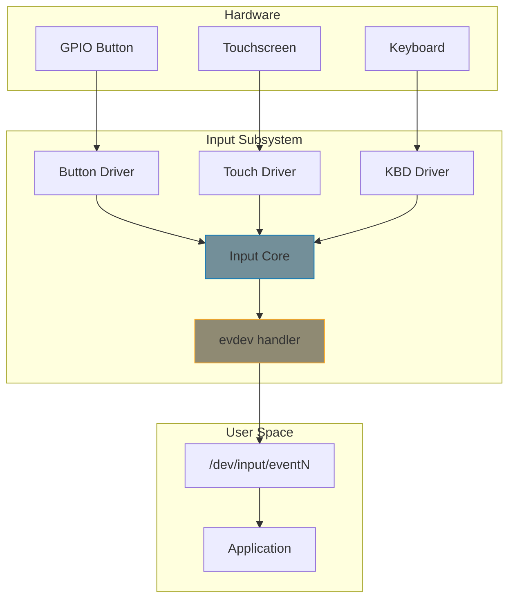

# Input Subsystem

The input subsystem provides a unified framework for keyboards, mice, touchscreens, buttons, joysticks, and other human-interface devices. It handles event reporting, device registration, and user-space delivery through `/dev/input/eventN`.

## Architecture



## Event Types

| Event Type | Constant | Use Case |
|-----------|----------|----------|
| Key/button press | `EV_KEY` | Keyboards, buttons, switches |
| Relative movement | `EV_REL` | Mouse movement, scroll wheels |
| Absolute position | `EV_ABS` | Touchscreens, joysticks |
| Switch | `EV_SW` | Lid close, headphone jack |
| LED indicator | `EV_LED` | Caps Lock LED, etc. |

## Registering an Input Device

```c
#include <linux/input.h>

struct my_button {
    struct input_dev *input;
    int gpio;
    int irq;
};

static int my_button_probe(struct platform_device *pdev)
{
    struct my_button *btn;
    struct input_dev *input;
    int ret;

    btn = devm_kzalloc(&pdev->dev, sizeof(*btn), GFP_KERNEL);
    if (!btn)
        return -ENOMEM;

    /* Allocate input device (managed) */
    input = devm_input_allocate_device(&pdev->dev);
    if (!input)
        return -ENOMEM;

    /* Set device metadata */
    input->name = "My GPIO Button";
    input->phys = "my-button/input0";
    input->id.bustype = BUS_HOST;

    /* Declare capabilities: we report EV_KEY events */
    set_bit(EV_KEY, input->evbit);
    set_bit(KEY_POWER, input->keybit);   /* Power button */
    set_bit(KEY_ENTER, input->keybit);   /* Enter key */

    /* Register with input subsystem */
    ret = input_register_device(input);
    if (ret)
        return ret;

    btn->input = input;
    platform_set_drvdata(pdev, btn);
    return 0;
}
```

### Using input_set_capability()

A cleaner alternative to manual `set_bit()`:

```c
/* These automatically set the event type bit too */
input_set_capability(input, EV_KEY, KEY_POWER);
input_set_capability(input, EV_KEY, KEY_ENTER);
input_set_capability(input, EV_SW, SW_LID);
```

## Reporting Events

### Key/Button Events

```c
/* In interrupt handler or threaded IRQ */
static irqreturn_t button_irq_handler(int irq, void *data)
{
    struct my_button *btn = data;
    int pressed = gpiod_get_value(btn->gpio_desc);

    /* Report key state: 1 = pressed, 0 = released */
    input_report_key(btn->input, KEY_POWER, pressed);

    /* Sync marks the end of this event frame */
    input_sync(btn->input);

    return IRQ_HANDLED;
}
```

{: .warning }
Always call `input_sync()` after reporting events. Without it, user space never sees the events — they're buffered until a sync marks the frame boundary.

### Relative Movement (Mouse)

```c
input_report_rel(input, REL_X, dx);
input_report_rel(input, REL_Y, dy);
input_report_rel(input, REL_WHEEL, scroll);
input_sync(input);
```

### Absolute Position (Touchscreen)

```c
/* During probe: set axis parameters */
input_set_abs_params(input, ABS_X, 0, 4095, 0, 0);
input_set_abs_params(input, ABS_Y, 0, 4095, 0, 0);
input_set_abs_params(input, ABS_PRESSURE, 0, 255, 0, 0);

/* In event handler */
input_report_abs(input, ABS_X, x_pos);
input_report_abs(input, ABS_Y, y_pos);
input_report_abs(input, ABS_PRESSURE, pressure);
input_sync(input);
```

The `input_set_abs_params()` arguments are: `(dev, axis, min, max, fuzz, flat)`. `fuzz` filters jitter; `flat` defines a dead zone around center.

## Complete Example: Virtual Button

A platform driver that simulates a button via proc interface:

```c
#include <linux/module.h>
#include <linux/input.h>
#include <linux/proc_fs.h>

static struct input_dev *vbutton;

static ssize_t vbutton_write(struct file *file, const char __user *buf,
                             size_t count, loff_t *ppos)
{
    char cmd[16];
    size_t len = min(count, sizeof(cmd) - 1);

    if (copy_from_user(cmd, buf, len))
        return -EFAULT;
    cmd[len] = '\0';
    if (len > 0 && cmd[len - 1] == '\n')
        cmd[len - 1] = '\0';

    if (strcmp(cmd, "press") == 0) {
        input_report_key(vbutton, KEY_ENTER, 1);
        input_sync(vbutton);
    } else if (strcmp(cmd, "release") == 0) {
        input_report_key(vbutton, KEY_ENTER, 0);
        input_sync(vbutton);
    } else if (strcmp(cmd, "click") == 0) {
        input_report_key(vbutton, KEY_ENTER, 1);
        input_sync(vbutton);
        input_report_key(vbutton, KEY_ENTER, 0);
        input_sync(vbutton);
    }

    return count;
}

static const struct proc_ops vbutton_ops = {
    .proc_write = vbutton_write,
};

static int __init vbutton_init(void)
{
    int ret;

    vbutton = input_allocate_device();
    if (!vbutton)
        return -ENOMEM;

    vbutton->name = "Virtual Button";
    vbutton->phys = "vbutton/input0";
    vbutton->id.bustype = BUS_VIRTUAL;

    input_set_capability(vbutton, EV_KEY, KEY_ENTER);
    input_set_capability(vbutton, EV_KEY, KEY_POWER);

    ret = input_register_device(vbutton);
    if (ret) {
        input_free_device(vbutton);
        return ret;
    }

    proc_create("vbutton", 0222, NULL, &vbutton_ops);

    pr_info("vbutton: registered, write to /proc/vbutton\n");
    return 0;
}

static void __exit vbutton_exit(void)
{
    remove_proc_entry("vbutton", NULL);
    input_unregister_device(vbutton);
}

module_init(vbutton_init);
module_exit(vbutton_exit);
MODULE_LICENSE("GPL");
```

## Polled Input Devices

For hardware without interrupts, use polling:

```c
static void my_poll(struct input_dev *input)
{
    int value = read_hardware_state();

    input_report_key(input, KEY_A, value);
    input_sync(input);
}

static int my_probe(struct platform_device *pdev)
{
    struct input_dev *input;

    input = devm_input_allocate_device(&pdev->dev);
    if (!input)
        return -ENOMEM;

    input->name = "My Polled Device";
    input_set_capability(input, EV_KEY, KEY_A);

    /* Set up polling (interval in ms) */
    input_setup_polling(input, my_poll);
    input_set_poll_interval(input, 50);     /* 50ms */
    input_set_min_poll_interval(input, 20);
    input_set_max_poll_interval(input, 500);

    return input_register_device(input);
}
```

## gpio-keys: Built-in GPIO Button Driver

For simple GPIO buttons, the kernel's built-in `gpio-keys` driver handles everything — no custom driver code needed. Just declare in the device tree:

```dts
gpio-keys {
    compatible = "gpio-keys";

    power-button {
        label = "Power";
        linux,code = <KEY_POWER>;
        gpios = <&gpio0 5 GPIO_ACTIVE_LOW>;
        wakeup-source;
    };

    volume-up {
        label = "Volume Up";
        linux,code = <KEY_VOLUMEUP>;
        gpios = <&gpio0 6 GPIO_ACTIVE_LOW>;
        debounce-interval = <20>;
    };
};
```

## User Space Testing

```bash
# List input devices
cat /proc/bus/input/devices

# Monitor events in real time (install evtest)
evtest /dev/input/event0

# Read raw events
hexdump -C /dev/input/event0
```

## Best Practices

- **Use `devm_input_allocate_device()`** — automatic cleanup on driver unbind
- **Always call `input_sync()`** — events are invisible to user space without it
- **Set proper capabilities** — only declare events your device can actually generate
- **Use `input_set_capability()`** over manual `set_bit()` — cleaner and less error-prone
- **Use `gpio-keys` for simple buttons** — no custom driver needed
- **Use polling for devices without IRQs** — `input_setup_polling()` is the modern API

## Summary

- The input subsystem unifies all human-interface device drivers
- Register with `input_register_device()`, report events with `input_report_*()`, sync with `input_sync()`
- EV_KEY for buttons, EV_REL for mice, EV_ABS for touchscreens
- Use `devm_input_allocate_device()` for managed allocation
- The built-in `gpio-keys` driver handles most button hardware

## Next

Continue to [Part 11: IIO, RTC, Regulator, Clock Drivers]() for data acquisition and clock frameworks.
