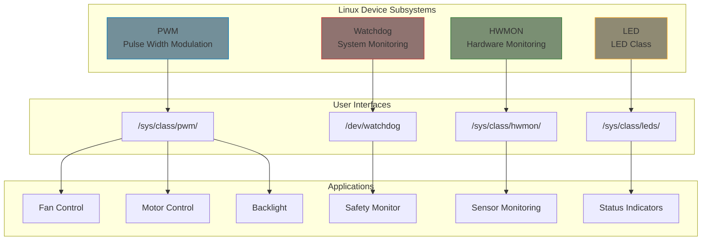
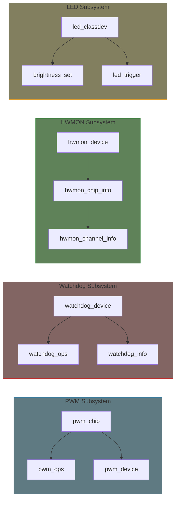

# Part 10: PWM, Watchdog, HWMON, LED Drivers

This part covers several specialized device subsystems commonly used in embedded Linux systems. Each subsystem provides a standardized interface for specific types of hardware.

## What You'll Learn

### PWM Subsystem
- PWM chip architecture and implementation
- PWM consumer API
- Duty cycle and period control
- Polarity configuration

### Watchdog Drivers
- Watchdog architecture
- `watchdog_device` implementation
- Timeout configuration
- Pretimeout support

### Hardware Monitoring (HWMON)
- HWMON subsystem architecture
- Temperature, voltage, fan speed monitoring
- `hwmon_chip_info` registration
- Sensor attributes

### LED Class Drivers
- LED class framework
- Brightness control
- LED triggers
- Hardware blink support

## Subsystem Overview

## Key Structures

| Subsystem | Main Structure | Registration Function |
|-----------|---------------|----------------------|
| PWM | `struct pwm_chip` | `pwmchip_add()` |
| Watchdog | `struct watchdog_device` | `watchdog_register_device()` |
| HWMON | `struct hwmon_chip_info` | `hwmon_device_register_with_info()` |
| LED | `struct led_classdev` | `led_classdev_register()` |

## Common Patterns

All these subsystems share common patterns:

1. **Provider/Consumer Model**: Drivers implement providers; other drivers/userspace consume
2. **sysfs Interface**: Standard attributes exposed in `/sys/class/`
3. **Device Tree Integration**: Properties for configuration
4. **Managed Resources**: `devm_*` variants for automatic cleanup

## In This Part

1. [PWM Subsystem]() - PWM architecture overview
2. [PWM Provider]() - Implementing pwm_chip
3. [Watchdog Subsystem]() - Watchdog architecture
4. [Watchdog Driver]() - Implementing watchdog_device
5. [HWMON Subsystem]() - Hardware monitoring overview
6. [HWMON Driver]() - Implementing HWMON sensors
7. [LED Subsystem]() - LED class drivers

## Further Reading

- [PWM Documentation](https://docs.kernel.org/driver-api/pwm.html) - PWM subsystem
- [Watchdog API](https://docs.kernel.org/watchdog/index.html) - Watchdog drivers
- [HWMON Documentation](https://docs.kernel.org/hwmon/index.html) - Hardware monitoring
- [LED Class Documentation](https://docs.kernel.org/leds/index.html) - LED framework

## Prerequisites

Before starting this part, you should understand:
- Platform drivers and Device Tree (Part 8)
- Basic driver probe/remove lifecycle (Part 6)
- [Managed resources (devm_*)]() - all examples use device-managed allocation
- sysfs attributes (Part 6)
