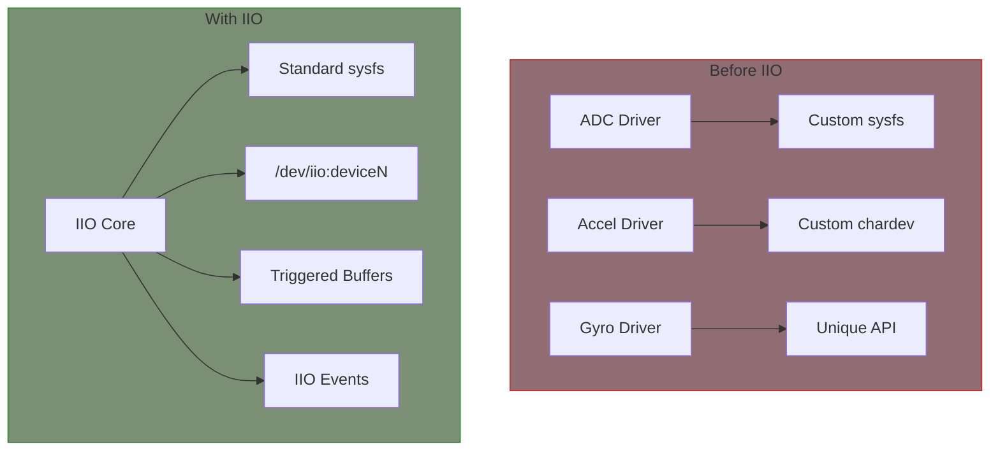
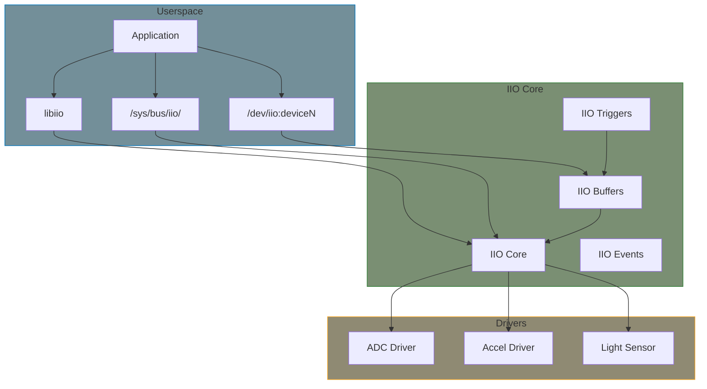

# IIO Subsystem

The Industrial I/O (IIO) subsystem provides a unified framework for sensors and data acquisition devices, including ADCs, DACs, accelerometers, gyroscopes, magnetometers, light sensors, and more.

## Why IIO?



## IIO Architecture



## Key Concepts

### Channels

IIO devices expose data through channels. Each channel represents a measurement:

```c
#include <linux/iio/iio.h>

struct iio_chan_spec {
    enum iio_chan_type type;      /* Channel type (VOLTAGE, ACCEL, etc.) */
    int channel;                   /* Channel index */
    int channel2;                  /* Modifier channel */
    unsigned long address;         /* Driver-specific address */
    int scan_index;               /* Buffer scan order */
    struct {
        char sign;                /* 's' or 'u' */
        u8 realbits;              /* Actual bits of data */
        u8 storagebits;           /* Storage bits (8, 16, 32) */
        u8 shift;                 /* Shift to apply */
        u8 repeat;                /* Number of repeated elements */
        enum iio_endian endianness;
    } scan_type;
    long info_mask_separate;       /* Per-channel attributes */
    long info_mask_shared_by_type; /* Shared attributes */
    long info_mask_shared_by_dir;  /* Direction-shared attrs */
    long info_mask_shared_by_all;  /* Global attributes */
    /* ... */
};
```

### Channel Types

```c
enum iio_chan_type {
    IIO_VOLTAGE,
    IIO_CURRENT,
    IIO_POWER,
    IIO_ACCEL,
    IIO_ANGL_VEL,      /* Gyroscope */
    IIO_MAGN,          /* Magnetometer */
    IIO_LIGHT,
    IIO_INTENSITY,
    IIO_PROXIMITY,
    IIO_TEMP,
    IIO_INCLI,         /* Inclinometer */
    IIO_ROT,           /* Rotation */
    IIO_ANGL,          /* Angle */
    IIO_TIMESTAMP,
    IIO_CAPACITANCE,
    IIO_ALTVOLTAGE,    /* Frequency/phase */
    IIO_CCT,           /* Color temperature */
    IIO_PRESSURE,
    IIO_HUMIDITYRELATIVE,
    IIO_ACTIVITY,
    IIO_STEPS,
    IIO_ENERGY,
    IIO_DISTANCE,
    IIO_VELOCITY,
    IIO_CONCENTRATION,
    IIO_RESISTANCE,
    IIO_PH,
    IIO_UVINDEX,
    IIO_ELECTRICALCONDUCTIVITY,
    IIO_COUNT,
    IIO_INDEX,
    IIO_GRAVITY,
    IIO_POSITIONRELATIVE,
    IIO_PHASE,
    IIO_MASSCONCENTRATION,
    /* ... */
};
```

### Channel Modifiers

```c
enum iio_modifier {
    IIO_NO_MOD,
    IIO_MOD_X,          /* X axis */
    IIO_MOD_Y,          /* Y axis */
    IIO_MOD_Z,          /* Z axis */
    IIO_MOD_X_AND_Y,
    IIO_MOD_X_AND_Z,
    IIO_MOD_Y_AND_Z,
    IIO_MOD_X_AND_Y_AND_Z,
    IIO_MOD_X_OR_Y,
    IIO_MOD_X_OR_Z,
    IIO_MOD_Y_OR_Z,
    IIO_MOD_X_OR_Y_OR_Z,
    IIO_MOD_LIGHT_BOTH,
    IIO_MOD_LIGHT_IR,
    IIO_MOD_LIGHT_CLEAR,
    IIO_MOD_LIGHT_RED,
    IIO_MOD_LIGHT_GREEN,
    IIO_MOD_LIGHT_BLUE,
    IIO_MOD_LIGHT_UV,
    /* ... */
};
```

### Info Mask Attributes

```c
/* Commonly used info masks */
IIO_CHAN_INFO_RAW           /* Raw reading */
IIO_CHAN_INFO_PROCESSED     /* Processed/scaled reading */
IIO_CHAN_INFO_SCALE         /* Scale factor */
IIO_CHAN_INFO_OFFSET        /* Offset to apply */
IIO_CHAN_INFO_CALIBSCALE    /* Calibration scale */
IIO_CHAN_INFO_CALIBBIAS     /* Calibration bias */
IIO_CHAN_INFO_PEAK          /* Peak value */
IIO_CHAN_INFO_PEAK_SCALE
IIO_CHAN_INFO_QUADRATURE_CORRECTION_RAW
IIO_CHAN_INFO_AVERAGE_RAW
IIO_CHAN_INFO_LOW_PASS_FILTER_3DB_FREQUENCY
IIO_CHAN_INFO_HIGH_PASS_FILTER_3DB_FREQUENCY
IIO_CHAN_INFO_SAMP_FREQ     /* Sampling frequency */
IIO_CHAN_INFO_FREQUENCY
IIO_CHAN_INFO_PHASE
IIO_CHAN_INFO_HARDWAREGAIN
IIO_CHAN_INFO_HYSTERESIS
IIO_CHAN_INFO_HYSTERESIS_RELATIVE
IIO_CHAN_INFO_INT_TIME      /* Integration time */
IIO_CHAN_INFO_ENABLE
IIO_CHAN_INFO_CALIBHEIGHT
IIO_CHAN_INFO_CALIBWEIGHT
IIO_CHAN_INFO_DEBOUNCE_COUNT
IIO_CHAN_INFO_DEBOUNCE_TIME
IIO_CHAN_INFO_OVERSAMPLING_RATIO
IIO_CHAN_INFO_THERMOCOUPLE_TYPE
IIO_CHAN_INFO_CALIBAMBIENT
```

## sysfs Interface

```bash
/sys/bus/iio/devices/iio:device0/
├── name                    # Device name
├── dev                     # Major:minor
├── in_voltage0_raw         # Raw ADC reading
├── in_voltage_scale        # Scale factor
├── in_accel_x_raw          # Accelerometer X raw
├── in_accel_y_raw          # Accelerometer Y raw
├── in_accel_z_raw          # Accelerometer Z raw
├── in_accel_scale          # Accelerometer scale
├── sampling_frequency      # Current sample rate
├── sampling_frequency_available  # Available rates
├── buffer/
│   ├── enable              # Enable buffer capture
│   ├── length              # Buffer length
│   └── watermark           # Watermark threshold
├── scan_elements/
│   ├── in_voltage0_en      # Enable channel in buffer
│   ├── in_voltage0_type    # Data format
│   └── in_voltage0_index   # Position in buffer
└── trigger/
    └── current_trigger     # Current trigger name
```

## Reading Sensor Data

### Direct Reading via sysfs

```bash
# Read raw value
cat /sys/bus/iio/devices/iio:device0/in_voltage0_raw
# Returns: 2048

# Read scale
cat /sys/bus/iio/devices/iio:device0/in_voltage_scale
# Returns: 0.000805664

# Calculate actual value: 2048 * 0.000805664 = 1.65V
```

### Using libiio

```c
#include <iio.h>

struct iio_context *ctx = iio_create_local_context();
struct iio_device *dev = iio_context_find_device(ctx, "my-adc");
struct iio_channel *ch = iio_device_find_channel(dev, "voltage0", false);

double scale;
iio_channel_attr_read_double(ch, "scale", &scale);

long long raw;
iio_channel_attr_read_longlong(ch, "raw", &raw);

double voltage = raw * scale;
printf("Voltage: %.3f V\n", voltage);

iio_context_destroy(ctx);
```

## Device Tree Binding

```dts
adc@48 {
    compatible = "vendor,my-adc";
    reg = <0x48>;
    #io-channel-cells = <1>;
    vref-supply = <&vdd_3v3>;
};

/* Consumer using the ADC */
battery_monitor {
    compatible = "simple-battery";
    io-channels = <&adc 0>;       /* Channel 0 */
    io-channel-names = "voltage";
};
```

## Summary

- IIO provides unified framework for sensors and DAQ devices
- Channels represent individual measurements
- Info masks define available attributes
- sysfs provides human-readable interface
- Buffered acquisition for high-speed data
- Triggers synchronize data capture

## Further Reading

- [IIO Documentation](https://docs.kernel.org/driver-api/iio/index.html) - Kernel documentation
- [IIO Drivers](https://elixir.bootlin.com/linux/v6.6/source/drivers/iio) - Driver examples
- [libiio](https://github.com/analogdevicesinc/libiio) - Userspace library

## Next

Learn how to implement an [IIO driver]().
