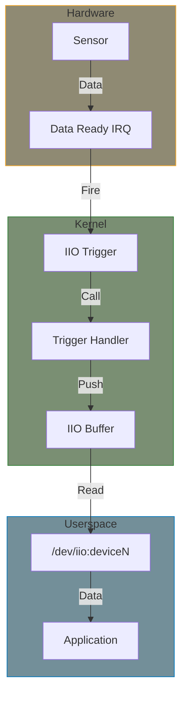

# IIO Buffers

IIO buffers provide efficient continuous data acquisition from sensors. Combined with triggers, they enable high-throughput sampling with minimal CPU overhead.

## Buffer Architecture



## Setting Up Triggered Buffers

### Channel Scan Type

```c
static const struct iio_chan_spec my_channels[] = {
    {
        .type = IIO_VOLTAGE,
        .indexed = 1,
        .channel = 0,
        .info_mask_separate = BIT(IIO_CHAN_INFO_RAW),
        .scan_index = 0,                /* Position in buffer */
        .scan_type = {
            .sign = 'u',                /* 'u' unsigned, 's' signed */
            .realbits = 12,             /* Actual data bits */
            .storagebits = 16,          /* Storage size */
            .shift = 0,                 /* Right shift to apply */
            .endianness = IIO_BE,       /* IIO_BE or IIO_LE */
        },
    },
    {
        .type = IIO_VOLTAGE,
        .indexed = 1,
        .channel = 1,
        .info_mask_separate = BIT(IIO_CHAN_INFO_RAW),
        .scan_index = 1,
        .scan_type = {
            .sign = 'u',
            .realbits = 12,
            .storagebits = 16,
            .shift = 0,
            .endianness = IIO_BE,
        },
    },
    IIO_CHAN_SOFT_TIMESTAMP(2),          /* Timestamp at index 2 */
};
```

### Driver with Triggered Buffer

```c
#include <linux/module.h>
#include <linux/i2c.h>
#include <linux/iio/iio.h>
#include <linux/iio/buffer.h>
#include <linux/iio/trigger.h>
#include <linux/iio/trigger_consumer.h>
#include <linux/iio/triggered_buffer.h>

struct my_sensor {
    struct i2c_client *client;
    struct iio_trigger *trig;
    struct mutex lock;
    /* Buffer for scan data - must be naturally aligned */
    struct {
        __be16 channels[4];
        s64 timestamp __aligned(8);
    } scan;
};

static irqreturn_t my_sensor_trigger_handler(int irq, void *p)
{
    struct iio_poll_func *pf = p;
    struct iio_dev *indio_dev = pf->indio_dev;
    struct my_sensor *sensor = iio_priv(indio_dev);
    int ret;

    mutex_lock(&sensor->lock);

    /* Read all enabled channels */
    ret = i2c_smbus_read_i2c_block_data(sensor->client,
                                        REG_DATA_BASE,
                                        sizeof(sensor->scan.channels),
                                        (u8 *)sensor->scan.channels);
    if (ret < 0)
        goto done;

    /* Push data to buffer with timestamp */
    iio_push_to_buffers_with_timestamp(indio_dev, &sensor->scan,
                                       iio_get_time_ns(indio_dev));

done:
    mutex_unlock(&sensor->lock);
    iio_trigger_notify_done(indio_dev->trig);

    return IRQ_HANDLED;
}

static int my_sensor_probe(struct i2c_client *client)
{
    struct my_sensor *sensor;
    struct iio_dev *indio_dev;
    int ret;

    indio_dev = devm_iio_device_alloc(&client->dev, sizeof(*sensor));
    if (!indio_dev)
        return -ENOMEM;

    sensor = iio_priv(indio_dev);
    sensor->client = client;
    mutex_init(&sensor->lock);

    indio_dev->name = "my-sensor";
    indio_dev->info = &my_sensor_info;
    indio_dev->modes = INDIO_DIRECT_MODE | INDIO_BUFFER_SOFTWARE;
    indio_dev->channels = my_channels;
    indio_dev->num_channels = ARRAY_SIZE(my_channels);

    /* Setup triggered buffer */
    ret = devm_iio_triggered_buffer_setup(&client->dev, indio_dev,
                                          NULL,  /* No top half */
                                          my_sensor_trigger_handler,
                                          NULL); /* No buffer ops */
    if (ret)
        return ret;

    return devm_iio_device_register(&client->dev, indio_dev);
}
```

## Creating Device Triggers

### Data-Ready Interrupt Trigger

```c
static irqreturn_t my_sensor_irq_handler(int irq, void *p)
{
    struct iio_dev *indio_dev = p;
    struct my_sensor *sensor = iio_priv(indio_dev);

    if (sensor->trig)
        iio_trigger_poll(sensor->trig);

    return IRQ_HANDLED;
}

static int my_sensor_probe(struct i2c_client *client)
{
    struct my_sensor *sensor;
    struct iio_dev *indio_dev;
    int ret, irq;

    /* ... allocate and setup ... */

    /* Create trigger */
    sensor->trig = devm_iio_trigger_alloc(&client->dev, "%s-dev%d",
                                          indio_dev->name,
                                          iio_device_id(indio_dev));
    if (!sensor->trig)
        return -ENOMEM;

    sensor->trig->ops = &my_sensor_trigger_ops;
    iio_trigger_set_drvdata(sensor->trig, indio_dev);

    ret = devm_iio_trigger_register(&client->dev, sensor->trig);
    if (ret)
        return ret;

    /* Set as default trigger */
    indio_dev->trig = iio_trigger_get(sensor->trig);

    /* Request data-ready IRQ */
    irq = client->irq;
    ret = devm_request_threaded_irq(&client->dev, irq,
                                    NULL,
                                    my_sensor_irq_handler,
                                    IRQF_ONESHOT,
                                    "my-sensor-drdy",
                                    indio_dev);
    if (ret)
        return ret;

    /* ... continue setup ... */
}
```

### Trigger Operations

```c
static int my_trigger_set_state(struct iio_trigger *trig, bool state)
{
    struct iio_dev *indio_dev = iio_trigger_get_drvdata(trig);
    struct my_sensor *sensor = iio_priv(indio_dev);

    if (state) {
        /* Enable data-ready interrupt */
        return regmap_update_bits(sensor->regmap, REG_CONFIG,
                                  CFG_DRDY_EN, CFG_DRDY_EN);
    } else {
        /* Disable data-ready interrupt */
        return regmap_update_bits(sensor->regmap, REG_CONFIG,
                                  CFG_DRDY_EN, 0);
    }
}

static const struct iio_trigger_ops my_sensor_trigger_ops = {
    .set_trigger_state = my_trigger_set_state,
};
```

## Buffer Setup Options

### Using Helper Function

```c
/* Simplest setup */
ret = devm_iio_triggered_buffer_setup(&client->dev, indio_dev,
                                      iio_pollfunc_store_time,
                                      my_sensor_trigger_handler,
                                      NULL);
```

### Custom Buffer Operations

```c
static const struct iio_buffer_setup_ops my_buffer_setup_ops = {
    .preenable = my_sensor_buffer_preenable,
    .postenable = my_sensor_buffer_postenable,
    .predisable = my_sensor_buffer_predisable,
    .postdisable = my_sensor_buffer_postdisable,
};

static int my_sensor_buffer_preenable(struct iio_dev *indio_dev)
{
    struct my_sensor *sensor = iio_priv(indio_dev);

    /* Configure sensor for continuous mode */
    return regmap_update_bits(sensor->regmap, REG_CONFIG,
                              CFG_MODE_MASK, CFG_MODE_CONTINUOUS);
}

static int my_sensor_buffer_postdisable(struct iio_dev *indio_dev)
{
    struct my_sensor *sensor = iio_priv(indio_dev);

    /* Return to single-shot mode */
    return regmap_update_bits(sensor->regmap, REG_CONFIG,
                              CFG_MODE_MASK, CFG_MODE_SINGLE);
}

/* In probe */
ret = devm_iio_triggered_buffer_setup(&client->dev, indio_dev,
                                      iio_pollfunc_store_time,
                                      my_sensor_trigger_handler,
                                      &my_buffer_setup_ops);
```

## Reading Buffer Data

### From sysfs

```bash
# Enable channels
echo 1 > /sys/bus/iio/devices/iio:device0/scan_elements/in_voltage0_en
echo 1 > /sys/bus/iio/devices/iio:device0/scan_elements/in_voltage1_en
echo 1 > /sys/bus/iio/devices/iio:device0/scan_elements/in_timestamp_en

# Set buffer length
echo 100 > /sys/bus/iio/devices/iio:device0/buffer/length

# Set trigger
echo "my-sensor-dev0" > /sys/bus/iio/devices/iio:device0/trigger/current_trigger

# Enable buffer
echo 1 > /sys/bus/iio/devices/iio:device0/buffer/enable

# Read data (binary)
cat /dev/iio:device0 | hexdump -C

# Disable buffer
echo 0 > /sys/bus/iio/devices/iio:device0/buffer/enable
```

### From C Application

```c
#include <stdio.h>
#include <fcntl.h>
#include <unistd.h>
#include <poll.h>

int main(void)
{
    int fd;
    struct pollfd pfd;
    char buf[256];
    ssize_t n;

    fd = open("/dev/iio:device0", O_RDONLY);
    if (fd < 0)
        return -1;

    pfd.fd = fd;
    pfd.events = POLLIN;

    while (1) {
        int ret = poll(&pfd, 1, 1000);
        if (ret < 0)
            break;
        if (ret == 0)
            continue;

        n = read(fd, buf, sizeof(buf));
        if (n > 0) {
            /* Process data based on scan_type */
            /* Format: [ch0][ch1]...[timestamp] */
        }
    }

    close(fd);
    return 0;
}
```

## Summary

- Triggered buffers enable efficient continuous sampling
- Define `scan_index` and `scan_type` in channel spec
- Use `devm_iio_triggered_buffer_setup()` for setup
- Implement trigger handler to push data
- Create device trigger for hardware interrupts
- Use `iio_push_to_buffers_with_timestamp()` to push data

## Further Reading

- [IIO Triggered Buffers](https://docs.kernel.org/driver-api/iio/triggered_buffer.html) - Buffer documentation
- [IIO Triggers](https://docs.kernel.org/driver-api/iio/triggers.html) - Trigger documentation
- [Example Drivers](https://elixir.bootlin.com/linux/v6.6/source/drivers/iio/accel/bmc150-accel-core.c) - Buffer implementation

## Next

Learn about the [RTC subsystem]().
