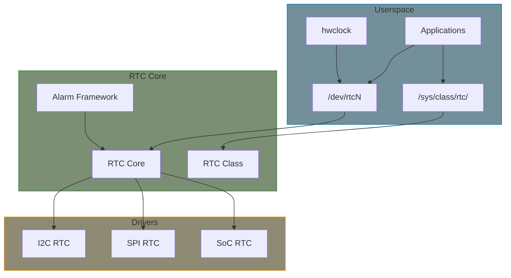

# RTC Subsystem

The Real-Time Clock (RTC) subsystem provides a unified interface for hardware that maintains time when the system is powered off. RTCs typically have battery backup and can provide alarms and wakeup functionality.

## RTC Architecture



## Key Structures

### rtc_device

```c
#include <linux/rtc.h>

struct rtc_device {
    struct device dev;
    struct module *owner;
    int id;
    const struct rtc_class_ops *ops;

    struct mutex ops_lock;
    struct cdev char_dev;

    unsigned long irq_data;
    spinlock_t irq_lock;
    wait_queue_head_t irq_queue;

    struct timerqueue_head timerqueue;
    struct rtc_timer aie_timer;
    struct rtc_timer uie_rtctimer;
    /* ... */
};
```

### rtc_class_ops

```c
struct rtc_class_ops {
    int (*ioctl)(struct device *dev, unsigned int cmd, unsigned long arg);
    int (*read_time)(struct device *dev, struct rtc_time *tm);
    int (*set_time)(struct device *dev, struct rtc_time *tm);
    int (*read_alarm)(struct device *dev, struct rtc_wkalrm *alrm);
    int (*set_alarm)(struct device *dev, struct rtc_wkalrm *alrm);
    int (*proc)(struct device *dev, struct seq_file *seq);
    int (*alarm_irq_enable)(struct device *dev, unsigned int enabled);
    int (*read_offset)(struct device *dev, long *offset);
    int (*set_offset)(struct device *dev, long offset);
    int (*param_get)(struct device *dev, struct rtc_param *param);
    int (*param_set)(struct device *dev, struct rtc_param *param);
};
```

### rtc_time

```c
struct rtc_time {
    int tm_sec;    /* Seconds (0-59) */
    int tm_min;    /* Minutes (0-59) */
    int tm_hour;   /* Hours (0-23) */
    int tm_mday;   /* Day of month (1-31) */
    int tm_mon;    /* Month (0-11) */
    int tm_year;   /* Year - 1900 */
    int tm_wday;   /* Day of week (0-6, Sunday=0) */
    int tm_yday;   /* Day of year (0-365) */
    int tm_isdst;  /* Daylight saving flag */
};
```

### rtc_wkalrm

```c
struct rtc_wkalrm {
    unsigned char enabled;   /* Alarm enabled */
    unsigned char pending;   /* Alarm pending */
    struct rtc_time time;    /* Alarm time */
};
```

## Userspace Interface

### sysfs Interface

```bash
# List RTC devices
ls /sys/class/rtc/

# Read current time
cat /sys/class/rtc/rtc0/time
cat /sys/class/rtc/rtc0/date
cat /sys/class/rtc/rtc0/since_epoch

# Read/write alarm
cat /sys/class/rtc/rtc0/wakealarm
echo +60 > /sys/class/rtc/rtc0/wakealarm  # Alarm in 60 seconds
echo 0 > /sys/class/rtc/rtc0/wakealarm    # Clear alarm

# RTC info
cat /sys/class/rtc/rtc0/name
cat /sys/class/rtc/rtc0/hctosys  # Was this RTC used to set system time?
```

### Character Device

```c
#include <linux/rtc.h>
#include <sys/ioctl.h>
#include <fcntl.h>

int fd = open("/dev/rtc0", O_RDONLY);

/* Read time */
struct rtc_time rtc_tm;
ioctl(fd, RTC_RD_TIME, &rtc_tm);
printf("RTC time: %02d:%02d:%02d\n",
       rtc_tm.tm_hour, rtc_tm.tm_min, rtc_tm.tm_sec);

/* Set alarm */
struct rtc_wkalrm alarm = {
    .enabled = 1,
    .time = {
        .tm_hour = 7,
        .tm_min = 30,
        .tm_sec = 0,
    },
};
ioctl(fd, RTC_WKALM_SET, &alarm);

/* Enable alarm interrupt */
ioctl(fd, RTC_AIE_ON, 0);

/* Wait for alarm */
unsigned long data;
read(fd, &data, sizeof(data));
printf("Alarm triggered!\n");

close(fd);
```

### hwclock Command

```bash
# Read hardware clock
hwclock --show

# Set hardware clock from system time
hwclock --systohc

# Set system time from hardware clock
hwclock --hctosys

# Specify RTC device
hwclock --rtc /dev/rtc1 --show
```

## ioctl Commands

| Command | Description |
|---------|-------------|
| `RTC_RD_TIME` | Read RTC time |
| `RTC_SET_TIME` | Set RTC time |
| `RTC_ALM_READ` | Read alarm time |
| `RTC_ALM_SET` | Set alarm time |
| `RTC_WKALM_RD` | Read wakeup alarm |
| `RTC_WKALM_SET` | Set wakeup alarm |
| `RTC_AIE_ON` | Enable alarm interrupt |
| `RTC_AIE_OFF` | Disable alarm interrupt |
| `RTC_UIE_ON` | Enable update interrupt |
| `RTC_UIE_OFF` | Disable update interrupt |
| `RTC_PIE_ON` | Enable periodic interrupt |
| `RTC_PIE_OFF` | Disable periodic interrupt |
| `RTC_IRQP_SET` | Set periodic IRQ rate |
| `RTC_IRQP_READ` | Read periodic IRQ rate |

## Device Tree Binding

```dts
&i2c1 {
    rtc@68 {
        compatible = "dallas,ds1307";
        reg = <0x68>;
        interrupt-parent = <&gpio>;
        interrupts = <5 IRQ_TYPE_LEVEL_LOW>;
        wakeup-source;
    };
};

/* SoC RTC */
rtc@10000000 {
    compatible = "vendor,soc-rtc";
    reg = <0x10000000 0x100>;
    interrupts = <GIC_SPI 20 IRQ_TYPE_LEVEL_HIGH>;
    clocks = <&rtc_clk>;
};
```

## Time Conversion Helpers

```c
/* Convert rtc_time to time64_t (seconds since epoch) */
time64_t rtc_tm_to_time64(struct rtc_time *tm);

/* Convert time64_t to rtc_time */
void rtc_time64_to_tm(time64_t time, struct rtc_time *tm);

/* Validate rtc_time */
int rtc_valid_tm(struct rtc_time *tm);

/* Convert BCD to binary */
unsigned int bcd2bin(unsigned int val);

/* Convert binary to BCD */
unsigned int bin2bcd(unsigned int val);
```

## Summary

- RTC maintains time when system is off
- `/dev/rtcN` provides userspace access
- `rtc_class_ops` defines driver callbacks
- Support for alarms and wakeup
- Use `hwclock` for command-line access
- Time conversion helpers available

## Further Reading

- [RTC Drivers](https://docs.kernel.org/driver-api/rtc.html) - Kernel documentation
- [RTC Subsystem](https://elixir.bootlin.com/linux/v6.6/source/drivers/rtc) - Driver examples
- [DS1307 Driver](https://elixir.bootlin.com/linux/v6.6/source/drivers/rtc/rtc-ds1307.c) - Reference

## Next

Learn how to implement an [RTC driver]().
