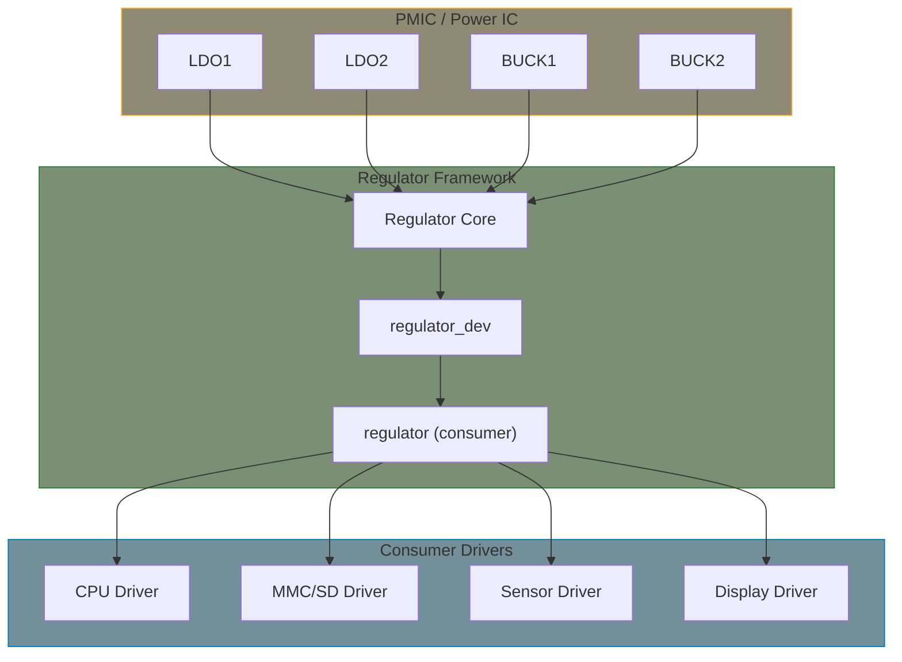

# Regulator Subsystem

The regulator framework provides a standard interface for controlling voltage and current regulators (LDOs, DC-DC converters, etc.) found in PMICs and discrete power management ICs.

## Regulator Architecture



## Key Concepts

### Provider vs Consumer

- **Provider**: Driver that controls the regulator hardware (PMIC driver)
- **Consumer**: Driver that uses the regulator (sensor, display, etc.)

### Supply Chains

Regulators can be chained:

```
Main Power → Buck Converter → LDO → Device
```

## Consumer API

### Getting a Regulator

```c
#include <linux/regulator/consumer.h>

/* Get regulator by supply name */
struct regulator *regulator_get(struct device *dev, const char *id);
struct regulator *devm_regulator_get(struct device *dev, const char *id);

/* Optional variant - returns NULL if not found */
struct regulator *devm_regulator_get_optional(struct device *dev,
                                              const char *id);

/* Exclusive access */
struct regulator *devm_regulator_get_exclusive(struct device *dev,
                                               const char *id);
```

### Basic Operations

```c
/* Enable/disable */
int regulator_enable(struct regulator *regulator);
int regulator_disable(struct regulator *regulator);
int regulator_is_enabled(struct regulator *regulator);

/* Voltage control */
int regulator_set_voltage(struct regulator *regulator,
                          int min_uV, int max_uV);
int regulator_get_voltage(struct regulator *regulator);

/* Current limit */
int regulator_set_current_limit(struct regulator *regulator,
                                int min_uA, int max_uA);
int regulator_get_current_limit(struct regulator *regulator);

/* Operating mode */
int regulator_set_mode(struct regulator *regulator, unsigned int mode);
unsigned int regulator_get_mode(struct regulator *regulator);
```

### Example Consumer Driver

```c
#include <linux/module.h>
#include <linux/platform_device.h>
#include <linux/regulator/consumer.h>

struct my_device {
    struct regulator *vdd;
    struct regulator *vddio;
};

static int my_device_probe(struct platform_device *pdev)
{
    struct my_device *dev;
    int ret;

    dev = devm_kzalloc(&pdev->dev, sizeof(*dev), GFP_KERNEL);
    if (!dev)
        return -ENOMEM;

    /* Get regulators */
    dev->vdd = devm_regulator_get(&pdev->dev, "vdd");
    if (IS_ERR(dev->vdd))
        return dev_err_probe(&pdev->dev, PTR_ERR(dev->vdd),
                             "Failed to get vdd regulator\n");

    dev->vddio = devm_regulator_get(&pdev->dev, "vddio");
    if (IS_ERR(dev->vddio))
        return dev_err_probe(&pdev->dev, PTR_ERR(dev->vddio),
                             "Failed to get vddio regulator\n");

    /* Set voltage if needed */
    ret = regulator_set_voltage(dev->vdd, 3300000, 3300000);
    if (ret)
        return ret;

    /* Enable regulators */
    ret = regulator_enable(dev->vdd);
    if (ret)
        return ret;

    ret = regulator_enable(dev->vddio);
    if (ret) {
        regulator_disable(dev->vdd);
        return ret;
    }

    platform_set_drvdata(pdev, dev);
    return 0;
}

static void my_device_remove(struct platform_device *pdev)
{
    struct my_device *dev = platform_get_drvdata(pdev);

    regulator_disable(dev->vddio);
    regulator_disable(dev->vdd);
}
```

### Bulk Regulator API

```c
struct regulator_bulk_data supplies[] = {
    { .supply = "vdd" },
    { .supply = "vddio" },
    { .supply = "vref" },
};

/* Get all regulators */
ret = devm_regulator_bulk_get(&pdev->dev, ARRAY_SIZE(supplies), supplies);
if (ret)
    return ret;

/* Enable all */
ret = regulator_bulk_enable(ARRAY_SIZE(supplies), supplies);
if (ret)
    return ret;

/* Disable all */
regulator_bulk_disable(ARRAY_SIZE(supplies), supplies);
```

## Device Tree Binding

### Provider (PMIC)

```dts
pmic@48 {
    compatible = "vendor,my-pmic";
    reg = <0x48>;

    regulators {
        ldo1: ldo1 {
            regulator-name = "vdd-sensor";
            regulator-min-microvolt = <1800000>;
            regulator-max-microvolt = <3300000>;
            regulator-boot-on;
        };

        buck1: buck1 {
            regulator-name = "vdd-core";
            regulator-min-microvolt = <900000>;
            regulator-max-microvolt = <1200000>;
            regulator-always-on;
        };
    };
};
```

### Consumer

```dts
sensor@50 {
    compatible = "vendor,my-sensor";
    reg = <0x50>;
    vdd-supply = <&ldo1>;
    vddio-supply = <&ldo2>;
};
```

## Constraints

Regulators have constraints defined in Device Tree:

```dts
ldo1: ldo1 {
    regulator-name = "ldo1";
    regulator-min-microvolt = <1800000>;
    regulator-max-microvolt = <3300000>;
    regulator-boot-on;          /* Enable at boot */
    regulator-always-on;        /* Never disable */
    regulator-allow-bypass;     /* Allow bypass mode */
    regulator-ramp-delay = <6250>;  /* µV/µs */
};
```

## sysfs Interface

```bash
# List regulators
ls /sys/class/regulator/

# View regulator info
cat /sys/class/regulator/regulator.0/name
cat /sys/class/regulator/regulator.0/state
cat /sys/class/regulator/regulator.0/microvolts
cat /sys/class/regulator/regulator.0/min_microvolts
cat /sys/class/regulator/regulator.0/max_microvolts
cat /sys/class/regulator/regulator.0/num_users
```

## Summary

- Regulator framework manages voltage/current regulators
- Consumers use `devm_regulator_get()` + `regulator_enable()`
- Use bulk API for multiple regulators
- Device Tree defines supply relationships
- Constraints limit voltage ranges and behavior

## Further Reading

- [Regulator API](https://docs.kernel.org/power/regulator/overview.html) - Framework overview
- [Consumer API](https://docs.kernel.org/power/regulator/consumer.html) - Consumer documentation
- [Machine Interface](https://docs.kernel.org/power/regulator/machine.html) - DT bindings

## Next

Learn how to implement a [Regulator driver]().
