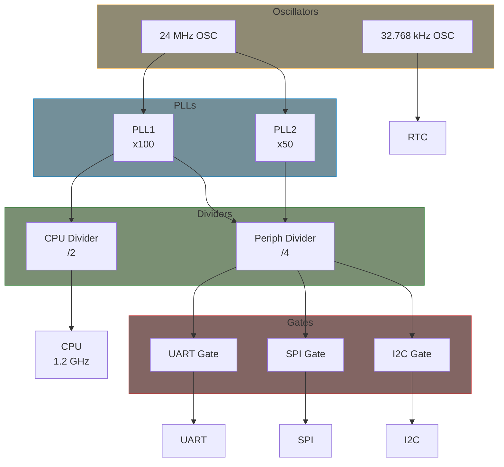

# Clock Framework

The Common Clock Framework (CCF) provides a unified interface for clock management in Linux. It handles clock tree hierarchies, rate management, gating, and parent selection.

## Clock Tree Concept



## Key Structures

### clk_hw

```c
#include <linux/clk-provider.h>

struct clk_hw {
    struct clk_core *core;      /* Internal core structure */
    struct clk *clk;            /* Legacy clk pointer */
    const struct clk_init_data *init;  /* Initialization data */
};

struct clk_init_data {
    const char *name;           /* Clock name */
    const struct clk_ops *ops;  /* Clock operations */
    const char * const *parent_names;  /* Parent clock names */
    const struct clk_parent_data *parent_data;  /* Parent data */
    const struct clk_hw **parent_hws;  /* Parent hw pointers */
    u8 num_parents;             /* Number of parents */
    unsigned long flags;        /* Clock flags */
};
```

### clk_ops

```c
struct clk_ops {
    int (*prepare)(struct clk_hw *hw);
    void (*unprepare)(struct clk_hw *hw);
    int (*is_prepared)(struct clk_hw *hw);

    int (*enable)(struct clk_hw *hw);
    void (*disable)(struct clk_hw *hw);
    int (*is_enabled)(struct clk_hw *hw);

    unsigned long (*recalc_rate)(struct clk_hw *hw,
                                  unsigned long parent_rate);
    long (*round_rate)(struct clk_hw *hw, unsigned long rate,
                       unsigned long *parent_rate);
    int (*set_rate)(struct clk_hw *hw, unsigned long rate,
                    unsigned long parent_rate);

    int (*set_parent)(struct clk_hw *hw, u8 index);
    u8 (*get_parent)(struct clk_hw *hw);

    int (*determine_rate)(struct clk_hw *hw,
                          struct clk_rate_request *req);
    /* ... */
};
```

## Consumer API

### Getting Clocks

```c
#include <linux/clk.h>

/* Get clock by name from Device Tree */
struct clk *devm_clk_get(struct device *dev, const char *id);

/* Optional variant */
struct clk *devm_clk_get_optional(struct device *dev, const char *id);

/* Enabled variant (prepare + enable) */
struct clk *devm_clk_get_enabled(struct device *dev, const char *id);
```

### Clock Control

```c
/* Prepare/unprepare (may sleep) */
int clk_prepare(struct clk *clk);
void clk_unprepare(struct clk *clk);

/* Enable/disable (atomic) */
int clk_enable(struct clk *clk);
void clk_disable(struct clk *clk);

/* Combined operations */
int clk_prepare_enable(struct clk *clk);
void clk_disable_unprepare(struct clk *clk);

/* Rate control */
unsigned long clk_get_rate(struct clk *clk);
int clk_set_rate(struct clk *clk, unsigned long rate);
long clk_round_rate(struct clk *clk, unsigned long rate);

/* Parent control */
int clk_set_parent(struct clk *clk, struct clk *parent);
struct clk *clk_get_parent(struct clk *clk);
```

### Consumer Example

```c
#include <linux/module.h>
#include <linux/platform_device.h>
#include <linux/clk.h>

struct my_device {
    struct clk *clk;
    struct clk *clk_bus;
};

static int my_device_probe(struct platform_device *pdev)
{
    struct my_device *dev;
    int ret;

    dev = devm_kzalloc(&pdev->dev, sizeof(*dev), GFP_KERNEL);
    if (!dev)
        return -ENOMEM;

    /* Get clocks */
    dev->clk = devm_clk_get(&pdev->dev, "func");
    if (IS_ERR(dev->clk))
        return dev_err_probe(&pdev->dev, PTR_ERR(dev->clk),
                             "Failed to get func clock\n");

    dev->clk_bus = devm_clk_get(&pdev->dev, "bus");
    if (IS_ERR(dev->clk_bus))
        return PTR_ERR(dev->clk_bus);

    /* Set rate if needed */
    ret = clk_set_rate(dev->clk, 100000000);  /* 100 MHz */
    if (ret)
        return ret;

    /* Enable clocks */
    ret = clk_prepare_enable(dev->clk_bus);
    if (ret)
        return ret;

    ret = clk_prepare_enable(dev->clk);
    if (ret) {
        clk_disable_unprepare(dev->clk_bus);
        return ret;
    }

    dev_info(&pdev->dev, "Clock rate: %lu Hz\n", clk_get_rate(dev->clk));

    platform_set_drvdata(pdev, dev);
    return 0;
}

static void my_device_remove(struct platform_device *pdev)
{
    struct my_device *dev = platform_get_drvdata(pdev);

    clk_disable_unprepare(dev->clk);
    clk_disable_unprepare(dev->clk_bus);
}
```

## Bulk Clock API

```c
struct clk_bulk_data clocks[] = {
    { .id = "func" },
    { .id = "bus" },
    { .id = "ref" },
};

/* Get all clocks */
ret = devm_clk_bulk_get(&pdev->dev, ARRAY_SIZE(clocks), clocks);
if (ret)
    return ret;

/* Prepare and enable all */
ret = clk_bulk_prepare_enable(ARRAY_SIZE(clocks), clocks);
if (ret)
    return ret;

/* Disable and unprepare all */
clk_bulk_disable_unprepare(ARRAY_SIZE(clocks), clocks);
```

## Device Tree Binding

### Clock Provider

```dts
osc24: oscillator {
    compatible = "fixed-clock";
    #clock-cells = <0>;
    clock-frequency = <24000000>;
    clock-output-names = "osc24";
};

clk_controller: clock-controller@10000000 {
    compatible = "vendor,clock-controller";
    reg = <0x10000000 0x1000>;
    #clock-cells = <1>;
    clocks = <&osc24>;
    clock-names = "ref";
};
```

### Clock Consumer

```dts
uart0: serial@20000000 {
    compatible = "vendor,uart";
    reg = <0x20000000 0x100>;
    clocks = <&clk_controller CLK_UART0>, <&clk_controller CLK_UART0_BUS>;
    clock-names = "func", "bus";
};
```

## Clock Flags

```c
#define CLK_SET_RATE_GATE         BIT(0)   /* Must be gated for rate change */
#define CLK_SET_PARENT_GATE       BIT(1)   /* Must be gated for parent change */
#define CLK_SET_RATE_PARENT       BIT(2)   /* Propagate rate to parent */
#define CLK_IGNORE_UNUSED         BIT(3)   /* Don't disable unused */
#define CLK_IS_BASIC              BIT(5)   /* Basic clock type */
#define CLK_GET_RATE_NOCACHE      BIT(6)   /* Always recalculate rate */
#define CLK_SET_RATE_NO_REPARENT  BIT(7)   /* Don't reparent during set_rate */
#define CLK_GET_ACCURACY_NOCACHE  BIT(8)   /* Recalculate accuracy */
#define CLK_RECALC_NEW_RATES      BIT(9)   /* Recalc subtree rates */
#define CLK_SET_RATE_UNGATE       BIT(10)  /* Rate change ungates clock */
#define CLK_IS_CRITICAL           BIT(11)  /* Critical, don't gate */
#define CLK_OPS_PARENT_ENABLE     BIT(12)  /* Enable parent for ops */
#define CLK_DUTY_CYCLE_PARENT     BIT(13)  /* Inherit duty from parent */
```

## debugfs Interface

```bash
# View clock tree
cat /sys/kernel/debug/clk/clk_summary

# View specific clock
cat /sys/kernel/debug/clk/uart0/clk_rate
cat /sys/kernel/debug/clk/uart0/clk_enable_count
cat /sys/kernel/debug/clk/uart0/clk_prepare_count
```

## Summary

- CCF provides unified clock management
- Clocks form hierarchical trees
- Consumers use `clk_prepare_enable()` / `clk_disable_unprepare()`
- Rate and parent can be controlled
- Device Tree defines clock relationships
- Use bulk API for multiple clocks

## Further Reading

- [Clock Framework](https://docs.kernel.org/driver-api/clk.html) - Kernel documentation
- [Clock Drivers](https://elixir.bootlin.com/linux/v6.6/source/drivers/clk) - Driver examples
- [Clock Bindings](https://docs.kernel.org/devicetree/bindings/clock/clock-bindings.html) - DT bindings

## Next

Learn how to implement a [Clock provider]().
