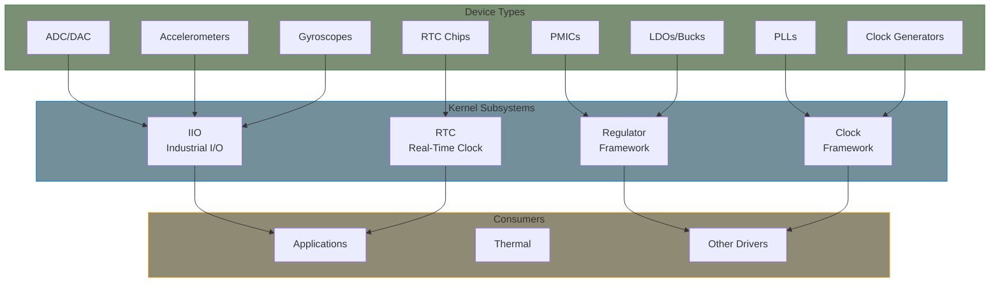
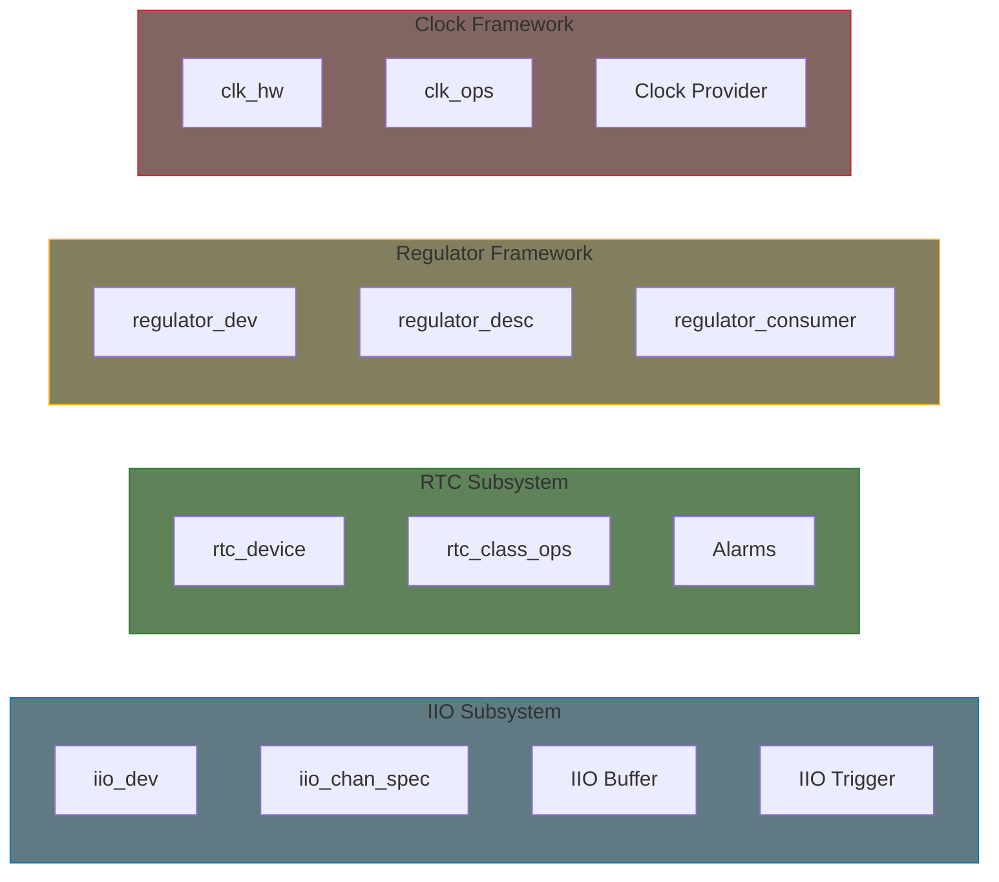

# Part 11: IIO, RTC, Regulator, Clock Drivers

This part covers four important kernel subsystems: Industrial I/O (IIO) for sensors and data acquisition, Real-Time Clock (RTC) for timekeeping, Regulator framework for power management, and Common Clock Framework (CCF) for clock providers.

## What You'll Learn

### Industrial I/O (IIO)
- IIO subsystem architecture
- Channels, attributes, and buffers
- Triggered buffer acquisition
- IIO device registration

### Real-Time Clock (RTC)
- RTC subsystem overview
- `rtc_device` implementation
- Alarm and wake-up support
- RTC class operations

### Regulator Framework
- Voltage regulator concepts
- Provider (supply) drivers
- Consumer API
- Constraints and coupling

### Common Clock Framework
- Clock tree hierarchy
- `clk_hw` implementation
- Clock types (fixed, divider, mux, PLL)
- Clock operations

## Subsystem Overview

## Key Structures

| Subsystem | Main Structure | Registration Function |
|-----------|---------------|----------------------|
| IIO | `struct iio_dev` | `devm_iio_device_register()` |
| RTC | `struct rtc_device` | `devm_rtc_device_register()` |
| Regulator | `struct regulator_dev` | `devm_regulator_register()` |
| Clock | `struct clk_hw` | `devm_clk_hw_register()` |

## Common Patterns

These subsystems share several design patterns:

1. **Provider/Consumer Model**: Drivers expose resources; others consume them
2. **Hierarchical Organization**: Clocks in trees, regulators in supplies
3. **Device Tree Integration**: Standard bindings for configuration
4. **Managed Resources**: `devm_*` functions for automatic cleanup
5. **Runtime PM Integration**: Power-aware operation

## In This Part

1. [IIO Subsystem]() - IIO architecture overview
2. [IIO Driver]() - Implementing iio_dev
3. [IIO Buffers]() - Triggered buffer acquisition
4. [RTC Subsystem]() - RTC architecture
5. [RTC Driver]() - Implementing rtc_device
6. [Regulator Subsystem]() - Regulator framework
7. [Regulator Driver]() - Provider/consumer implementation
8. [Clock Framework]() - CCF overview
9. [Clock Provider]() - Implementing clk_hw

## Further Reading

- [IIO Documentation](https://docs.kernel.org/driver-api/iio/index.html) - Industrial I/O
- [RTC Documentation](https://docs.kernel.org/driver-api/rtc.html) - Real-time clock
- [Regulator Documentation](https://docs.kernel.org/power/regulator/index.html) - Regulator framework
- [Clock Framework](https://docs.kernel.org/driver-api/clk.html) - Common clock framework

## Prerequisites

Before starting this part, you should understand:
- Platform drivers and Device Tree (Part 8)
- I2C/SPI drivers (Part 9)
- [Managed resources (devm_*)]() - essential for these drivers
- Basic kernel memory management (Part 5)
