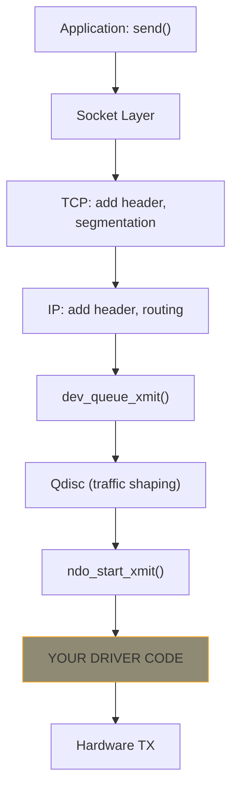
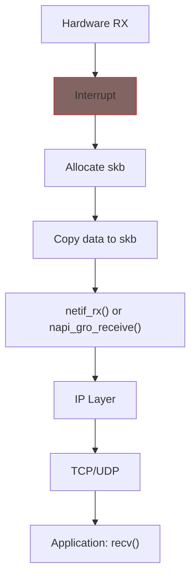

# Network Driver Concepts

Before writing code, understand these three core concepts: `net_device`, `sk_buff`, and the TX/RX data flow.

## net_device: Your Network Interface

A `net_device` represents a network interface (like `eth0` or `wlan0`). Think of it as:

- **Identity**: name, MAC address, MTU
- **State**: link up/down, carrier status
- **Operations**: how to transmit, how to configure
- **Statistics**: packets sent/received, errors

```c
/* You don't fill this directly - use allocation helpers */
struct net_device *ndev = alloc_etherdev(sizeof(struct my_priv));

ndev->netdev_ops = &my_netdev_ops;   /* Your callbacks */
ndev->ethtool_ops = &my_ethtool_ops; /* Optional: ethtool support */

register_netdev(ndev);  /* Makes interface visible */
```

{: .note }
> Use `alloc_etherdev()` for Ethernet devices. It sets up sensible defaults (MTU=1500, broadcast address, etc.). The argument is your private data size.

## sk_buff: The Packet Container

Every network packet travels through the kernel in an `sk_buff` (socket buffer). Think of it as an envelope containing:

```
┌─────────────────────────────────────────┐
│  head                                   │  ← Start of allocated memory
├─────────────────────────────────────────┤
│  (headroom for headers)                 │
├─────────────────────────────────────────┤
│  data ──────────────────────────┐       │  ← Start of actual packet
│  ┌─────────────────────────────┤        │
│  │  Ethernet Header (14 bytes) │        │
│  ├─────────────────────────────┤        │
│  │  IP Header (20+ bytes)      │        │
│  ├─────────────────────────────┤        │
│  │  TCP/UDP Header             │        │
│  ├─────────────────────────────┤        │
│  │  Payload                    │        │
│  └─────────────────────────────┘        │
│  tail ──────────────────────────        │  ← End of actual packet
├─────────────────────────────────────────┤
│  (tailroom)                             │
├─────────────────────────────────────────┤
│  end                                    │  ← End of allocated memory
└─────────────────────────────────────────┘
```

**Key operations** (you'll use these in your driver):

| Function | What It Does |
|----------|--------------|
| `skb_put(skb, len)` | Add data to tail, return pointer to added area |
| `skb_push(skb, len)` | Add header at front, return pointer |
| `skb_pull(skb, len)` | Remove bytes from front (strip header) |
| `skb_reserve(skb, len)` | Reserve headroom (call before adding data) |

## TX Path: Sending Packets

When an application calls `send()`, the packet flows down:



**Your job in `ndo_start_xmit()`:**
1. Get the packet data from `skb->data` (length: `skb->len`)
2. Send it to hardware (DMA or direct copy)
3. Free the skb when transmission completes
4. Return `NETDEV_TX_OK`

```c
static netdev_tx_t my_start_xmit(struct sk_buff *skb, struct net_device *ndev)
{
    /* Send skb->data (skb->len bytes) to hardware */

    /* Free skb when done (or in TX completion interrupt) */
    dev_kfree_skb(skb);

    return NETDEV_TX_OK;
}
```

## RX Path: Receiving Packets

Packets arrive asynchronously. The traditional flow:



**Your job in the RX path:**
1. Allocate an skb: `netdev_alloc_skb(ndev, len)`
2. Copy received data into it: `skb_put()` + `memcpy()` or DMA
3. Set metadata: `skb->protocol = eth_type_trans(skb, ndev)`
4. Hand to stack: `netif_rx(skb)` or `napi_gro_receive()`

```c
/* In your interrupt handler or NAPI poll */
skb = netdev_alloc_skb(ndev, pkt_len + NET_IP_ALIGN);
skb_reserve(skb, NET_IP_ALIGN);  /* Align IP header */
skb_put(skb, pkt_len);

/* Copy data from hardware to skb->data */
memcpy(skb->data, hw_buffer, pkt_len);

skb->protocol = eth_type_trans(skb, ndev);
netif_rx(skb);  /* Hand to network stack */
```

## The Performance Problem

At 10 Gbps with 64-byte packets, you get **~15 million packets per second**. If every packet triggers an interrupt:

- 15M interrupts/sec = system unusable
- Context switch overhead dominates
- No time left for actual work

**Solution: NAPI** (covered in [Chapter 3]())

## Summary

| Concept | Purpose |
|---------|---------|
| `net_device` | Represents your interface, holds ops and state |
| `sk_buff` | Container for packet data + metadata |
| TX path | Kernel calls `ndo_start_xmit()`, you send to hardware |
| RX path | Hardware receives, you allocate skb and call `netif_rx()` |

## Further Reading

- [sk_buff Documentation](https://docs.kernel.org/networking/skbuff.html) - Full skb API
- [Network Drivers](https://docs.kernel.org/networking/netdevices.html) - net_device details
