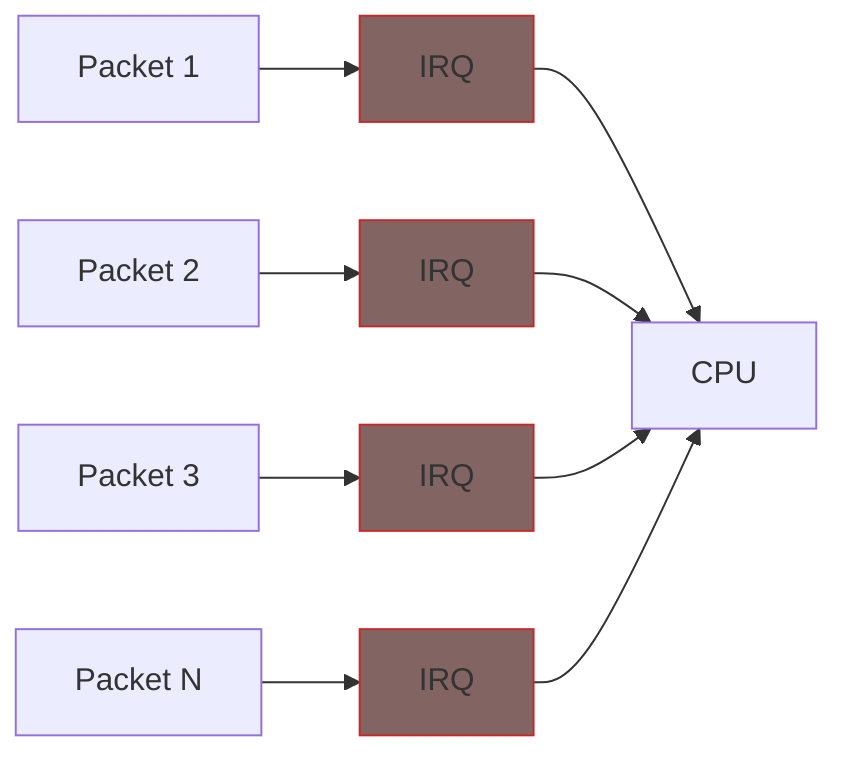
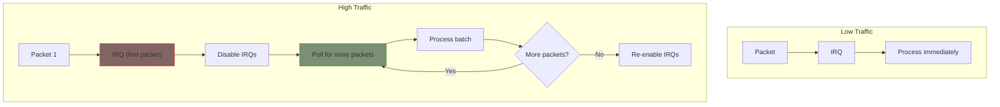

# NAPI: Interrupt Mitigation

NAPI (New API) is the standard way to handle high packet rates. Understanding NAPI is essential for network driver development.

## The Problem with Interrupts

Traditional interrupt-per-packet approach:



At 10 Gbps with small packets: **~15 million interrupts/second** → System overwhelmed.

## NAPI Solution: Switch to Polling

NAPI uses a hybrid approach:



**Key insight**: When busy, disable interrupts and poll. When idle, re-enable interrupts.

## NAPI Flow

1. **Interrupt arrives** → Disable IRQ, schedule NAPI
2. **NAPI polls** → Process up to `budget` packets
3. **If done** → Re-enable IRQ
4. **If not done** → Kernel will call poll again

```c
/* Step 1: Interrupt handler - schedule NAPI */
static irqreturn_t my_irq(int irq, void *dev_id)
{
    struct my_priv *priv = dev_id;

    /* Disable hardware interrupts */
    disable_hw_irq(priv);

    /* Schedule NAPI poll */
    napi_schedule(&priv->napi);

    return IRQ_HANDLED;
}

/* Step 2: NAPI poll function */
static int my_poll(struct napi_struct *napi, int budget)
{
    struct my_priv *priv = container_of(napi, struct my_priv, napi);
    int processed = 0;

    /* Process up to 'budget' packets */
    while (processed < budget && hw_has_packets(priv)) {
        struct sk_buff *skb = receive_one_packet(priv);
        napi_gro_receive(napi, skb);
        processed++;
    }

    /* If we processed fewer than budget, we're done */
    if (processed < budget) {
        napi_complete_done(napi, processed);
        enable_hw_irq(priv);  /* Re-enable interrupts */
    }

    return processed;
}
```

## NAPI Setup

```c
struct my_priv {
    struct net_device *ndev;
    struct napi_struct napi;
    /* ... */
};

static int my_open(struct net_device *ndev)
{
    struct my_priv *priv = netdev_priv(ndev);

    /* Enable NAPI before enabling interrupts */
    napi_enable(&priv->napi);

    /* Enable hardware, request IRQ, etc. */

    netif_start_queue(ndev);
    return 0;
}

static int my_stop(struct net_device *ndev)
{
    struct my_priv *priv = netdev_priv(ndev);

    netif_stop_queue(ndev);

    /* Disable NAPI */
    napi_disable(&priv->napi);

    /* Disable hardware, free IRQ, etc. */
    return 0;
}

static int my_probe(...)
{
    /* ... allocate net_device ... */

    /* Register NAPI */
    netif_napi_add(ndev, &priv->napi, my_poll);

    /* ... register_netdev ... */
}

static void my_remove(...)
{
    /* ... unregister_netdev ... */

    netif_napi_del(&priv->napi);

    /* ... free ... */
}
```

## Budget and Weight

- **Budget**: Maximum packets to process per poll (passed to your poll function)
- **Default weight**: 64 (set by `netif_napi_add`)

```c
/* Poll function receives budget as parameter */
static int my_poll(struct napi_struct *napi, int budget)
{
    int processed = 0;

    while (processed < budget && more_packets()) {
        /* process one packet */
        processed++;
    }

    if (processed < budget) {
        /* Done - processed less than allowed */
        napi_complete_done(napi, processed);
        enable_irq();
    }
    /* else: kernel will call us again */

    return processed;  /* Must return count processed */
}
```

{: .warning }
> Always check `processed < budget` before calling `napi_complete_done()`. If you processed exactly `budget` packets, there may be more waiting - don't re-enable interrupts yet.

## GRO: Generic Receive Offload

Use `napi_gro_receive()` instead of `netif_rx()` for better performance:

```c
/* In your poll function */
skb->protocol = eth_type_trans(skb, ndev);
napi_gro_receive(napi, skb);  /* Better than netif_rx() */
```

GRO coalesces multiple packets into larger ones, reducing per-packet overhead.

## Complete NAPI Pattern

```c
/* IRQ handler */
static irqreturn_t my_irq(int irq, void *data)
{
    struct my_priv *priv = data;

    if (!hw_interrupt_pending(priv))
        return IRQ_NONE;  /* Shared IRQ, not ours */

    disable_hw_irq(priv);
    napi_schedule(&priv->napi);
    return IRQ_HANDLED;
}

/* Poll function */
static int my_poll(struct napi_struct *napi, int budget)
{
    struct my_priv *priv = container_of(napi, struct my_priv, napi);
    struct net_device *ndev = priv->ndev;
    int processed = 0;

    while (processed < budget) {
        struct sk_buff *skb;
        int len;

        if (!hw_rx_ready(priv))
            break;

        len = hw_get_rx_len(priv);
        skb = napi_alloc_skb(napi, len);
        if (!skb) {
            ndev->stats.rx_dropped++;
            break;
        }

        hw_copy_rx_data(priv, skb_put(skb, len), len);
        skb->protocol = eth_type_trans(skb, ndev);

        napi_gro_receive(napi, skb);

        ndev->stats.rx_packets++;
        ndev->stats.rx_bytes += len;
        processed++;
    }

    if (processed < budget) {
        napi_complete_done(napi, processed);
        enable_hw_irq(priv);
    }

    return processed;
}
```

## Summary

| Step | Function |
|------|----------|
| Register NAPI | `netif_napi_add(ndev, &napi, poll_fn)` |
| Enable (in open) | `napi_enable(&napi)` |
| Schedule (in IRQ) | `napi_schedule(&napi)` |
| Complete (in poll) | `napi_complete_done(&napi, count)` |
| Disable (in stop) | `napi_disable(&napi)` |
| Unregister | `netif_napi_del(&napi)` |

## Further Reading

- [NAPI Documentation](https://docs.kernel.org/networking/napi.html) - Official reference
- [GRO Documentation](https://docs.kernel.org/networking/segmentation-offloads.html) - Offload features
