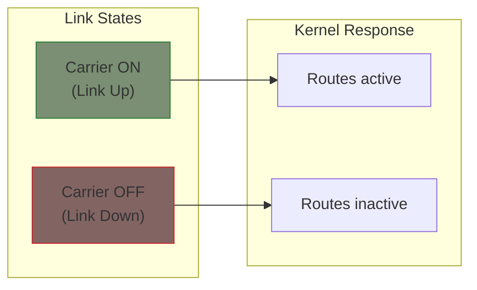
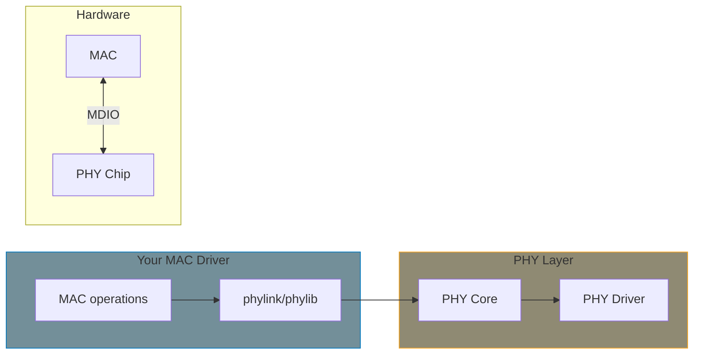

# Link State Management

Network drivers must report link status changes (cable connected/disconnected) to the kernel. This chapter covers carrier status, PHY integration, and link event handling.

## Carrier Status

The "carrier" represents physical link connectivity:



**Your driver must call:**
- `netif_carrier_on(ndev)` - When link is established
- `netif_carrier_off(ndev)` - When link is lost

## Basic Link Detection

For simple hardware with a link status register:

```c
static void my_check_link(struct my_priv *priv)
{
    struct net_device *ndev = priv->ndev;
    u32 status = readl(priv->regs + LINK_STATUS);
    bool link_up = !!(status & LINK_UP_BIT);

    if (link_up && !netif_carrier_ok(ndev)) {
        /* Link came up */
        netif_carrier_on(ndev);
        netdev_info(ndev, "Link up\n");
    } else if (!link_up && netif_carrier_ok(ndev)) {
        /* Link went down */
        netif_carrier_off(ndev);
        netdev_info(ndev, "Link down\n");
    }
}
```

## Interrupt-Driven Link Status

If hardware generates link change interrupts:

```c
static irqreturn_t my_link_irq(int irq, void *data)
{
    struct my_priv *priv = data;

    /* Clear interrupt */
    writel(LINK_IRQ_CLEAR, priv->regs + IRQ_STATUS);

    /* Check and update link status */
    my_check_link(priv);

    return IRQ_HANDLED;
}
```

## Polling Link Status

For hardware without link interrupts, use a workqueue:

```c
struct my_priv {
    struct net_device *ndev;
    struct delayed_work link_work;
    /* ... */
};

static void my_link_work(struct work_struct *work)
{
    struct my_priv *priv = container_of(work, struct my_priv,
                                        link_work.work);

    my_check_link(priv);

    /* Reschedule every second */
    schedule_delayed_work(&priv->link_work, HZ);
}

static int my_open(struct net_device *ndev)
{
    struct my_priv *priv = netdev_priv(ndev);

    /* Start link polling */
    INIT_DELAYED_WORK(&priv->link_work, my_link_work);
    schedule_delayed_work(&priv->link_work, HZ);

    netif_start_queue(ndev);
    return 0;
}

static int my_stop(struct net_device *ndev)
{
    struct my_priv *priv = netdev_priv(ndev);

    netif_stop_queue(ndev);

    /* Stop link polling */
    cancel_delayed_work_sync(&priv->link_work);

    return 0;
}
```

## Integrating with PHYLIB

Most Ethernet MACs connect to external PHY chips. The PHYLIB framework handles PHY management:



### Connecting to a PHY

```c
#include <linux/phy.h>

static int my_open(struct net_device *ndev)
{
    struct my_priv *priv = netdev_priv(ndev);
    struct phy_device *phydev;

    /* Connect to PHY specified in device tree */
    phydev = of_phy_connect(ndev, priv->phy_node,
                            my_adjust_link, 0,
                            PHY_INTERFACE_MODE_RGMII);
    if (!phydev) {
        netdev_err(ndev, "Could not connect to PHY\n");
        return -ENODEV;
    }

    /* Store for later */
    priv->phydev = phydev;

    /* Start PHY */
    phy_start(phydev);

    netif_start_queue(ndev);
    return 0;
}

static int my_stop(struct net_device *ndev)
{
    struct my_priv *priv = netdev_priv(ndev);

    netif_stop_queue(ndev);

    if (priv->phydev) {
        phy_stop(priv->phydev);
        phy_disconnect(priv->phydev);
        priv->phydev = NULL;
    }

    return 0;
}
```

### Link Adjustment Callback

PHYLIB calls this when link parameters change:

```c
static void my_adjust_link(struct net_device *ndev)
{
    struct my_priv *priv = netdev_priv(ndev);
    struct phy_device *phydev = priv->phydev;
    bool status_changed = false;

    if (phydev->link) {
        /* Link is up - configure MAC to match PHY */
        if (phydev->speed != priv->link_speed) {
            priv->link_speed = phydev->speed;
            my_set_mac_speed(priv, phydev->speed);
            status_changed = true;
        }

        if (phydev->duplex != priv->duplex) {
            priv->duplex = phydev->duplex;
            my_set_mac_duplex(priv, phydev->duplex);
            status_changed = true;
        }

        if (!netif_carrier_ok(ndev)) {
            netif_carrier_on(ndev);
            status_changed = true;
        }
    } else {
        /* Link is down */
        if (netif_carrier_ok(ndev)) {
            netif_carrier_off(ndev);
            status_changed = true;
        }
    }

    if (status_changed)
        phy_print_status(phydev);
}
```

### Device Tree PHY Reference

```dts
&ethernet {
    status = "okay";
    phy-mode = "rgmii";
    phy-handle = <&phy0>;

    mdio {
        #address-cells = <1>;
        #size-cells = <0>;

        phy0: ethernet-phy@0 {
            reg = <0>;
        };
    };
};
```

### Parsing PHY from Device Tree

```c
static int my_probe(struct platform_device *pdev)
{
    struct device_node *np = pdev->dev.of_node;
    struct my_priv *priv;

    /* ... allocate ndev and priv ... */

    /* Get PHY mode */
    priv->phy_mode = device_get_phy_mode(&pdev->dev);
    if ((int)priv->phy_mode < 0)
        return priv->phy_mode;

    /* Get PHY node */
    priv->phy_node = of_parse_phandle(np, "phy-handle", 0);
    if (!priv->phy_node) {
        dev_err(&pdev->dev, "No phy-handle specified\n");
        return -ENODEV;
    }

    /* ... */
}

static void my_remove(struct platform_device *pdev)
{
    struct my_priv *priv = platform_get_drvdata(pdev);

    of_node_put(priv->phy_node);
    /* ... */
}
```

## Fixed Link (No PHY)

For MAC-to-MAC connections or switches without a PHY:

```c
static int my_open(struct net_device *ndev)
{
    struct my_priv *priv = netdev_priv(ndev);
    struct phy_device *phydev;

    /* Create a fixed-link PHY */
    phydev = fixed_phy_register(PHY_POLL, &priv->fixed_link_status,
                                NULL);
    if (IS_ERR(phydev))
        return PTR_ERR(phydev);

    priv->phydev = phydev;
    phydev = phy_connect(ndev, phydev_name(phydev),
                         my_adjust_link, priv->phy_mode);

    phy_start(phydev);
    return 0;
}
```

Device tree for fixed link:

```dts
&ethernet {
    status = "okay";

    fixed-link {
        speed = <1000>;
        full-duplex;
    };
};
```

## Initial Carrier State

Set carrier off initially, enable when link is confirmed:

```c
static int my_probe(struct platform_device *pdev)
{
    /* ... allocate and setup ... */

    /* Start with carrier off */
    netif_carrier_off(ndev);

    register_netdev(ndev);
    return 0;
}
```

## Summary

| Situation | Approach |
|-----------|----------|
| External PHY | Use PHYLIB (`of_phy_connect`, `phy_start`) |
| No PHY (fixed) | Use fixed-link or manual carrier control |
| Link interrupt | Update carrier in ISR |
| No link interrupt | Poll with delayed_work |

**Key functions:**
- `netif_carrier_on(ndev)` / `netif_carrier_off(ndev)` - Set link state
- `netif_carrier_ok(ndev)` - Query current state
- `phy_start()` / `phy_stop()` - Control PHY polling
- `phy_connect()` / `phy_disconnect()` - Manage PHY connection

{: .note }
> Always start with carrier off. Only enable it when link is verified. This prevents traffic being sent into a black hole.

## Further Reading

- [PHYLIB Documentation](https://docs.kernel.org/networking/phy.html) - PHY library
- [PHYLINK Documentation](https://docs.kernel.org/networking/phylink.html) - Modern PHY abstraction
- [Fixed PHY](https://docs.kernel.org/networking/phy.html#fixed-link-support) - MAC-to-MAC links
