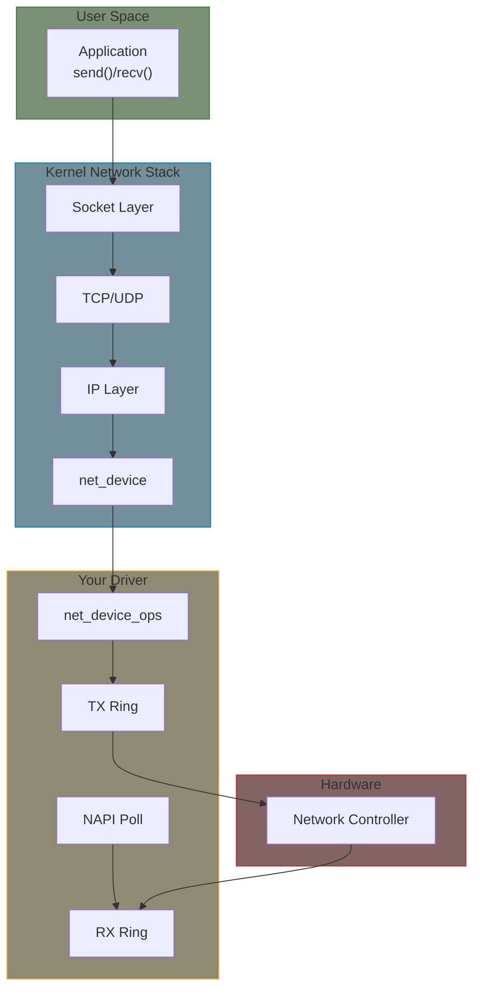

# Part 12: Network Device Drivers

Network drivers connect the kernel's TCP/IP stack to physical or virtual network hardware.

## Why Network Drivers Are Different

Network drivers differ from character/block devices in key ways:

| Aspect | Char/Block Device | Network Device |
|--------|-------------------|----------------|
| Data flow | User initiates read/write | Packets arrive asynchronously |
| Addressing | /dev node | Interface name (eth0) |
| Performance | Usually OK with syscalls | Must handle millions of packets/sec |
| API | file_operations | net_device_ops |

The challenge: **high packet rates require interrupt mitigation** (NAPI).

## Mental Model

**Key insight**: TX path is synchronous (kernel calls your `ndo_start_xmit`), but RX path uses polling (NAPI) to avoid interrupt storms.

## Chapters

| Chapter | What You'll Learn |
|---------|-------------------|
| [Concepts]() | net_device, sk_buff, and the TX/RX mental model |
| [Driver Skeleton]() | Typical driver structure and key callbacks |
| [NAPI]() | Interrupt mitigation through polling |
| [Ethtool]() | Configuration and statistics via ethtool |
| [Link Management]() | Carrier status and PHY integration |

## Example

This part includes ONE complete working example:

- **[Virtual Network Device](../examples/part12/virtual-netdev/)** - Loopback-style driver demonstrating all core concepts

## Prerequisites

- Kernel module basics (Part 1-2)
- Device model and platform drivers (Part 6)
- [Managed resources (devm_*)]() - for automatic cleanup
- Interrupt handling concepts (Part 7)
- DMA basics helpful but not required (Part 5)

## Further Reading

For API details beyond this tutorial:

- [Network Device Driver Documentation](https://docs.kernel.org/networking/netdevices.html) - Official kernel docs
- [NAPI Documentation](https://docs.kernel.org/networking/napi.html) - Polling API details
- [Driver Implementer's API](https://docs.kernel.org/networking/driver.html) - Full API reference
- [Linux Device Drivers, 3rd Ed - Chapter 17](https://lwn.net/Kernel/LDD3/) - Classic reference
