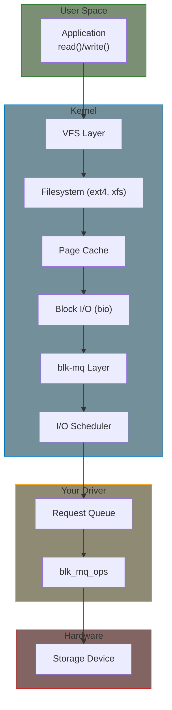

# Part 13: Block Device Drivers

Block devices provide random-access storage (disks, SSDs, RAM disks). This part covers the modern blk-mq (multi-queue) interface.

## Why Block Devices Are Different

| Aspect | Character Device | Block Device |
|--------|------------------|--------------|
| Access pattern | Sequential stream | Random access by sector |
| Data unit | Byte | Block (usually 512B or 4KB) |
| Caching | None (usually) | Page cache, writeback |
| Interface | read/write syscalls | Filesystem or direct I/O |
| Scheduling | None | I/O scheduler (mq-deadline, none, etc.) |

## Mental Model

**Key insight**: The kernel batches and schedules I/O requests. Your driver receives `struct request` containing one or more sectors to read/write.

## Key Concepts

### gendisk

`gendisk` represents your disk device:
- Capacity (in sectors)
- Block size
- Partitioning info
- Link to request queue

### blk-mq (Multi-Queue Block Layer)

Modern block layer with:
- Per-CPU software queues (no lock contention)
- Hardware queue mapping
- Tag-based request tracking

### bio vs request

- **bio**: Single contiguous I/O operation from filesystem
- **request**: Multiple bios merged by scheduler for efficiency

Your driver typically works with `struct request`.

## Chapters

| Chapter | What You'll Learn |
|---------|-------------------|
| [Concepts]() | gendisk, bio, request, and the I/O path |
| [Driver Skeleton]() | blk-mq driver structure and callbacks |
| [Block Operations]() | open/release, ioctl, disk geometry |
| [Request Handling]() | Request types, error handling, async completion |

## Example

- **[RAM Disk](../examples/part13/ramdisk/)** - Simple RAM-backed block device

## Prerequisites

- Kernel module basics (Part 1-2)
- Memory management (Part 5) - for buffer allocation

## Further Reading

- [Block Layer Documentation](https://docs.kernel.org/block/index.html) - Official docs
- [blk-mq Documentation](https://docs.kernel.org/block/blk-mq.html) - Multi-queue details
- [Request-based vs bio-based](https://docs.kernel.org/block/writeback_cache_control.html) - Design choices
