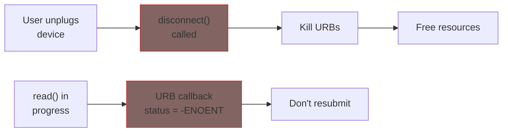

# USB Error Handling

This chapter covers robust error handling: disconnect races, error recovery, and proper cleanup.

## The Disconnect Problem

USB devices can be unplugged at any time. Your driver must handle this gracefully:



## Safe URB Callback

Always check status before processing:

```c
static void my_bulk_callback(struct urb *urb)
{
    struct my_usb *dev = urb->context;

    /* Check for disconnect/cancellation */
    switch (urb->status) {
    case 0:
        /* Success - process data */
        process_data(dev, urb->transfer_buffer, urb->actual_length);
        break;

    case -ENOENT:      /* urb was killed (usb_kill_urb) */
    case -ECONNRESET:  /* urb was unlinked (usb_unlink_urb) */
    case -ESHUTDOWN:   /* device disconnected */
        /* Device going away - don't resubmit */
        dev_dbg(&dev->intf->dev, "URB cancelled/shutdown\n");
        return;

    case -EPIPE:       /* Endpoint stalled */
        /* Try to clear stall */
        usb_clear_halt(dev->udev, urb->pipe);
        break;

    case -EOVERFLOW:   /* Data overrun */
        dev_err(&dev->intf->dev, "Data overrun\n");
        break;

    case -EPROTO:      /* Protocol error */
    case -EILSEQ:      /* CRC error */
    case -ETIME:       /* Timed out */
        dev_warn(&dev->intf->dev, "URB error: %d\n", urb->status);
        break;

    default:
        dev_err(&dev->intf->dev, "Unknown URB status: %d\n", urb->status);
        break;
    }

    /* Resubmit if device still connected */
    if (dev->connected)
        usb_submit_urb(urb, GFP_ATOMIC);
}
```

## URB Status Codes Reference

| Status | Meaning | Action |
|--------|---------|--------|
| `0` | Success | Process data |
| `-ENOENT` | URB killed by driver | Don't resubmit |
| `-ECONNRESET` | URB unlinked | Don't resubmit |
| `-ESHUTDOWN` | Device disconnected | Don't resubmit |
| `-EPIPE` | Endpoint stalled | Clear stall |
| `-EOVERFLOW` | Buffer too small | Increase buffer |
| `-EPROTO` | Protocol error | Log, maybe retry |
| `-EILSEQ` | CRC/bitstuff error | Hardware issue |
| `-ETIME` | Timeout | Retry or abort |
| `-ENODEV` | Device removed | Abort operation |

## Disconnect-Safe Operations

Use a flag to track device state:

```c
struct my_usb {
    struct usb_device *udev;
    struct usb_interface *intf;
    struct urb *urb;
    unsigned char *buffer;

    bool connected;        /* Device still present */
    struct mutex io_mutex; /* Protect I/O operations */
};

static int my_probe(struct usb_interface *intf,
                    const struct usb_device_id *id)
{
    struct my_usb *dev;

    dev = kzalloc(sizeof(*dev), GFP_KERNEL);
    if (!dev)
        return -ENOMEM;

    mutex_init(&dev->io_mutex);
    dev->connected = true;

    /* ... rest of probe ... */
    return 0;
}

static void my_disconnect(struct usb_interface *intf)
{
    struct my_usb *dev = usb_get_intfdata(intf);

    /* Mark device as disconnected */
    mutex_lock(&dev->io_mutex);
    dev->connected = false;
    mutex_unlock(&dev->io_mutex);

    /* Now safe to kill URBs */
    usb_kill_urb(dev->urb);

    /* Cleanup */
    usb_set_intfdata(intf, NULL);
    usb_free_urb(dev->urb);
    kfree(dev->buffer);
    kfree(dev);
}
```

## Safe I/O Operations

Check connection before and after I/O:

```c
static int my_read(struct my_usb *dev, void *data, int size)
{
    int ret, actual;

    mutex_lock(&dev->io_mutex);

    /* Check if still connected */
    if (!dev->connected) {
        ret = -ENODEV;
        goto out;
    }

    /* Perform blocking I/O */
    ret = usb_bulk_msg(dev->udev,
                       usb_rcvbulkpipe(dev->udev, dev->bulk_in_addr),
                       dev->buffer, min(size, 64), &actual, 5000);

    /* Check again - device might have disconnected during I/O */
    if (!dev->connected) {
        ret = -ENODEV;
        goto out;
    }

    if (ret == 0)
        memcpy(data, dev->buffer, actual);

out:
    mutex_unlock(&dev->io_mutex);
    return ret < 0 ? ret : actual;
}
```

## Handling Stalled Endpoints

Clear a stalled endpoint:

```c
static int recover_from_stall(struct my_usb *dev, unsigned int pipe)
{
    int ret;

    /* Clear the stall condition */
    ret = usb_clear_halt(dev->udev, pipe);
    if (ret < 0) {
        dev_err(&dev->intf->dev, "Failed to clear halt: %d\n", ret);
        return ret;
    }

    return 0;
}

/* In your I/O function */
ret = usb_bulk_msg(dev->udev, pipe, buffer, len, &actual, timeout);
if (ret == -EPIPE) {
    /* Endpoint stalled */
    if (recover_from_stall(dev, pipe) == 0) {
        /* Retry the transfer */
        ret = usb_bulk_msg(dev->udev, pipe, buffer, len, &actual, timeout);
    }
}
```

## Device Reset

For severe errors, reset the device:

```c
static int my_reset_device(struct my_usb *dev)
{
    int ret;

    mutex_lock(&dev->io_mutex);

    if (!dev->connected) {
        ret = -ENODEV;
        goto out;
    }

    /* Kill any pending URBs */
    usb_kill_urb(dev->urb);

    /* Reset the device */
    ret = usb_reset_device(dev->udev);
    if (ret < 0) {
        dev_err(&dev->intf->dev, "Device reset failed: %d\n", ret);
        goto out;
    }

    /* Device was reset - re-initialize */
    ret = my_device_init(dev);

out:
    mutex_unlock(&dev->io_mutex);
    return ret;
}
```

{: .warning }
> `usb_reset_device()` will cause your `disconnect()` and `probe()` to be called if the device re-enumerates differently.

## Pre/Post Reset Callbacks

Handle reset gracefully:

```c
static int my_pre_reset(struct usb_interface *intf)
{
    struct my_usb *dev = usb_get_intfdata(intf);

    /* Stop all I/O before reset */
    mutex_lock(&dev->io_mutex);
    usb_kill_urb(dev->urb);

    return 0;
}

static int my_post_reset(struct usb_interface *intf)
{
    struct my_usb *dev = usb_get_intfdata(intf);

    /* Reinitialize after reset */
    my_device_init(dev);

    mutex_unlock(&dev->io_mutex);
    return 0;
}

static struct usb_driver my_driver = {
    .name = "my_usb_driver",
    .id_table = my_id_table,
    .probe = my_probe,
    .disconnect = my_disconnect,
    .pre_reset = my_pre_reset,
    .post_reset = my_post_reset,
};
```

## Autosuspend Interaction

Prevent suspend during I/O:

```c
static int my_open(struct my_usb *dev)
{
    /* Prevent autosuspend while open */
    usb_autopm_get_interface(dev->intf);
    return 0;
}

static int my_release(struct my_usb *dev)
{
    /* Allow autosuspend again */
    usb_autopm_put_interface(dev->intf);
    return 0;
}
```

## Summary

| Scenario | Handling |
|----------|----------|
| Normal disconnect | Kill URBs, free resources |
| URB error | Check status, clear stall if needed |
| Endpoint stall | `usb_clear_halt()` |
| Severe error | `usb_reset_device()` |
| I/O during disconnect | Check `connected` flag, use mutex |

**Key principles:**
1. Always check URB status in callbacks
2. Never resubmit after -ENOENT/-ESHUTDOWN
3. Use mutex to protect against disconnect races
4. Clear stalls before retrying
5. Reset device as last resort

## Further Reading

- [USB Error Handling](https://docs.kernel.org/driver-api/usb/error-codes.html) - Error code reference
- [USB Core API](https://docs.kernel.org/driver-api/usb/usb.html) - Full documentation
