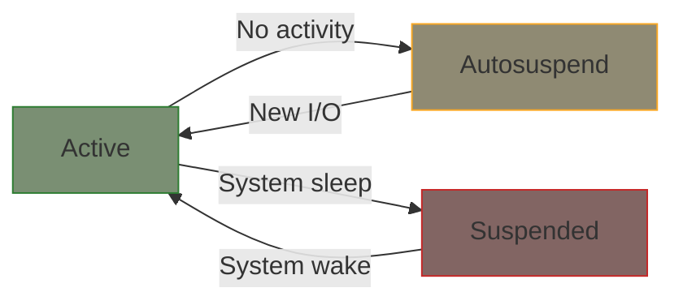

# USB Suspend and Resume

This chapter covers USB power management: autosuspend and system sleep.

## USB Power States



| State | Power | Device Status |
|-------|-------|---------------|
| Active | Full | Processing I/O |
| Autosuspend | Reduced | Idle, can wake quickly |
| System Suspend | Minimal | Saved state, deep sleep |

## Autosuspend

USB autosuspend powers down idle devices automatically. Enable it in your driver:

```c
static int my_probe(struct usb_interface *intf,
                    const struct usb_device_id *id)
{
    struct my_usb *dev;
    struct usb_device *udev = interface_to_usbdev(intf);

    /* ... allocate and initialize ... */

    /* Enable autosuspend */
    usb_enable_autosuspend(udev);

    /* Set autosuspend delay (in seconds) */
    pm_runtime_set_autosuspend_delay(&udev->dev, 2);

    return 0;
}
```

## Suspend and Resume Callbacks

Implement suspend/resume to save/restore device state:

```c
static int my_suspend(struct usb_interface *intf, pm_message_t message)
{
    struct my_usb *dev = usb_get_intfdata(intf);

    /* Kill pending URBs */
    usb_kill_urb(dev->urb);

    /* Save any device state if needed */
    dev->saved_state = read_device_state(dev);

    return 0;
}

static int my_resume(struct usb_interface *intf)
{
    struct my_usb *dev = usb_get_intfdata(intf);
    int ret;

    /* Restore device state */
    ret = restore_device_state(dev, dev->saved_state);
    if (ret < 0)
        return ret;

    /* Resubmit URBs if device was active */
    if (dev->reading)
        usb_submit_urb(dev->urb, GFP_KERNEL);

    return 0;
}

static struct usb_driver my_driver = {
    .name = "my_usb_driver",
    .id_table = my_id_table,
    .probe = my_probe,
    .disconnect = my_disconnect,
    .suspend = my_suspend,
    .resume = my_resume,
    .supports_autosuspend = 1,  /* Required for autosuspend */
};
```

{: .note }
> Set `.supports_autosuspend = 1` to enable autosuspend. Without this, autosuspend won't work even if enabled.

## Preventing Autosuspend During I/O

Use `usb_autopm_get/put` to prevent suspend during operations:

```c
static int my_read(struct my_usb *dev, void *data, int size)
{
    int ret;

    /* Prevent suspend during I/O */
    ret = usb_autopm_get_interface(dev->intf);
    if (ret < 0)
        return ret;

    /* Perform I/O - device guaranteed to be active */
    ret = do_usb_io(dev, data, size);

    /* Allow suspend again */
    usb_autopm_put_interface(dev->intf);

    return ret;
}
```

For async operations, use `_async` variants:

```c
static int start_async_read(struct my_usb *dev)
{
    int ret;

    /* Keep device awake for async operation */
    ret = usb_autopm_get_interface_async(dev->intf);
    if (ret < 0)
        return ret;

    ret = usb_submit_urb(dev->urb, GFP_KERNEL);
    if (ret < 0) {
        usb_autopm_put_interface_async(dev->intf);
        return ret;
    }

    return 0;
}

static void my_bulk_callback(struct urb *urb)
{
    struct my_usb *dev = urb->context;

    /* Process data... */

    /* Allow suspend now that we're done */
    usb_autopm_put_interface_async(dev->intf);
}
```

## Remote Wakeup

Some devices can wake the host from suspend:

```c
static int my_probe(struct usb_interface *intf,
                    const struct usb_device_id *id)
{
    struct usb_device *udev = interface_to_usbdev(intf);

    /* Enable remote wakeup if device supports it */
    if (udev->descriptor.bmAttributes & USB_CONFIG_ATT_WAKEUP) {
        device_init_wakeup(&intf->dev, true);
    }

    /* ... */
    return 0;
}

static int my_suspend(struct usb_interface *intf, pm_message_t message)
{
    struct my_usb *dev = usb_get_intfdata(intf);

    usb_kill_urb(dev->urb);

    /* Enable wake-on-event if configured */
    if (device_may_wakeup(&intf->dev)) {
        enable_device_wakeup(dev);
    }

    return 0;
}

static int my_resume(struct usb_interface *intf)
{
    struct my_usb *dev = usb_get_intfdata(intf);

    if (device_may_wakeup(&intf->dev)) {
        disable_device_wakeup(dev);
    }

    /* Resubmit URBs... */
    return 0;
}
```

## Reset-Resume

When a device resets during suspend, it needs full reinitialization:

```c
static int my_reset_resume(struct usb_interface *intf)
{
    struct my_usb *dev = usb_get_intfdata(intf);

    /* Device was reset - reinitialize completely */
    my_device_init(dev);

    /* Restore previous state */
    if (dev->was_reading)
        usb_submit_urb(dev->urb, GFP_KERNEL);

    return 0;
}

static struct usb_driver my_driver = {
    .name = "my_usb_driver",
    .id_table = my_id_table,
    .probe = my_probe,
    .disconnect = my_disconnect,
    .suspend = my_suspend,
    .resume = my_resume,
    .reset_resume = my_reset_resume,  /* Handle reset during suspend */
    .supports_autosuspend = 1,
};
```

## Distinguishing Suspend Types

The `pm_message_t` tells you why suspend was called:

```c
static int my_suspend(struct usb_interface *intf, pm_message_t message)
{
    struct my_usb *dev = usb_get_intfdata(intf);

    if (PMSG_IS_AUTO(message)) {
        /* Autosuspend - device idle */
        dev_dbg(&intf->dev, "Autosuspend\n");
    } else {
        /* System suspend */
        dev_dbg(&intf->dev, "System suspend\n");
    }

    usb_kill_urb(dev->urb);
    return 0;
}
```

## Complete PM Example

```c
struct my_usb {
    struct usb_device *udev;
    struct usb_interface *intf;
    struct urb *urb;
    unsigned char *buffer;

    bool reading;
    u32 saved_config;
};

static int my_suspend(struct usb_interface *intf, pm_message_t message)
{
    struct my_usb *dev = usb_get_intfdata(intf);

    /* Stop I/O */
    usb_kill_urb(dev->urb);

    /* Save hardware state */
    dev->saved_config = read_device_config(dev);

    return 0;
}

static int my_resume(struct usb_interface *intf)
{
    struct my_usb *dev = usb_get_intfdata(intf);

    /* Restore hardware state */
    write_device_config(dev, dev->saved_config);

    /* Restart I/O if it was active */
    if (dev->reading)
        usb_submit_urb(dev->urb, GFP_KERNEL);

    return 0;
}

static struct usb_driver my_driver = {
    .name = "my_usb_driver",
    .id_table = my_id_table,
    .probe = my_probe,
    .disconnect = my_disconnect,
    .suspend = my_suspend,
    .resume = my_resume,
    .reset_resume = my_resume,  /* Can often reuse resume */
    .supports_autosuspend = 1,
};
```

## User-Space Control

Users can control autosuspend via sysfs:

```bash
# Check current status
cat /sys/bus/usb/devices/1-1/power/runtime_status

# Disable autosuspend for this device
echo on > /sys/bus/usb/devices/1-1/power/control

# Enable autosuspend
echo auto > /sys/bus/usb/devices/1-1/power/control

# Set autosuspend delay (in seconds)
echo 5 > /sys/bus/usb/devices/1-1/power/autosuspend
```

## Summary

| Function | Purpose |
|----------|---------|
| `usb_enable_autosuspend()` | Enable autosuspend for device |
| `usb_autopm_get_interface()` | Prevent suspend, resume if needed |
| `usb_autopm_put_interface()` | Allow suspend again |
| `.suspend` | Called before entering low power |
| `.resume` | Called when waking up |
| `.supports_autosuspend` | Required flag for autosuspend |

**Key principles:**
1. Always set `.supports_autosuspend = 1` if implementing PM
2. Kill URBs in suspend, resubmit in resume
3. Use `usb_autopm_get/put` to prevent suspend during I/O
4. Save/restore device state across suspend cycles

## Further Reading

- [USB Power Management](https://docs.kernel.org/driver-api/usb/power-management.html) - Official docs
- [Runtime PM](https://docs.kernel.org/power/runtime_pm.html) - General PM framework
