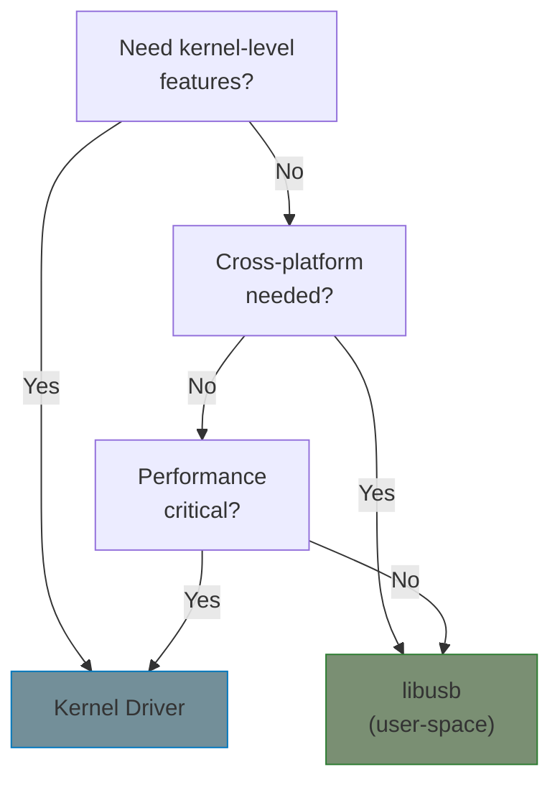
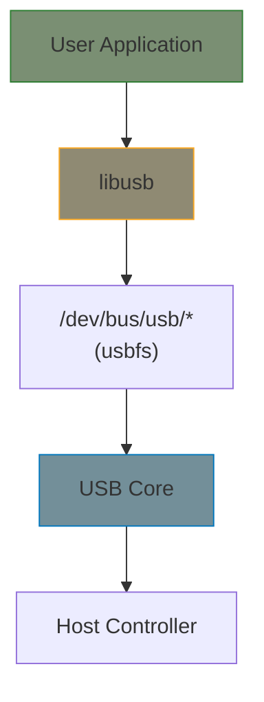

# WinUSB and libusb Compatibility

This chapter covers designing USB devices and drivers for cross-platform compatibility with WinUSB (Windows) and libusb (Linux/macOS/Windows).

## When to Use What



| Approach | Pros | Cons |
|----------|------|------|
| **Kernel driver** | Full access, best performance, integrates with subsystems | Platform-specific, needs root to install |
| **libusb** | Cross-platform, no root install, easier development | Limited features, higher latency |
| **WinUSB** | Windows native, no custom driver | Windows only |

## libusb Architecture on Linux



libusb on Linux uses **usbfs** - a virtual filesystem that exposes USB devices to user space.

## Designing for libusb Compatibility

### Device Side: Avoiding Kernel Driver Binding

If you want libusb to access your device, prevent the kernel from claiming it:

```c
/* Option 1: Use a unique VID:PID not matched by any kernel driver */

/* Option 2: Mark interface for user-space in kernel driver */
static int my_probe(struct usb_interface *intf,
                    const struct usb_device_id *id)
{
    /* Check if user wants libusb access */
    if (use_libusb_mode) {
        /* Don't bind - let usbfs handle it */
        return -ENODEV;
    }
    /* Normal kernel driver binding */
    return 0;
}

/* Option 3: Create a "stub" driver that can be unbound */
/* User runs: echo "1-2:1.0" > /sys/bus/usb/drivers/my_driver/unbind */
```

### Supporting Both Kernel and libusb Access

```c
/* Driver that supports both modes */
static bool libusb_mode = false;
module_param(libusb_mode, bool, 0644);
MODULE_PARM_DESC(libusb_mode, "Don't claim device, allow libusb access");

static int my_probe(struct usb_interface *intf,
                    const struct usb_device_id *id)
{
    if (libusb_mode) {
        dev_info(&intf->dev, "libusb mode - not binding\n");
        return -ENODEV;
    }

    /* Normal probe */
    return do_probe(intf, id);
}
```

## usbfs: The Linux libusb Backend

### How libusb Uses usbfs

```bash
# Device nodes created by udev
/dev/bus/usb/001/001    # Bus 1, Device 1
/dev/bus/usb/001/002    # Bus 1, Device 2

# Permissions (usually need udev rules for non-root access)
ls -la /dev/bus/usb/001/
crw-rw-r-- 1 root root 189, 0 Jan  1 00:00 001
crw-rw-rw- 1 root plugdev 189, 1 Jan  1 00:00 002
```

### udev Rules for libusb Access

Create `/etc/udev/rules.d/99-mydevice.rules`:

```udev
# Allow all users to access device with VID:PID 1234:5678
SUBSYSTEM=="usb", ATTR{idVendor}=="1234", ATTR{idProduct}=="5678", MODE="0666"

# Or restrict to a group
SUBSYSTEM=="usb", ATTR{idVendor}=="1234", ATTR{idProduct}=="5678", GROUP="plugdev", MODE="0660"

# Unbind kernel driver automatically for libusb use
SUBSYSTEM=="usb", ATTR{idVendor}=="1234", ATTR{idProduct}=="5678", RUN+="/bin/sh -c 'echo $kernel > /sys/bus/usb/drivers/my_driver/unbind'"
```

Reload rules:
```bash
sudo udevadm control --reload-rules
sudo udevadm trigger
```

## WinUSB Compatibility

### WinUSB-Compatible Descriptors

For automatic WinUSB binding on Windows, add Microsoft OS descriptors:

```c
/* USB device descriptor with MS OS String Descriptor support */
static const u8 ms_os_string_desc[] = {
    18,                     /* bLength */
    USB_DT_STRING,          /* bDescriptorType */
    'M', 0, 'S', 0,         /* qwSignature: "MSFT100" */
    'F', 0, 'T', 0,
    '1', 0, '0', 0,
    '0', 0,
    0x01,                   /* bMS_VendorCode */
    0x00,                   /* bPad */
};

/* Extended Compat ID OS Feature Descriptor - declares WinUSB compatible */
static const u8 ms_ext_compat_id[] = {
    0x28, 0x00, 0x00, 0x00, /* dwLength */
    0x00, 0x01,             /* bcdVersion */
    0x04, 0x00,             /* wIndex */
    0x01,                   /* bCount */
    /* ... 7 bytes reserved ... */
    0x00,                   /* bFirstInterfaceNumber */
    0x01,                   /* Reserved */
    'W', 'I', 'N', 'U', 'S', 'B', 0, 0,  /* compatibleID */
    0, 0, 0, 0, 0, 0, 0, 0,              /* subCompatibleID */
    /* ... 6 bytes reserved ... */
};
```

### Device Side Implementation

If you're writing firmware, respond to MS OS descriptor requests:

```c
/* Handle MS OS String Descriptor request */
if (setup->bRequest == 0x01 && /* MS_VENDOR_CODE */
    setup->wIndex == 0x0004) { /* Extended Compat ID */
    return send_descriptor(ms_ext_compat_id, sizeof(ms_ext_compat_id));
}
```

## Cross-Platform Driver Strategy

### Architecture for Dual Support

```
┌─────────────────────────────────────────────────┐
│                  Application                    │
├─────────────────────────────────────────────────┤
│              Protocol Layer                     │
│         (device-specific logic)                 │
├──────────────────┬──────────────────────────────┤
│  Linux Kernel    │        libusb                │
│  USB Driver      │   (cross-platform)           │
├──────────────────┴──────────────────────────────┤
│                USB Hardware                     │
└─────────────────────────────────────────────────┘
```

### Abstraction Layer Example

```c
/* transport.h - Abstract USB transport */
struct usb_transport {
    void *context;
    int (*open)(struct usb_transport *t, uint16_t vid, uint16_t pid);
    void (*close)(struct usb_transport *t);
    int (*bulk_write)(struct usb_transport *t, uint8_t ep,
                      void *data, int len, int timeout);
    int (*bulk_read)(struct usb_transport *t, uint8_t ep,
                     void *data, int len, int timeout);
    int (*control)(struct usb_transport *t, uint8_t type, uint8_t req,
                   uint16_t val, uint16_t idx, void *data, int len);
};

/* libusb implementation */
struct usb_transport *transport_libusb_create(void);

/* Linux kernel implementation (for kernel module) */
struct usb_transport *transport_kernel_create(struct usb_interface *intf);
```

### libusb Implementation

```c
/* transport_libusb.c */
#include <libusb.h>

struct libusb_context_data {
    libusb_context *ctx;
    libusb_device_handle *handle;
};

static int libusb_open(struct usb_transport *t, uint16_t vid, uint16_t pid)
{
    struct libusb_context_data *d = t->context;

    libusb_init(&d->ctx);
    d->handle = libusb_open_device_with_vid_pid(d->ctx, vid, pid);
    if (!d->handle)
        return -1;

    libusb_claim_interface(d->handle, 0);
    return 0;
}

static int libusb_bulk_write(struct usb_transport *t, uint8_t ep,
                              void *data, int len, int timeout)
{
    struct libusb_context_data *d = t->context;
    int actual;
    int ret = libusb_bulk_transfer(d->handle, ep, data, len, &actual, timeout);
    return ret < 0 ? ret : actual;
}

/* ... similar for other functions ... */
```

## Debugging libusb Issues

### Check Device Access

```bash
# List USB devices
lsusb -v -d 1234:5678

# Check if kernel driver is bound
cat /sys/bus/usb/devices/1-2:1.0/driver/module

# Manually unbind kernel driver
echo "1-2:1.0" | sudo tee /sys/bus/usb/drivers/my_driver/unbind

# Check permissions
ls -la /dev/bus/usb/001/002

# Test with libusb
sudo ./my_libusb_app  # Works?
./my_libusb_app       # Permission denied?
```

### USB Traffic Capture

```bash
# Load usbmon
sudo modprobe usbmon

# Find bus number
lsusb  # e.g., Bus 001

# Capture with Wireshark
sudo wireshark -i usbmon1

# Or with tcpdump
sudo tcpdump -i usbmon1 -w usb.pcap
```

## Comparison: libusb vs Kernel Driver

| Feature | libusb | Kernel Driver |
|---------|--------|---------------|
| Development time | Fast | Slower |
| Cross-platform | Yes | No |
| Performance | Good | Best |
| Root required | For udev setup | For install |
| Isochronous | Supported | Supported |
| Integration | Limited | Full (netdev, block, etc.) |
| Hot-plug handling | Manual | Automatic |
| Power management | Basic | Full |

## When to Choose What

**Use libusb when:**
- Cross-platform support needed
- Simple bulk/control transfers
- Prototyping or testing
- Infrequent device access

**Use kernel driver when:**
- Integration with kernel subsystems (network, block, input)
- High-performance requirements
- Advanced power management
- Multiple concurrent users
- Production Linux-only deployment

## Summary

| Topic | Key Points |
|-------|------------|
| libusb on Linux | Uses usbfs, needs udev rules for permissions |
| WinUSB | MS OS descriptors enable automatic binding |
| Cross-platform | Abstraction layer over transport |
| Kernel vs libusb | Trade-off: features vs portability |

## Further Reading

- [libusb Documentation](https://libusb.info/api-1.0/) - API reference
- [WinUSB](https://docs.microsoft.com/en-us/windows-hardware/drivers/usbcon/winusb) - Microsoft documentation
- [MS OS Descriptors](https://docs.microsoft.com/en-us/windows-hardware/drivers/usbcon/microsoft-defined-usb-descriptors) - Automatic driver binding
- [usbfs](https://docs.kernel.org/driver-api/usb/usb.html#the-usb-character-device-nodes) - Linux user-space USB access
