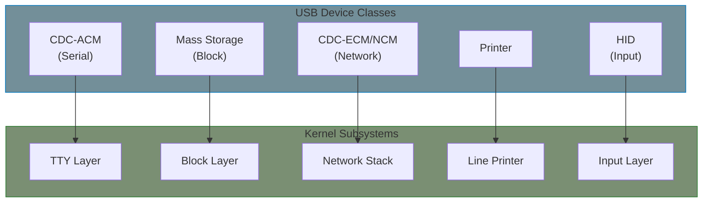
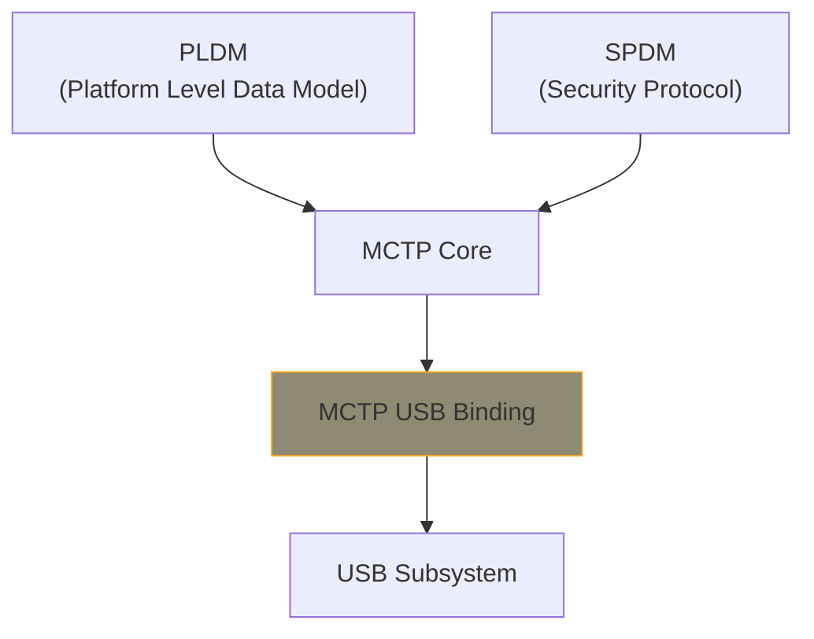

# USB Class Drivers

This chapter covers USB class drivers that integrate with other kernel subsystems: serial (ACM), storage, network, and printer classes.

## USB Class Overview

USB classes allow generic drivers to work with any compliant device:



| Class | Code | Kernel Integration | Device Examples |
|-------|------|-------------------|-----------------|
| CDC-ACM | 0x02 | tty (serial) | Modems, Arduino, debug consoles |
| Mass Storage | 0x08 | block (scsi) | Flash drives, card readers |
| CDC-ECM | 0x02 | network | Ethernet adapters |
| CDC-NCM | 0x02 | network | High-speed Ethernet |
| Printer | 0x07 | usblp | Printers |
| HID | 0x03 | input | Keyboards, mice |

## CDC-ACM: USB Serial Devices

CDC-ACM (Abstract Control Model) presents USB devices as serial ports (`/dev/ttyACM*`).

### ACM Driver Structure

```c
#include <linux/usb.h>
#include <linux/usb/cdc.h>
#include <linux/tty.h>
#include <linux/tty_driver.h>
#include <linux/tty_flip.h>

struct acm_device {
    struct usb_device *udev;
    struct usb_interface *control;
    struct usb_interface *data;
    struct tty_port port;

    /* Endpoints */
    u8 bulk_in;
    u8 bulk_out;
    u8 notify;

    /* URBs */
    struct urb *read_urb;
    struct urb *write_urb;
    struct urb *notify_urb;

    /* Buffers */
    unsigned char *read_buffer;
    unsigned char *write_buffer;

    /* Line coding (baud rate, etc.) */
    struct usb_cdc_line_coding line;
};
```

### Registering with TTY Layer

```c
static struct tty_driver *acm_tty_driver;

static const struct tty_operations acm_tty_ops = {
    .open = acm_tty_open,
    .close = acm_tty_close,
    .write = acm_tty_write,
    .write_room = acm_tty_write_room,
    .set_termios = acm_tty_set_termios,
    .tiocmget = acm_tty_tiocmget,
    .tiocmset = acm_tty_tiocmset,
};

static int __init acm_init(void)
{
    int ret;

    /* Allocate TTY driver */
    acm_tty_driver = tty_alloc_driver(ACM_TTY_MINORS,
                                       TTY_DRIVER_REAL_RAW |
                                       TTY_DRIVER_DYNAMIC_DEV);
    if (IS_ERR(acm_tty_driver))
        return PTR_ERR(acm_tty_driver);

    acm_tty_driver->driver_name = "acm";
    acm_tty_driver->name = "ttyACM";
    acm_tty_driver->major = 0;  /* Dynamic */
    acm_tty_driver->minor_start = 0;
    acm_tty_driver->type = TTY_DRIVER_TYPE_SERIAL;
    acm_tty_driver->subtype = SERIAL_TYPE_NORMAL;
    tty_set_operations(acm_tty_driver, &acm_tty_ops);

    ret = tty_register_driver(acm_tty_driver);
    if (ret)
        goto err_tty;

    ret = usb_register(&acm_usb_driver);
    if (ret)
        goto err_usb;

    return 0;

err_usb:
    tty_unregister_driver(acm_tty_driver);
err_tty:
    tty_driver_kref_put(acm_tty_driver);
    return ret;
}
```

### Handling Serial Data

```c
/* Receive callback - push to TTY */
static void acm_read_callback(struct urb *urb)
{
    struct acm_device *acm = urb->context;
    struct tty_port *port = &acm->port;

    if (urb->status == 0 && urb->actual_length > 0) {
        /* Push data to TTY buffer */
        tty_insert_flip_string(port, acm->read_buffer, urb->actual_length);
        tty_flip_buffer_push(port);
    }

    /* Resubmit for more data */
    if (urb->status != -ESHUTDOWN)
        usb_submit_urb(urb, GFP_ATOMIC);
}

/* TTY write - send to USB */
static int acm_tty_write(struct tty_struct *tty,
                          const unsigned char *buf, int count)
{
    struct acm_device *acm = tty->driver_data;

    if (count > ACM_BUFFER_SIZE)
        count = ACM_BUFFER_SIZE;

    memcpy(acm->write_buffer, buf, count);

    usb_fill_bulk_urb(acm->write_urb, acm->udev,
                      usb_sndbulkpipe(acm->udev, acm->bulk_out),
                      acm->write_buffer, count,
                      acm_write_callback, acm);

    return usb_submit_urb(acm->write_urb, GFP_ATOMIC) ? 0 : count;
}

/* Set baud rate, parity, etc. */
static void acm_tty_set_termios(struct tty_struct *tty,
                                 const struct ktermios *old)
{
    struct acm_device *acm = tty->driver_data;
    struct usb_cdc_line_coding coding;

    /* Convert termios to USB line coding */
    coding.dwDTERate = cpu_to_le32(tty_get_baud_rate(tty));
    coding.bCharFormat = tty->termios.c_cflag & CSTOPB ? 2 : 0;
    coding.bParityType = /* ... convert parity ... */;
    coding.bDataBits = /* ... convert data bits ... */;

    /* Send SET_LINE_CODING request */
    usb_control_msg(acm->udev, usb_sndctrlpipe(acm->udev, 0),
                    USB_CDC_REQ_SET_LINE_CODING,
                    USB_TYPE_CLASS | USB_RECIP_INTERFACE | USB_DIR_OUT,
                    0, acm->control->cur_altsetting->desc.bInterfaceNumber,
                    &coding, sizeof(coding), 5000);
}
```

## USB Mass Storage

Mass storage class presents USB devices as SCSI block devices.

### Architecture


### Bulk-Only Transport (BOT)

```c
/* Command Block Wrapper (CBW) */
struct bulk_cb_wrap {
    __le32 Signature;        /* 0x43425355 "USBC" */
    __le32 Tag;              /* Unique command ID */
    __le32 DataTransferLength;
    __u8   Flags;            /* Direction: 0x80=IN, 0x00=OUT */
    __u8   Lun;
    __u8   Length;           /* SCSI command length */
    __u8   CDB[16];          /* SCSI command */
} __packed;

/* Command Status Wrapper (CSW) */
struct bulk_cs_wrap {
    __le32 Signature;        /* 0x53425355 "USBS" */
    __le32 Tag;              /* Matches CBW Tag */
    __le32 Residue;          /* Bytes not transferred */
    __u8   Status;           /* 0=pass, 1=fail, 2=phase error */
} __packed;

/* Send SCSI command over USB */
static int usb_stor_bulk_transfer_sglist(struct us_data *us,
                                          unsigned int pipe,
                                          struct scatterlist *sg,
                                          int num_sg, unsigned int length,
                                          unsigned int *act_len)
{
    /* 1. Send CBW */
    usb_stor_bulk_transfer_buf(us, us->send_bulk_pipe,
                                &us->cbw, US_BULK_CB_WRAP_LEN, NULL);

    /* 2. Data phase (if any) */
    if (length > 0)
        usb_stor_bulk_transfer_sg(us, pipe, sg, num_sg, length, act_len);

    /* 3. Receive CSW */
    usb_stor_bulk_transfer_buf(us, us->recv_bulk_pipe,
                                &us->csw, US_BULK_CS_WRAP_LEN, NULL);

    return check_csw_status(&us->csw);
}
```

### Registering with SCSI

```c
static struct scsi_host_template usb_stor_host_template = {
    .name = "USB Mass Storage",
    .proc_name = "usb-storage",
    .queuecommand = queuecommand,
    .eh_abort_handler = command_abort,
    .eh_device_reset_handler = device_reset,
    .can_queue = 1,
    .this_id = -1,
    .sg_tablesize = SG_ALL,
    .max_sectors = 240,
};

static int usb_stor_probe(struct usb_interface *intf,
                           const struct usb_device_id *id)
{
    struct Scsi_Host *host;
    struct us_data *us;

    host = scsi_host_alloc(&usb_stor_host_template, sizeof(*us));
    us = shost_priv(host);

    /* Initialize USB specifics */
    us->udev = interface_to_usbdev(intf);
    /* ... find endpoints ... */

    scsi_add_host(host, &intf->dev);
    scsi_scan_host(host);

    return 0;
}
```

## USB Network: CDC-ECM/NCM/RNDIS

USB network classes provide Ethernet over USB.

### Network Class Comparison

| Class | Speed | Efficiency | Use Case |
|-------|-------|------------|----------|
| CDC-ECM | Low | Single frame/transfer | Simple devices, BMC |
| CDC-NCM | High | Multiple frames/transfer | Modern devices |
| RNDIS | Medium | Windows compat | Cross-platform |
| CDC-EEM | Medium | Minimal overhead | Embedded |

{: .note }
> **OpenBMC Usage**: OpenBMC (Yocto-based BMC firmware) typically uses **CDC-ECM** for USB network between BMC and host. ECM is preferred because:
> - Native Linux support on host (no drivers needed)
> - Simple implementation suitable for management traffic
> - Low overhead for BMC's limited resources
>
> For Windows host compatibility, OpenBMC can use a **composite gadget** combining ECM + RNDIS:
> ```bash
> # OpenBMC USB gadget configuration (meta-phosphor)
> # /usr/share/usb-network/usb-network.sh
> mkdir -p functions/ecm.usb0      # Linux hosts
> mkdir -p functions/rndis.usb0    # Windows hosts
> ```
>
> The BMC acts as USB **gadget** (device), not host. See [USB Gadget Drivers]() for gadget-side implementation.

### CDC-ECM/NCM Driver Structure

```c
#include <linux/usb/cdc.h>
#include <linux/usb/usbnet.h>

struct cdc_ncm_ctx {
    struct usbnet *dev;

    /* NCM parameters */
    u32 rx_max;
    u32 tx_max;
    u16 tx_max_datagrams;
    u16 tx_remainder;
    u16 tx_modulus;

    /* Delayed TX aggregation */
    struct sk_buff *tx_curr_skb;
    struct timer_list tx_timer;
    spinlock_t mtx;
};

/* Register with usbnet framework */
static const struct driver_info cdc_ncm_info = {
    .description = "CDC NCM",
    .flags = FLAG_POINTTOPOINT | FLAG_NO_SETINT | FLAG_MULTI_PACKET,
    .bind = cdc_ncm_bind,
    .unbind = cdc_ncm_unbind,
    .status = cdc_ncm_status,
    .rx_fixup = cdc_ncm_rx_fixup,
    .tx_fixup = cdc_ncm_tx_fixup,
};

static int cdc_ncm_bind(struct usbnet *dev, struct usb_interface *intf)
{
    struct cdc_ncm_ctx *ctx;

    ctx = kzalloc(sizeof(*ctx), GFP_KERNEL);
    dev->driver_priv = ctx;
    ctx->dev = dev;

    /* Parse CDC functional descriptors */
    cdc_ncm_find_endpoints(dev, intf);

    /* Get NCM parameters */
    cdc_ncm_setup(dev);

    /* Set MAC address from descriptor */
    usbnet_get_ethernet_addr(dev, /* ... */);

    return 0;
}
```

### NCM Frame Aggregation

```c
/* NCM Transfer Header (NTH16) */
struct usb_cdc_ncm_nth16 {
    __le32 dwSignature;      /* "NCMH" */
    __le16 wHeaderLength;
    __le16 wSequence;
    __le16 wBlockLength;
    __le16 wNdpIndex;        /* Offset to NDP */
} __packed;

/* NCM Datagram Pointer (NDP16) */
struct usb_cdc_ncm_ndp16 {
    __le32 dwSignature;      /* "NCM0" or "NCM1" */
    __le16 wLength;
    __le16 wNextNdpIndex;
    /* Followed by datagram entries */
} __packed;

/* RX: Unpack aggregated frames */
static int cdc_ncm_rx_fixup(struct usbnet *dev, struct sk_buff *skb)
{
    struct usb_cdc_ncm_nth16 *nth;
    struct usb_cdc_ncm_ndp16 *ndp;
    struct usb_cdc_ncm_dpe16 *dpe;

    nth = (void *)skb->data;
    if (nth->dwSignature != cpu_to_le32(USB_CDC_NCM_NTH16_SIGN))
        return 0;

    ndp = (void *)(skb->data + le16_to_cpu(nth->wNdpIndex));

    /* Process each datagram */
    dpe = ndp->dpe16;
    while (le16_to_cpu(dpe->wDatagramIndex) &&
           le16_to_cpu(dpe->wDatagramLength)) {

        struct sk_buff *skb2;
        skb2 = netdev_alloc_skb(dev->net, dpe->wDatagramLength);
        skb_put_data(skb2, skb->data + dpe->wDatagramIndex,
                     dpe->wDatagramLength);
        usbnet_skb_return(dev, skb2);
        dpe++;
    }

    return 1;
}

/* TX: Aggregate multiple frames */
static struct sk_buff *cdc_ncm_tx_fixup(struct usbnet *dev,
                                         struct sk_buff *skb, gfp_t flags)
{
    struct cdc_ncm_ctx *ctx = dev->driver_priv;

    spin_lock_bh(&ctx->mtx);

    if (!ctx->tx_curr_skb) {
        /* Start new aggregation buffer */
        ctx->tx_curr_skb = alloc_skb(ctx->tx_max, flags);
        cdc_ncm_fill_nth(ctx);
    }

    /* Add datagram to current buffer */
    cdc_ncm_add_datagram(ctx, skb);

    /* Check if we should send now */
    if (cdc_ncm_tx_ready(ctx)) {
        skb = ctx->tx_curr_skb;
        ctx->tx_curr_skb = NULL;
    } else {
        /* Delay for more aggregation */
        mod_timer(&ctx->tx_timer, jiffies + TX_TIMEOUT);
        skb = NULL;
    }

    spin_unlock_bh(&ctx->mtx);
    return skb;
}
```

### RNDIS (Remote NDIS)

Microsoft's proprietary USB network protocol:

```c
/* RNDIS message types */
#define RNDIS_MSG_INIT          0x00000002
#define RNDIS_MSG_QUERY         0x00000004
#define RNDIS_MSG_SET           0x00000005
#define RNDIS_MSG_PACKET        0x00000001

struct rndis_data_hdr {
    __le32 msg_type;         /* RNDIS_MSG_PACKET */
    __le32 msg_len;
    __le32 data_offset;
    __le32 data_len;
    /* ... OOB data, per-packet info ... */
} __packed;

static int rndis_rx_fixup(struct usbnet *dev, struct sk_buff *skb)
{
    struct rndis_data_hdr *hdr = (void *)skb->data;

    if (hdr->msg_type != cpu_to_le32(RNDIS_MSG_PACKET))
        return 0;

    /* Strip RNDIS header */
    skb_pull(skb, le32_to_cpu(hdr->data_offset) + 8);
    skb_trim(skb, le32_to_cpu(hdr->data_len));

    return 1;
}
```

## MCTP over USB

MCTP (Management Component Transport Protocol) enables platform management over USB.

### MCTP Architecture



### MCTP USB Binding

```c
#include <linux/mctp.h>
#include <linux/usb.h>

/* MCTP USB uses vendor-specific interface class */
#define MCTP_USB_CLASS        0xFF
#define MCTP_USB_SUBCLASS     0x04
#define MCTP_USB_PROTOCOL     0x01

struct mctp_usb {
    struct mctp_dev mdev;
    struct usb_device *udev;
    struct usb_interface *intf;

    u8 bulk_in;
    u8 bulk_out;

    struct urb *rx_urb;
    u8 *rx_buf;
};

/* MCTP over USB packet header */
struct mctp_usb_hdr {
    u8 id[4];                /* "MCTP" */
    u8 rsvd;
    u8 len;                  /* Payload length */
} __packed;

static int mctp_usb_tx(struct mctp_dev *mdev, struct sk_buff *skb)
{
    struct mctp_usb *musb = container_of(mdev, struct mctp_usb, mdev);
    struct mctp_usb_hdr *hdr;
    int ret;

    /* Prepend USB header */
    hdr = skb_push(skb, sizeof(*hdr));
    memcpy(hdr->id, "MCTP", 4);
    hdr->len = skb->len - sizeof(*hdr);

    ret = usb_bulk_msg(musb->udev,
                       usb_sndbulkpipe(musb->udev, musb->bulk_out),
                       skb->data, skb->len, NULL, 1000);

    kfree_skb(skb);
    return ret;
}

static void mctp_usb_rx_callback(struct urb *urb)
{
    struct mctp_usb *musb = urb->context;
    struct mctp_usb_hdr *hdr;
    struct sk_buff *skb;

    if (urb->status != 0)
        goto resubmit;

    hdr = (void *)musb->rx_buf;
    if (memcmp(hdr->id, "MCTP", 4) != 0)
        goto resubmit;

    /* Deliver to MCTP core */
    skb = netdev_alloc_skb(NULL, hdr->len);
    skb_put_data(skb, musb->rx_buf + sizeof(*hdr), hdr->len);
    mctp_pkttype_receive(skb, &musb->mdev);

resubmit:
    usb_submit_urb(urb, GFP_ATOMIC);
}

static int mctp_usb_probe(struct usb_interface *intf,
                           const struct usb_device_id *id)
{
    struct mctp_usb *musb;

    musb = kzalloc(sizeof(*musb), GFP_KERNEL);
    musb->udev = interface_to_usbdev(intf);
    musb->intf = intf;

    /* Find bulk endpoints */
    /* ... */

    /* Register with MCTP subsystem */
    musb->mdev.dev = &intf->dev;
    musb->mdev.ops = &mctp_usb_ops;
    mctp_register_netdev(&musb->mdev);

    /* Start receiving */
    usb_submit_urb(musb->rx_urb, GFP_KERNEL);

    return 0;
}
```

## USB Printer Class

```c
#include <linux/usb.h>

struct usb_printer {
    struct usb_device *udev;
    struct usb_interface *intf;
    u8 bulk_in;
    u8 bulk_out;

    /* Device ID string */
    char *device_id;

    /* Minor number for /dev/usb/lpX */
    int minor;
};

static const struct file_operations usblp_fops = {
    .owner = THIS_MODULE,
    .read = usblp_read,
    .write = usblp_write,
    .poll = usblp_poll,
    .unlocked_ioctl = usblp_ioctl,
    .open = usblp_open,
    .release = usblp_release,
};

/* Get IEEE 1284 Device ID */
static int usblp_get_id(struct usb_printer *usblp)
{
    int ret;

    usblp->device_id = kmalloc(1024, GFP_KERNEL);

    ret = usb_control_msg(usblp->udev,
                          usb_rcvctrlpipe(usblp->udev, 0),
                          0,  /* GET_DEVICE_ID */
                          USB_TYPE_CLASS | USB_RECIP_INTERFACE | USB_DIR_IN,
                          0,  /* Config index */
                          usblp->intf->cur_altsetting->desc.bInterfaceNumber,
                          usblp->device_id, 1024, 5000);

    return ret;
}

/* Write to printer */
static ssize_t usblp_write(struct file *file, const char __user *buf,
                            size_t count, loff_t *ppos)
{
    struct usb_printer *usblp = file->private_data;
    int actual;

    if (copy_from_user(usblp->write_buf, buf, count))
        return -EFAULT;

    return usb_bulk_msg(usblp->udev,
                        usb_sndbulkpipe(usblp->udev, usblp->bulk_out),
                        usblp->write_buf, count, &actual, 0) ? -EIO : actual;
}
```

## Custom Class Driver Template

Creating your own class driver:

```c
/* Template for USB class driver integrating with kernel subsystem */

struct my_usb_class_device {
    /* USB specifics */
    struct usb_device *udev;
    struct usb_interface *intf;
    u8 ep_in, ep_out;

    /* Kernel subsystem integration */
    struct device *subsys_dev;  /* e.g., tty_port, net_device */

    /* State */
    bool connected;
    struct mutex lock;
};

static int my_class_probe(struct usb_interface *intf,
                           const struct usb_device_id *id)
{
    struct my_usb_class_device *dev;
    int ret;

    dev = kzalloc(sizeof(*dev), GFP_KERNEL);
    mutex_init(&dev->lock);
    dev->connected = true;

    /* 1. Set up USB */
    dev->udev = interface_to_usbdev(intf);
    dev->intf = intf;
    find_endpoints(dev, intf);

    /* 2. Register with kernel subsystem */
    ret = register_with_subsystem(dev);
    if (ret)
        goto err;

    usb_set_intfdata(intf, dev);
    return 0;

err:
    kfree(dev);
    return ret;
}

static void my_class_disconnect(struct usb_interface *intf)
{
    struct my_usb_class_device *dev = usb_get_intfdata(intf);

    mutex_lock(&dev->lock);
    dev->connected = false;
    mutex_unlock(&dev->lock);

    /* Unregister from subsystem */
    unregister_from_subsystem(dev);

    usb_set_intfdata(intf, NULL);
    kfree(dev);
}
```

## Summary

| Class | Kernel Integration | Key Functions |
|-------|-------------------|---------------|
| CDC-ACM | tty_driver, tty_port | `tty_insert_flip_string()`, `tty_flip_buffer_push()` |
| Mass Storage | scsi_host_template | `scsi_host_alloc()`, `scsi_add_host()` |
| CDC-NCM | usbnet driver_info | `usbnet_skb_return()`, rx/tx_fixup |
| RNDIS | usbnet | `rndis_command()`, header parsing |
| MCTP | mctp_dev | `mctp_register_netdev()` |
| Printer | file_operations | Direct `/dev/usb/lpX` access |

## Further Reading

- [USB CDC Specification](https://www.usb.org/document-library/class-definitions-communication-devices-12) - CDC class docs
- [USB Mass Storage](https://www.usb.org/document-library/mass-storage-class-specification-overview-14) - BOT protocol
- [MCTP Specification](https://www.dmtf.org/standards/mctp) - DMTF MCTP standard
- [usbnet Framework](https://elixir.bootlin.com/linux/v6.6/source/drivers/net/usb/usbnet.c) - Network driver base
