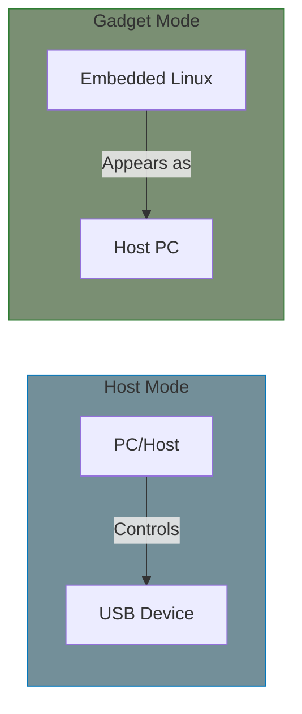
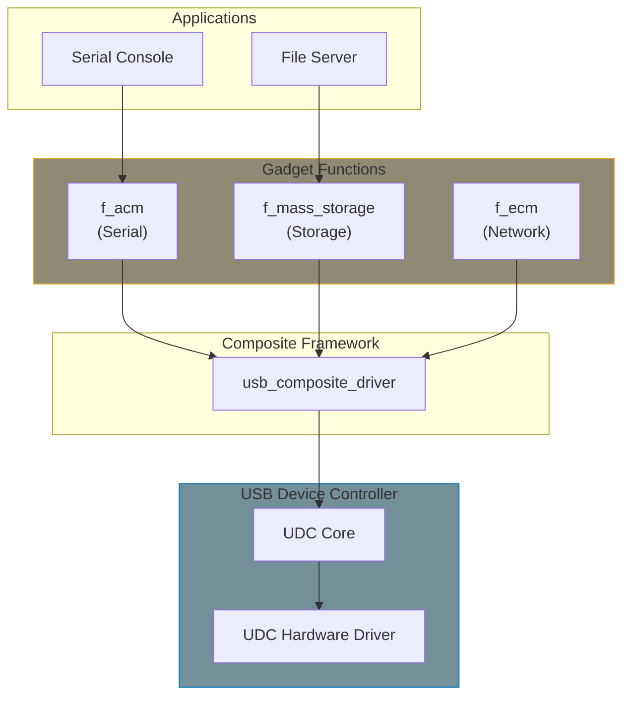

# USB Gadget Drivers

This chapter covers USB gadget (device-side) drivers - when Linux acts as the USB device, not the host.

## Host vs Gadget



| Mode | Linux Role | Use Case |
|------|------------|----------|
| Host | Controller | PC connecting to peripherals |
| Gadget | Peripheral | Embedded device appearing to PC |

**Gadget examples:**
- Raspberry Pi as USB serial console
- Android phone as USB storage
- Embedded board as Ethernet adapter
- Custom USB device emulation

## Gadget Architecture



## ConfigFS Gadget (Recommended)

Modern way to create USB gadgets at runtime:

```bash
# Load modules
modprobe libcomposite
modprobe usb_f_acm
modprobe usb_f_mass_storage

# Create gadget
cd /sys/kernel/config/usb_gadget
mkdir g1 && cd g1

# Set IDs
echo 0x1d6b > idVendor   # Linux Foundation
echo 0x0104 > idProduct  # Multifunction Composite Gadget
echo 0x0100 > bcdDevice
echo 0x0200 > bcdUSB

# Strings
mkdir strings/0x409
echo "fedcba9876543210" > strings/0x409/serialnumber
echo "Linux" > strings/0x409/manufacturer
echo "USB Gadget" > strings/0x409/product

# Configuration
mkdir configs/c.1
mkdir configs/c.1/strings/0x409
echo "Config 1" > configs/c.1/strings/0x409/configuration
echo 250 > configs/c.1/MaxPower

# Add ACM function (serial)
mkdir functions/acm.usb0
ln -s functions/acm.usb0 configs/c.1/

# Add mass storage function
mkdir functions/mass_storage.usb0
echo /dev/mmcblk0p1 > functions/mass_storage.usb0/lun.0/file
ln -s functions/mass_storage.usb0 configs/c.1/

# Enable gadget (use your UDC name)
ls /sys/class/udc
echo "fe980000.usb" > UDC
```

## Legacy Gadget API

For custom gadget functions, use the composite framework:

### Composite Driver

```c
#include <linux/usb/composite.h>

static struct usb_device_descriptor device_desc = {
    .bLength            = USB_DT_DEVICE_SIZE,
    .bDescriptorType    = USB_DT_DEVICE,
    .bcdUSB             = cpu_to_le16(0x0200),
    .bDeviceClass       = USB_CLASS_MISC,
    .bDeviceSubClass    = 2,
    .bDeviceProtocol    = 1,
    .idVendor           = cpu_to_le16(VENDOR_ID),
    .idProduct          = cpu_to_le16(PRODUCT_ID),
    .bNumConfigurations = 1,
};

static struct usb_string strings[] = {
    [USB_GADGET_MANUFACTURER_IDX].s = "My Company",
    [USB_GADGET_PRODUCT_IDX].s = "My Gadget",
    [USB_GADGET_SERIAL_IDX].s = "0123456789",
    { }
};

static struct usb_gadget_strings stringtab = {
    .language = 0x0409,  /* en-US */
    .strings = strings,
};

static struct usb_gadget_strings *gadget_strings[] = {
    &stringtab,
    NULL,
};

static int my_gadget_bind(struct usb_composite_dev *cdev)
{
    int ret;

    /* Allocate string IDs */
    ret = usb_string_ids_tab(cdev, strings);
    if (ret < 0)
        return ret;

    device_desc.iManufacturer = strings[USB_GADGET_MANUFACTURER_IDX].id;
    device_desc.iProduct = strings[USB_GADGET_PRODUCT_IDX].id;
    device_desc.iSerialNumber = strings[USB_GADGET_SERIAL_IDX].id;

    /* Add configuration */
    ret = usb_add_config(cdev, &my_config_driver, my_config_bind);

    return ret;
}

static struct usb_composite_driver my_gadget_driver = {
    .name = "my_gadget",
    .dev = &device_desc,
    .strings = gadget_strings,
    .max_speed = USB_SPEED_HIGH,
    .bind = my_gadget_bind,
    .unbind = my_gadget_unbind,
};

module_usb_composite_driver(my_gadget_driver);
```

### Custom Function

```c
#include <linux/usb/composite.h>

struct my_function {
    struct usb_function func;
    struct usb_ep *ep_in;
    struct usb_ep *ep_out;
    struct usb_request *req_in;
    struct usb_request *req_out;
};

/* Endpoint descriptors */
static struct usb_endpoint_descriptor fs_ep_in_desc = {
    .bLength          = USB_DT_ENDPOINT_SIZE,
    .bDescriptorType  = USB_DT_ENDPOINT,
    .bEndpointAddress = USB_DIR_IN,
    .bmAttributes     = USB_ENDPOINT_XFER_BULK,
    .wMaxPacketSize   = cpu_to_le16(64),
};

static struct usb_endpoint_descriptor fs_ep_out_desc = {
    .bLength          = USB_DT_ENDPOINT_SIZE,
    .bDescriptorType  = USB_DT_ENDPOINT,
    .bEndpointAddress = USB_DIR_OUT,
    .bmAttributes     = USB_ENDPOINT_XFER_BULK,
    .wMaxPacketSize   = cpu_to_le16(64),
};

/* Function callbacks */
static int my_func_bind(struct usb_configuration *c,
                         struct usb_function *f)
{
    struct my_function *mf = container_of(f, struct my_function, func);
    struct usb_composite_dev *cdev = c->cdev;
    int ret;

    /* Allocate interface ID */
    ret = usb_interface_id(c, f);
    if (ret < 0)
        return ret;
    my_intf_desc.bInterfaceNumber = ret;

    /* Allocate endpoints */
    mf->ep_in = usb_ep_autoconfig(cdev->gadget, &fs_ep_in_desc);
    if (!mf->ep_in)
        return -ENODEV;

    mf->ep_out = usb_ep_autoconfig(cdev->gadget, &fs_ep_out_desc);
    if (!mf->ep_out)
        return -ENODEV;

    /* Allocate requests */
    mf->req_in = usb_ep_alloc_request(mf->ep_in, GFP_KERNEL);
    mf->req_out = usb_ep_alloc_request(mf->ep_out, GFP_KERNEL);

    return 0;
}

static int my_func_set_alt(struct usb_function *f,
                            unsigned intf, unsigned alt)
{
    struct my_function *mf = container_of(f, struct my_function, func);

    /* Enable endpoints */
    config_ep_by_speed(f->config->cdev->gadget, f, mf->ep_in);
    usb_ep_enable(mf->ep_in);

    config_ep_by_speed(f->config->cdev->gadget, f, mf->ep_out);
    usb_ep_enable(mf->ep_out);

    /* Queue initial OUT request to receive data */
    mf->req_out->complete = my_out_complete;
    mf->req_out->context = mf;
    usb_ep_queue(mf->ep_out, mf->req_out, GFP_ATOMIC);

    return 0;
}

static void my_func_disable(struct usb_function *f)
{
    struct my_function *mf = container_of(f, struct my_function, func);

    usb_ep_disable(mf->ep_in);
    usb_ep_disable(mf->ep_out);
}
```

### Request Handling

```c
/* Data received from host */
static void my_out_complete(struct usb_ep *ep, struct usb_request *req)
{
    struct my_function *mf = req->context;

    switch (req->status) {
    case 0:
        /* Success - process data */
        process_received_data(mf, req->buf, req->actual);

        /* Queue request again */
        usb_ep_queue(ep, req, GFP_ATOMIC);
        break;

    case -ESHUTDOWN:
        /* Gadget disconnected */
        break;

    default:
        pr_err("OUT complete error: %d\n", req->status);
        usb_ep_queue(ep, req, GFP_ATOMIC);
        break;
    }
}

/* Send data to host */
static int my_send_data(struct my_function *mf, void *data, int len)
{
    memcpy(mf->req_in->buf, data, len);
    mf->req_in->length = len;
    mf->req_in->complete = my_in_complete;
    mf->req_in->context = mf;

    return usb_ep_queue(mf->ep_in, mf->req_in, GFP_KERNEL);
}

static void my_in_complete(struct usb_ep *ep, struct usb_request *req)
{
    struct my_function *mf = req->context;

    if (req->status == 0)
        pr_debug("Sent %d bytes to host\n", req->actual);
}
```

## Common Gadget Functions

### Serial (ACM)

```bash
# ConfigFS
mkdir functions/acm.usb0
ln -s functions/acm.usb0 configs/c.1/

# Creates /dev/ttyGS0 on gadget side
# Host sees /dev/ttyACM0
```

```c
/* Use in code */
#include <linux/usb/g_serial.h>

/* gs_port handles TTY integration */
```

### Mass Storage

```bash
# ConfigFS
mkdir functions/mass_storage.usb0
echo /path/to/disk.img > functions/mass_storage.usb0/lun.0/file
echo 1 > functions/mass_storage.usb0/lun.0/removable
ln -s functions/mass_storage.usb0 configs/c.1/
```

### Ethernet (ECM/RNDIS/NCM)

```bash
# CDC ECM (Mac/Linux compatible)
mkdir functions/ecm.usb0
# Creates usb0 network interface on gadget

# RNDIS (Windows compatible)
mkdir functions/rndis.usb0

# NCM (modern, efficient)
mkdir functions/ncm.usb0
```

{: .note }
> **OpenBMC USB Network Configuration**
>
> OpenBMC uses USB gadget networking for BMC-to-Host communication. The typical setup in `meta-phosphor`:
>
> ```bash
> #!/bin/bash
> # /usr/share/usb-network/usb-network.sh (simplified)
>
> GADGET_BASE=/sys/kernel/config/usb_gadget
> GADGET_NAME=bmc
>
> # Create gadget
> mkdir -p ${GADGET_BASE}/${GADGET_NAME}
> cd ${GADGET_BASE}/${GADGET_NAME}
>
> # BMC identifiers (OpenBMC VID:PID)
> echo 0x1d6b > idVendor   # Linux Foundation
> echo 0x0104 > idProduct  # Multifunction Composite
>
> # Strings
> mkdir -p strings/0x409
> echo "OpenBMC" > strings/0x409/manufacturer
> echo "BMC USB Network" > strings/0x409/product
>
> # Configuration
> mkdir -p configs/c.1/strings/0x409
> echo "ECM+RNDIS" > configs/c.1/strings/0x409/configuration
>
> # ECM function (Linux/Mac hosts)
> mkdir -p functions/ecm.usb0
> HOST_MAC=$(cat /sys/class/net/eth0/address)
> DEV_MAC=$(echo $HOST_MAC | sed 's/^\(..\)/\12/')  # Modify first byte
> echo $HOST_MAC > functions/ecm.usb0/host_addr
> echo $DEV_MAC > functions/ecm.usb0/dev_addr
>
> # RNDIS function (Windows hosts) - must be first for Windows
> mkdir -p functions/rndis.usb0
>
> # Link functions to config (order matters for Windows)
> ln -s functions/rndis.usb0 configs/c.1/
> ln -s functions/ecm.usb0 configs/c.1/
>
> # Enable gadget
> UDC=$(ls /sys/class/udc | head -1)
> echo $UDC > UDC
>
> # Configure IP on BMC side
> ifconfig usb0 169.254.0.2 netmask 255.255.0.0 up
> ```
>
> **Host-side detection:**
> - Linux: Automatically creates `usb0` interface via `cdc_ether` driver
> - Windows: Uses RNDIS, may need driver on older versions
> - The BMC typically uses link-local addressing (169.254.x.x)
>
> **Why ECM over NCM in OpenBMC:**
> - ECM has broader host compatibility
> - Management traffic is low-bandwidth (IPMI, Redfish)
> - NCM's aggregation benefits are minimal for small packets
> - Simpler debugging

### HID (Keyboard/Mouse)

```bash
# Keyboard
mkdir functions/hid.usb0
echo 1 > functions/hid.usb0/protocol
echo 1 > functions/hid.usb0/subclass
echo 8 > functions/hid.usb0/report_length
# Write HID report descriptor
echo -ne \\x05\\x01\\x09\\x06... > functions/hid.usb0/report_desc
ln -s functions/hid.usb0 configs/c.1/
```

### Multi-function (Composite)

```bash
# Serial + Network + Storage
mkdir functions/acm.usb0
mkdir functions/ecm.usb0
mkdir functions/mass_storage.usb0

ln -s functions/acm.usb0 configs/c.1/
ln -s functions/ecm.usb0 configs/c.1/
ln -s functions/mass_storage.usb0 configs/c.1/
```

## FunctionFS: User-Space Gadget

Run gadget logic in user space:

```bash
# ConfigFS setup
mkdir functions/ffs.my_func
ln -s functions/ffs.my_func configs/c.1/

# Mount FunctionFS
mkdir /dev/ffs
mount -t functionfs my_func /dev/ffs
```

```c
/* User-space code */
#include <linux/usb/functionfs.h>

/* Write descriptors to ep0 */
int fd = open("/dev/ffs/ep0", O_RDWR);
write(fd, &descriptors, sizeof(descriptors));
write(fd, &strings, sizeof(strings));

/* Open endpoints */
int ep_in = open("/dev/ffs/ep1", O_RDWR);
int ep_out = open("/dev/ffs/ep2", O_RDWR);

/* Read/write data */
while (1) {
    int n = read(ep_out, buf, sizeof(buf));
    if (n > 0) {
        process(buf, n);
        write(ep_in, response, response_len);
    }
}
```

## UDC (USB Device Controller) Drivers

Low-level hardware interface:

```c
#include <linux/usb/gadget.h>

static const struct usb_gadget_ops my_udc_ops = {
    .get_frame = my_udc_get_frame,
    .wakeup = my_udc_wakeup,
    .set_selfpowered = my_udc_set_selfpowered,
    .pullup = my_udc_pullup,
    .udc_start = my_udc_start,
    .udc_stop = my_udc_stop,
};

static const struct usb_ep_ops my_ep_ops = {
    .enable = my_ep_enable,
    .disable = my_ep_disable,
    .alloc_request = my_ep_alloc_request,
    .free_request = my_ep_free_request,
    .queue = my_ep_queue,
    .dequeue = my_ep_dequeue,
    .set_halt = my_ep_set_halt,
};

static int my_udc_probe(struct platform_device *pdev)
{
    struct my_udc *udc;

    udc = devm_kzalloc(&pdev->dev, sizeof(*udc), GFP_KERNEL);

    /* Initialize gadget structure */
    udc->gadget.ops = &my_udc_ops;
    udc->gadget.max_speed = USB_SPEED_HIGH;
    udc->gadget.speed = USB_SPEED_UNKNOWN;
    udc->gadget.name = "my_udc";

    /* Initialize EP0 */
    udc->ep0.ep.ops = &my_ep_ops;
    udc->ep0.ep.name = "ep0";
    udc->ep0.ep.maxpacket = 64;
    udc->gadget.ep0 = &udc->ep0.ep;
    INIT_LIST_HEAD(&udc->gadget.ep_list);

    /* Add other endpoints */
    for (i = 1; i < NUM_EPS; i++) {
        list_add_tail(&udc->eps[i].ep.ep_list, &udc->gadget.ep_list);
    }

    /* Register with UDC core */
    return usb_add_gadget_udc(&pdev->dev, &udc->gadget);
}
```

## Summary

| Approach | Complexity | Use Case |
|----------|------------|----------|
| ConfigFS | Low | Standard functions (serial, storage, network) |
| Composite API | Medium | Custom multi-function devices |
| FunctionFS | Medium | User-space gadget logic |
| UDC Driver | High | New USB controller hardware |

## Further Reading

- [USB Gadget API](https://docs.kernel.org/driver-api/usb/gadget.html) - Kernel docs
- [ConfigFS Gadget](https://docs.kernel.org/usb/gadget_configfs.html) - Runtime configuration
- [FunctionFS](https://docs.kernel.org/usb/functionfs.html) - User-space interface
