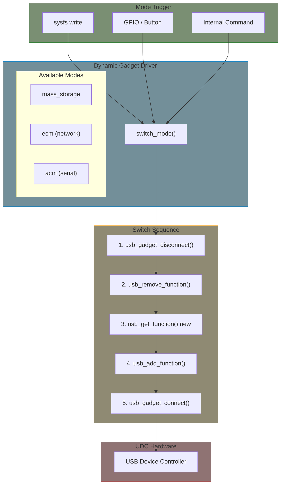

# Dynamic USB Gadget Configuration

Chapter 10 showed how to create gadgets using ConfigFS (shell scripts) or write a fixed custom function in C. This chapter covers the next step: **kernel code that dynamically switches gadget modes at runtime** — for example, an embedded board that starts as mass storage but switches to a network adapter on command.

## Why Dynamic Gadgets?

Fixed gadget configurations are fine for devices with a single purpose. But many embedded systems need to change their USB identity at runtime:

| Scenario | Example |
|----------|---------|
| User-selectable mode | DIP switch or button selects storage vs. network |
| State-dependent mode | Boot as mass storage for firmware update, then switch to network for normal operation |
| BMC/management controller | Switch between IPMI serial, virtual media, and network based on host requests |
| Debug vs. production | Development mode exposes serial console; production mode exposes only the product interface |

The host sees a device disconnect and a new device connect — this is inherent to changing USB device class.

## Architecture



## Key Concepts

### Function Instances vs. Functions

The gadget framework separates **templates** from **active instances**:

```
usb_function_instance (template)     usb_function (active)
─────────────────────────────────    ────────────────────────
Created once at bind time            Created each time you switch modes
Holds configuration (backing file,   Holds runtime state (endpoints,
MAC address, etc.)                   requests, interface IDs)
Lives for the lifetime of the        Created with usb_get_function(),
composite driver                     destroyed with usb_put_function()
```

This separation is what makes dynamic switching possible — you keep the templates around and stamp out new active instances as needed.

### The Switch Sequence

When switching from mode A to mode B:

```
  Gadget Side                    USB Bus                    Host Side
  ──────────                    ───────                    ─────────
  [mode A active]               ← enumerated →             [sees device A]
       │
  trigger: switch to B
       │
  usb_gadget_disconnect() ────→ electrical disconnect ───→ "device removed"
       │
  usb_remove_function(A)        (bus idle)
  usb_put_function(A)
       │
  usb_get_function(fi_B)
  usb_add_function(B)
       │
  usb_gadget_connect() ───────→ electrical connect ──────→ "new device!"
       │                                                    re-enumerate
  [mode B active]               ← enumerated →             [sees device B]
```

## Complete Example: Dynamic Mode-Switching Gadget

This module creates a composite gadget that can switch between mass storage, network (ECM), and serial (ACM) modes via sysfs.

### Driver State

```c
#include <linux/module.h>
#include <linux/kernel.h>
#include <linux/usb/composite.h>
#include <linux/usb/gadget.h>

#define VENDOR_ID   0x1d6b  /* Linux Foundation */
#define PRODUCT_ID  0x0200

enum gadget_mode {
    MODE_NONE,
    MODE_MASS_STORAGE,
    MODE_NETWORK,
    MODE_SERIAL,
};

static const char *mode_names[] = {
    [MODE_NONE]         = "none",
    [MODE_MASS_STORAGE] = "mass_storage",
    [MODE_NETWORK]      = "network",
    [MODE_SERIAL]       = "serial",
};

struct dynamic_gadget {
    struct usb_composite_dev    *cdev;
    struct usb_configuration    config;

    /* Function templates — one per supported mode */
    struct usb_function_instance *fi_mass;
    struct usb_function_instance *fi_ecm;
    struct usb_function_instance *fi_acm;

    /* Currently active function */
    struct usb_function         *f_active;
    enum gadget_mode             current_mode;

    struct mutex                 lock;
};

static struct dynamic_gadget the_gadget;
```

### Composite Driver Setup

```c
static struct usb_device_descriptor device_desc = {
    .bLength            = USB_DT_DEVICE_SIZE,
    .bDescriptorType    = USB_DT_DEVICE,
    .bcdUSB             = cpu_to_le16(0x0200),
    .bDeviceClass       = USB_CLASS_MISC,
    .bDeviceSubClass    = 2,
    .bDeviceProtocol    = 1,  /* IAD */
    .idVendor           = cpu_to_le16(VENDOR_ID),
    .idProduct          = cpu_to_le16(PRODUCT_ID),
    .bNumConfigurations = 1,
};

static struct usb_string strings[] = {
    [USB_GADGET_MANUFACTURER_IDX].s = "Linux",
    [USB_GADGET_PRODUCT_IDX].s     = "Dynamic Gadget",
    [USB_GADGET_SERIAL_IDX].s      = "0123456789",
    { }
};

static struct usb_gadget_strings stringtab = {
    .language = 0x0409,
    .strings  = strings,
};

static struct usb_gadget_strings *gadget_strings[] = {
    &stringtab,
    NULL,
};
```

### Mode Switching Core

This is the central function — disconnect, swap, reconnect:

```c
static int dynamic_switch_mode(struct dynamic_gadget *dg,
                               enum gadget_mode new_mode)
{
    struct usb_function_instance *fi_new;
    struct usb_function *f_new;
    int ret;

    mutex_lock(&dg->lock);

    if (new_mode == dg->current_mode) {
        mutex_unlock(&dg->lock);
        return 0;
    }

    /* Select the template for the requested mode */
    switch (new_mode) {
    case MODE_MASS_STORAGE:
        fi_new = dg->fi_mass;
        break;
    case MODE_NETWORK:
        fi_new = dg->fi_ecm;
        break;
    case MODE_SERIAL:
        fi_new = dg->fi_acm;
        break;
    default:
        mutex_unlock(&dg->lock);
        return -EINVAL;
    }

    /*
     * Disconnect from the bus.
     * Host sees "device unplugged."
     */
    usb_gadget_disconnect(dg->cdev->gadget);

    /* Remove the current function (calls its unbind) */
    if (dg->f_active) {
        usb_remove_function(&dg->config, dg->f_active);
        usb_put_function(dg->f_active);
        dg->f_active = NULL;
    }

    /* Create a new function from the template */
    f_new = usb_get_function(fi_new);
    if (IS_ERR(f_new)) {
        ret = PTR_ERR(f_new);
        pr_err("Failed to get function for mode %s: %d\n",
               mode_names[new_mode], ret);
        /* Reconnect in old state (no function) */
        usb_gadget_connect(dg->cdev->gadget);
        mutex_unlock(&dg->lock);
        return ret;
    }

    /* Add it to the configuration (calls its bind) */
    ret = usb_add_function(&dg->config, f_new);
    if (ret) {
        usb_put_function(f_new);
        usb_gadget_connect(dg->cdev->gadget);
        mutex_unlock(&dg->lock);
        return ret;
    }

    dg->f_active = f_new;
    dg->current_mode = new_mode;

    /*
     * Reconnect to the bus.
     * Host sees "new device" and re-enumerates.
     */
    usb_gadget_connect(dg->cdev->gadget);

    mutex_unlock(&dg->lock);
    pr_info("dynamic_gadget: switched to %s\n", mode_names[new_mode]);
    return 0;
}
```

### Bind: Create All Templates

```c
static int dynamic_config_bind(struct usb_configuration *c)
{
    /* Empty — functions are added dynamically by switch_mode() */
    return 0;
}

static int dynamic_gadget_bind(struct usb_composite_dev *cdev)
{
    struct dynamic_gadget *dg = &the_gadget;
    int ret;

    dg->cdev = cdev;
    mutex_init(&dg->lock);

    ret = usb_string_ids_tab(cdev, strings);
    if (ret < 0)
        return ret;

    device_desc.iManufacturer = strings[USB_GADGET_MANUFACTURER_IDX].id;
    device_desc.iProduct      = strings[USB_GADGET_PRODUCT_IDX].id;
    device_desc.iSerialNumber = strings[USB_GADGET_SERIAL_IDX].id;

    /*
     * Allocate function templates.
     * The string names must match registered gadget function drivers.
     * Each requires its CONFIG_USB_F_* to be enabled.
     */
    dg->fi_mass = usb_get_function_instance("mass_storage");
    if (IS_ERR(dg->fi_mass))
        return PTR_ERR(dg->fi_mass);

    dg->fi_ecm = usb_get_function_instance("ecm");
    if (IS_ERR(dg->fi_ecm)) {
        ret = PTR_ERR(dg->fi_ecm);
        goto err_put_mass;
    }

    dg->fi_acm = usb_get_function_instance("acm");
    if (IS_ERR(dg->fi_acm)) {
        ret = PTR_ERR(dg->fi_acm);
        goto err_put_ecm;
    }

    /* Add one configuration (functions added dynamically) */
    dg->config.label              = "dynamic";
    dg->config.bConfigurationValue = 1;
    ret = usb_add_config(cdev, &dg->config, dynamic_config_bind);
    if (ret)
        goto err_put_acm;

    /* Start in mass storage mode */
    ret = dynamic_switch_mode(dg, MODE_MASS_STORAGE);
    if (ret)
        goto err_put_acm;

    return 0;

err_put_acm:
    usb_put_function_instance(dg->fi_acm);
err_put_ecm:
    usb_put_function_instance(dg->fi_ecm);
err_put_mass:
    usb_put_function_instance(dg->fi_mass);
    return ret;
}

static void dynamic_gadget_unbind(struct usb_composite_dev *cdev)
{
    struct dynamic_gadget *dg = &the_gadget;

    if (dg->f_active) {
        usb_remove_function(&dg->config, dg->f_active);
        usb_put_function(dg->f_active);
    }

    usb_put_function_instance(dg->fi_acm);
    usb_put_function_instance(dg->fi_ecm);
    usb_put_function_instance(dg->fi_mass);
}

static struct usb_composite_driver dynamic_gadget_driver = {
    .name      = "dynamic_gadget",
    .dev       = &device_desc,
    .strings   = gadget_strings,
    .max_speed = USB_SPEED_HIGH,
    .bind      = dynamic_gadget_bind,
    .unbind    = dynamic_gadget_unbind,
};

module_usb_composite_driver(dynamic_gadget_driver);
MODULE_LICENSE("GPL");
MODULE_DESCRIPTION("Dynamic mode-switching USB gadget");
```

### Triggering the Switch

#### Via sysfs

Expose a `mode` attribute that userspace can read and write:

```c
static ssize_t mode_store(struct device *dev,
                          struct device_attribute *attr,
                          const char *buf, size_t count)
{
    struct dynamic_gadget *dg = &the_gadget;
    enum gadget_mode mode;
    int ret;

    if (sysfs_streq(buf, "mass_storage"))
        mode = MODE_MASS_STORAGE;
    else if (sysfs_streq(buf, "network"))
        mode = MODE_NETWORK;
    else if (sysfs_streq(buf, "serial"))
        mode = MODE_SERIAL;
    else
        return -EINVAL;

    ret = dynamic_switch_mode(dg, mode);
    return ret ? ret : count;
}

static ssize_t mode_show(struct device *dev,
                         struct device_attribute *attr, char *buf)
{
    struct dynamic_gadget *dg = &the_gadget;

    return sysfs_emit(buf, "%s\n", mode_names[dg->current_mode]);
}

static DEVICE_ATTR_RW(mode);
```

Usage:

```bash
# Check current mode
cat /sys/devices/.../mode
mass_storage

# Switch to network
echo "network" > /sys/devices/.../mode

# Switch to serial console
echo "serial" > /sys/devices/.../mode
```

#### Via GPIO or hardware signal

For physical switches (DIP switch, button), use a workqueue since mode switching sleeps:

```c
static void switch_work_fn(struct work_struct *work)
{
    struct dynamic_gadget *dg =
        container_of(work, struct dynamic_gadget, switch_work);

    dynamic_switch_mode(dg, dg->requested_mode);
}

static irqreturn_t mode_button_irq(int irq, void *data)
{
    struct dynamic_gadget *dg = data;

    /* Read GPIO to determine desired mode */
    int val = gpiod_get_value(dg->mode_gpio);
    dg->requested_mode = val ? MODE_NETWORK : MODE_MASS_STORAGE;

    /* switch_mode() sleeps — must run in process context */
    schedule_work(&dg->switch_work);
    return IRQ_HANDLED;
}
```

## Configuring Mass Storage Backing

The mass storage function needs a backing file or device set on its template before the first switch. This uses the `fsg_opts` structure:

```c
#include <linux/usb/f_mass_storage.h>

/* During bind, after usb_get_function_instance("mass_storage"): */
struct fsg_opts *fsg_opts;

fsg_opts = fsg_opts_from_func_inst(dg->fi_mass);

/* Configure LUN 0 */
struct fsg_lun_opts *lun_opts = &fsg_opts->lun0;
/* The backing file path is set via configfs or programmatically */

/*
 * For runtime backing file changes, the mass_storage function
 * exposes sysfs attributes under the gadget's function directory:
 *   echo /path/to/image > .../lun.0/file
 *   echo 1 > .../lun.0/removable
 */
```

{: .note }
> **Backing file options for mass storage:**
> - **Disk image file**: `dd if=/dev/zero of=usb.img bs=1M count=64 && mkfs.vfat usb.img`
> - **Block device partition**: `/dev/mmcblk0p2` (exposes actual storage)
> - **RAM disk**: Create a tmpfs-backed file for volatile storage
>
> Set `removable = 1` if you plan to switch the backing file at runtime.

## Real-World Patterns

### Boot-Stage Switching

A common embedded pattern: expose mass storage during early boot for firmware updates, then switch to the production interface:

```c
/*
 * In your board-specific init or a systemd service:
 *
 * 1. Boot with mass_storage mode (DFU partition exposed)
 * 2. Wait for firmware update or timeout
 * 3. Switch to production mode (network or custom)
 */
static int boot_stage_init(struct dynamic_gadget *dg)
{
    /* Start as mass storage for firmware update window */
    dynamic_switch_mode(dg, MODE_MASS_STORAGE);

    /* After timeout or signal, switch to production mode */
    schedule_delayed_work(&dg->production_switch,
                          msecs_to_jiffies(10000));
    return 0;
}

static void production_switch_fn(struct work_struct *work)
{
    struct dynamic_gadget *dg =
        container_of(work, struct dynamic_gadget, production_switch.work);

    /* Switch to network mode for normal operation */
    dynamic_switch_mode(dg, MODE_NETWORK);
}
```

### Android-Style Mode Selection

Android uses this exact pattern to switch between MTP (file transfer), PTP (photo transfer), RNDIS (tethering), and ADB (debug) modes when the user changes USB settings. Older kernels implemented this in `drivers/usb/gadget/android.c`; modern Android uses ConfigFS controlled from init scripts, but the underlying mechanism is the same disconnect-swap-reconnect sequence.

## Required Kernel Configuration

```
CONFIG_USB_GADGET=y              # Gadget framework
CONFIG_USB_CONFIGFS=m            # ConfigFS support (for function registration)
CONFIG_USB_LIBCOMPOSITE=m        # Composite framework

# Function drivers (enable the ones you need):
CONFIG_USB_F_MASS_STORAGE=m      # mass_storage
CONFIG_USB_F_ECM=m               # ecm (network)
CONFIG_USB_F_ACM=m               # acm (serial)
CONFIG_USB_F_RNDIS=m             # rndis (Windows network)
CONFIG_USB_F_NCM=m               # ncm (modern network)
CONFIG_USB_F_HID=m               # hid (keyboard/mouse)

# Your board's UDC driver (one of these):
CONFIG_USB_DWC2=m                # DesignWare USB2 (RPi, STM32)
CONFIG_USB_DWC3=m                # DesignWare USB3 (i.MX8, TI)
CONFIG_USB_MUSB_HDRC=m           # Mentor Graphics (BeagleBone, TI)
CONFIG_USB_CDNS3=m               # Cadence USB3
```

## Design Considerations

| Consideration | Detail |
|---------------|--------|
| **Host sees disconnect** | Every mode switch causes a USB bus reset. The host detects device removal and re-insertion. This is unavoidable. |
| **Switching is not instant** | The full sequence (disconnect → teardown → setup → connect → enumeration) takes 100-500ms depending on host OS. |
| **No data in flight** | Ensure all pending transfers are complete before switching. The `usb_remove_function()` call handles URB cancellation, but application-level protocols should be quiesced first. |
| **Thread safety** | The `switch_mode()` function sleeps (mutex, USB operations). Never call from interrupt context — use a workqueue. |
| **Error recovery** | If `usb_get_function()` or `usb_add_function()` fails, reconnect the gadget even with no function so the UDC doesn't hang. |

## Summary

| What | How |
|------|-----|
| Create mode templates | `usb_get_function_instance("ecm")` at bind time |
| Stamp out active function | `usb_get_function(fi)` when switching |
| Add to configuration | `usb_add_function(&config, f)` |
| Remove active function | `usb_remove_function()` + `usb_put_function()` |
| Bus disconnect/connect | `usb_gadget_disconnect()` / `usb_gadget_connect()` |
| Trigger from userspace | sysfs attribute |
| Trigger from hardware | GPIO IRQ → workqueue → `switch_mode()` |

## Further Reading

- [Composite Framework source](https://elixir.bootlin.com/linux/v6.6/source/drivers/usb/gadget/composite.c) - The engine behind dynamic function management
- [g_multi.c](https://elixir.bootlin.com/linux/v6.6/source/drivers/usb/gadget/legacy/multi.c) - Kernel's built-in multi-function gadget example
- [USB Gadget API](https://docs.kernel.org/driver-api/usb/gadget.html) - Official documentation
- [ConfigFS Gadget internals](https://elixir.bootlin.com/linux/v6.6/source/drivers/usb/gadget/configfs.c) - How ConfigFS uses the same APIs under the hood
