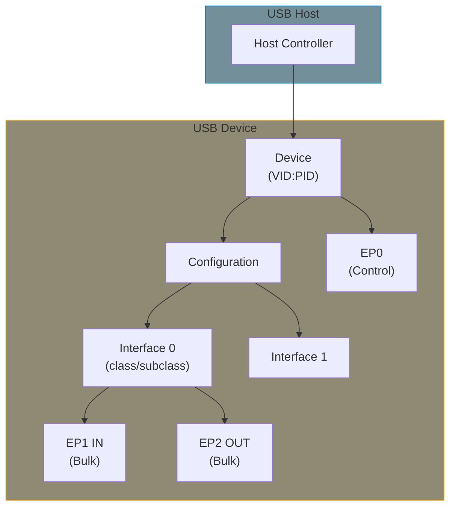
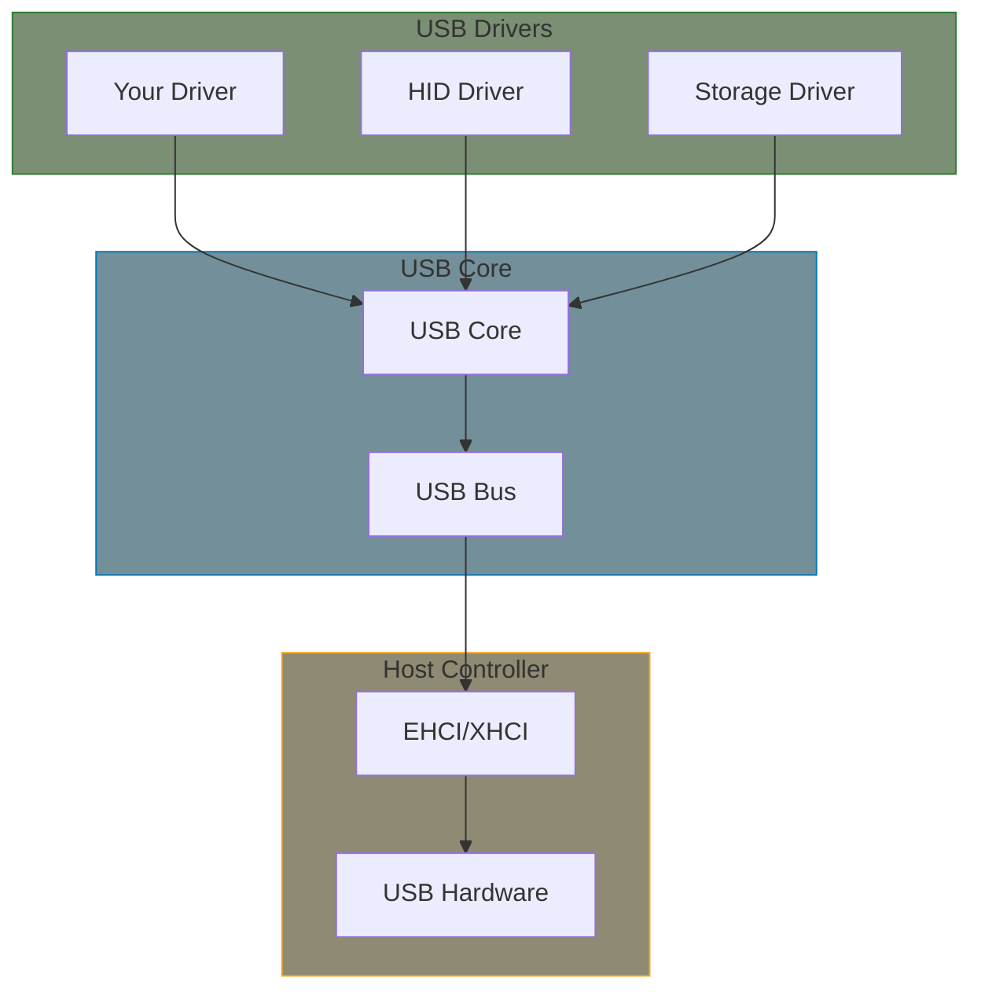

# Part 14: USB Drivers

USB drivers connect the kernel to USB devices. This part covers USB device drivers (not host controller drivers).

## USB Model

USB is hierarchical: Host → Hub(s) → Device → Interface(s) → Endpoint(s)

**Key insight**: Your driver binds to an **interface**, not the whole device. A USB device can have multiple interfaces (e.g., keyboard + media keys).

## Transfer Types

| Type | Use Case | Characteristics |
|------|----------|-----------------|
| **Control** | Configuration, commands | Guaranteed delivery, bidirectional |
| **Bulk** | Data transfer (storage) | Reliable, no bandwidth guarantee |
| **Interrupt** | Small periodic data (HID) | Guaranteed latency, small packets |
| **Isochronous** | Streaming (audio/video) | Guaranteed bandwidth, no retry |

Most drivers use **bulk** (data) or **interrupt** (events) transfers.

## Linux USB Architecture

## Chapters

| Chapter | What You'll Learn |
|---------|-------------------|
| [Concepts]() | USB model, endpoints, and URBs |
| [Driver Skeleton]() | usb_driver structure and probe/disconnect |
| [Transfers]() | Control, bulk, and interrupt URBs |
| [Error Handling]() | Disconnect races, URB errors, recovery |
| [Suspend and Resume]() | Autosuspend, PM callbacks |
| [User Space Interface]() | Character device, file operations, ioctl |
| [Porting Guide]() | Migrating from libusb, vendor SDKs |
| [WinUSB and libusb]() | Cross-platform compatibility, usbfs |
| [USB Class Drivers]() | ACM, mass storage, network (NCM/RNDIS), MCTP |
| [USB Gadget Drivers]() | Device-side drivers, ConfigFS, FunctionFS |

## Example

- **[USB Device Driver](../examples/part14/usb-device/)** - Bulk transfer example with simple protocol

## Prerequisites

- Kernel module basics (Part 1-2)
- Device model (Part 6) - probe/remove pattern
- [Managed resources (devm_*)]() - USB drivers use usb_* and devm_* functions
- Understanding of asynchronous I/O

## Further Reading

- [USB API Documentation](https://docs.kernel.org/driver-api/usb/index.html) - Official reference
- [USB Core API](https://docs.kernel.org/driver-api/usb/usb.html) - Core functions
- [Writing USB Drivers](https://docs.kernel.org/driver-api/usb/writing_usb_driver.html) - Tutorial
- [USB in a Nutshell](https://www.beyondlogic.org/usbnutshell/usb1.shtml) - Protocol basics
