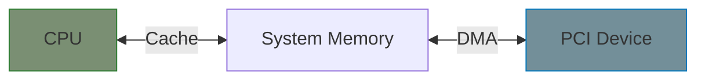

# DMA Operations

This chapter covers DMA for PCI devices: coherent and streaming mappings.

## DMA Concepts



**Key challenge:** CPU caches can make memory inconsistent with what the device sees.

| Mapping Type | Use Case | Cache Handling |
|--------------|----------|----------------|
| Coherent | Long-lived buffers (descriptors) | Hardware-managed |
| Streaming | Per-transfer buffers | Explicit sync |

## Setting DMA Mask

Tell the kernel what addresses your device can access:

```c
static int my_probe(struct pci_dev *pdev, const struct pci_device_id *id)
{
    int ret;

    /* Try 64-bit DMA first */
    ret = dma_set_mask_and_coherent(&pdev->dev, DMA_BIT_MASK(64));
    if (ret) {
        /* Fall back to 32-bit */
        ret = dma_set_mask_and_coherent(&pdev->dev, DMA_BIT_MASK(32));
        if (ret) {
            dev_err(&pdev->dev, "No usable DMA configuration\n");
            return ret;
        }
    }

    /* Enable bus mastering (required for DMA) */
    pci_set_master(pdev);

    return 0;
}
```

{: .note }
> Always call `pci_set_master()` to enable the device's ability to initiate DMA transfers.

## Coherent DMA Allocations

For descriptor rings and other long-lived shared memory:

```c
struct my_pci_dev {
    struct pci_dev *pdev;

    /* DMA descriptor ring */
    struct my_descriptor *desc_ring;  /* Virtual address */
    dma_addr_t desc_ring_dma;         /* Physical address for device */
    int ring_size;
};

static int allocate_ring(struct my_pci_dev *dev)
{
    dev->ring_size = 256;

    /* Allocate coherent DMA memory */
    dev->desc_ring = dma_alloc_coherent(&dev->pdev->dev,
                                         dev->ring_size * sizeof(*dev->desc_ring),
                                         &dev->desc_ring_dma,
                                         GFP_KERNEL);
    if (!dev->desc_ring)
        return -ENOMEM;

    /* Tell hardware where the ring is */
    writel(lower_32_bits(dev->desc_ring_dma),
           dev->regs + RING_BASE_LO);
    writel(upper_32_bits(dev->desc_ring_dma),
           dev->regs + RING_BASE_HI);

    return 0;
}

static void free_ring(struct my_pci_dev *dev)
{
    if (dev->desc_ring) {
        dma_free_coherent(&dev->pdev->dev,
                          dev->ring_size * sizeof(*dev->desc_ring),
                          dev->desc_ring,
                          dev->desc_ring_dma);
        dev->desc_ring = NULL;
    }
}
```

## Streaming DMA Mappings

For per-transfer buffers (more efficient for one-time use):

```c
static int do_dma_transfer(struct my_pci_dev *dev, void *data, size_t len,
                           bool to_device)
{
    dma_addr_t dma_addr;
    enum dma_data_direction dir;

    dir = to_device ? DMA_TO_DEVICE : DMA_FROM_DEVICE;

    /* Map the buffer */
    dma_addr = dma_map_single(&dev->pdev->dev, data, len, dir);
    if (dma_mapping_error(&dev->pdev->dev, dma_addr)) {
        dev_err(&dev->pdev->dev, "DMA mapping failed\n");
        return -ENOMEM;
    }

    /* Submit to hardware */
    submit_dma_command(dev, dma_addr, len, to_device);

    /* Wait for completion... */
    wait_for_dma_done(dev);

    /* Unmap when done */
    dma_unmap_single(&dev->pdev->dev, dma_addr, len, dir);

    return 0;
}
```

## DMA Direction

| Direction | Meaning | Cache Operation |
|-----------|---------|-----------------|
| `DMA_TO_DEVICE` | CPU writes, device reads | Flush cache |
| `DMA_FROM_DEVICE` | Device writes, CPU reads | Invalidate cache |
| `DMA_BIDIRECTIONAL` | Both directions | Flush + invalidate |

## Scatter-Gather DMA

For non-contiguous memory (like user buffers):

```c
static int do_sg_transfer(struct my_pci_dev *dev, struct scatterlist *sg,
                          int nents, bool to_device)
{
    enum dma_data_direction dir = to_device ? DMA_TO_DEVICE : DMA_FROM_DEVICE;
    int mapped_nents, i;
    struct scatterlist *s;

    /* Map scatter-gather list */
    mapped_nents = dma_map_sg(&dev->pdev->dev, sg, nents, dir);
    if (mapped_nents == 0) {
        dev_err(&dev->pdev->dev, "DMA SG mapping failed\n");
        return -ENOMEM;
    }

    /* Submit each segment to hardware */
    for_each_sg(sg, s, mapped_nents, i) {
        dma_addr_t addr = sg_dma_address(s);
        unsigned int len = sg_dma_len(s);

        submit_sg_entry(dev, addr, len, i == mapped_nents - 1);
    }

    /* Wait for completion... */
    wait_for_dma_done(dev);

    /* Unmap */
    dma_unmap_sg(&dev->pdev->dev, sg, nents, dir);

    return 0;
}
```

## DMA Sync Operations

For buffers you keep mapped but need to sync:

```c
struct my_buffer {
    void *cpu_addr;
    dma_addr_t dma_addr;
    size_t size;
    bool mapped;
};

/* CPU is done writing, device will read */
static void sync_for_device(struct my_pci_dev *dev, struct my_buffer *buf)
{
    dma_sync_single_for_device(&dev->pdev->dev,
                                buf->dma_addr, buf->size,
                                DMA_TO_DEVICE);
}

/* Device is done writing, CPU will read */
static void sync_for_cpu(struct my_pci_dev *dev, struct my_buffer *buf)
{
    dma_sync_single_for_cpu(&dev->pdev->dev,
                             buf->dma_addr, buf->size,
                             DMA_FROM_DEVICE);
}
```

## DMA Pool

For frequent small allocations:

```c
struct my_pci_dev {
    struct dma_pool *cmd_pool;
};

static int setup_dma_pool(struct my_pci_dev *dev)
{
    /* Create pool for 64-byte command structures */
    dev->cmd_pool = dma_pool_create("my_cmd_pool",
                                     &dev->pdev->dev,
                                     64,      /* Size */
                                     64,      /* Alignment */
                                     0);      /* Boundary */
    if (!dev->cmd_pool)
        return -ENOMEM;

    return 0;
}

static struct my_cmd *alloc_cmd(struct my_pci_dev *dev, dma_addr_t *dma)
{
    return dma_pool_alloc(dev->cmd_pool, GFP_KERNEL, dma);
}

static void free_cmd(struct my_pci_dev *dev, struct my_cmd *cmd, dma_addr_t dma)
{
    dma_pool_free(dev->cmd_pool, cmd, dma);
}

static void destroy_dma_pool(struct my_pci_dev *dev)
{
    if (dev->cmd_pool)
        dma_pool_destroy(dev->cmd_pool);
}
```

## Complete Ring Buffer Example

```c
#define RING_SIZE 256

struct tx_descriptor {
    __le64 buffer_addr;
    __le32 length;
    __le32 flags;
};

struct tx_buffer {
    void *data;
    dma_addr_t dma;
    size_t len;
};

struct my_tx_ring {
    struct tx_descriptor *desc;   /* Coherent ring */
    dma_addr_t desc_dma;
    struct tx_buffer *buffers;    /* Buffer tracking */
    int head, tail;
};

static int init_tx_ring(struct my_pci_dev *dev, struct my_tx_ring *ring)
{
    /* Allocate descriptor ring (coherent) */
    ring->desc = dma_alloc_coherent(&dev->pdev->dev,
                                     RING_SIZE * sizeof(*ring->desc),
                                     &ring->desc_dma, GFP_KERNEL);
    if (!ring->desc)
        return -ENOMEM;

    /* Allocate buffer tracking array */
    ring->buffers = kcalloc(RING_SIZE, sizeof(*ring->buffers), GFP_KERNEL);
    if (!ring->buffers) {
        dma_free_coherent(&dev->pdev->dev,
                          RING_SIZE * sizeof(*ring->desc),
                          ring->desc, ring->desc_dma);
        return -ENOMEM;
    }

    ring->head = ring->tail = 0;
    return 0;
}

static int queue_tx_buffer(struct my_pci_dev *dev, struct my_tx_ring *ring,
                           void *data, size_t len)
{
    struct tx_buffer *buf = &ring->buffers[ring->head];
    struct tx_descriptor *desc = &ring->desc[ring->head];

    /* Map data buffer (streaming) */
    buf->dma = dma_map_single(&dev->pdev->dev, data, len, DMA_TO_DEVICE);
    if (dma_mapping_error(&dev->pdev->dev, buf->dma))
        return -ENOMEM;

    buf->data = data;
    buf->len = len;

    /* Fill descriptor */
    desc->buffer_addr = cpu_to_le64(buf->dma);
    desc->length = cpu_to_le32(len);
    desc->flags = cpu_to_le32(TX_DESC_VALID);

    /* Ensure descriptor is written before advancing head */
    wmb();

    ring->head = (ring->head + 1) % RING_SIZE;

    /* Tell hardware */
    writel(ring->head, dev->regs + TX_HEAD);

    return 0;
}

static void complete_tx_buffer(struct my_pci_dev *dev, struct my_tx_ring *ring)
{
    while (ring->tail != ring->head) {
        struct tx_buffer *buf = &ring->buffers[ring->tail];
        struct tx_descriptor *desc = &ring->desc[ring->tail];

        /* Check if hardware consumed this descriptor */
        if (le32_to_cpu(desc->flags) & TX_DESC_VALID)
            break;

        /* Unmap buffer */
        dma_unmap_single(&dev->pdev->dev, buf->dma, buf->len, DMA_TO_DEVICE);

        ring->tail = (ring->tail + 1) % RING_SIZE;
    }
}
```

## Summary

| Function | Purpose |
|----------|---------|
| `dma_set_mask_and_coherent()` | Set DMA addressing limits |
| `pci_set_master()` | Enable bus mastering |
| `dma_alloc_coherent()` | Allocate always-synced memory |
| `dma_map_single()` | Map buffer for streaming DMA |
| `dma_unmap_single()` | Unmap after transfer |
| `dma_sync_single_for_*()` | Sync mapped buffer |
| `dma_pool_*()` | Pool for small allocations |

**Best practices:**
1. Always check `dma_mapping_error()` after mapping
2. Use coherent DMA for descriptor rings
3. Use streaming DMA for data buffers
4. Match map/unmap pairs carefully
5. Use proper memory barriers around descriptor updates

## Further Reading

- [DMA API Guide](https://docs.kernel.org/core-api/dma-api.html) - Complete reference
- [DMA Coherency](https://docs.kernel.org/core-api/dma-api-howto.html) - HOWTO guide
