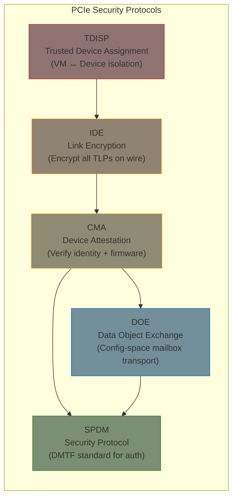
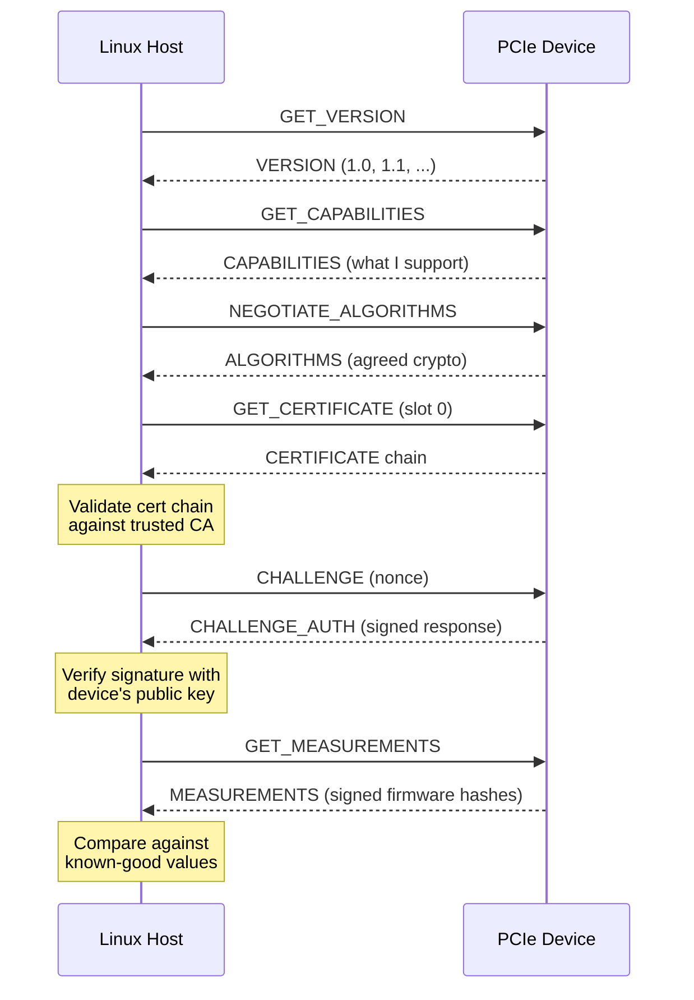
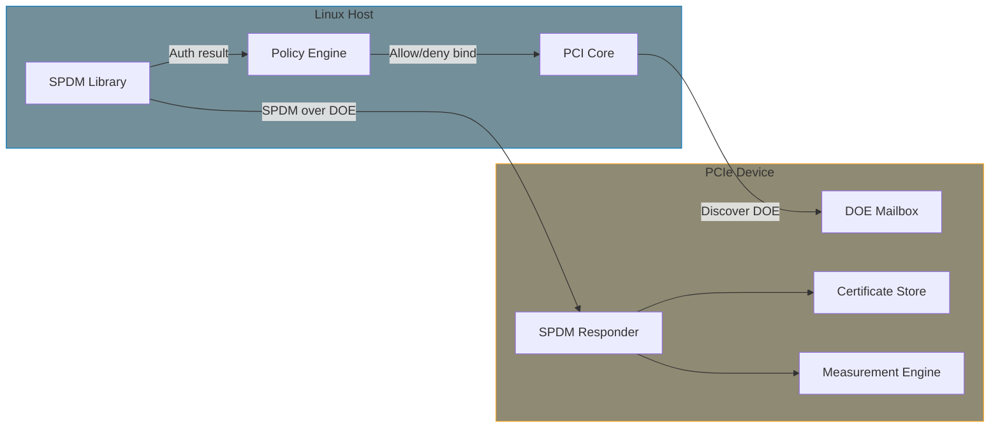
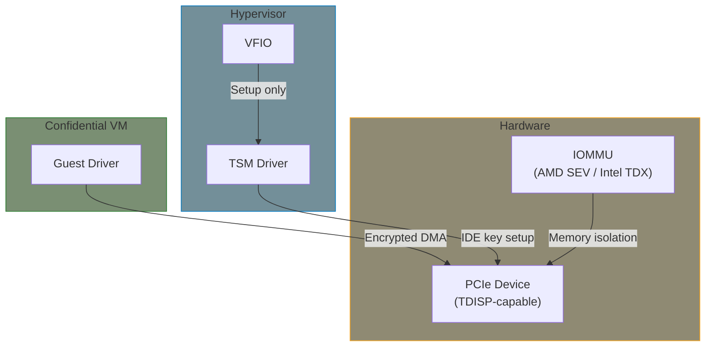

# PCIe Security: Attestation and Link Encryption

Modern PCIe specifications (5.0, 6.0, and beyond) introduce a security stack for **device attestation**, **link encryption**, and **trusted device assignment**. This chapter explains the architecture, what it means for driver developers, and the Linux kernel support status.

{: .note }
> **Forward-looking content.** This guide targets kernel 6.6 LTS, where DOE is available but CMA, IDE, and TDISP are not yet upstream. The infrastructure for IDE and TDISP landed in **Linux 6.19** (late 2025). This chapter prepares you for these capabilities as they mature and reach future LTS kernels.

## Why PCIe Security?

Traditional PCIe has no authentication — the host trusts whatever device appears on the bus. This creates attack surfaces:

| Threat | Example |
|--------|---------|
| **Device impersonation** | Malicious device pretends to be a trusted NIC |
| **Firmware tampering** | Attacker modifies device firmware to exfiltrate data |
| **Bus snooping** | Physical interposer reads DMA traffic (unencrypted TLPs) |
| **Supply chain attacks** | Counterfeit device inserted during manufacturing or shipping |
| **Malicious device in cloud** | Compromised PCIe device in multi-tenant server accesses other VMs' memory |

PCIe security protocols address these by adding **identity verification**, **integrity checking**, and **encryption** to the bus.

## The Security Stack

Five protocols form a layered security architecture. Each builds on the one below:



### Layer 1: SPDM (Security Protocol and Data Model)

**What**: A DMTF (not PCI-SIG) standard protocol for device authentication. Not PCIe-specific — also used for SATA, NVMe, and other buses.

**How it works**:



**What SPDM proves**:
1. **Identity** — Device holds the private key matching its certificate (which chains to a trusted CA)
2. **Integrity** — Device firmware measurements match expected values
3. **Freshness** — Challenge nonce prevents replay attacks

### Layer 2: DOE (Data Object Exchange)

**What**: A PCIe configuration-space mailbox mechanism for exchanging structured data objects between host and device. Defined in PCIe 6.0.

**Why it exists**: Before DOE, there was no standard way to exchange arbitrary data with a PCIe device through config space. DOE provides vendor-neutral request/response mailboxes.

**How it works**: Each DOE mailbox is a PCIe Extended Capability with control/status/data registers. The host writes a data object, triggers the mailbox, and reads back the response.

```
PCIe Config Space
┌────────────────────────────────┐
│  Standard Header (00-3F)       │
│  ...                           │
│  Extended Capabilities         │
│  ┌──────────────────────────┐  │
│  │  DOE Extended Capability │  │
│  │  ┌────────────────────┐  │  │
│  │  │ DOE Control        │  │  │
│  │  │ DOE Status         │  │  │
│  │  │ DOE Write Data     │←─│──│── Host writes request here
│  │  │ DOE Read Data      │──│──│─→ Host reads response here
│  │  └────────────────────┘  │  │
│  └──────────────────────────┘  │
└────────────────────────────────┘
```

**Linux kernel status**: DOE discovery and access is **upstream** since around kernel 6.0. CXL uses it for CDAT (Coherent Device Attribute Table) retrieval. The kernel auto-discovers DOE mailboxes during PCI enumeration and exposes supported protocols in sysfs.

**sysfs interface**:

```bash
# List DOE features supported by a device
ls /sys/bus/pci/devices/0000:03:00.0/doe_features/
# Example output:
#   0001:00    (DOE discovery)
#   0001:01    (CMA/SPDM)
#   0001:02    (Secure CMA/SPDM)
```

### Layer 3: CMA (Component Measurement and Authentication)

**What**: A PCIe ECN (Engineering Change Notice) that adapts SPDM for PCIe devices. CMA defines how SPDM messages are transported over DOE mailboxes and how authentication results integrate with the PCI subsystem.

**The attestation flow**:



**What CMA enables for Linux**:
- PCI core authenticates devices **before driver probe()**
- Authentication result exposed in sysfs
- Userspace policy can **block driver binding** to devices that fail attestation
- Measurements can be logged to the TPM event log for remote attestation

**Linux kernel status**: RFC patches (v3) from Jonathan Cameron (Huawei). Not yet upstream. The design exposes results via sysfs so that udev rules or systemd policies can act on authentication status.

### Layer 4: IDE (Integrity and Data Encryption)

**What**: Link-level encryption of all PCIe TLPs (Transaction Layer Packets). Defined in PCIe 5.0/6.0. Prevents physical snooping and tampering of data on the PCIe link.

**Two modes**:

| Mode | Scope | Use Case |
|------|-------|----------|
| **Link IDE** | Single PCIe link (endpoint ↔ switch or root port) | Protect against physical interposers |
| **Selective IDE** | End-to-end (root port ↔ endpoint, through switches) | Protect traffic across entire hierarchy |

**How keys are established**: IDE keys are negotiated over DOE using the IDE_KM (Key Management) protocol, which itself runs over SPDM secure sessions. The flow:

```
1. CMA authenticates device (via SPDM over DOE)
2. SPDM establishes a secure session (encrypted channel over DOE)
3. IDE_KM messages exchange encryption keys over the secure session
4. Keys are installed in hardware at both ends of the link
5. All subsequent TLPs are encrypted/authenticated by hardware
```

**Linux kernel status**: Infrastructure landed in **Linux 6.19**. The PCI/TSM (TEE Security Manager) subsystem provides APIs for TSM drivers to establish link encryption.

### Layer 5: TDISP (TEE Device Interface Security Protocol)

**What**: Secure assignment of PCIe devices (or device functions) to confidential VMs. Part of the confidential computing stack (AMD SEV-TIO, Intel TDX-Connect).

**The problem TDISP solves**: In cloud environments, a VM is assigned a PCIe device via VFIO passthrough. Without TDISP, the hypervisor can snoop all DMA traffic between the VM and device. TDISP establishes a trusted channel so that **even the hypervisor cannot read the data**.

**How it works**:



**Linux kernel status**: PCI/TSM core infrastructure in **Linux 6.19**. AMD SEV-TIO initial enabling also in 6.19. This is the most cutting-edge part of the stack.

## Impact on Driver Development

### What Changes for Most Drivers: Nothing

For the vast majority of PCIe drivers, these security features are **transparent**. Your `pci_driver` with `probe()`/`remove()`, BAR mapping, DMA, and MSI-X works exactly the same. The security protocols operate below the driver layer:

```
┌──────────────────────────┐
│     Your PCIe Driver     │  ← No changes needed
│  probe / remove / MMIO   │
├──────────────────────────┤
│      PCI Core            │  ← Handles CMA/attestation
├──────────────────────────┤
│   SPDM Library + DOE     │  ← Handles protocol exchange
├──────────────────────────┤
│  IDE Hardware (in chip)  │  ← Transparent encryption
└──────────────────────────┘
```

### What You Should Be Aware Of

| Scenario | What Happens | Your Action |
|----------|--------------|-------------|
| Device fails attestation | PCI core may prevent `probe()` from being called (policy-dependent) | Nothing — your driver is simply never probed |
| IDE is active on the link | All MMIO and DMA encrypted transparently by hardware | Nothing — your driver works unchanged |
| Device supports DOE for vendor data | DOE mailbox available for your own data exchange | Use `pci_doe_*` APIs if needed |
| TDISP + VFIO passthrough | Device assigned to confidential VM with encrypted DMA | Driver in guest works unchanged; host-side TSM handles setup |
| Userspace attestation policy | udev rules check sysfs attestation status | Ensure your device's firmware supports CMA if deploying in attested environments |

### Using DOE from a Driver

If your device uses DOE mailboxes for vendor-specific data exchange (separate from CMA/SPDM), the kernel provides an API:

```c
#include <linux/pci-doe.h>

static int my_driver_probe(struct pci_dev *pdev,
                           const struct pci_device_id *id)
{
    struct pci_doe_mb *doe_mb;

    /*
     * Find a DOE mailbox that supports your vendor protocol.
     * vendor_id: your PCI vendor ID
     * data_obj_type: your protocol's data object type
     */
    doe_mb = pci_find_doe_mailbox(pdev, MY_VENDOR_ID, MY_DOE_PROTOCOL);
    if (!doe_mb) {
        dev_warn(&pdev->dev, "DOE mailbox not found\n");
        /* DOE is optional — degrade gracefully */
        return 0;
    }

    /*
     * Exchange data objects.
     * The request/response are structured per your protocol.
     */
    struct pci_doe_task task = {
        .prot.vid = MY_VENDOR_ID,
        .prot.type = MY_DOE_PROTOCOL,
        .request_pl = request_buf,
        .request_pl_sz = request_len,
        .response_pl = response_buf,
        .response_pl_sz = response_buf_size,
    };

    int ret = pci_doe_submit_task(doe_mb, &task);
    if (ret)
        dev_err(&pdev->dev, "DOE exchange failed: %d\n", ret);

    /* Process response in response_buf */
    return ret;
}
```

{: .note }
> **DOE vs. MMIO for device communication:**
> DOE operates through PCIe **configuration space** (slow, small messages). Use it for control-plane operations like capability negotiation, key exchange, or metadata retrieval — not for data-plane traffic. Your bulk data path should still use BAR-mapped MMIO and DMA.

## Practical Implications by Role

### Embedded Linux Driver Developer

For most embedded work (this guide's primary audience), PCIe attestation is not yet a daily concern. Your focus remains on:
- Correct `pci_driver` registration
- BAR mapping and MMIO access
- DMA setup with proper masks
- MSI/MSI-X interrupt handling

**When it becomes relevant**: If your embedded platform is deployed in security-sensitive environments (medical devices, automotive, industrial control), device attestation provides supply chain integrity assurance. You may need to:
- Ensure your device's firmware includes SPDM responder support
- Provide certificates signed by a trusted CA
- Support measurement reporting of firmware state

### Cloud/Datacenter Driver Developer

PCIe security is most immediately relevant here:
- **Device attestation** prevents compromised or counterfeit devices in multi-tenant servers
- **IDE link encryption** protects against physical interposers in shared facilities
- **TDISP** enables secure GPU/NIC/accelerator passthrough to confidential VMs
- Your drivers work unchanged, but the infrastructure around them enforces trust

### Device Firmware Developer

The biggest impact is on the device side:
- Implement SPDM responder in firmware
- Manage certificate chains (device cert → intermediate CA → root CA)
- Provide measurement capabilities (hash of firmware, configuration, etc.)
- Support IDE key installation in hardware
- Optionally support TDISP state machine for VM assignment

## Kernel Configuration

```
# DOE (available in 6.6 LTS)
CONFIG_PCI_DOE=y              # Data Object Exchange support

# CMA/SPDM (not yet upstream as of 6.6)
# CONFIG_PCI_CMA=y            # Component Measurement & Authentication
# CONFIG_SPDM=y               # SPDM library

# IDE and TDISP (infrastructure in 6.19+)
# CONFIG_PCI_TSM=y            # TEE Security Manager for PCI
# CONFIG_PCI_IDE=y            # Integrity and Data Encryption
```

## Relationship to Other Security Features

PCIe security complements other kernel security mechanisms:

| Feature | Layer | What It Protects |
|---------|-------|------------------|
| **IOMMU (DMAR)** | DMA isolation | Prevents devices from accessing unauthorized memory regions |
| **ACS (Access Control Services)** | PCIe topology | Prevents peer-to-peer traffic between devices in the same switch |
| **CMA/SPDM** | Device identity | Verifies the device is genuine and unmodified |
| **IDE** | Link encryption | Prevents physical snooping of PCIe traffic |
| **TDISP** | VM isolation | Secure device assignment to confidential VMs |
| **Secure Boot** | Host firmware | Ensures host firmware chain is trusted |

Together, these create a chain of trust from host firmware → host OS → device identity → link encryption → VM isolation.

## Summary

| Protocol | What It Does | PCIe Spec | Linux Status |
|----------|-------------|-----------|--------------|
| **SPDM** | Authentication protocol (certificates + challenge) | DMTF standard | Library in RFC patches |
| **DOE** | Config-space mailbox transport | PCIe 6.0 | Upstream (~6.0) |
| **CMA** | Adapts SPDM for PCIe, exposes results in sysfs | PCIe 6.0 ECN | RFC patches (v3) |
| **IDE** | Link-level TLP encryption | PCIe 5.0/6.0 | Infrastructure in 6.19 |
| **TDISP** | Trusted device assignment to VMs | PCIe 6.0 | Infrastructure in 6.19 |

**For most driver developers**: These protocols are transparent. Your driver code does not change. The PCI core handles attestation before `probe()`, and IDE encryption is invisible to your MMIO/DMA operations.

**When you need to care**: If your device must function in attested environments, if you need vendor-specific DOE communication, or if you are developing device firmware that must respond to SPDM queries.

## Further Reading

- [PCI Device Authentication](https://lwn.net/Articles/945928/) - LWN article on CMA/SPDM in Linux
- [DOE / CMA / SPDM - Linux Plumbers 2021](https://lpc.events/event/11/contributions/1089/attachments/766/1440/DOE%20CMA%20SPDM%20Plumbers%20v5.pdf) - Architecture presentation by Jonathan Cameron and Dan Williams
- [Device attestation - Linux Plumbers 2022](https://lpc.events/event/16/contributions/1304/) - Progress update and design discussion
- [PCI/CMA and SPDM RFC v3 patches](https://patchwork.ozlabs.org/project/linux-pci/cover/20220906111556.1544-1-Jonathan.Cameron@huawei.com/) - Kernel patchset
- [PCI/TSM TDISP Infrastructure](https://patchwork.kernel.org/project/linux-pci/cover/173343739517.1074769.13134786548545925484.stgit@dwillia2-xfh.jf.intel.com/) - Linux 6.19 patches
- [Secure VFIO and TDISP](https://lwn.net/Articles/987020/) - LWN on confidential computing with PCIe
- [DMTF SPDM Specification](https://www.dmtf.org/standards/spdm) - The underlying protocol standard
- [PCIe 6.0 Specification](https://pcisig.com/specifications) - Official PCI-SIG specification (member access)
