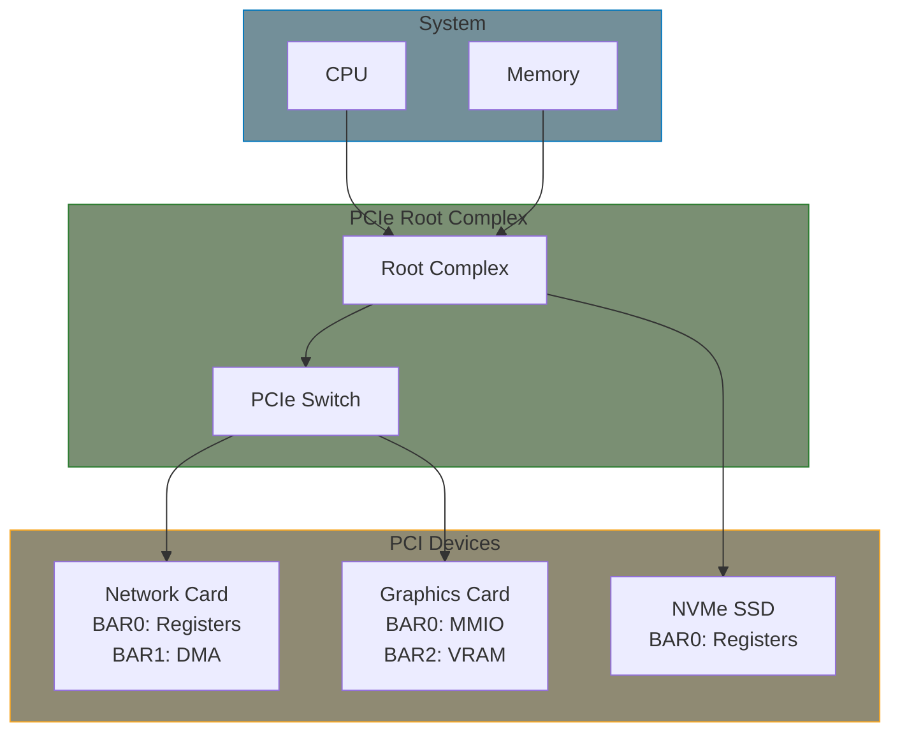

# Part 15: PCIe Drivers

PCI/PCIe drivers control expansion cards and on-board peripherals connected via the PCI bus.

## PCI Model

PCI devices are identified by:
- **Vendor ID**: Who made it (assigned by PCI-SIG)
- **Device ID**: What model
- **Class**: What type (network, storage, etc.)

## BARs: Base Address Registers

Each PCI device has up to 6 BARs (Base Address Registers) that define memory or I/O regions:

| BAR Type | Access | Use Case |
|----------|--------|----------|
| Memory-mapped | `ioremap()` | Registers, DMA buffers |
| I/O ports | `inb()`/`outb()` | Legacy devices (rare now) |

Your driver maps BARs to access device registers.

## Key Concepts

- **pci_dev**: Represents the PCI device
- **pci_driver**: Your driver, with probe/remove
- **BARs**: Memory regions to map
- **MSI/MSI-X**: Modern interrupt mechanism
- **DMA**: Direct memory access

## Chapters

| Chapter | What You'll Learn |
|---------|-------------------|
| [Concepts]() | PCI model, BARs, configuration space |
| [Driver Skeleton]() | pci_driver structure and resource mapping |
| [MSI/MSI-X Interrupts]() | Multiple vectors, interrupt affinity |
| [DMA Operations]() | Coherent and streaming DMA mappings |

## Example

- **[PCI Skeleton](../examples/part15/pci-skeleton/)** - Minimal PCI driver template

## Prerequisites

- Device model (Part 6)
- [Managed resources (devm_*)]() - PCI uses pcim_* and devm_* extensively
- Memory-mapped I/O (Part 5)
- Interrupt handling (Part 7)

## Further Reading

- [PCI Documentation](https://docs.kernel.org/PCI/index.html) - Kernel docs
- [PCI Driver API](https://docs.kernel.org/PCI/pci.html) - Function reference
- [MSI-HOWTO](https://docs.kernel.org/PCI/msi-howto.html) - Interrupt setup
