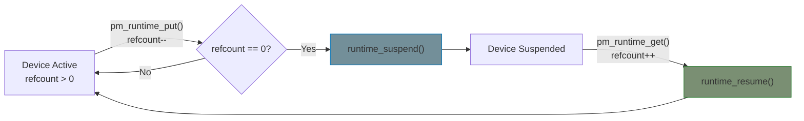

# Power Management Concepts

Understand the difference between runtime PM and system sleep.

## Runtime PM: Idle Power Saving

Runtime PM suspends devices when they're not in use **while the system is running**.

**Example scenario**: Network driver
1. No packets for 5 seconds
2. Driver calls `pm_runtime_put()`
3. If reference count → 0, `runtime_suspend()` is called
4. Device enters low-power mode
5. Packet arrives → `pm_runtime_get()` → `runtime_resume()`



## System Sleep: Suspend/Resume

System sleep happens when the entire system enters a low-power state (S3 = suspend to RAM, S4 = hibernate).

**Example scenario**: Laptop lid close
1. User closes lid
2. System calls `suspend()` on all devices
3. Devices save state, disable hardware
4. System enters S3
5. User opens lid
6. System calls `resume()` on all devices
7. Devices restore state

## Reference Counting

Runtime PM uses reference counting to track active users:

```c
/* Increment count - ensures device is active */
pm_runtime_get(dev);       /* Async, returns immediately */
pm_runtime_get_sync(dev);  /* Blocks until device is active */

/* Decrement count - may trigger suspend */
pm_runtime_put(dev);       /* Async, may schedule suspend */
pm_runtime_put_sync(dev);  /* Blocks if suspend happens */

/* Check status */
bool active = pm_runtime_active(dev);
```

**Rule**: Every `get` needs a matching `put`.

{: .warning }
> Always use `pm_runtime_get_sync()` before accessing hardware to ensure the device is powered.

## Autosuspend

To avoid rapid suspend/resume cycles, use autosuspend:

```c
/* In probe: enable autosuspend with delay */
pm_runtime_set_autosuspend_delay(dev, 1000);  /* 1 second */
pm_runtime_use_autosuspend(dev);

/* In code: mark idle, will suspend after delay */
pm_runtime_mark_last_busy(dev);
pm_runtime_put_autosuspend(dev);
```

This is useful for devices with bursty activity.

## PM States

| State | Meaning | Power |
|-------|---------|-------|
| Active | Device fully powered, processing | High |
| Runtime Suspended | Device idle, may be powered down | Low |
| System Suspended | System in S3/S4, device state saved | Very Low |

## Callbacks Summary

| Callback | When Called |
|----------|-------------|
| `runtime_suspend` | Device idle, refcount → 0 |
| `runtime_resume` | Device needed, `pm_runtime_get()` |
| `suspend` | System entering sleep |
| `resume` | System waking up |

## Summary

| Concept | Description |
|---------|-------------|
| Runtime PM | Saves power when device idle, system running |
| System Sleep | Saves power when system suspended |
| Reference count | Tracks active users of device |
| Autosuspend | Delays suspend to avoid rapid cycles |

## Further Reading

- [Runtime PM](https://docs.kernel.org/power/runtime_pm.html) - Complete reference
- [Device PM](https://docs.kernel.org/driver-api/pm/devices.html) - Guidelines
