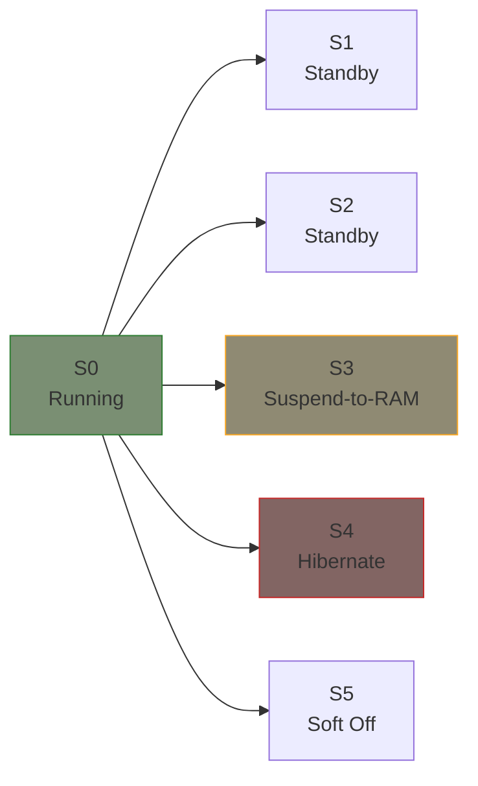
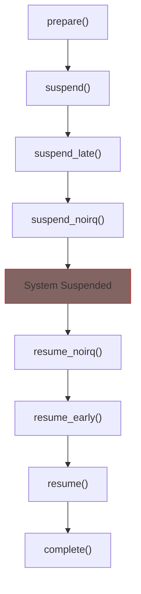

# System Sleep States

This chapter covers system-wide sleep states and how drivers handle them.

## Sleep States Overview

Linux supports several sleep states:



| State | Name | Memory | Resume Speed | Power |
|-------|------|--------|--------------|-------|
| S0 | Running | Active | - | Full |
| S3 | Suspend-to-RAM | Powered | Fast | Low |
| S4 | Hibernate | Saved to disk | Slow | Off |

## Suspend Phases

System suspend happens in phases:



Most drivers only need `suspend` and `resume`. Use `_noirq` variants only if you need to run with interrupts disabled.

## Complete PM Ops

```c
static int my_prepare(struct device *dev)
{
    /* Called before any device suspends */
    /* Return non-zero to abort suspend */
    return 0;
}

static int my_suspend(struct device *dev)
{
    struct my_dev *mydev = dev_get_drvdata(dev);

    /* Stop DMA and I/O */
    my_stop_dma(mydev);

    /* Save hardware state */
    mydev->saved_regs = readl(mydev->regs + CONFIG_REG);

    /* Disable interrupts */
    disable_irq(mydev->irq);

    return 0;
}

static int my_suspend_late(struct device *dev)
{
    /* Called after all suspend() callbacks */
    /* Use for ordering dependencies */
    return 0;
}

static int my_suspend_noirq(struct device *dev)
{
    /* Called with interrupts disabled */
    /* Last chance before system sleeps */
    return 0;
}

static int my_resume_noirq(struct device *dev)
{
    /* Called with interrupts still disabled */
    /* First callback after wake */
    return 0;
}

static int my_resume_early(struct device *dev)
{
    /* Called before resume() */
    return 0;
}

static int my_resume(struct device *dev)
{
    struct my_dev *mydev = dev_get_drvdata(dev);

    /* Re-enable interrupts */
    enable_irq(mydev->irq);

    /* Restore hardware state */
    writel(mydev->saved_regs, mydev->regs + CONFIG_REG);

    /* Restart I/O */
    my_start_dma(mydev);

    return 0;
}

static void my_complete(struct device *dev)
{
    /* Called after all devices resume */
    /* Good place for deferred work */
}

static const struct dev_pm_ops my_pm_ops = {
    .prepare = my_prepare,
    .suspend = my_suspend,
    .suspend_late = my_suspend_late,
    .suspend_noirq = my_suspend_noirq,
    .resume_noirq = my_resume_noirq,
    .resume_early = my_resume_early,
    .resume = my_resume,
    .complete = my_complete,
};
```

## Freeze/Thaw for Hibernate

Hibernate (S4) uses different callbacks:

```c
static int my_freeze(struct device *dev)
{
    struct my_dev *mydev = dev_get_drvdata(dev);

    /* Stop device but don't power down */
    /* State will be saved to disk */
    stop_device(mydev);

    return 0;
}

static int my_thaw(struct device *dev)
{
    struct my_dev *mydev = dev_get_drvdata(dev);

    /* Hibernate aborted, resume normal operation */
    restart_device(mydev);

    return 0;
}

static int my_poweroff(struct device *dev)
{
    struct my_dev *mydev = dev_get_drvdata(dev);

    /* System is about to power off after hibernate */
    power_down_device(mydev);

    return 0;
}

static int my_restore(struct device *dev)
{
    struct my_dev *mydev = dev_get_drvdata(dev);

    /* Restored from hibernate image */
    /* Hardware state may be different than saved */
    full_reinit_device(mydev);

    return 0;
}

static const struct dev_pm_ops my_pm_ops = {
    /* Normal suspend/resume */
    SET_SYSTEM_SLEEP_PM_OPS(my_suspend, my_resume)

    /* Hibernate support */
    .freeze = my_freeze,
    .thaw = my_thaw,
    .poweroff = my_poweroff,
    .restore = my_restore,
};
```

## Simple PM Ops Helpers

For most drivers, use helper macros:

```c
/* Most common: just suspend/resume */
static DEFINE_SIMPLE_DEV_PM_OPS(my_pm_ops, my_suspend, my_resume);

/* With runtime PM */
static const struct dev_pm_ops my_pm_ops = {
    SET_SYSTEM_SLEEP_PM_OPS(my_suspend, my_resume)
    SET_RUNTIME_PM_OPS(my_runtime_suspend, my_runtime_resume, NULL)
};

/* Use runtime PM for system sleep too */
static const struct dev_pm_ops my_pm_ops = {
    SET_SYSTEM_SLEEP_PM_OPS(pm_runtime_force_suspend,
                            pm_runtime_force_resume)
    SET_RUNTIME_PM_OPS(my_runtime_suspend, my_runtime_resume, NULL)
};
```

## Handling DMA Across Suspend

DMA needs careful handling:

```c
static int my_suspend(struct device *dev)
{
    struct my_dev *mydev = dev_get_drvdata(dev);

    /* 1. Stop submitting new DMA */
    mydev->suspended = true;

    /* 2. Wait for pending DMA to complete */
    wait_for_dma_completion(mydev);

    /* 3. Disable DMA engine */
    writel(0, mydev->regs + DMA_CTRL);

    /* 4. Save DMA configuration */
    mydev->saved_dma_config = readl(mydev->regs + DMA_CONFIG);

    return 0;
}

static int my_resume(struct device *dev)
{
    struct my_dev *mydev = dev_get_drvdata(dev);

    /* 1. Restore DMA configuration */
    writel(mydev->saved_dma_config, mydev->regs + DMA_CONFIG);

    /* 2. Re-enable DMA */
    writel(DMA_ENABLE, mydev->regs + DMA_CTRL);

    /* 3. Allow new submissions */
    mydev->suspended = false;

    /* 4. Restart any pending work */
    if (mydev->has_pending_work)
        schedule_work(&mydev->work);

    return 0;
}
```

## Suspend Blockers

Prevent suspend when device is busy:

```c
static int my_suspend(struct device *dev)
{
    struct my_dev *mydev = dev_get_drvdata(dev);

    /* Check if device is busy */
    if (atomic_read(&mydev->in_use)) {
        dev_dbg(dev, "Device busy, cannot suspend\n");
        return -EBUSY;
    }

    /* Proceed with suspend... */
    return 0;
}
```

## Testing Suspend/Resume

```bash
# Check available sleep states
cat /sys/power/state

# Test suspend-to-RAM
echo mem > /sys/power/state

# Test with debug
echo platform > /sys/power/pm_test
echo mem > /sys/power/state
# System suspends, then immediately resumes

# Check suspend statistics
cat /sys/power/suspend_stats/success
cat /sys/power/suspend_stats/fail
```

## Debugging Failed Suspend

```bash
# Enable PM debugging
echo 1 > /sys/power/pm_debug_messages

# Check dmesg after failed suspend
dmesg | grep -i "suspend\|resume\|pm"

# Find devices blocking suspend
cat /sys/kernel/debug/suspend_stats
```

## Platform-Specific Callbacks

For platform drivers with special requirements:

```c
static int my_suspend(struct device *dev)
{
    struct platform_device *pdev = to_platform_device(dev);

    /* Access platform-specific resources */
    return 0;
}

static const struct dev_pm_ops my_pm_ops = {
    SET_SYSTEM_SLEEP_PM_OPS(my_suspend, my_resume)
};

static struct platform_driver my_driver = {
    .probe = my_probe,
    .remove = my_remove,
    .driver = {
        .name = "my_device",
        .pm = &my_pm_ops,
        .of_match_table = my_of_match,
    },
};
```

## Summary

| Callback | When | Use For |
|----------|------|---------|
| `prepare` | Before any suspend | Abort check |
| `suspend` | Normal suspend | Save state, stop I/O |
| `suspend_late` | After all suspend | Dependency ordering |
| `suspend_noirq` | IRQs disabled | Final hardware prep |
| `resume_noirq` | IRQs disabled | First hardware init |
| `resume_early` | Before resume | Dependency ordering |
| `resume` | Normal resume | Restore state, restart I/O |
| `complete` | After all resume | Deferred work |

**Best practices:**
1. Use `SET_SYSTEM_SLEEP_PM_OPS` for simple cases
2. Stop DMA before suspend
3. Save/restore hardware registers
4. Return `-EBUSY` if device cannot suspend
5. Test with `/sys/power/pm_test`

## Further Reading

- [System Sleep](https://docs.kernel.org/admin-guide/pm/sleep-states.html) - Sleep states overview
- [Device PM](https://docs.kernel.org/driver-api/pm/devices.html) - Device callbacks
- [PM Debugging](https://docs.kernel.org/power/basic-pm-debugging.html) - Debug guide
