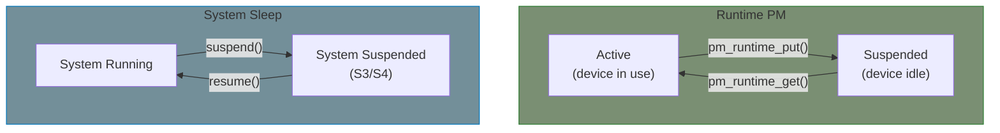

# Part 16: Power Management

Power management allows devices to save energy when idle and properly handle system sleep states.

## Two Types of PM

| Type | When | Use Case |
|------|------|----------|
| **Runtime PM** | Device idle while system runs | Save power during gaps in activity |
| **System Sleep** | System suspending (S3/S4) | Laptop lid close, `systemctl suspend` |



## When to Use What

**Runtime PM:**
- Network card with no active connections
- USB device with no pending transfers
- Display controller with screen off

**System Sleep:**
- User closes laptop
- System enters hibernate
- Scheduled sleep

## Key Concept: Reference Counting

Runtime PM uses reference counting:

```c
/* Before using device */
pm_runtime_get_sync(dev);   /* Ensures device is active */

/* ... use device ... */

/* When done */
pm_runtime_put(dev);        /* May suspend if count reaches 0 */
```

## dev_pm_ops

Both types use the same structure:

```c
static const struct dev_pm_ops my_pm_ops = {
    /* System sleep */
    .suspend = my_suspend,
    .resume = my_resume,

    /* Runtime PM */
    .runtime_suspend = my_runtime_suspend,
    .runtime_resume = my_runtime_resume,
};
```

## Chapters

| Chapter | What You'll Learn |
|---------|-------------------|
| [Concepts]() | Runtime PM vs system sleep, reference counting |
| [Implementation]() | dev_pm_ops, pm_runtime_* API |
| [Wakeup Sources]() | Wakeup capability, enable_irq_wake |
| [System Sleep States]() | Suspend phases, freeze/thaw, debugging |

## Example

- **[PM Driver](../examples/part16/pm-driver/)** - Platform driver with both runtime and system PM

## Prerequisites

- Platform drivers (Part 6)
- Device model basics

## Further Reading

- [Power Management](https://docs.kernel.org/power/index.html) - Kernel docs
- [Runtime PM](https://docs.kernel.org/power/runtime_pm.html) - API reference
- [Device PM](https://docs.kernel.org/driver-api/pm/devices.html) - Driver guidelines
