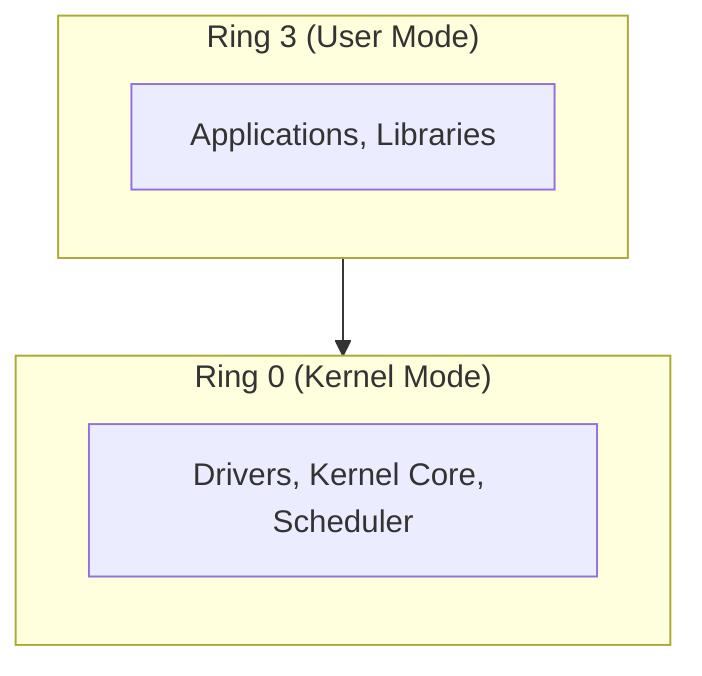
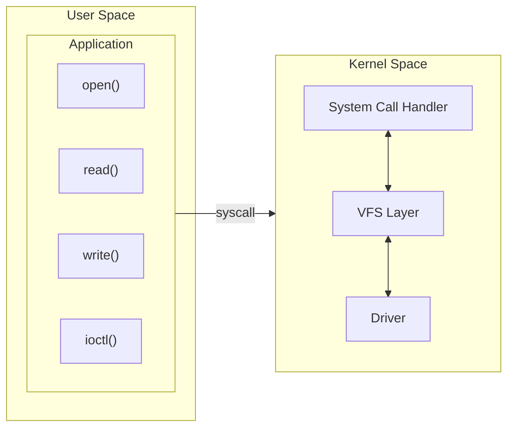

# Kernel Architecture

Understanding the separation between kernel space and user space is fundamental to driver development.

## CPU Privilege Levels

Modern CPUs implement protection rings:



- **Ring 0 (Kernel mode)**: Full hardware access, all instructions available
- **Ring 3 (User mode)**: Restricted access, some instructions prohibited

## Address Space Separation

Each process has virtual address space divided between user and kernel:

```
64-bit Linux (typical):

0xFFFFFFFFFFFFFFFF  ┌──────────────────┐
                    │                  │
                    │  Kernel Space    │  (shared by all processes)
                    │  ~128 TB         │
                    │                  │
0xFFFF800000000000  ├──────────────────┤
                    │  Non-canonical   │  (hole)
0x00007FFFFFFFFFFF  ├──────────────────┤
                    │                  │
                    │  User Space      │  (per-process)
                    │  ~128 TB         │
                    │                  │
0x0000000000000000  └──────────────────┘
```

### Key Points

- User processes cannot access kernel memory directly
- Kernel can access user memory (carefully, with checks)
- Memory addresses are virtual, not physical
- Page tables control access permissions

## System Call Interface

User space communicates with kernel via system calls:



### System Call Mechanism

1. User code calls library function (e.g., `read()`)
2. Library triggers syscall instruction
3. CPU switches to kernel mode
4. Kernel executes handler
5. Result returned, CPU switches back to user mode

## Kernel vs User Space Constraints

| Aspect | User Space | Kernel Space |
|--------|-----------|--------------|
| **Memory access** | Own process only | All physical memory |
| **Stack size** | 8 MB typical | 8-16 KB only! |
| **Libraries** | glibc, pthreads, etc. | Kernel API only |
| **Floating point** | Available | Avoid (expensive to save/restore) |
| **Sleep/block** | Freely | Only in process context |
| **Errors** | Return -1, set errno | Return negative errno |
| **Crashes** | Process dies | System panic (usually) |

## Execution Contexts

Kernel code runs in different contexts:

### Process Context

- Executing on behalf of a user process (syscall, ioctl)
- Has `current` pointer to process task_struct
- Can sleep/block
- Can access user memory

```c
/* In process context */
pr_info("Running in process: %s (pid %d)\n",
        current->comm, current->pid);
```

### Interrupt Context (Atomic Context)

- Handling hardware interrupt
- No `current` process
- Cannot sleep/block
- Must be fast

```c
/* In interrupt context - cannot sleep! */
static irqreturn_t my_irq_handler(int irq, void *dev)
{
    /* Quick work only - defer lengthy processing */
    return IRQ_HANDLED;
}
```

### Softirq/Tasklet Context

- Deferred interrupt processing
- Still atomic - cannot sleep
- Can be preempted by hardware interrupts

## The `current` Macro

In process context, `current` points to the current task:

```c
#include <linux/sched.h>

static int my_func(void)
{
    /* Access current process info */
    pr_info("Process: %s\n", current->comm);
    pr_info("PID: %d\n", current->pid);
    pr_info("UID: %u\n", current_uid().val);

    return 0;
}
```

{: .warning }
`current` is undefined in interrupt context. Always check execution context before using it.

## Checking Execution Context

```c
#include <linux/preempt.h>

void check_context(void)
{
    if (in_interrupt())
        pr_info("In interrupt context\n");
    else if (in_atomic())
        pr_info("In atomic context (preemption disabled)\n");
    else
        pr_info("In process context - can sleep\n");
}
```

## User Space Access

Kernel must never directly dereference user pointers:

```c
/* WRONG - never do this! */
int __user *uptr = ...;
int value = *uptr;  /* Can crash, security hole */

/* CORRECT - use accessor functions */
int value;
if (get_user(value, uptr))
    return -EFAULT;
```

Functions for user space access:

| Function | Purpose |
|----------|---------|
| `get_user(val, ptr)` | Read single value |
| `put_user(val, ptr)` | Write single value |
| `copy_from_user(to, from, n)` | Copy buffer from user |
| `copy_to_user(to, from, n)` | Copy buffer to user |
| `access_ok(ptr, size)` | Check pointer validity |

## Module vs Built-in

Kernel code can be:

- **Module** (`.ko`): Loaded/unloaded at runtime
- **Built-in**: Compiled into kernel image

Modules allow:
- Dynamic loading without reboot
- Memory savings (unload when not needed)
- Easier development/testing

## Summary

- Kernel runs in privileged mode with full hardware access
- User space is isolated and protected
- System calls bridge the user/kernel boundary
- Execution context determines what operations are safe
- Always use proper functions for user space access

## Next

Learn about the [module lifecycle]() - how modules are loaded, initialized, and unloaded.
