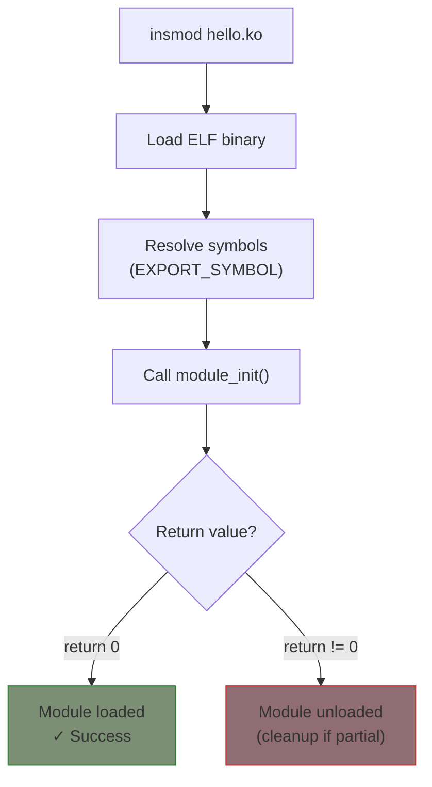

# Module Lifecycle

Understanding how modules are loaded, initialized, and unloaded is essential for writing robust drivers.

## Module Loading Process

When you run `insmod module.ko`, the kernel:

1. Loads the `.ko` file into memory
2. Resolves symbol references
3. Allocates module memory
4. Calls your `module_init()` function
5. Makes module visible in `/proc/modules` and `lsmod`



## Init and Exit Functions

### Initialization Function

```c
#include <linux/init.h>
#include <linux/module.h>

static int __init my_init(void)
{
    pr_info("Module initializing...\n");

    /* Allocate resources, register with subsystems, etc. */

    if (some_error)
        return -ENOMEM;  /* Return negative errno on failure */

    pr_info("Module initialized successfully\n");
    return 0;  /* Success */
}

module_init(my_init);
```

### Exit Function

```c
static void __exit my_exit(void)
{
    pr_info("Module cleaning up...\n");

    /* Release resources, unregister from subsystems */

    pr_info("Module unloaded\n");
}

module_exit(my_exit);
```

### The `__init` and `__exit` Macros

```c
static int __init my_init(void)  /* Memory freed after init */
static void __exit my_exit(void) /* Excluded from built-in */
```

- `__init`: Function only needed during initialization. Memory is freed afterward.
- `__exit`: Function only needed for cleanup. Excluded when module is built-in.
- `__initdata`: Data only needed during init.

## Module Parameters

Accept parameters when loading the module:

```c
#include <linux/moduleparam.h>

static int count = 1;
static char *name = "default";
static bool verbose = false;

/* module_param(variable, type, permissions) */
module_param(count, int, 0644);
module_param(name, charp, 0644);
module_param(verbose, bool, 0644);

/* Add descriptions (shown by modinfo) */
MODULE_PARM_DESC(count, "Number of iterations");
MODULE_PARM_DESC(name, "User name");
MODULE_PARM_DESC(verbose, "Enable verbose output");

static int __init my_init(void)
{
    pr_info("count=%d, name=%s, verbose=%d\n", count, name, verbose);
    return 0;
}
```

### Parameter Types

| Type | C Type | Example |
|------|--------|---------|
| `bool` | bool | `module_param(flag, bool, 0644)` |
| `int` | int | `module_param(count, int, 0644)` |
| `uint` | unsigned int | `module_param(size, uint, 0644)` |
| `long` | long | `module_param(offset, long, 0644)` |
| `charp` | char * | `module_param(name, charp, 0644)` |
| `short` | short | `module_param(val, short, 0644)` |

### Array Parameters

```c
static int values[10];
static int values_count;

module_param_array(values, int, &values_count, 0644);
MODULE_PARM_DESC(values, "Array of values");
```

Usage: `insmod module.ko values=1,2,3,4,5`

### Loading with Parameters

```bash
# Load with parameters
sudo insmod mymodule.ko count=5 name="Alice" verbose=1

# Or with modprobe (parameters in /etc/modprobe.d/)
sudo modprobe mymodule count=5
```

### Runtime Parameter Access

Parameters with permissions > 0 appear in sysfs:

```bash
# View parameter
cat /sys/module/mymodule/parameters/count

# Modify parameter (if writable)
echo 10 > /sys/module/mymodule/parameters/count
```

## Symbol Exporting

Modules can export symbols for use by other modules:

### Exporting Symbols

```c
/* mylib.c */
int my_shared_function(int x)
{
    return x * 2;
}
EXPORT_SYMBOL(my_shared_function);

/* Or GPL-only export */
EXPORT_SYMBOL_GPL(my_gpl_function);
```

### Using Exported Symbols

```c
/* myuser.c */
extern int my_shared_function(int x);

static int __init user_init(void)
{
    int result = my_shared_function(21);
    pr_info("Result: %d\n", result);  /* 42 */
    return 0;
}
```

### GPL vs Non-GPL Symbols

| Export | Accessible to |
|--------|---------------|
| `EXPORT_SYMBOL()` | All modules |
| `EXPORT_SYMBOL_GPL()` | GPL-licensed modules only |

{: .important }
Most kernel APIs use `EXPORT_SYMBOL_GPL()`. Use `MODULE_LICENSE("GPL")` to access them.

## Module Dependencies

When module A uses symbols from module B:

```bash
# B must be loaded first
sudo insmod module_b.ko
sudo insmod module_a.ko  # Uses symbols from B

# Unload in reverse order
sudo rmmod module_a
sudo rmmod module_b
```

### Using modprobe

`modprobe` handles dependencies automatically:

```bash
# Automatically loads dependencies
sudo modprobe module_a

# View dependencies
modinfo -F depends module_a.ko
```

## Reference Counting

Modules have a usage count:

```bash
lsmod | grep mymodule
# mymodule  16384  2   # "2" = usage count
```

- Count > 0: Module in use, cannot unload
- Count = 0: Safe to unload

### Managing References

```c
/* Increment reference count */
try_module_get(THIS_MODULE);

/* Decrement reference count */
module_put(THIS_MODULE);
```

{: .note }
File operations on character devices automatically manage module references.

## Module Metadata

Always include proper metadata:

```c
MODULE_LICENSE("GPL");           /* Required */
MODULE_AUTHOR("Your Name <email@example.com>");
MODULE_DESCRIPTION("What the module does");
MODULE_VERSION("1.0.0");
MODULE_ALIAS("alternative_name");
```

### Viewing Metadata

```bash
modinfo mymodule.ko
# filename:       /path/to/mymodule.ko
# license:        GPL
# author:         Your Name
# description:    What the module does
# version:        1.0.0
# ...
```

## Module Unloading

When you run `rmmod`:

1. Kernel checks reference count (must be 0)
2. Calls your `module_exit()` function
3. Frees module memory
4. Removes from `/proc/modules`

### Forced Unload

```bash
# Normal unload
sudo rmmod mymodule

# Force unload (dangerous!)
sudo rmmod -f mymodule
```

{: .warning }
Forced unload can crash the system if the module is actually in use.

## Error Handling in Init

Always clean up on partial initialization failure:

```c
static int __init my_init(void)
{
    int ret;

    ret = step1_init();
    if (ret)
        return ret;

    ret = step2_init();
    if (ret)
        goto err_step2;

    ret = step3_init();
    if (ret)
        goto err_step3;

    return 0;

err_step3:
    step2_cleanup();
err_step2:
    step1_cleanup();
    return ret;
}
```

## Example: Module with Parameters

See the complete example at `examples/part2/module-params/`.

## Summary

- `module_init()` and `module_exit()` define lifecycle functions
- Use `__init` and `__exit` for memory optimization
- Module parameters allow runtime configuration
- `EXPORT_SYMBOL` shares functions between modules
- Always handle partial initialization failures

## Next

Learn about [kernel coding style]() and conventions.
