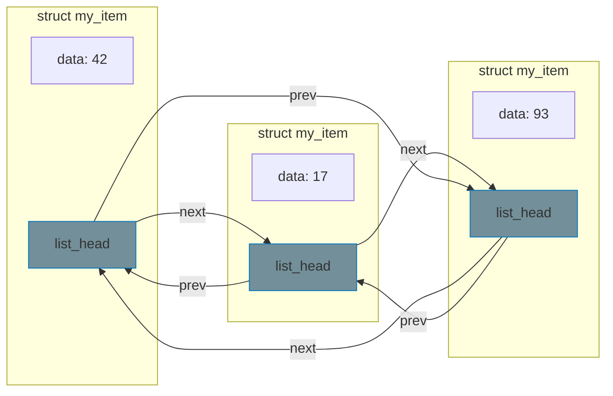

# Kernel Data Structures

The kernel provides its own implementations of common data structures optimized for kernel use. These appear throughout driver code, so understanding them is essential.

## Linked Lists (list_head)

The kernel's linked list is **intrusive** — you embed a `struct list_head` inside your data structure rather than storing pointers to your data in a separate list node.

### Why Intrusive Lists?

- No separate allocation for list nodes
- A structure can be on multiple lists simultaneously
- Cache-friendly — data and links are co-located



### Basic Operations

```c
#include <linux/list.h>

struct my_item {
    int data;
    char name[32];
    struct list_head list;  /* Embed the list node */
};

/* Declare and initialize list head */
static LIST_HEAD(my_list);

/* Or dynamic initialization */
struct list_head my_list;
INIT_LIST_HEAD(&my_list);

/* Add to list */
struct my_item *item = kmalloc(sizeof(*item), GFP_KERNEL);
item->data = 42;
list_add(&item->list, &my_list);         /* Add to front */
list_add_tail(&item->list, &my_list);    /* Add to back */

/* Remove from list */
list_del(&item->list);

/* Check if list is empty */
if (list_empty(&my_list))
    pr_info("List is empty\n");
```

### Iteration

```c
/* Iterate over all entries */
struct my_item *entry;

list_for_each_entry(entry, &my_list, list) {
    pr_info("Item: %s = %d\n", entry->name, entry->data);
}

/* Safe iteration (allows deletion during loop) */
struct my_item *tmp;

list_for_each_entry_safe(entry, tmp, &my_list, list) {
    if (entry->data == 0) {
        list_del(&entry->list);
        kfree(entry);
    }
}
```

{: .warning }
Use `list_for_each_entry_safe()` when removing entries during iteration. The non-safe version will crash if you delete the current entry.

### Getting the Container

The `list_entry()` macro (alias for `container_of()`) retrieves the enclosing structure from a `list_head` pointer:

```c
struct list_head *pos;
struct my_item *item;

list_for_each(pos, &my_list) {
    item = list_entry(pos, struct my_item, list);
    /* use item->data */
}
```

In practice, `list_for_each_entry()` combines both steps and is preferred.

## Hash Tables

For fast key-based lookup, the kernel provides a simple hash table built on `hlist` (hash list — single-pointer head for space efficiency):

```c
#include <linux/hashtable.h>

struct my_entry {
    int id;              /* Key */
    char name[32];
    struct hlist_node node;
};

/* Declare hash table with 2^10 = 1024 buckets */
static DEFINE_HASHTABLE(my_table, 10);

/* Add entry */
struct my_entry *e = kmalloc(sizeof(*e), GFP_KERNEL);
e->id = 42;
strscpy(e->name, "foo", sizeof(e->name));
hash_add(my_table, &e->node, e->id);

/* Look up by key */
struct my_entry *found;
int key = 42;

hash_for_each_possible(my_table, found, node, key) {
    if (found->id == key) {
        pr_info("Found: %s\n", found->name);
        break;
    }
}

/* Remove entry */
hash_del(&e->node);

/* Iterate all entries */
int bkt;
struct my_entry *entry;

hash_for_each(my_table, bkt, entry, node) {
    pr_info("Entry: %d -> %s\n", entry->id, entry->name);
}

/* Check if empty */
if (hash_empty(my_table))
    pr_info("Table is empty\n");
```

## Red-Black Trees (rbtree)

When you need sorted data with O(log n) lookup, insertion, and deletion:

```c
#include <linux/rbtree.h>

struct my_node {
    int key;
    struct rb_node rb;
};

static struct rb_root my_tree = RB_ROOT;

/* Insert (must maintain sorted order) */
static int my_insert(struct my_node *new)
{
    struct rb_node **link = &my_tree.rb_node;
    struct rb_node *parent = NULL;
    struct my_node *entry;

    while (*link) {
        parent = *link;
        entry = rb_entry(parent, struct my_node, rb);

        if (new->key < entry->key)
            link = &parent->rb_left;
        else if (new->key > entry->key)
            link = &parent->rb_right;
        else
            return -EEXIST;  /* Duplicate */
    }

    rb_link_node(&new->rb, parent, link);
    rb_insert_color(&new->rb, &my_tree);
    return 0;
}

/* Search */
static struct my_node *my_search(int key)
{
    struct rb_node *node = my_tree.rb_node;

    while (node) {
        struct my_node *entry = rb_entry(node, struct my_node, rb);

        if (key < entry->key)
            node = node->rb_left;
        else if (key > entry->key)
            node = node->rb_right;
        else
            return entry;
    }

    return NULL;
}

/* Iterate in order */
struct rb_node *node;
for (node = rb_first(&my_tree); node; node = rb_next(node)) {
    struct my_node *entry = rb_entry(node, struct my_node, rb);
    pr_info("Key: %d\n", entry->key);
}
```

## XArray

The XArray is the modern replacement for radix trees, optimized for storing pointers indexed by unsigned long keys (like page indices or IDs):

```c
#include <linux/xarray.h>

static DEFINE_XARRAY(my_xa);

/* Store a pointer at index */
void *old = xa_store(&my_xa, index, ptr, GFP_KERNEL);

/* Load pointer from index */
void *ptr = xa_load(&my_xa, index);

/* Erase an entry */
xa_erase(&my_xa, index);

/* Iterate all entries */
unsigned long index;
void *entry;
xa_for_each(&my_xa, index, entry) {
    pr_info("Index %lu: %p\n", index, entry);
}
```

## Choosing the Right Data Structure

| Structure | Access Pattern | Complexity | Use Case |
|-----------|---------------|------------|----------|
| `list_head` | Sequential | O(n) search | Moderate-size ordered collections |
| `hlist` / hashtable | Key lookup | O(1) average | Fast lookup by ID/key |
| `rbtree` | Sorted access | O(log n) | Sorted data, range queries |
| `xarray` | Index lookup | O(log n) | Sparse index-to-pointer mapping |

## Thread Safety

None of these data structures include built-in locking. You must protect them with the appropriate synchronization primitive:

```c
/* Mutex for process-context-only access */
static DEFINE_MUTEX(list_lock);

mutex_lock(&list_lock);
list_add(&item->list, &my_list);
mutex_unlock(&list_lock);

/* Spinlock for interrupt-safe access */
static DEFINE_SPINLOCK(table_lock);

spin_lock(&table_lock);
hash_add(my_table, &entry->node, key);
spin_unlock(&table_lock);

/* RCU for read-heavy access (see Part 4 Chapter 6) */
rcu_read_lock();
list_for_each_entry_rcu(entry, &my_list, list) {
    /* read-only access */
}
rcu_read_unlock();
```

## Summary

- **Linked lists** (`list_head`): The workhorse — use for most collections
- **Hash tables** (`DEFINE_HASHTABLE`): Fast key-based lookup
- **Red-black trees** (`rbtree`): Sorted data with efficient operations
- **XArray**: Sparse index-to-pointer mapping (replaces radix tree)
- Always protect data structures with appropriate locking

## Further Reading

- [Linked List API](https://docs.kernel.org/core-api/kernel-api.html#list-management-functions) - Kernel list functions
- [Red-Black Trees](https://docs.kernel.org/core-api/rbtree.html) - rbtree documentation
- [XArray](https://docs.kernel.org/core-api/xarray.html) - XArray documentation

## Next

Continue to [Part 3: Character Device Drivers]() to build your first device driver.
