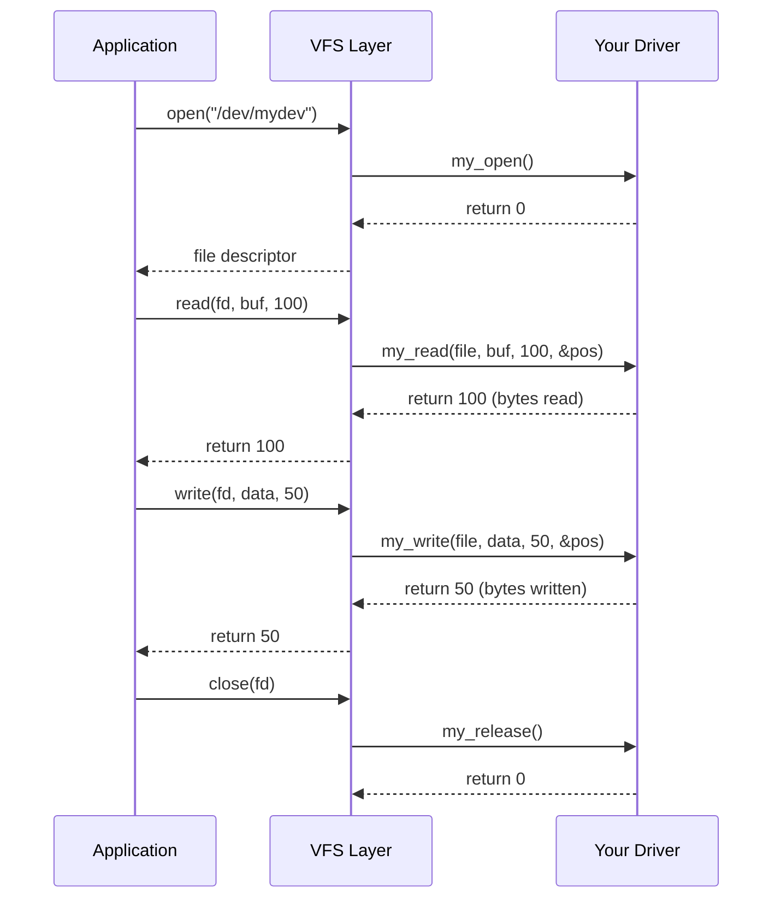

# File Operations

The `file_operations` structure is the heart of character device drivers. It defines the functions that handle user-space operations like open, read, write, and close.

## The file_operations Structure

```c
#include <linux/fs.h>

struct file_operations {
    struct module *owner;
    loff_t (*llseek)(struct file *, loff_t, int);
    ssize_t (*read)(struct file *, char __user *, size_t, loff_t *);
    ssize_t (*write)(struct file *, const char __user *, size_t, loff_t *);
    int (*open)(struct inode *, struct file *);
    int (*release)(struct inode *, struct file *);
    long (*unlocked_ioctl)(struct file *, unsigned int, unsigned long);
    unsigned int (*poll)(struct file *, struct poll_table_struct *);
    int (*mmap)(struct file *, struct vm_area_struct *);
    int (*flush)(struct file *, fl_owner_t id);
    int (*fsync)(struct file *, loff_t, loff_t, int datasync);
    /* ... and more */
};
```

## Defining Your Operations

Only implement the operations your device needs:

```c
static int my_open(struct inode *inode, struct file *file);
static int my_release(struct inode *inode, struct file *file);
static ssize_t my_read(struct file *file, char __user *buf,
                       size_t count, loff_t *ppos);
static ssize_t my_write(struct file *file, const char __user *buf,
                        size_t count, loff_t *ppos);

static const struct file_operations my_fops = {
    .owner   = THIS_MODULE,
    .open    = my_open,
    .release = my_release,
    .read    = my_read,
    .write   = my_write,
};
```

{: .important }
Always set `.owner = THIS_MODULE` to prevent the module from being unloaded while files are open.

## Key Structures

### struct inode

Represents the file on disk (or in this case, the device):

```c
struct inode {
    dev_t i_rdev;       /* Device number (major:minor) */
    struct cdev *i_cdev; /* Associated cdev structure */
    /* ... */
};

/* Extract minor number in open() */
static int my_open(struct inode *inode, struct file *file)
{
    unsigned int minor = iminor(inode);
    pr_info("Device %u opened\n", minor);
    return 0;
}
```

### struct file

Represents an open file instance:

```c
struct file {
    struct file_operations *f_op;  /* File operations */
    void *private_data;            /* Driver-specific data */
    loff_t f_pos;                  /* Current file position */
    unsigned int f_flags;          /* Open flags (O_RDONLY, etc.) */
    /* ... */
};
```

## The open() Operation

Called when user calls `open()` on the device file:

```c
static int my_open(struct inode *inode, struct file *file)
{
    struct my_device *dev;

    /* Get device structure from cdev */
    dev = container_of(inode->i_cdev, struct my_device, cdev);

    /* Store in private_data for use in other operations */
    file->private_data = dev;

    /* Check open flags */
    if ((file->f_flags & O_ACCMODE) == O_WRONLY) {
        pr_info("Device opened for writing only\n");
    }

    pr_info("Device opened by process %s (pid %d)\n",
            current->comm, current->pid);

    return 0;
}
```

### Restricting Access

```c
static int my_open(struct inode *inode, struct file *file)
{
    static atomic_t open_count = ATOMIC_INIT(0);

    /* Allow only one open at a time */
    if (atomic_cmpxchg(&open_count, 0, 1) != 0)
        return -EBUSY;

    /* Store flag for release */
    file->private_data = &open_count;

    return 0;
}

static int my_release(struct inode *inode, struct file *file)
{
    atomic_t *count = file->private_data;
    atomic_set(count, 0);
    return 0;
}
```

## The release() Operation

Called when the last reference to an open file is closed:

```c
static int my_release(struct inode *inode, struct file *file)
{
    struct my_device *dev = file->private_data;

    /* Clean up resources allocated in open() */
    if (dev->buffer) {
        kfree(dev->buffer);
        dev->buffer = NULL;
    }

    pr_info("Device closed\n");
    return 0;
}
```

{: .note }
`release()` is not called for every `close()`. It's called only when the file's reference count drops to zero.

## The read() Operation

Called when user calls `read()`:

```c
static ssize_t my_read(struct file *file, char __user *buf,
                       size_t count, loff_t *ppos)
{
    struct my_device *dev = file->private_data;
    size_t available;
    int ret;

    /* Calculate available data */
    available = dev->data_size - *ppos;
    if (available == 0)
        return 0;  /* EOF */

    /* Limit to available data */
    if (count > available)
        count = available;

    /* Copy to user space */
    ret = copy_to_user(buf, dev->data + *ppos, count);
    if (ret)
        return -EFAULT;

    /* Update file position */
    *ppos += count;

    pr_info("Read %zu bytes from position %lld\n", count, *ppos);

    return count;  /* Return bytes read */
}
```

### Read Return Values

| Return | Meaning |
|--------|---------|
| > 0 | Number of bytes read |
| 0 | End of file (EOF) |
| -EFAULT | Bad user address |
| -EINTR | Interrupted by signal |
| -EAGAIN | Non-blocking and no data available |

## The write() Operation

Called when user calls `write()`:

```c
static ssize_t my_write(struct file *file, const char __user *buf,
                        size_t count, loff_t *ppos)
{
    struct my_device *dev = file->private_data;
    size_t space;
    int ret;

    /* Calculate available space */
    space = dev->buffer_size - *ppos;
    if (space == 0)
        return -ENOSPC;

    /* Limit to available space */
    if (count > space)
        count = space;

    /* Copy from user space */
    ret = copy_from_user(dev->data + *ppos, buf, count);
    if (ret)
        return -EFAULT;

    /* Update file position and data size */
    *ppos += count;
    if (*ppos > dev->data_size)
        dev->data_size = *ppos;

    pr_info("Wrote %zu bytes at position %lld\n", count, *ppos);

    return count;  /* Return bytes written */
}
```

## Default Operations

If you don't implement an operation, the kernel provides defaults:

| Operation | Default Behavior |
|-----------|------------------|
| open | Always succeeds (returns 0) |
| release | Always succeeds (returns 0) |
| read | Returns -EINVAL |
| write | Returns -EINVAL |
| llseek | Updates f_pos based on offset |
| ioctl | Returns -ENOTTY |

## Operation Flow



## Complete Example Structure

```c
#include <linux/module.h>
#include <linux/fs.h>
#include <linux/cdev.h>
#include <linux/device.h>
#include <linux/uaccess.h>

#define DEVICE_NAME "mydevice"
#define BUFFER_SIZE 4096

struct my_device {
    struct cdev cdev;
    char buffer[BUFFER_SIZE];
    size_t data_size;
};

static struct my_device my_dev;
static dev_t dev_num;
static struct class *my_class;

static int my_open(struct inode *inode, struct file *file)
{
    file->private_data = &my_dev;
    return 0;
}

static int my_release(struct inode *inode, struct file *file)
{
    return 0;
}

static ssize_t my_read(struct file *file, char __user *buf,
                       size_t count, loff_t *ppos)
{
    struct my_device *dev = file->private_data;

    if (*ppos >= dev->data_size)
        return 0;

    if (*ppos + count > dev->data_size)
        count = dev->data_size - *ppos;

    if (copy_to_user(buf, dev->buffer + *ppos, count))
        return -EFAULT;

    *ppos += count;
    return count;
}

static ssize_t my_write(struct file *file, const char __user *buf,
                        size_t count, loff_t *ppos)
{
    struct my_device *dev = file->private_data;

    if (*ppos >= BUFFER_SIZE)
        return -ENOSPC;

    if (*ppos + count > BUFFER_SIZE)
        count = BUFFER_SIZE - *ppos;

    if (copy_from_user(dev->buffer + *ppos, buf, count))
        return -EFAULT;

    *ppos += count;
    if (*ppos > dev->data_size)
        dev->data_size = *ppos;

    return count;
}

static const struct file_operations my_fops = {
    .owner   = THIS_MODULE,
    .open    = my_open,
    .release = my_release,
    .read    = my_read,
    .write   = my_write,
};
```

## Summary

- `file_operations` defines the interface between user space and your driver
- `struct inode` represents the device; `struct file` represents an open instance
- Use `private_data` to store per-file or per-device state
- Always validate user pointers and handle errors properly
- Only implement operations your device needs

## Next

Learn about [device registration]() with cdev and device_create.
