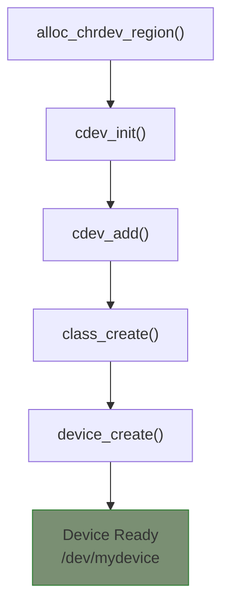

# Device Registration

To make your character device available to user space, you need to register it with the kernel using the cdev subsystem.

## The cdev Structure

The `struct cdev` represents a character device in the kernel:

```c
#include <linux/cdev.h>

struct cdev {
    struct module *owner;
    const struct file_operations *ops;
    dev_t dev;
    unsigned int count;
    /* ... */
};
```

## Registration Flow



## Step 1: Allocate Device Numbers

```c
static dev_t dev_num;
static int num_devices = 1;

static int __init my_init(void)
{
    int ret;

    ret = alloc_chrdev_region(&dev_num, 0, num_devices, "mydevice");
    if (ret < 0) {
        pr_err("Failed to allocate device numbers\n");
        return ret;
    }

    pr_info("Allocated major=%d, starting minor=%d\n",
            MAJOR(dev_num), MINOR(dev_num));

    /* Continue to cdev initialization... */
}
```

## Step 2: Initialize and Add cdev

### Option A: Static cdev

```c
static struct cdev my_cdev;

static int __init my_init(void)
{
    int ret;

    /* ... allocate device numbers ... */

    /* Initialize cdev with file operations */
    cdev_init(&my_cdev, &my_fops);
    my_cdev.owner = THIS_MODULE;

    /* Add cdev to the system */
    ret = cdev_add(&my_cdev, dev_num, 1);
    if (ret < 0) {
        pr_err("Failed to add cdev\n");
        goto err_cdev;
    }

    return 0;

err_cdev:
    unregister_chrdev_region(dev_num, 1);
    return ret;
}

static void __exit my_exit(void)
{
    cdev_del(&my_cdev);
    unregister_chrdev_region(dev_num, 1);
}
```

### Option B: Dynamic cdev Allocation

```c
static struct cdev *my_cdev;

static int __init my_init(void)
{
    int ret;

    /* ... allocate device numbers ... */

    /* Allocate cdev structure */
    my_cdev = cdev_alloc();
    if (!my_cdev) {
        ret = -ENOMEM;
        goto err_alloc;
    }

    my_cdev->ops = &my_fops;
    my_cdev->owner = THIS_MODULE;

    ret = cdev_add(my_cdev, dev_num, 1);
    if (ret < 0)
        goto err_add;

    return 0;

err_add:
    /* cdev_alloc uses kobject, no explicit free needed after add fails */
err_alloc:
    unregister_chrdev_region(dev_num, 1);
    return ret;
}
```

## Step 3: Create Device Class and Node

```c
static struct class *my_class;
static struct device *my_device;

static int __init my_init(void)
{
    int ret;

    /* ... device numbers and cdev ... */

    /* Create device class */
    my_class = class_create("my_class");
    if (IS_ERR(my_class)) {
        ret = PTR_ERR(my_class);
        pr_err("Failed to create class\n");
        goto err_class;
    }

    /* Create device - triggers udev to create /dev node */
    my_device = device_create(my_class, NULL, dev_num, NULL, "mydevice");
    if (IS_ERR(my_device)) {
        ret = PTR_ERR(my_device);
        pr_err("Failed to create device\n");
        goto err_device;
    }

    pr_info("Device created at /dev/mydevice\n");
    return 0;

err_device:
    class_destroy(my_class);
err_class:
    cdev_del(&my_cdev);
    unregister_chrdev_region(dev_num, 1);
    return ret;
}

static void __exit my_exit(void)
{
    device_destroy(my_class, dev_num);
    class_destroy(my_class);
    cdev_del(&my_cdev);
    unregister_chrdev_region(dev_num, 1);
}
```

## Complete Registration Template

Here's a complete, clean template for character device registration:

```c
// SPDX-License-Identifier: GPL-2.0
#include <linux/module.h>
#include <linux/fs.h>
#include <linux/cdev.h>
#include <linux/device.h>

#define DEVICE_NAME "mydevice"
#define CLASS_NAME  "my_class"

static dev_t dev_num;
static struct cdev my_cdev;
static struct class *my_class;
static struct device *my_device;

/* File operations - implement these */
static int my_open(struct inode *inode, struct file *file)
{
    return 0;
}

static int my_release(struct inode *inode, struct file *file)
{
    return 0;
}

static const struct file_operations my_fops = {
    .owner   = THIS_MODULE,
    .open    = my_open,
    .release = my_release,
};

static int __init my_init(void)
{
    int ret;

    /* 1. Allocate device numbers */
    ret = alloc_chrdev_region(&dev_num, 0, 1, DEVICE_NAME);
    if (ret < 0) {
        pr_err("alloc_chrdev_region failed: %d\n", ret);
        return ret;
    }

    /* 2. Initialize cdev */
    cdev_init(&my_cdev, &my_fops);
    my_cdev.owner = THIS_MODULE;

    /* 3. Add cdev to system */
    ret = cdev_add(&my_cdev, dev_num, 1);
    if (ret < 0) {
        pr_err("cdev_add failed: %d\n", ret);
        goto err_cdev;
    }

    /* 4. Create device class */
    my_class = class_create(CLASS_NAME);
    if (IS_ERR(my_class)) {
        ret = PTR_ERR(my_class);
        pr_err("class_create failed: %d\n", ret);
        goto err_class;
    }

    /* 5. Create device node */
    my_device = device_create(my_class, NULL, dev_num, NULL, DEVICE_NAME);
    if (IS_ERR(my_device)) {
        ret = PTR_ERR(my_device);
        pr_err("device_create failed: %d\n", ret);
        goto err_device;
    }

    pr_info("%s: registered with major=%d, minor=%d\n",
            DEVICE_NAME, MAJOR(dev_num), MINOR(dev_num));
    return 0;

err_device:
    class_destroy(my_class);
err_class:
    cdev_del(&my_cdev);
err_cdev:
    unregister_chrdev_region(dev_num, 1);
    return ret;
}

static void __exit my_exit(void)
{
    device_destroy(my_class, dev_num);
    class_destroy(my_class);
    cdev_del(&my_cdev);
    unregister_chrdev_region(dev_num, 1);
    pr_info("%s: unregistered\n", DEVICE_NAME);
}

module_init(my_init);
module_exit(my_exit);

MODULE_LICENSE("GPL");
MODULE_AUTHOR("Your Name");
MODULE_DESCRIPTION("Character device template");
```

## Multiple Devices

Managing multiple device instances:

```c
#define NUM_DEVICES 4

struct my_device {
    struct cdev cdev;
    char buffer[4096];
    size_t size;
    int id;
};

static struct my_device devices[NUM_DEVICES];
static dev_t dev_base;
static struct class *my_class;

static int __init my_init(void)
{
    int i, ret;

    ret = alloc_chrdev_region(&dev_base, 0, NUM_DEVICES, "mydevice");
    if (ret < 0)
        return ret;

    my_class = class_create("my_class");
    if (IS_ERR(my_class)) {
        ret = PTR_ERR(my_class);
        goto err_class;
    }

    for (i = 0; i < NUM_DEVICES; i++) {
        devices[i].id = i;

        cdev_init(&devices[i].cdev, &my_fops);
        devices[i].cdev.owner = THIS_MODULE;

        ret = cdev_add(&devices[i].cdev,
                       MKDEV(MAJOR(dev_base), i), 1);
        if (ret < 0)
            goto err_cdev;

        if (IS_ERR(device_create(my_class, NULL,
                                 MKDEV(MAJOR(dev_base), i),
                                 NULL, "mydevice%d", i))) {
            cdev_del(&devices[i].cdev);
            ret = -ENOMEM;
            goto err_cdev;
        }
    }

    return 0;

err_cdev:
    while (--i >= 0) {
        device_destroy(my_class, MKDEV(MAJOR(dev_base), i));
        cdev_del(&devices[i].cdev);
    }
    class_destroy(my_class);
err_class:
    unregister_chrdev_region(dev_base, NUM_DEVICES);
    return ret;
}

/* Get device from inode in file operations */
static int my_open(struct inode *inode, struct file *file)
{
    struct my_device *dev;

    /* container_of gets the my_device from embedded cdev */
    dev = container_of(inode->i_cdev, struct my_device, cdev);
    file->private_data = dev;

    pr_info("Opened device %d\n", dev->id);
    return 0;
}
```

## Legacy Registration (Avoid)

You may see old code using `register_chrdev()`:

```c
/* OLD WAY - DON'T USE */
static int major;

major = register_chrdev(0, "mydevice", &my_fops);
/* ... */
unregister_chrdev(major, "mydevice");
```

{: .warning }
`register_chrdev()` is deprecated. It allocates all 256 minor numbers and doesn't support modern device management. Always use `alloc_chrdev_region()` + `cdev_add()`.

## Verification

After loading your module:

```bash
# Check device numbers
cat /proc/devices | grep mydevice
# 243 mydevice

# Check device class
ls /sys/class/my_class/
# mydevice

# Check device node
ls -la /dev/mydevice
# crw------- 1 root root 243, 0 Jan 15 10:00 /dev/mydevice

# Test with simple commands
echo "hello" > /dev/mydevice
cat /dev/mydevice
```

## Summary

- Use `alloc_chrdev_region()` to get device numbers
- Initialize cdev with `cdev_init()` and add with `cdev_add()`
- Create device class with `class_create()` for sysfs visibility
- Create device node with `device_create()` for udev
- Always clean up in reverse order on exit or error
- Use `container_of()` to get your device structure from cdev

## Next

Learn about [read and write operations]() for data transfer with user space.
