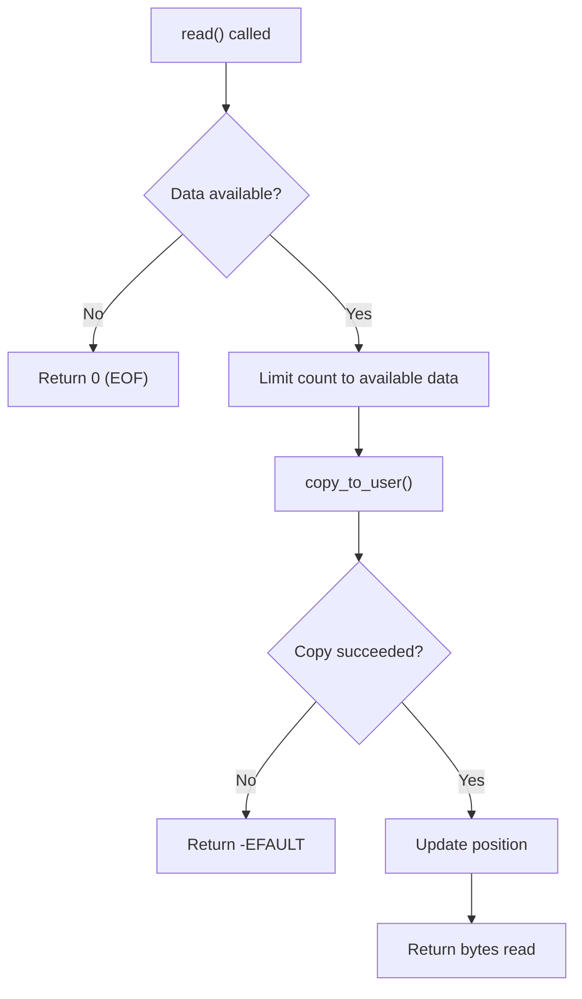
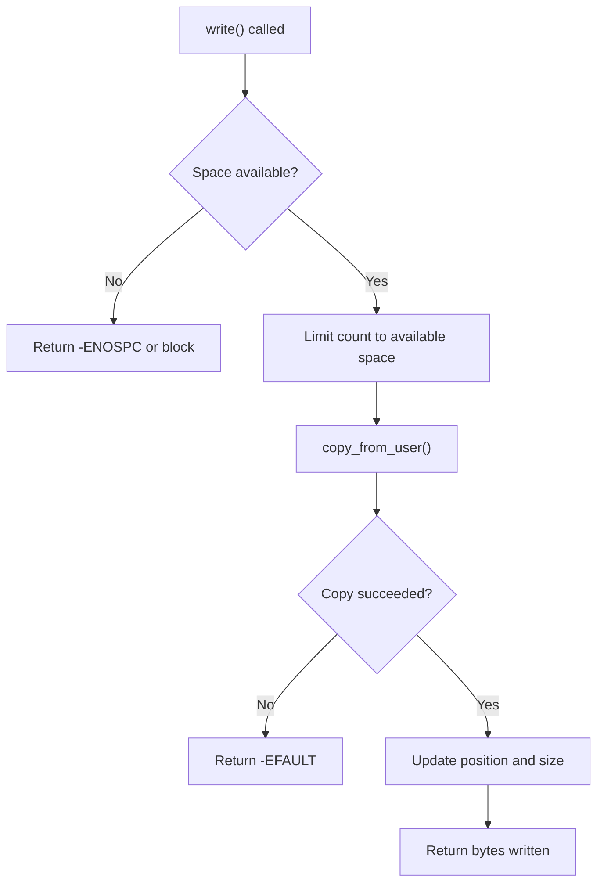

# Read and Write Operations

The read and write operations are how data flows between user space and your driver. Getting these right is critical for driver correctness and security.

## The Golden Rule

{: .warning }
**Never directly dereference user-space pointers!** Always use `copy_to_user()` and `copy_from_user()`.

User pointers (`char __user *`) may be:
- Invalid (pointing to unmapped memory)
- Pointing to kernel memory (security attack)
- Swapped out (page fault required)

## Data Transfer Functions

```c
#include <linux/uaccess.h>

/* Copy data TO user space */
unsigned long copy_to_user(void __user *to, const void *from,
                           unsigned long n);

/* Copy data FROM user space */
unsigned long copy_from_user(void *to, const void __user *from,
                             unsigned long n);

/* Single values */
int get_user(x, ptr);  /* Get value from user pointer */
int put_user(x, ptr);  /* Put value to user pointer */
```

### Return Values

| Function | Return | Meaning |
|----------|--------|---------|
| `copy_to_user` | 0 | Success |
| `copy_to_user` | > 0 | Number of bytes NOT copied |
| `copy_from_user` | 0 | Success |
| `copy_from_user` | > 0 | Number of bytes NOT copied |
| `get_user` | 0 | Success |
| `get_user` | -EFAULT | Invalid pointer |
| `put_user` | 0 | Success |
| `put_user` | -EFAULT | Invalid pointer |

## Implementing read()



### Basic Read Implementation

```c
#define BUFFER_SIZE 4096

struct my_device {
    char data[BUFFER_SIZE];
    size_t size;  /* Amount of valid data */
};

static ssize_t my_read(struct file *file, char __user *buf,
                       size_t count, loff_t *ppos)
{
    struct my_device *dev = file->private_data;
    size_t available;

    /* Check if we're past end of data */
    if (*ppos >= dev->size)
        return 0;  /* EOF */

    /* Calculate how much data is available */
    available = dev->size - *ppos;

    /* Limit read to available data */
    if (count > available)
        count = available;

    /* Copy data to user space */
    if (copy_to_user(buf, dev->data + *ppos, count))
        return -EFAULT;

    /* Update file position */
    *ppos += count;

    return count;
}
```

### Read with Blocking

If no data is available, block until data arrives:

```c
#include <linux/wait.h>
#include <linux/sched.h>

struct my_device {
    char data[BUFFER_SIZE];
    size_t read_pos;
    size_t write_pos;
    wait_queue_head_t read_queue;
    struct mutex lock;
};

static ssize_t my_read(struct file *file, char __user *buf,
                       size_t count, loff_t *ppos)
{
    struct my_device *dev = file->private_data;
    size_t available;
    int ret;

    mutex_lock(&dev->lock);

    /* Wait for data */
    while (dev->read_pos == dev->write_pos) {
        mutex_unlock(&dev->lock);

        /* Non-blocking mode: return immediately */
        if (file->f_flags & O_NONBLOCK)
            return -EAGAIN;

        /* Sleep until data available or signal */
        ret = wait_event_interruptible(dev->read_queue,
                        dev->read_pos != dev->write_pos);
        if (ret)
            return -ERESTARTSYS;

        mutex_lock(&dev->lock);
    }

    /* Calculate available data */
    available = dev->write_pos - dev->read_pos;
    if (count > available)
        count = available;

    /* Copy to user */
    if (copy_to_user(buf, dev->data + dev->read_pos, count)) {
        mutex_unlock(&dev->lock);
        return -EFAULT;
    }

    dev->read_pos += count;
    mutex_unlock(&dev->lock);

    return count;
}
```

## Implementing write()



### Basic Write Implementation

```c
static ssize_t my_write(struct file *file, const char __user *buf,
                        size_t count, loff_t *ppos)
{
    struct my_device *dev = file->private_data;
    size_t space;

    /* Check for space */
    if (*ppos >= BUFFER_SIZE)
        return -ENOSPC;

    /* Calculate available space */
    space = BUFFER_SIZE - *ppos;

    /* Limit write to available space */
    if (count > space)
        count = space;

    /* Zero count means nothing to do */
    if (count == 0)
        return 0;

    /* Copy data from user space */
    if (copy_from_user(dev->data + *ppos, buf, count))
        return -EFAULT;

    /* Update file position */
    *ppos += count;

    /* Update data size if we extended it */
    if (*ppos > dev->size)
        dev->size = *ppos;

    return count;
}
```

### Write with Wakeup

Wake readers when data is written:

```c
static ssize_t my_write(struct file *file, const char __user *buf,
                        size_t count, loff_t *ppos)
{
    struct my_device *dev = file->private_data;
    size_t space;
    int ret;

    mutex_lock(&dev->lock);

    /* Calculate space */
    space = BUFFER_SIZE - dev->write_pos;
    if (count > space)
        count = space;

    if (count == 0) {
        mutex_unlock(&dev->lock);
        return -ENOSPC;
    }

    /* Copy from user */
    if (copy_from_user(dev->data + dev->write_pos, buf, count)) {
        mutex_unlock(&dev->lock);
        return -EFAULT;
    }

    dev->write_pos += count;
    mutex_unlock(&dev->lock);

    /* Wake up any waiting readers */
    wake_up_interruptible(&dev->read_queue);

    return count;
}
```

## Working with Single Values

For simple values, use `get_user()` and `put_user()`:

```c
static ssize_t my_read(struct file *file, char __user *buf,
                       size_t count, loff_t *ppos)
{
    struct my_device *dev = file->private_data;

    /* Read a single integer */
    if (count < sizeof(int))
        return -EINVAL;

    if (put_user(dev->value, (int __user *)buf))
        return -EFAULT;

    return sizeof(int);
}

static ssize_t my_write(struct file *file, const char __user *buf,
                        size_t count, loff_t *ppos)
{
    struct my_device *dev = file->private_data;
    int value;

    if (count < sizeof(int))
        return -EINVAL;

    if (get_user(value, (int __user *)buf))
        return -EFAULT;

    dev->value = value;
    return sizeof(int);
}
```

## Circular Buffer Implementation

A common pattern for producers/consumers:

```c
#define CIRC_BUF_SIZE 4096

struct circular_buffer {
    char data[CIRC_BUF_SIZE];
    size_t head;  /* Write position */
    size_t tail;  /* Read position */
    wait_queue_head_t read_queue;
    wait_queue_head_t write_queue;
    struct mutex lock;
};

static inline size_t circ_count(struct circular_buffer *buf)
{
    return (buf->head - buf->tail) & (CIRC_BUF_SIZE - 1);
}

static inline size_t circ_space(struct circular_buffer *buf)
{
    return (CIRC_BUF_SIZE - 1 - circ_count(buf));
}

static ssize_t my_read(struct file *file, char __user *buf,
                       size_t count, loff_t *ppos)
{
    struct circular_buffer *cb = file->private_data;
    size_t available, to_end, first, second;
    int ret;

    mutex_lock(&cb->lock);

    while (circ_count(cb) == 0) {
        mutex_unlock(&cb->lock);
        if (file->f_flags & O_NONBLOCK)
            return -EAGAIN;
        ret = wait_event_interruptible(cb->read_queue,
                                       circ_count(cb) > 0);
        if (ret)
            return -ERESTARTSYS;
        mutex_lock(&cb->lock);
    }

    available = circ_count(cb);
    if (count > available)
        count = available;

    /* Handle wrap-around */
    to_end = CIRC_BUF_SIZE - cb->tail;
    first = min(count, to_end);
    second = count - first;

    if (copy_to_user(buf, cb->data + cb->tail, first)) {
        mutex_unlock(&cb->lock);
        return -EFAULT;
    }

    if (second && copy_to_user(buf + first, cb->data, second)) {
        mutex_unlock(&cb->lock);
        return -EFAULT;
    }

    cb->tail = (cb->tail + count) & (CIRC_BUF_SIZE - 1);
    mutex_unlock(&cb->lock);

    wake_up_interruptible(&cb->write_queue);
    return count;
}
```

## Partial Transfers

Sometimes you can't complete the full transfer:

```c
static ssize_t my_write(struct file *file, const char __user *buf,
                        size_t count, loff_t *ppos)
{
    struct my_device *dev = file->private_data;
    unsigned long not_copied;
    size_t written;

    /* Try to copy everything */
    not_copied = copy_from_user(dev->data + *ppos, buf, count);

    /* Calculate how much we actually wrote */
    written = count - not_copied;

    if (written == 0)
        return -EFAULT;  /* Nothing copied */

    /* Update position for partial write */
    *ppos += written;

    if (*ppos > dev->size)
        dev->size = *ppos;

    return written;  /* Return what we managed to write */
}
```

## Error Handling Summary

| Situation | Return Value |
|-----------|--------------|
| Successful read/write | Number of bytes transferred |
| End of file (read) | 0 |
| No space (write) | -ENOSPC |
| Bad user pointer | -EFAULT |
| Would block (non-blocking) | -EAGAIN |
| Interrupted by signal | -ERESTARTSYS |
| Invalid argument | -EINVAL |

## Testing Your Implementation

```c
/* User space test program */
#include <fcntl.h>
#include <unistd.h>
#include <stdio.h>
#include <string.h>

int main(void)
{
    int fd;
    char write_buf[] = "Hello, driver!";
    char read_buf[100];
    ssize_t bytes;

    fd = open("/dev/mydevice", O_RDWR);
    if (fd < 0) {
        perror("open");
        return 1;
    }

    /* Write data */
    bytes = write(fd, write_buf, strlen(write_buf));
    printf("Wrote %zd bytes\n", bytes);

    /* Reset position */
    lseek(fd, 0, SEEK_SET);

    /* Read back */
    bytes = read(fd, read_buf, sizeof(read_buf) - 1);
    if (bytes > 0) {
        read_buf[bytes] = '\0';
        printf("Read %zd bytes: %s\n", bytes, read_buf);
    }

    close(fd);
    return 0;
}
```

## Summary

- Always use `copy_to_user()` and `copy_from_user()` for data transfer
- Check return values - non-zero means partial or failed copy
- Handle blocking properly with wait queues
- Support `O_NONBLOCK` by returning `-EAGAIN`
- Return `-ERESTARTSYS` when interrupted by signal
- Consider circular buffers for producer/consumer patterns

## Next

Learn about [ioctl operations]() for device control commands.
