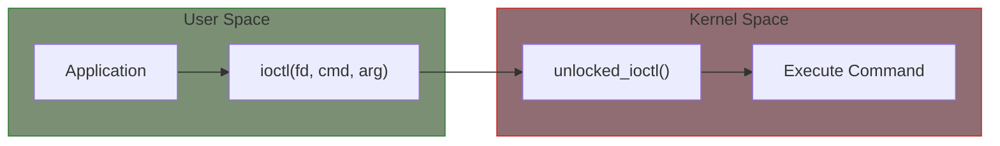

# IOCTL Operations

IOCTL (I/O Control) provides a way to send commands and transfer structured data between user space and drivers. It's the mechanism for device-specific operations that don't fit the read/write model.

## Why IOCTL?

Read and write handle data streams. IOCTL handles:

- Device configuration
- Status queries
- Special commands
- Structured data exchange



## Defining IOCTL Commands

### The _IO Macros

Commands are defined using special macros that encode:
- Direction (read/write from user perspective)
- Type (driver-specific magic number)
- Number (command number)
- Size (data size for transfers)

```c
#include <linux/ioctl.h>

/* Commands without data transfer */
_IO(type, nr)

/* Commands that read data from driver (driver writes to user) */
_IOR(type, nr, datatype)

/* Commands that write data to driver (driver reads from user) */
_IOW(type, nr, datatype)

/* Commands that transfer data both ways */
_IOWR(type, nr, datatype)
```

### Example Header (Shared with User Space)

```c
/* mydevice_ioctl.h - shared between kernel and user space */
#ifndef MYDEVICE_IOCTL_H
#define MYDEVICE_IOCTL_H

#include <linux/ioctl.h>

/* Magic number - choose something unique */
#define MYDEV_IOC_MAGIC 'M'

/* Structure for data transfer */
struct mydev_config {
    int param1;
    int param2;
    char name[32];
};

struct mydev_status {
    int state;
    unsigned long count;
    int error_code;
};

/* Command definitions */
#define MYDEV_IOC_RESET      _IO(MYDEV_IOC_MAGIC, 0)
#define MYDEV_IOC_GET_STATUS _IOR(MYDEV_IOC_MAGIC, 1, struct mydev_status)
#define MYDEV_IOC_SET_CONFIG _IOW(MYDEV_IOC_MAGIC, 2, struct mydev_config)
#define MYDEV_IOC_XFER_DATA  _IOWR(MYDEV_IOC_MAGIC, 3, struct mydev_config)

/* For range checking */
#define MYDEV_IOC_MAXNR 3

#endif /* MYDEVICE_IOCTL_H */
```

### Command Number Encoding

```
Bits:  31-30    29-16     15-8      7-0
       ├────┤  ├─────┤   ├────┤   ├────┤
       Dir     Size      Type      Nr
```

| Field | Bits | Purpose |
|-------|------|---------|
| Dir | 2 | Direction (none/read/write/both) |
| Size | 14 | Size of data transfer |
| Type | 8 | Magic number (identifies driver) |
| Nr | 8 | Command number |

## Implementing IOCTL Handler

```c
#include <linux/uaccess.h>
#include "mydevice_ioctl.h"

static long my_ioctl(struct file *file, unsigned int cmd, unsigned long arg)
{
    struct my_device *dev = file->private_data;
    struct mydev_config config;
    struct mydev_status status;
    int ret = 0;

    /* Verify command is for our driver */
    if (_IOC_TYPE(cmd) != MYDEV_IOC_MAGIC)
        return -ENOTTY;
    if (_IOC_NR(cmd) > MYDEV_IOC_MAXNR)
        return -ENOTTY;

    /* Handle each command */
    switch (cmd) {
    case MYDEV_IOC_RESET:
        pr_info("Reset command received\n");
        /* Perform reset */
        dev->state = 0;
        dev->count = 0;
        break;

    case MYDEV_IOC_GET_STATUS:
        /* Prepare status data */
        status.state = dev->state;
        status.count = dev->count;
        status.error_code = dev->last_error;

        /* Copy to user space */
        if (copy_to_user((void __user *)arg, &status, sizeof(status)))
            return -EFAULT;
        break;

    case MYDEV_IOC_SET_CONFIG:
        /* Copy from user space */
        if (copy_from_user(&config, (void __user *)arg, sizeof(config)))
            return -EFAULT;

        /* Validate and apply configuration */
        if (config.param1 < 0 || config.param1 > 100)
            return -EINVAL;

        dev->param1 = config.param1;
        dev->param2 = config.param2;
        strscpy(dev->name, config.name, sizeof(dev->name));
        break;

    case MYDEV_IOC_XFER_DATA:
        /* Bidirectional: read input, write output */
        if (copy_from_user(&config, (void __user *)arg, sizeof(config)))
            return -EFAULT;

        /* Process and modify */
        config.param1 = process_param(config.param1);
        config.param2 = dev->internal_value;

        if (copy_to_user((void __user *)arg, &config, sizeof(config)))
            return -EFAULT;
        break;

    default:
        return -ENOTTY;
    }

    return ret;
}

static const struct file_operations my_fops = {
    .owner          = THIS_MODULE,
    .open           = my_open,
    .release        = my_release,
    .read           = my_read,
    .write          = my_write,
    .unlocked_ioctl = my_ioctl,
};
```

## Accessing User Space in IOCTL

### For Data Structures

```c
case MY_IOC_SET_DATA:
    if (copy_from_user(&data, (void __user *)arg, sizeof(data)))
        return -EFAULT;
    break;

case MY_IOC_GET_DATA:
    if (copy_to_user((void __user *)arg, &data, sizeof(data)))
        return -EFAULT;
    break;
```

### For Simple Values

```c
case MY_IOC_SET_VALUE:
    /* arg contains the value directly */
    dev->value = arg;
    break;

case MY_IOC_GET_VALUE:
    /* Return value via return code */
    return dev->value;

case MY_IOC_GET_VALUE_PTR:
    /* Or via pointer */
    if (put_user(dev->value, (int __user *)arg))
        return -EFAULT;
    break;
```

## Verifying Access

The kernel can pre-verify user pointer access:

```c
static long my_ioctl(struct file *file, unsigned int cmd, unsigned long arg)
{
    int ret = 0;

    /* Pre-verify user pointer access */
    if (_IOC_DIR(cmd) & _IOC_READ) {
        if (!access_ok((void __user *)arg, _IOC_SIZE(cmd)))
            return -EFAULT;
    }
    if (_IOC_DIR(cmd) & _IOC_WRITE) {
        if (!access_ok((void __user *)arg, _IOC_SIZE(cmd)))
            return -EFAULT;
    }

    switch (cmd) {
        /* ... handle commands ... */
    }

    return ret;
}
```

## IOCTL vs Other Interfaces

| Interface | Best For | Advantages |
|-----------|----------|------------|
| IOCTL | Device control, complex data | Flexible, typed commands |
| read/write | Data streams | Simple, standard |
| sysfs | Simple attributes | User-friendly, discoverable |
| netlink | Complex async communication | Scalable, multicast |

## User Space Usage

```c
/* User space application */
#include <fcntl.h>
#include <sys/ioctl.h>
#include <stdio.h>
#include "mydevice_ioctl.h"

int main(void)
{
    int fd;
    struct mydev_config config;
    struct mydev_status status;

    fd = open("/dev/mydevice", O_RDWR);
    if (fd < 0) {
        perror("open");
        return 1;
    }

    /* Reset the device */
    if (ioctl(fd, MYDEV_IOC_RESET) < 0) {
        perror("ioctl reset");
        goto err;
    }

    /* Set configuration */
    config.param1 = 50;
    config.param2 = 100;
    strncpy(config.name, "test", sizeof(config.name));

    if (ioctl(fd, MYDEV_IOC_SET_CONFIG, &config) < 0) {
        perror("ioctl set config");
        goto err;
    }

    /* Get status */
    if (ioctl(fd, MYDEV_IOC_GET_STATUS, &status) < 0) {
        perror("ioctl get status");
        goto err;
    }

    printf("Status: state=%d, count=%lu\n", status.state, status.count);

    close(fd);
    return 0;

err:
    close(fd);
    return 1;
}
```

## Compat IOCTL (32-bit Compatibility)

For 64-bit kernels supporting 32-bit applications:

```c
#ifdef CONFIG_COMPAT
#include <linux/compat.h>

/* 32-bit version of the structure if sizes differ */
struct mydev_config32 {
    s32 param1;
    s32 param2;
    char name[32];
};

static long my_compat_ioctl(struct file *file, unsigned int cmd,
                            unsigned long arg)
{
    /* Convert 32-bit structures to 64-bit and call regular handler */
    switch (cmd) {
    case MYDEV_IOC_SET_CONFIG:
        /* Handle structure conversion if needed */
        break;
    default:
        return my_ioctl(file, cmd, arg);
    }
    return 0;
}

static const struct file_operations my_fops = {
    /* ... */
    .unlocked_ioctl = my_ioctl,
    .compat_ioctl   = my_compat_ioctl,
};
#endif
```

## Error Codes

| Error | When to Return |
|-------|----------------|
| -ENOTTY | Unknown command or wrong device |
| -EFAULT | Bad user pointer |
| -EINVAL | Invalid argument value |
| -EBUSY | Device busy |
| -EPERM | Operation not permitted |
| -ENOMEM | Out of memory |

## Complete IOCTL Example

See the complete working example at `examples/part3/ioctl-device/`.

## Summary

- Use `_IO`, `_IOR`, `_IOW`, `_IOWR` to define commands
- Choose a unique magic number for your driver
- Always validate command numbers and arguments
- Use `copy_to_user()`/`copy_from_user()` for data transfer
- Return `-ENOTTY` for unknown commands
- Share IOCTL header between kernel and user space

## Next

Learn about [poll and seek operations]() for advanced I/O patterns.
