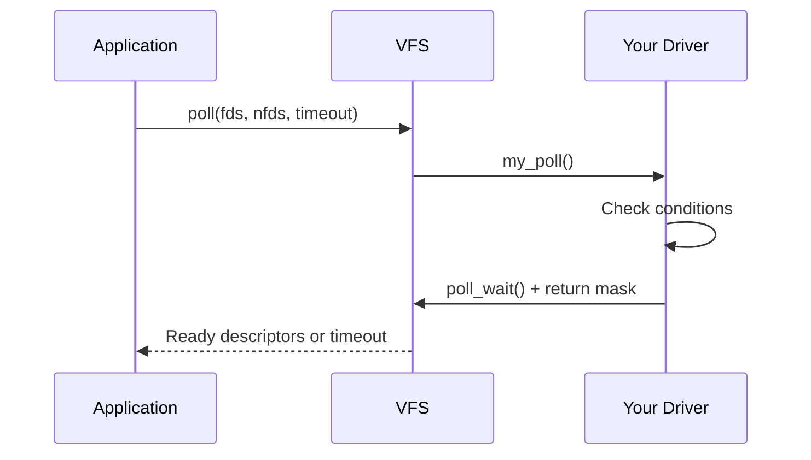

# Poll and Seek Operations

Beyond basic read/write, character devices often need to support asynchronous I/O notification (poll/select) and file positioning (llseek).

## Poll Operation

The poll operation allows user space to wait for multiple file descriptors simultaneously using `poll()`, `select()`, or `epoll()`.

### Poll Flow



### Implementing Poll

```c
#include <linux/poll.h>
#include <linux/wait.h>

struct my_device {
    wait_queue_head_t read_queue;   /* Readers wait here */
    wait_queue_head_t write_queue;  /* Writers wait here */
    struct mutex lock;
    char buffer[BUFFER_SIZE];
    size_t data_size;
    bool readable;
    bool writable;
};

static __poll_t my_poll(struct file *file, poll_table *wait)
{
    struct my_device *dev = file->private_data;
    __poll_t mask = 0;

    mutex_lock(&dev->lock);

    /* Register with poll system */
    poll_wait(file, &dev->read_queue, wait);
    poll_wait(file, &dev->write_queue, wait);

    /* Check read conditions */
    if (dev->data_size > 0)
        mask |= EPOLLIN | EPOLLRDNORM;   /* Readable */

    /* Check write conditions */
    if (dev->data_size < BUFFER_SIZE)
        mask |= EPOLLOUT | EPOLLWRNORM;  /* Writable */

    /* Check for errors */
    if (dev->error)
        mask |= EPOLLERR;

    /* Check for hangup */
    if (dev->disconnected)
        mask |= EPOLLHUP;

    mutex_unlock(&dev->lock);

    return mask;
}
```

### Poll Return Flags

| Flag | Meaning |
|------|---------|
| `EPOLLIN` | Data available for reading |
| `EPOLLRDNORM` | Normal data readable |
| `EPOLLRDBAND` | Priority band data readable |
| `EPOLLOUT` | Writing possible |
| `EPOLLWRNORM` | Normal data writable |
| `EPOLLWRBAND` | Priority band data writable |
| `EPOLLERR` | Error condition |
| `EPOLLHUP` | Hang up (device disconnected) |
| `EPOLLPRI` | Urgent data available |

### Waking Up Waiters

When data becomes available or space opens up:

```c
static ssize_t my_write(struct file *file, const char __user *buf,
                        size_t count, loff_t *ppos)
{
    struct my_device *dev = file->private_data;
    /* ... write data ... */

    /* Wake up readers waiting in poll() */
    wake_up_interruptible(&dev->read_queue);

    return count;
}

static ssize_t my_read(struct file *file, char __user *buf,
                       size_t count, loff_t *ppos)
{
    struct my_device *dev = file->private_data;
    /* ... read data ... */

    /* Wake up writers waiting in poll() */
    wake_up_interruptible(&dev->write_queue);

    return count;
}
```

### User Space Poll Example

```c
#include <poll.h>
#include <fcntl.h>
#include <stdio.h>

int main(void)
{
    struct pollfd fds[1];
    int fd, ret;

    fd = open("/dev/mydevice", O_RDWR | O_NONBLOCK);
    if (fd < 0) {
        perror("open");
        return 1;
    }

    fds[0].fd = fd;
    fds[0].events = POLLIN | POLLOUT;

    while (1) {
        ret = poll(fds, 1, 1000);  /* 1 second timeout */

        if (ret < 0) {
            perror("poll");
            break;
        }

        if (ret == 0) {
            printf("Timeout\n");
            continue;
        }

        if (fds[0].revents & POLLIN) {
            printf("Device readable\n");
            /* Read data */
        }

        if (fds[0].revents & POLLOUT) {
            printf("Device writable\n");
            /* Write data */
        }

        if (fds[0].revents & POLLERR) {
            printf("Device error\n");
            break;
        }

        if (fds[0].revents & POLLHUP) {
            printf("Device hung up\n");
            break;
        }
    }

    close(fd);
    return 0;
}
```

## Seek Operation (llseek)

The llseek operation controls file position:

```c
static loff_t my_llseek(struct file *file, loff_t offset, int whence)
{
    struct my_device *dev = file->private_data;
    loff_t newpos;

    switch (whence) {
    case SEEK_SET:  /* Absolute position */
        newpos = offset;
        break;

    case SEEK_CUR:  /* Relative to current position */
        newpos = file->f_pos + offset;
        break;

    case SEEK_END:  /* Relative to end */
        newpos = dev->data_size + offset;
        break;

    default:
        return -EINVAL;
    }

    /* Validate new position */
    if (newpos < 0)
        return -EINVAL;

    if (newpos > dev->data_size)
        return -EINVAL;  /* Or allow seeking past end */

    file->f_pos = newpos;
    return newpos;
}
```

### Seek Strategies

Different devices need different seek behaviors:

```c
/* 1. Seekable device (like a file) */
static const struct file_operations seekable_fops = {
    .owner  = THIS_MODULE,
    .llseek = my_llseek,
    .read   = my_read,
    .write  = my_write,
};

/* 2. Non-seekable device (like a pipe) */
static const struct file_operations nonseekable_fops = {
    .owner  = THIS_MODULE,
    .llseek = no_llseek,
    .read   = my_read,
    .write  = my_write,
};

/* 3. Position doesn't matter (like /dev/null) */
static const struct file_operations noop_fops = {
    .owner  = THIS_MODULE,
    .llseek = noop_llseek,  /* Returns without changing position */
    .read   = my_read,
    .write  = my_write,
};

/* Mark file as non-seekable in open */
static int my_open(struct inode *inode, struct file *file)
{
    return stream_open(inode, file);  /* Sets O_STREAM flag */
}
```

### Generic Seek Helpers

The kernel provides generic implementations:

```c
/* For fixed-size data */
.llseek = fixed_size_llseek,

/* For growable files */
.llseek = default_llseek,

/* For non-seekable */
.llseek = no_llseek,

/* For devices that ignore position */
.llseek = noop_llseek,
```

## Asynchronous I/O (fasync)

Support for SIGIO signal notification:

```c
#include <linux/fs.h>

struct my_device {
    struct fasync_struct *async_queue;
    /* ... */
};

static int my_fasync(int fd, struct file *file, int mode)
{
    struct my_device *dev = file->private_data;
    return fasync_helper(fd, file, mode, &dev->async_queue);
}

static int my_release(struct inode *inode, struct file *file)
{
    /* Remove from async notification list */
    my_fasync(-1, file, 0);
    return 0;
}

/* Notify when data available */
static void notify_async_readers(struct my_device *dev)
{
    if (dev->async_queue)
        kill_fasync(&dev->async_queue, SIGIO, POLL_IN);
}

/* Notify when write space available */
static void notify_async_writers(struct my_device *dev)
{
    if (dev->async_queue)
        kill_fasync(&dev->async_queue, SIGIO, POLL_OUT);
}

static const struct file_operations my_fops = {
    /* ... */
    .fasync = my_fasync,
};
```

### User Space Async I/O

```c
#include <signal.h>
#include <fcntl.h>

void sigio_handler(int sig)
{
    printf("Received SIGIO - data available\n");
}

int main(void)
{
    int fd, flags;

    fd = open("/dev/mydevice", O_RDWR);

    /* Set up signal handler */
    signal(SIGIO, sigio_handler);

    /* Set this process as owner for SIGIO */
    fcntl(fd, F_SETOWN, getpid());

    /* Enable async notification */
    flags = fcntl(fd, F_GETFL);
    fcntl(fd, F_SETFL, flags | FASYNC);

    /* Now we'll receive SIGIO when device has data */
    while (1)
        pause();

    return 0;
}
```

## Combining Poll with Read/Write

A typical pattern for event-driven I/O:

```c
struct my_device {
    wait_queue_head_t wait;
    struct mutex lock;
    char buffer[BUFFER_SIZE];
    size_t head;
    size_t tail;
    bool closed;
};

static inline bool has_data(struct my_device *dev)
{
    return dev->head != dev->tail;
}

static inline bool has_space(struct my_device *dev)
{
    return ((dev->head + 1) & (BUFFER_SIZE - 1)) != dev->tail;
}

static ssize_t my_read(struct file *file, char __user *buf,
                       size_t count, loff_t *ppos)
{
    struct my_device *dev = file->private_data;
    size_t copied = 0;

    mutex_lock(&dev->lock);

    while (!has_data(dev)) {
        mutex_unlock(&dev->lock);

        if (file->f_flags & O_NONBLOCK)
            return -EAGAIN;

        if (wait_event_interruptible(dev->wait,
                                     has_data(dev) || dev->closed))
            return -ERESTARTSYS;

        if (dev->closed)
            return 0;

        mutex_lock(&dev->lock);
    }

    /* Copy data */
    while (count && has_data(dev)) {
        if (put_user(dev->buffer[dev->tail], buf + copied)) {
            mutex_unlock(&dev->lock);
            return copied ? copied : -EFAULT;
        }
        dev->tail = (dev->tail + 1) & (BUFFER_SIZE - 1);
        copied++;
        count--;
    }

    mutex_unlock(&dev->lock);
    wake_up_interruptible(&dev->wait);

    return copied;
}

static __poll_t my_poll(struct file *file, poll_table *wait)
{
    struct my_device *dev = file->private_data;
    __poll_t mask = 0;

    poll_wait(file, &dev->wait, wait);

    mutex_lock(&dev->lock);
    if (has_data(dev))
        mask |= EPOLLIN | EPOLLRDNORM;
    if (has_space(dev))
        mask |= EPOLLOUT | EPOLLWRNORM;
    if (dev->closed)
        mask |= EPOLLHUP;
    mutex_unlock(&dev->lock);

    return mask;
}
```

## Summary

- Use `poll_wait()` to register wait queues with the poll system
- Return appropriate EPOLL* flags based on device state
- Wake up waiters with `wake_up_interruptible()` when conditions change
- Implement `llseek` for seekable devices, use `no_llseek` for streams
- Use `fasync` for SIGIO-based notification
- Combine poll with non-blocking read/write for robust I/O

## Next

Learn about [misc devices]() for simplified character device registration.
