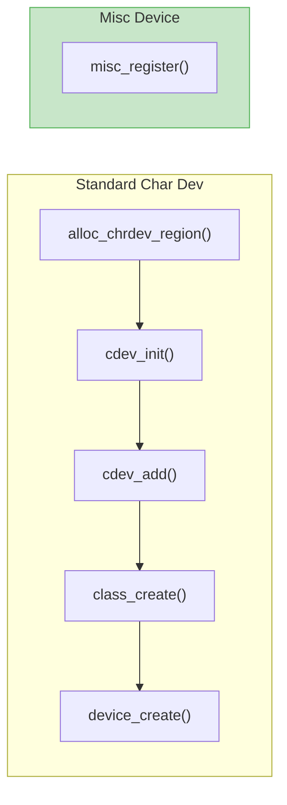

# Misc Devices

The misc (miscellaneous) device framework provides a simplified interface for character device registration. It's ideal for simple devices that don't fit into other subsystems.

## Why Use Misc Devices?

| Standard Character Device | Misc Device |
|---------------------------|-------------|
| Allocate device numbers | Automatic (major 10) |
| Create cdev | Automatic |
| Create class | Shared `misc` class |
| Create device node | Automatic |
| ~50 lines setup code | ~10 lines setup code |



## Basic Misc Device

```c
// SPDX-License-Identifier: GPL-2.0
#include <linux/module.h>
#include <linux/miscdevice.h>
#include <linux/fs.h>

static int my_open(struct inode *inode, struct file *file)
{
    pr_info("Device opened\n");
    return 0;
}

static int my_release(struct inode *inode, struct file *file)
{
    pr_info("Device closed\n");
    return 0;
}

static ssize_t my_read(struct file *file, char __user *buf,
                       size_t count, loff_t *ppos)
{
    return 0;  /* EOF */
}

static ssize_t my_write(struct file *file, const char __user *buf,
                        size_t count, loff_t *ppos)
{
    pr_info("Received %zu bytes\n", count);
    return count;
}

static const struct file_operations my_fops = {
    .owner   = THIS_MODULE,
    .open    = my_open,
    .release = my_release,
    .read    = my_read,
    .write   = my_write,
};

static struct miscdevice my_misc = {
    .minor = MISC_DYNAMIC_MINOR,  /* Auto-assign minor number */
    .name  = "mymisc",            /* Device name: /dev/mymisc */
    .fops  = &my_fops,
};

static int __init my_init(void)
{
    int ret;

    ret = misc_register(&my_misc);
    if (ret) {
        pr_err("Failed to register misc device\n");
        return ret;
    }

    pr_info("Misc device registered: /dev/%s (minor %d)\n",
            my_misc.name, my_misc.minor);
    return 0;
}

static void __exit my_exit(void)
{
    misc_deregister(&my_misc);
    pr_info("Misc device unregistered\n");
}

module_init(my_init);
module_exit(my_exit);

MODULE_LICENSE("GPL");
MODULE_AUTHOR("Your Name");
MODULE_DESCRIPTION("Simple misc device example");
```

## The miscdevice Structure

```c
#include <linux/miscdevice.h>

struct miscdevice {
    int minor;                          /* Minor number */
    const char *name;                   /* Device name */
    const struct file_operations *fops; /* File operations */
    struct list_head list;              /* Internal use */
    struct device *parent;              /* Parent device (optional) */
    struct device *this_device;         /* Created device */
    const struct attribute_group **groups; /* Sysfs attributes */
    const char *nodename;               /* Custom /dev path */
    umode_t mode;                       /* Device permissions */
};
```

### Minor Number Options

```c
/* Dynamic allocation (recommended) */
.minor = MISC_DYNAMIC_MINOR,

/* Static well-known minors (see include/linux/miscdevice.h) */
.minor = WATCHDOG_MINOR,      /* 130 */
.minor = TEMP_MINOR,          /* 131 */
.minor = RTC_MINOR,           /* 135 */
/* ... many more predefined */
```

## Misc Device with Private Data

```c
struct my_device {
    struct miscdevice misc;
    char buffer[4096];
    size_t size;
    struct mutex lock;
};

static struct my_device my_dev;

static int my_open(struct inode *inode, struct file *file)
{
    struct my_device *dev;

    /* Get our device structure from miscdevice */
    dev = container_of(file->private_data, struct my_device, misc);

    /* Or use our global */
    file->private_data = &my_dev;

    return 0;
}

static ssize_t my_read(struct file *file, char __user *buf,
                       size_t count, loff_t *ppos)
{
    struct my_device *dev = file->private_data;

    mutex_lock(&dev->lock);
    /* ... use dev->buffer ... */
    mutex_unlock(&dev->lock);

    return count;
}

static int __init my_init(void)
{
    mutex_init(&my_dev.lock);
    my_dev.misc.minor = MISC_DYNAMIC_MINOR;
    my_dev.misc.name = "mymisc";
    my_dev.misc.fops = &my_fops;

    return misc_register(&my_dev.misc);
}
```

## Setting Permissions

```c
static struct miscdevice my_misc = {
    .minor = MISC_DYNAMIC_MINOR,
    .name  = "mymisc",
    .fops  = &my_fops,
    .mode  = 0666,  /* rw-rw-rw- */
};
```

| Mode | Permissions |
|------|-------------|
| 0666 | Read/write for all |
| 0644 | Read/write owner, read others |
| 0600 | Read/write owner only |
| 0660 | Read/write owner and group |

## Custom Device Path

```c
static struct miscdevice my_misc = {
    .minor   = MISC_DYNAMIC_MINOR,
    .name    = "mydriver",
    .fops    = &my_fops,
    .nodename = "mysubdir/mydevice",  /* Creates /dev/mysubdir/mydevice */
};
```

{: .note }
The directory must already exist or udev must be configured to create it.

## Adding Sysfs Attributes

```c
static ssize_t status_show(struct device *dev,
                           struct device_attribute *attr, char *buf)
{
    return sprintf(buf, "OK\n");
}

static DEVICE_ATTR_RO(status);

static struct attribute *my_attrs[] = {
    &dev_attr_status.attr,
    NULL,
};

ATTRIBUTE_GROUPS(my);

static struct miscdevice my_misc = {
    .minor  = MISC_DYNAMIC_MINOR,
    .name   = "mymisc",
    .fops   = &my_fops,
    .groups = my_groups,  /* Automatically creates sysfs attributes */
};
```

Result:
```bash
cat /sys/class/misc/mymisc/status
# OK
```

## Parent Device Association

When your misc device is part of a larger device:

```c
static int my_probe(struct platform_device *pdev)
{
    struct my_device *dev;

    dev = devm_kzalloc(&pdev->dev, sizeof(*dev), GFP_KERNEL);
    if (!dev)
        return -ENOMEM;

    dev->misc.minor = MISC_DYNAMIC_MINOR;
    dev->misc.name = "mymisc";
    dev->misc.fops = &my_fops;
    dev->misc.parent = &pdev->dev;  /* Set parent device */

    return misc_register(&dev->misc);
}
```

## Multiple Misc Devices

```c
#define NUM_DEVICES 4

struct my_device {
    struct miscdevice misc;
    int id;
    char name[16];
};

static struct my_device devices[NUM_DEVICES];

static int __init my_init(void)
{
    int i, ret;

    for (i = 0; i < NUM_DEVICES; i++) {
        devices[i].id = i;
        snprintf(devices[i].name, sizeof(devices[i].name),
                 "mymisc%d", i);

        devices[i].misc.minor = MISC_DYNAMIC_MINOR;
        devices[i].misc.name = devices[i].name;
        devices[i].misc.fops = &my_fops;

        ret = misc_register(&devices[i].misc);
        if (ret) {
            pr_err("Failed to register device %d\n", i);
            goto err;
        }
    }

    return 0;

err:
    while (--i >= 0)
        misc_deregister(&devices[i].misc);
    return ret;
}

static void __exit my_exit(void)
{
    int i;

    for (i = 0; i < NUM_DEVICES; i++)
        misc_deregister(&devices[i].misc);
}
```

## Complete Example: Echo Device

A misc device that echoes back what you write:

```c
// SPDX-License-Identifier: GPL-2.0
#include <linux/module.h>
#include <linux/miscdevice.h>
#include <linux/fs.h>
#include <linux/uaccess.h>
#include <linux/mutex.h>

#define BUFFER_SIZE 4096

struct echo_device {
    struct miscdevice misc;
    char buffer[BUFFER_SIZE];
    size_t size;
    struct mutex lock;
};

static struct echo_device echo_dev;

static int echo_open(struct inode *inode, struct file *file)
{
    file->private_data = &echo_dev;
    return 0;
}

static ssize_t echo_read(struct file *file, char __user *buf,
                         size_t count, loff_t *ppos)
{
    struct echo_device *dev = file->private_data;
    size_t available;

    mutex_lock(&dev->lock);

    if (*ppos >= dev->size) {
        mutex_unlock(&dev->lock);
        return 0;
    }

    available = dev->size - *ppos;
    if (count > available)
        count = available;

    if (copy_to_user(buf, dev->buffer + *ppos, count)) {
        mutex_unlock(&dev->lock);
        return -EFAULT;
    }

    *ppos += count;
    mutex_unlock(&dev->lock);

    return count;
}

static ssize_t echo_write(struct file *file, const char __user *buf,
                          size_t count, loff_t *ppos)
{
    struct echo_device *dev = file->private_data;

    mutex_lock(&dev->lock);

    if (count > BUFFER_SIZE)
        count = BUFFER_SIZE;

    if (copy_from_user(dev->buffer, buf, count)) {
        mutex_unlock(&dev->lock);
        return -EFAULT;
    }

    dev->size = count;
    *ppos = 0;  /* Reset position for reading */

    mutex_unlock(&dev->lock);

    return count;
}

static const struct file_operations echo_fops = {
    .owner   = THIS_MODULE,
    .open    = echo_open,
    .read    = echo_read,
    .write   = echo_write,
};

static int __init echo_init(void)
{
    mutex_init(&echo_dev.lock);
    echo_dev.misc.minor = MISC_DYNAMIC_MINOR;
    echo_dev.misc.name = "echo";
    echo_dev.misc.fops = &echo_fops;
    echo_dev.misc.mode = 0666;

    return misc_register(&echo_dev.misc);
}

static void __exit echo_exit(void)
{
    misc_deregister(&echo_dev.misc);
}

module_init(echo_init);
module_exit(echo_exit);

MODULE_LICENSE("GPL");
MODULE_DESCRIPTION("Echo misc device");
```

Test:
```bash
echo "Hello" > /dev/echo
cat /dev/echo
# Hello
```

## When to Use Misc Devices

**Use misc devices when:**
- Simple character device functionality needed
- No specific subsystem fits
- Quick prototyping
- Single-function devices

**Use standard char devices when:**
- Multiple device instances with different minors
- Custom device class needed
- Complex sysfs hierarchy required
- Integration with existing subsystem

## Summary

- Misc devices simplify character device registration
- All misc devices share major number 10
- Use `MISC_DYNAMIC_MINOR` for automatic minor allocation
- `misc_register()` does all setup automatically
- Set `.mode` for custom permissions
- Use `.parent` to link to parent device in sysfs
- Use `.groups` for automatic sysfs attributes

## Next

Continue to [Part 4: Concurrency and Synchronization]() to learn about protecting shared data.
