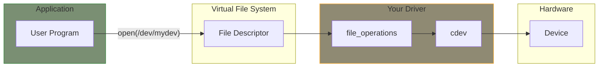
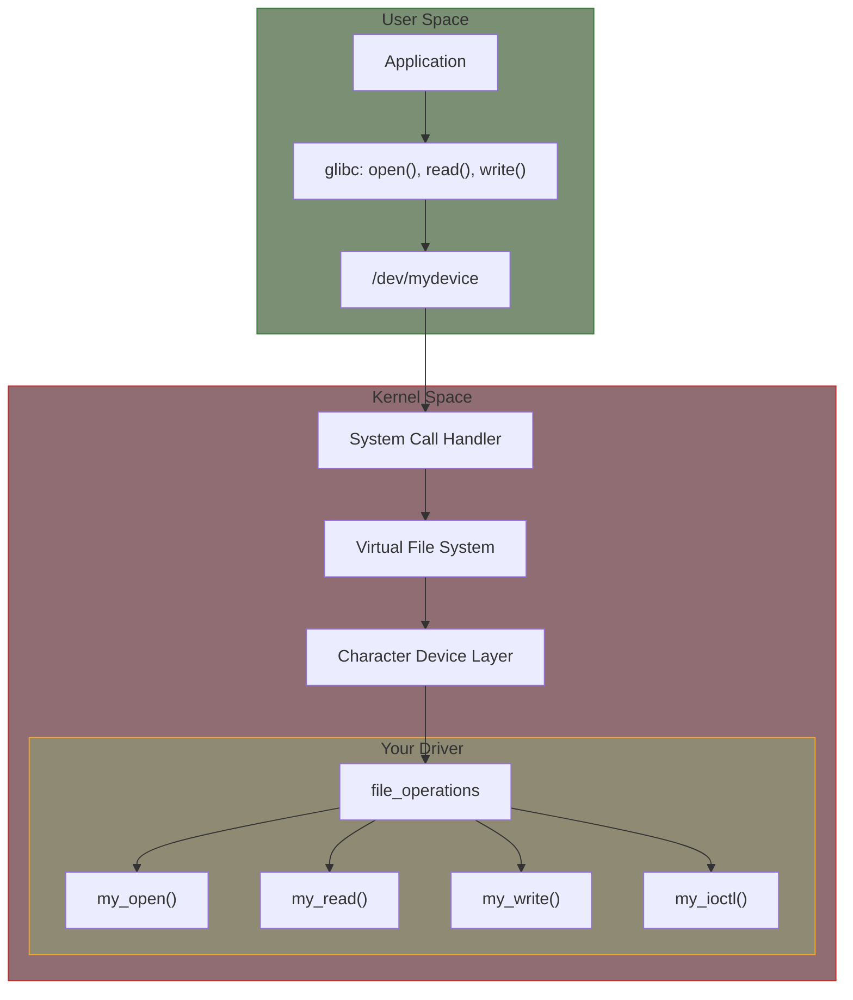

# Part 3: Character Device Drivers

Character devices are the most common type of driver and provide the foundation for interacting with hardware through the filesystem interface. In this part, you'll learn how to create complete character device drivers that applications can open, read, write, and control.

## What You'll Learn

## Chapter Contents

| Chapter | Topic | Key Concepts |
|---------|-------|--------------|
| [3.1]() | Character Device Concepts | Major/minor numbers, device nodes, /dev |
| [3.2]() | File Operations | file_operations structure, implementing handlers |
| [3.3]() | Device Registration | cdev_init, cdev_add, device_create |
| [3.4]() | Read and Write | copy_to_user, copy_from_user, data transfer |
| [3.5]() | IOCTL | Custom commands, _IO macros |
| [3.6]() | Poll and Seek | poll(), llseek(), blocking I/O |
| [3.7]() | Misc Devices | Simplified character device registration |

## Prerequisites

Before starting this part, ensure you understand:

- Module lifecycle (Part 2)
- Kernel memory access rules
- Basic kernel coding style

## Examples

This part includes complete working examples:

- **simple-char**: Basic character device with read/write
- **ioctl-device**: Device with custom ioctl commands

## Character Device Overview

Character devices:

- Transfer data as a stream of bytes (no block structure)
- Appear as special files in `/dev/`
- Support file operations: open, read, write, close, ioctl
- Are identified by major and minor numbers

Common character devices include:

- Serial ports (`/dev/ttyS*`)
- Terminals (`/dev/tty*`)
- Input devices (`/dev/input/*`)
- Memory devices (`/dev/mem`, `/dev/null`, `/dev/zero`)
- Custom hardware interfaces

## The Big Picture

## Further Reading

- [Character Device Drivers](https://docs.kernel.org/driver-api/infrastructure.html) - Kernel driver infrastructure
- [VFS Documentation](https://docs.kernel.org/filesystems/vfs.html) - Virtual filesystem layer
- [Linux Device Drivers, 3rd Ed - Chapter 3](https://lwn.net/Kernel/LDD3/) - Character drivers

## Next

Start with [Character Device Concepts]() to understand how character devices are identified and accessed.
