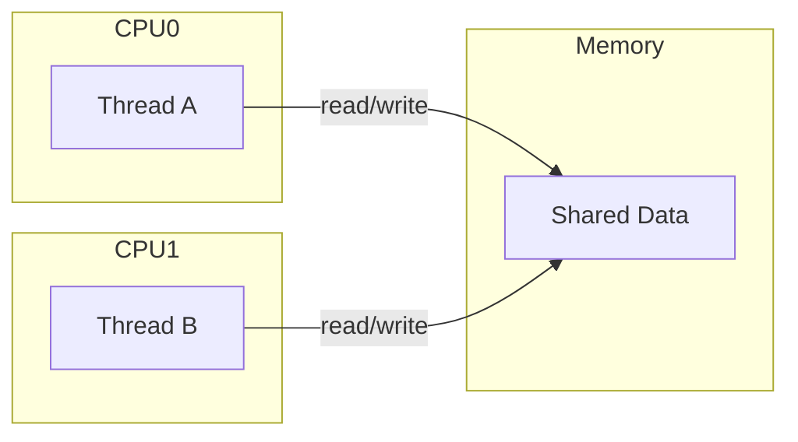
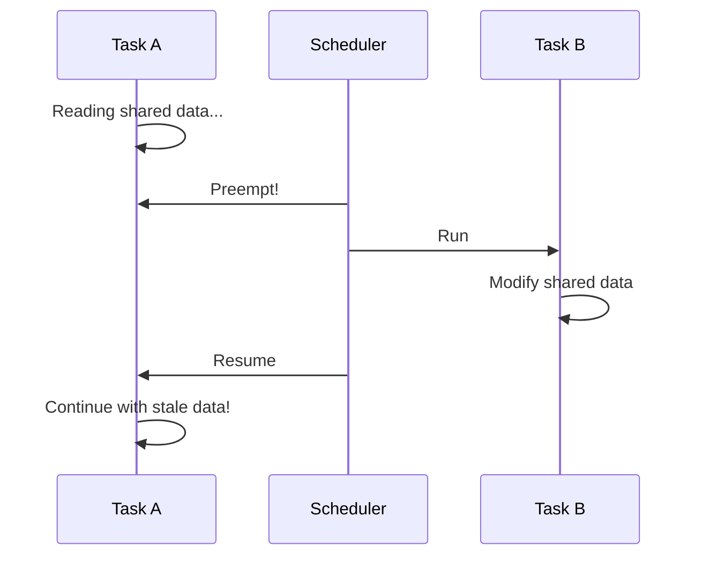
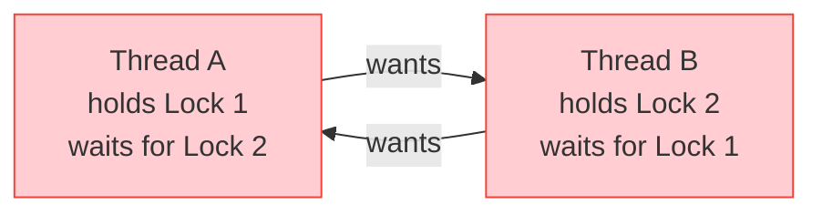

# Concurrency Concepts

Before diving into synchronization primitives, you need to understand why they're necessary and what problems they solve.

## Sources of Concurrency

### 1. Symmetric Multiprocessing (SMP)

Multiple CPUs can execute kernel code simultaneously:



### 2. Preemption

In preemptible kernels, one task can interrupt another:



### 3. Interrupts

Hardware interrupts can occur at any time:

```c
/* Process context */
void process_data(struct my_device *dev)
{
    dev->counter++;  /* Can be interrupted here! */
}

/* Interrupt context */
irqreturn_t my_irq_handler(int irq, void *data)
{
    struct my_device *dev = data;
    dev->counter++;  /* Race condition! */
    return IRQ_HANDLED;
}
```

### 4. Softirqs and Tasklets

Deferred interrupt processing can run concurrently:

- Softirqs can run on multiple CPUs simultaneously
- Tasklets of different types can run concurrently
- Both can preempt process context

## Race Conditions

A race condition occurs when the outcome depends on timing:

### Example: Increment Bug

```c
/* This is NOT atomic! */
counter++;

/* The CPU actually does: */
/* 1. Load counter into register */
/* 2. Add 1 to register */
/* 3. Store register to counter */
```

With two threads:

```
Thread A          Thread B          counter
--------          --------          -------
                                    0
Load counter                        0
                  Load counter      0
Add 1 (reg=1)                       0
                  Add 1 (reg=1)     0
Store (1)                           1
                  Store (1)         1  <- Should be 2!
```

### Example: Check-Then-Act Bug

```c
/* WRONG: Race between check and action */
if (resource_available) {
    resource_available = false;  /* Another thread might do this first! */
    use_resource();
}
```

## Critical Sections

A critical section is code that accesses shared data. It must be protected:

```c
/* Unprotected - DANGEROUS */
void bad_function(struct my_device *dev)
{
    dev->value++;  /* Critical section without protection */
}

/* Protected - SAFE */
void good_function(struct my_device *dev)
{
    spin_lock(&dev->lock);    /* Enter critical section */
    dev->value++;
    spin_unlock(&dev->lock);  /* Exit critical section */
}
```

## Locking Rules

### Rule 1: Identify Shared Data

Ask: "What data can be accessed by multiple contexts?"

- Global variables
- Data pointed to by pointers accessible from multiple contexts
- Device state structures
- Buffers shared between interrupt and process context

### Rule 2: Identify Access Points

For each piece of shared data, identify all code paths:

```c
struct my_device {
    int state;           /* Accessed by: open, read, write, ioctl, irq */
    char buffer[4096];   /* Accessed by: read, write, irq */
    atomic_t users;      /* Accessed by: open, release */
};
```

### Rule 3: Choose Appropriate Lock

| Context | Can Sleep? | Lock Type |
|---------|------------|-----------|
| Interrupt | No | Spinlock with irqsave |
| Softirq/Tasklet | No | Spinlock |
| Process | Yes | Mutex or Spinlock |

### Rule 4: Lock Ordering

Always acquire locks in the same order:

```c
/* CORRECT: Always lock A before B */
void function1(void)
{
    spin_lock(&lock_a);
    spin_lock(&lock_b);
    /* ... */
    spin_unlock(&lock_b);
    spin_unlock(&lock_a);
}

void function2(void)
{
    spin_lock(&lock_a);  /* Same order as function1 */
    spin_lock(&lock_b);
    /* ... */
    spin_unlock(&lock_b);
    spin_unlock(&lock_a);
}

/* WRONG: Deadlock risk! */
void bad_function(void)
{
    spin_lock(&lock_b);  /* Opposite order! */
    spin_lock(&lock_a);  /* Can deadlock with function1 */
    /* ... */
}
```

## What Can Go Wrong

### Deadlock

Two or more tasks waiting for each other:



### Data Corruption

Unsynchronized access leads to inconsistent state:

```c
/* Thread A */                    /* Thread B */
list_add(&new->list, head);       list_add(&other->list, head);

/* Both modify head->next simultaneously - corruption! */
```

### Use-After-Free

One context frees memory while another uses it:

```c
/* Thread A */
kfree(dev->buffer);

/* Thread B (racing) */
memcpy(dest, dev->buffer, size);  /* Crash! */
```

## Context Matters

### Process Context

- Has a `current` task
- Can sleep and block
- Can use mutexes and semaphores
- Can use spinlocks (but don't sleep while holding)

```c
/* In process context (syscall, ioctl, etc.) */
static ssize_t my_write(struct file *file, ...)
{
    struct my_device *dev = file->private_data;

    mutex_lock(&dev->lock);    /* Can sleep waiting for lock */
    /* ... access shared data ... */
    mutex_unlock(&dev->lock);

    return count;
}
```

### Interrupt Context

- No `current` task
- Cannot sleep!
- Must use spinlock (with irq variants)
- Must be fast

```c
/* In interrupt context */
static irqreturn_t my_irq(int irq, void *data)
{
    struct my_device *dev = data;
    unsigned long flags;

    spin_lock_irqsave(&dev->lock, flags);  /* Disable interrupts too */
    /* ... quick access to shared data ... */
    spin_unlock_irqrestore(&dev->lock, flags);

    return IRQ_HANDLED;
}
```

### Atomic Context

When you can't sleep (preemption disabled, holding spinlock):

```c
/* Check if you can sleep */
if (in_atomic() || irqs_disabled()) {
    /* Cannot sleep - use GFP_ATOMIC for allocations */
    ptr = kmalloc(size, GFP_ATOMIC);
} else {
    /* Can sleep - use GFP_KERNEL */
    ptr = kmalloc(size, GFP_KERNEL);
}
```

## Memory Barriers

On some architectures, memory operations can be reordered. Barriers ensure ordering:

```c
/* Without barrier - CPU might reorder */
dev->data = new_data;
dev->ready = true;  /* Might be visible before data! */

/* With barrier - guaranteed order */
dev->data = new_data;
smp_wmb();          /* Write memory barrier */
dev->ready = true;  /* Only visible after data */
```

| Barrier | Purpose |
|---------|---------|
| `smp_rmb()` | Read barrier - order reads |
| `smp_wmb()` | Write barrier - order writes |
| `smp_mb()` | Full barrier - order both |
| `barrier()` | Compiler barrier only |

{: .note }
Locking primitives include appropriate barriers. You usually don't need explicit barriers when using locks correctly.

## Summary

- Kernel code runs concurrently from multiple sources
- Race conditions lead to data corruption and crashes
- Critical sections must be protected with appropriate locks
- Context determines which locks you can use
- Lock ordering prevents deadlocks
- Memory barriers ensure visibility across CPUs

## Next

Learn about [spinlocks]() - the fundamental kernel locking primitive.
