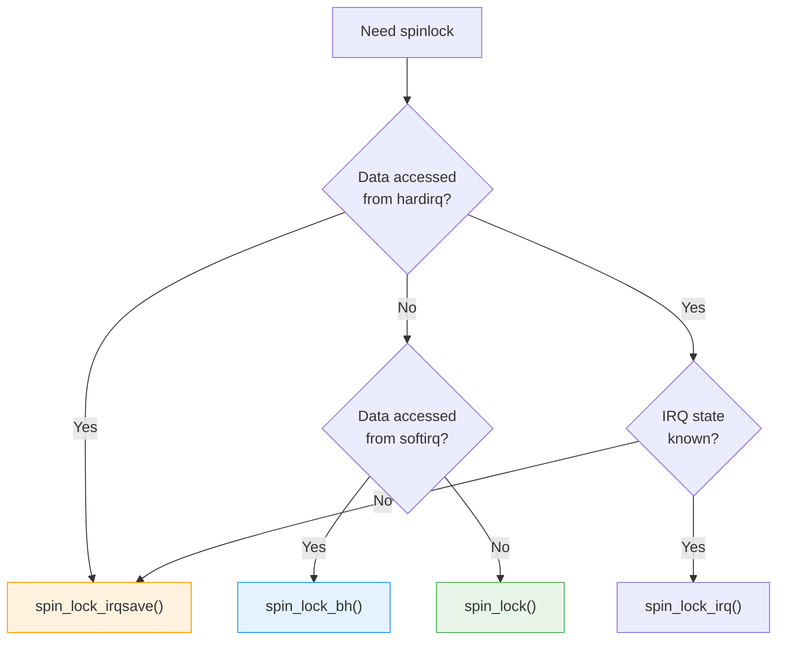

# Spinlocks

Spinlocks are the most fundamental locking primitive in the kernel. They protect critical sections by "spinning" (busy-waiting) until the lock becomes available.

## Basic Spinlock Usage

```c
#include <linux/spinlock.h>

/* Static initialization */
static DEFINE_SPINLOCK(my_lock);

/* Or dynamic initialization */
spinlock_t my_lock;
spin_lock_init(&my_lock);

/* Using the lock */
spin_lock(&my_lock);
/* ... critical section ... */
spin_unlock(&my_lock);
```

## When to Use Spinlocks

Use spinlocks when:
- The critical section is short
- You cannot sleep (interrupt context)
- You're protecting data accessed by interrupts

{: .warning }
**Never sleep while holding a spinlock!** This includes `kmalloc(GFP_KERNEL)`, `copy_to_user()`, `mutex_lock()`, etc.

## Spinlock Variants

### Basic Spinlock

```c
spin_lock(&lock);
/* Critical section - can be preempted, interrupts enabled */
spin_unlock(&lock);
```

Use when: Data is only accessed from process context.

### With IRQ Disable

```c
unsigned long flags;

spin_lock_irqsave(&lock, flags);
/* Critical section - interrupts disabled, preemption disabled */
spin_unlock_irqrestore(&lock, flags);
```

Use when: Data is accessed from both process and interrupt context.

### With IRQ Disable (Known State)

```c
spin_lock_irq(&lock);
/* Critical section - interrupts disabled */
spin_unlock_irq(&lock);
```

Use when: You know interrupts are enabled when you acquire the lock.

### With BH Disable

```c
spin_lock_bh(&lock);
/* Critical section - bottom halves disabled */
spin_unlock_bh(&lock);
```

Use when: Data is accessed from process and softirq/tasklet context (but not hardirq).

## Choosing the Right Variant



| Data Access | Function |
|-------------|----------|
| Process + Process | `spin_lock()` |
| Process + Softirq | `spin_lock_bh()` |
| Process + Hardirq | `spin_lock_irqsave()` |
| Softirq + Softirq | `spin_lock()` (softirqs don't preempt themselves) |
| Softirq + Hardirq | `spin_lock_irqsave()` |
| Hardirq + Hardirq | `spin_lock()` (same IRQ won't nest) |

## Complete Example

```c
#include <linux/module.h>
#include <linux/spinlock.h>
#include <linux/interrupt.h>

struct my_device {
    spinlock_t lock;
    int process_count;
    int irq_count;
    char buffer[256];
};

static struct my_device dev;

/* Called from process context */
static ssize_t my_read(struct file *file, char __user *buf,
                       size_t count, loff_t *ppos)
{
    unsigned long flags;
    int local_count;

    spin_lock_irqsave(&dev.lock, flags);
    dev.process_count++;
    local_count = dev.irq_count;
    /* Copy from buffer safely */
    spin_unlock_irqrestore(&dev.lock, flags);

    return local_count;
}

/* Called from interrupt context */
static irqreturn_t my_irq_handler(int irq, void *data)
{
    struct my_device *d = data;

    spin_lock(&d->lock);  /* Already in IRQ context */
    d->irq_count++;
    /* Modify buffer */
    spin_unlock(&d->lock);

    return IRQ_HANDLED;
}

static int __init my_init(void)
{
    spin_lock_init(&dev.lock);
    /* ... */
    return 0;
}
```

## Spinlock Internals

On SMP systems, spinlocks actually spin:

```c
/* Conceptual implementation */
void spin_lock(spinlock_t *lock)
{
    preempt_disable();
    while (test_and_set(&lock->locked))
        cpu_relax();  /* Spin waiting */
}

void spin_unlock(spinlock_t *lock)
{
    lock->locked = 0;
    preempt_enable();
}
```

On UP (uniprocessor) with preemption:
- Spinlocks just disable preemption
- No actual spinning (nothing to wait for)

## Reader-Writer Spinlocks

For data that's read frequently but written rarely:

```c
#include <linux/rwlock.h>

static DEFINE_RWLOCK(my_rwlock);

/* Reader */
read_lock(&my_rwlock);
/* Multiple readers can enter simultaneously */
read_unlock(&my_rwlock);

/* Writer */
write_lock(&my_rwlock);
/* Exclusive access - no other readers or writers */
write_unlock(&my_rwlock);
```

### RW Spinlock Variants

```c
/* With IRQ save */
read_lock_irqsave(&lock, flags);
read_unlock_irqrestore(&lock, flags);

write_lock_irqsave(&lock, flags);
write_unlock_irqrestore(&lock, flags);

/* With BH disable */
read_lock_bh(&lock);
read_unlock_bh(&lock);
```

{: .note }
RW spinlocks can starve writers. Consider RCU for read-heavy workloads.

## Trylock Variants

Don't block if lock is unavailable:

```c
if (spin_trylock(&lock)) {
    /* Got the lock */
    spin_unlock(&lock);
} else {
    /* Lock was held - do something else */
}

/* With IRQ save */
if (spin_trylock_irqsave(&lock, flags)) {
    /* ... */
    spin_unlock_irqrestore(&lock, flags);
}
```

## Common Mistakes

### Mistake 1: Sleeping with Spinlock

```c
/* WRONG! */
spin_lock(&lock);
kmalloc(size, GFP_KERNEL);  /* Can sleep! */
copy_to_user(buf, data, n);  /* Can sleep! */
msleep(100);                 /* Sleeps! */
spin_unlock(&lock);

/* CORRECT */
spin_lock(&lock);
ptr = kmalloc(size, GFP_ATOMIC);  /* Won't sleep */
spin_unlock(&lock);
```

### Mistake 2: Forgetting IRQ Disable

```c
/* WRONG - can deadlock if interrupted! */
void process_function(struct my_device *dev)
{
    spin_lock(&dev->lock);  /* If IRQ fires here... */
    /* ... */
    spin_unlock(&dev->lock);
}

irqreturn_t irq_handler(int irq, void *data)
{
    struct my_device *dev = data;
    spin_lock(&dev->lock);  /* Deadlock! Already holding lock */
    /* ... */
}

/* CORRECT */
void process_function(struct my_device *dev)
{
    unsigned long flags;
    spin_lock_irqsave(&dev->lock, flags);
    /* ... */
    spin_unlock_irqrestore(&dev->lock, flags);
}
```

### Mistake 3: Double Acquire

```c
/* WRONG - deadlock! */
spin_lock(&lock);
spin_lock(&lock);  /* Deadlock - already holding this lock! */
```

### Mistake 4: Lock Ordering Violation

```c
/* Function A */
spin_lock(&lock_a);
spin_lock(&lock_b);

/* Function B - WRONG ORDER! */
spin_lock(&lock_b);  /* If A holds lock_a and waits for lock_b... */
spin_lock(&lock_a);  /* ...and B holds lock_b and waits for lock_a = DEADLOCK */
```

## Per-CPU Data Alternative

Sometimes you can avoid locking entirely:

```c
#include <linux/percpu.h>

DEFINE_PER_CPU(int, my_counter);

/* No locking needed for per-CPU access */
void increment_counter(void)
{
    preempt_disable();
    this_cpu_inc(my_counter);
    preempt_enable();
}
```

## Summary

- Spinlocks protect short critical sections
- Use `irqsave` variant when data is accessed from interrupts
- Never sleep while holding a spinlock
- Keep critical sections as short as possible
- Always acquire multiple locks in the same order

## Next

Learn about [mutexes]() - sleeping locks for longer critical sections.
