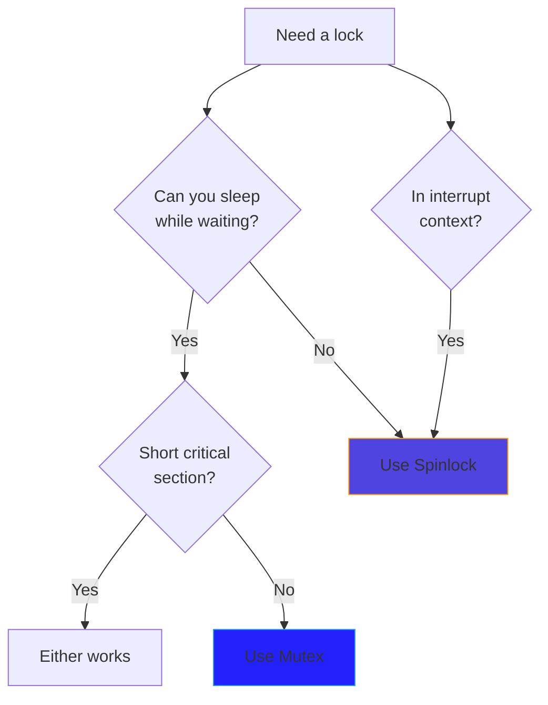

# Mutexes

Mutexes (mutual exclusion locks) are sleeping locks designed for longer critical sections in process context. Unlike spinlocks, a task waiting for a mutex will sleep instead of busy-waiting.

## Basic Mutex Usage

```c
#include <linux/mutex.h>

/* Static initialization */
static DEFINE_MUTEX(my_mutex);

/* Or dynamic initialization */
struct mutex my_mutex;
mutex_init(&my_mutex);

/* Using the mutex */
mutex_lock(&my_mutex);
/* ... critical section (can sleep here) ... */
mutex_unlock(&my_mutex);
```

## Mutex vs Spinlock

| Aspect | Mutex | Spinlock |
|--------|-------|----------|
| Waiting | Sleeps | Busy-waits |
| Context | Process only | Any |
| Can sleep while holding | Yes | No |
| Overhead | Higher (scheduling) | Lower |
| Best for | Longer critical sections | Short critical sections |



## Mutex Operations

### Basic Lock/Unlock

```c
mutex_lock(&mutex);       /* Sleep if not available */
/* Critical section */
mutex_unlock(&mutex);
```

### Try Lock (Non-blocking)

```c
if (mutex_trylock(&mutex)) {
    /* Got the lock */
    mutex_unlock(&mutex);
} else {
    /* Lock was held - do something else */
}
```

### Interruptible Lock

```c
if (mutex_lock_interruptible(&mutex)) {
    /* Was interrupted by a signal */
    return -ERESTARTSYS;
}
/* Got the lock */
mutex_unlock(&mutex);
```

### Killable Lock

```c
if (mutex_lock_killable(&mutex)) {
    /* Was killed by a fatal signal */
    return -ERESTARTSYS;
}
/* Got the lock */
mutex_unlock(&mutex);
```

## Complete Example

```c
#include <linux/module.h>
#include <linux/mutex.h>
#include <linux/fs.h>
#include <linux/uaccess.h>

struct my_device {
    struct mutex lock;
    char buffer[4096];
    size_t size;
};

static struct my_device dev;

static ssize_t my_read(struct file *file, char __user *buf,
                       size_t count, loff_t *ppos)
{
    ssize_t ret;

    /* Use interruptible to allow Ctrl-C */
    if (mutex_lock_interruptible(&dev.lock))
        return -ERESTARTSYS;

    if (*ppos >= dev.size) {
        ret = 0;
        goto out;
    }

    if (*ppos + count > dev.size)
        count = dev.size - *ppos;

    /* copy_to_user can sleep - that's OK with mutex! */
    if (copy_to_user(buf, dev.buffer + *ppos, count)) {
        ret = -EFAULT;
        goto out;
    }

    *ppos += count;
    ret = count;

out:
    mutex_unlock(&dev.lock);
    return ret;
}

static ssize_t my_write(struct file *file, const char __user *buf,
                        size_t count, loff_t *ppos)
{
    ssize_t ret;

    if (mutex_lock_interruptible(&dev.lock))
        return -ERESTARTSYS;

    if (*ppos + count > sizeof(dev.buffer))
        count = sizeof(dev.buffer) - *ppos;

    /* copy_from_user can sleep - OK! */
    if (copy_from_user(dev.buffer + *ppos, buf, count)) {
        ret = -EFAULT;
        goto out;
    }

    *ppos += count;
    if (*ppos > dev.size)
        dev.size = *ppos;
    ret = count;

out:
    mutex_unlock(&dev.lock);
    return ret;
}

static int __init my_init(void)
{
    mutex_init(&dev.lock);
    return 0;
}
```

## Mutex Rules

### Rule 1: Only the Owner Can Unlock

```c
/* WRONG - different task unlocking */
void task_a(void)
{
    mutex_lock(&mutex);
    /* ... */
}

void task_b(void)
{
    mutex_unlock(&mutex);  /* Wrong! A locked it */
}
```

### Rule 2: No Recursive Locking

```c
/* WRONG - will deadlock! */
void my_function(void)
{
    mutex_lock(&mutex);
    other_function();  /* If this also locks mutex... deadlock! */
    mutex_unlock(&mutex);
}

void other_function(void)
{
    mutex_lock(&mutex);  /* Deadlock! */
    /* ... */
    mutex_unlock(&mutex);
}
```

### Rule 3: Cannot Use in Interrupt Context

```c
/* WRONG! */
irqreturn_t my_irq_handler(int irq, void *data)
{
    mutex_lock(&mutex);  /* Will sleep! Crash! */
    /* ... */
    mutex_unlock(&mutex);
    return IRQ_HANDLED;
}
```

## Checking Mutex State

```c
/* Check if mutex is locked */
if (mutex_is_locked(&mutex))
    pr_info("Mutex is currently held\n");

/* Check if current task owns the mutex (debug builds) */
#ifdef CONFIG_DEBUG_MUTEXES
if (lockdep_is_held(&mutex))
    pr_info("We are holding the mutex\n");
#endif
```

## Mutex in Device Structures

Common pattern for per-device locking:

```c
struct my_device {
    struct mutex lock;
    /* ... other fields ... */
};

static int my_open(struct inode *inode, struct file *file)
{
    struct my_device *dev;

    dev = container_of(inode->i_cdev, struct my_device, cdev);
    file->private_data = dev;

    return 0;
}

static ssize_t my_read(struct file *file, char __user *buf,
                       size_t count, loff_t *ppos)
{
    struct my_device *dev = file->private_data;

    mutex_lock(&dev->lock);  /* Lock this specific device */
    /* ... */
    mutex_unlock(&dev->lock);

    return count;
}
```

## Nested Locking

Sometimes you need multiple mutexes. Define clear ordering:

```c
/*
 * Lock ordering:
 * 1. global_lock
 * 2. dev->lock (for any device)
 */

void my_function(struct my_device *dev)
{
    mutex_lock(&global_lock);
    mutex_lock(&dev->lock);
    /* ... */
    mutex_unlock(&dev->lock);
    mutex_unlock(&global_lock);
}
```

Use lockdep annotations for complex cases:

```c
static struct lock_class_key my_lock_key;

void my_init(struct my_device *dev)
{
    mutex_init(&dev->lock);
    lockdep_set_class(&dev->lock, &my_lock_key);
}
```

## Mutex Alternatives

### struct rw_semaphore

For read-heavy access patterns:

```c
#include <linux/rwsem.h>

static DECLARE_RWSEM(my_rwsem);

/* Multiple readers */
down_read(&my_rwsem);
/* ... read data ... */
up_read(&my_rwsem);

/* Exclusive writer */
down_write(&my_rwsem);
/* ... modify data ... */
up_write(&my_rwsem);
```

### struct ww_mutex

For wound-wait deadlock avoidance (used in graphics drivers):

```c
#include <linux/ww_mutex.h>

/* Complex usage - see documentation for details */
```

## Debugging

Enable CONFIG_DEBUG_MUTEXES for:
- Deadlock detection
- Owner tracking
- Use-after-free detection

```bash
# Check kernel config
grep DEBUG_MUTEXES /boot/config-$(uname -r)
```

## Summary

- Mutexes are sleeping locks for process context
- Use when critical sections may be long or involve sleeping
- Cannot be used in interrupt context
- Only the owner can unlock
- Not recursive - don't try to lock twice
- Use `mutex_lock_interruptible()` to allow signal interruption

## Next

Learn about [semaphores]() for resource counting.
