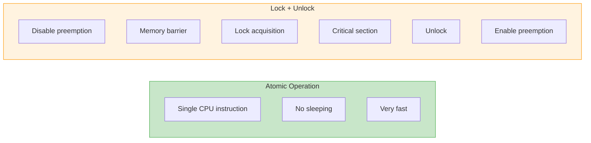

# Atomic Operations

Atomic operations provide lock-free synchronization for simple operations on integers and bits. They're faster than locks when you just need to update a counter or flag.

## Why Atomic?

Normal operations aren't atomic:

```c
/* This is NOT atomic! */
counter++;

/* CPU executes as:
 * 1. Load counter into register
 * 2. Add 1 to register
 * 3. Store register to memory
 *
 * Another CPU can interfere at any point!
 */
```

Atomic operations complete in a single, uninterruptible step.

## atomic_t Type

```c
#include <linux/atomic.h>

/* Declaration and initialization */
atomic_t counter = ATOMIC_INIT(0);

/* Or dynamic */
atomic_t counter;
atomic_set(&counter, 0);
```

## Basic Operations

```c
atomic_t v = ATOMIC_INIT(0);

/* Read */
int val = atomic_read(&v);

/* Write */
atomic_set(&v, 10);

/* Increment/Decrement */
atomic_inc(&v);  /* v++ */
atomic_dec(&v);  /* v-- */

/* Add/Subtract */
atomic_add(5, &v);  /* v += 5 */
atomic_sub(3, &v);  /* v -= 3 */
```

## Operations with Return Value

```c
/* Add and return new value */
int new_val = atomic_add_return(5, &v);

/* Increment and return new value */
int new_val = atomic_inc_return(&v);

/* Decrement and return new value */
int new_val = atomic_dec_return(&v);

/* Read then add */
int old_val = atomic_fetch_add(5, &v);

/* Read then increment */
int old_val = atomic_fetch_inc(&v);
```

## Test and Modify

```c
/* Decrement and test if zero */
if (atomic_dec_and_test(&v)) {
    pr_info("Counter reached zero!\n");
    /* Free resources, etc. */
}

/* Increment and test if zero */
if (atomic_inc_and_test(&v)) {
    pr_info("Counter is now zero after increment\n");
}

/* Add and test if negative */
if (atomic_add_negative(-10, &v)) {
    pr_info("Counter is now negative\n");
}
```

## Compare and Exchange

The fundamental atomic building block:

```c
/* If v equals old, set to new and return true */
/* Otherwise return false */
int old = 5;
int new = 10;

if (atomic_cmpxchg(&v, old, new) == old) {
    pr_info("Successfully changed from %d to %d\n", old, new);
} else {
    pr_info("Value was not %d, exchange failed\n", old);
}

/* Exchange unconditionally */
int prev = atomic_xchg(&v, new);
pr_info("Previous value was %d\n", prev);
```

## 64-bit Atomics

```c
#include <linux/atomic.h>

atomic64_t counter64 = ATOMIC64_INIT(0);

/* Same operations with atomic64_ prefix */
atomic64_set(&counter64, 100);
atomic64_add(50, &counter64);
long val = atomic64_read(&counter64);
```

## Reference Counting Pattern

Common use for atomic operations:

```c
struct my_object {
    atomic_t refcount;
    /* ... other data ... */
};

struct my_object *obj_get(struct my_object *obj)
{
    atomic_inc(&obj->refcount);
    return obj;
}

void obj_put(struct my_object *obj)
{
    if (atomic_dec_and_test(&obj->refcount)) {
        /* Last reference - free the object */
        kfree(obj);
    }
}
```

### Using kref

The kernel provides a reference counting abstraction:

```c
#include <linux/kref.h>

struct my_object {
    struct kref ref;
    /* ... */
};

static void my_object_release(struct kref *ref)
{
    struct my_object *obj = container_of(ref, struct my_object, ref);
    kfree(obj);
}

void obj_get(struct my_object *obj)
{
    kref_get(&obj->ref);
}

void obj_put(struct my_object *obj)
{
    kref_put(&obj->ref, my_object_release);
}
```

## Bitwise Atomic Operations

```c
#include <linux/atomic.h>

unsigned long flags = 0;

/* Set a bit atomically */
set_bit(3, &flags);  /* flags |= (1 << 3) */

/* Clear a bit atomically */
clear_bit(3, &flags);  /* flags &= ~(1 << 3) */

/* Toggle a bit atomically */
change_bit(3, &flags);  /* flags ^= (1 << 3) */

/* Test a bit (not atomic, just reads) */
if (test_bit(3, &flags)) {
    pr_info("Bit 3 is set\n");
}
```

## Test and Modify Bits

```c
/* Set bit and return old value */
if (!test_and_set_bit(3, &flags)) {
    pr_info("Bit was clear, now set\n");
} else {
    pr_info("Bit was already set\n");
}

/* Clear bit and return old value */
if (test_and_clear_bit(3, &flags)) {
    pr_info("Bit was set, now clear\n");
}

/* Toggle bit and return old value */
int was_set = test_and_change_bit(3, &flags);
```

## Bit Lock Pattern

Use a bit as a simple lock:

```c
#define DEVICE_BUSY 0

struct my_device {
    unsigned long flags;
    /* ... */
};

int try_lock_device(struct my_device *dev)
{
    if (test_and_set_bit(DEVICE_BUSY, &dev->flags))
        return -EBUSY;  /* Already locked */
    return 0;
}

void unlock_device(struct my_device *dev)
{
    clear_bit(DEVICE_BUSY, &dev->flags);
}
```

## Memory Barriers with Atomics

Most atomic operations include implicit barriers, but you can be explicit:

```c
/* Operations with explicit barriers */
smp_mb__before_atomic();  /* Barrier before atomic op */
atomic_inc(&v);
smp_mb__after_atomic();   /* Barrier after atomic op */

/* Atomics that include barriers */
atomic_add_return();      /* Includes full barrier */
atomic_cmpxchg();         /* Includes full barrier */
test_and_set_bit();       /* Includes full barrier */
```

## Complete Example: Status Flags

```c
#include <linux/module.h>
#include <linux/atomic.h>

#define STATUS_INITIALIZED  0
#define STATUS_RUNNING      1
#define STATUS_ERROR        2
#define STATUS_STOPPED      3

struct device_state {
    unsigned long status;
    atomic_t error_count;
    atomic_t operation_count;
};

static struct device_state state;

int device_start(void)
{
    /* Check if already running */
    if (test_and_set_bit(STATUS_RUNNING, &state.status)) {
        pr_warn("Device already running\n");
        return -EBUSY;
    }

    set_bit(STATUS_INITIALIZED, &state.status);
    clear_bit(STATUS_STOPPED, &state.status);

    pr_info("Device started\n");
    return 0;
}

void device_stop(void)
{
    clear_bit(STATUS_RUNNING, &state.status);
    set_bit(STATUS_STOPPED, &state.status);
    pr_info("Device stopped\n");
}

void device_operation(void)
{
    atomic_inc(&state.operation_count);

    if (some_error_condition()) {
        set_bit(STATUS_ERROR, &state.status);
        atomic_inc(&state.error_count);
    }
}

void device_get_stats(int *ops, int *errors)
{
    *ops = atomic_read(&state.operation_count);
    *errors = atomic_read(&state.error_count);
}
```

## When to Use Atomic Operations

**Use atomics when:**
- Simple counters (increment, decrement)
- Reference counting
- Status flags
- Single-variable updates

**Use locks when:**
- Multiple variables need consistent update
- Complex operations
- Need to hold access during sleep

## Atomic vs Lock Performance



## Summary

- `atomic_t` provides lock-free integer operations
- Use for simple counters and reference counting
- Bitwise atomics (`set_bit`, `test_and_set_bit`) for flags
- Most atomic operations include memory barriers
- Faster than locks but limited to simple operations
- Use `kref` for reference counting patterns

## Next

Learn about [RCU]() for read-heavy data structures.
