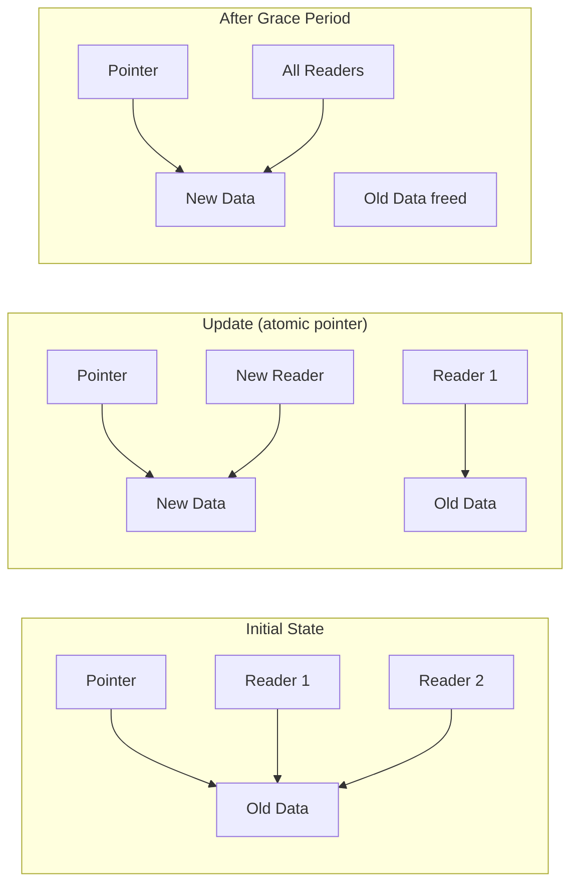

# RCU (Read-Copy-Update)

RCU is a synchronization mechanism optimized for read-heavy workloads. Readers can access data without any locking, while writers create new versions of data and wait for readers to finish.

## The RCU Concept



Key principles:
1. **Readers never block** - use `rcu_read_lock()` which just disables preemption
2. **Writers create new copy** - modify a copy, then atomically swap pointer
3. **Grace period** - old data is freed only after all readers are done

## Basic RCU API

```c
#include <linux/rcupdate.h>

/* Reader side */
rcu_read_lock();
/* Read RCU-protected data */
rcu_read_unlock();

/* Writer side */
synchronize_rcu();     /* Wait for all readers to finish */
call_rcu(&rcu_head, callback);  /* Defer callback until grace period */
```

## Pointer Access

```c
#include <linux/rcupdate.h>

struct my_data {
    int value;
    char name[32];
};

static struct my_data __rcu *global_data;

/* Reading */
void read_data(void)
{
    struct my_data *p;

    rcu_read_lock();
    p = rcu_dereference(global_data);  /* Safe pointer access */
    if (p) {
        pr_info("Value: %d, Name: %s\n", p->value, p->name);
    }
    rcu_read_unlock();
}

/* Writing */
void update_data(int new_value, const char *new_name)
{
    struct my_data *new, *old;

    /* Allocate new data */
    new = kmalloc(sizeof(*new), GFP_KERNEL);
    if (!new)
        return;

    new->value = new_value;
    strscpy(new->name, new_name, sizeof(new->name));

    /* Atomically swap pointer */
    old = rcu_dereference_protected(global_data,
                                    lockdep_is_held(&update_lock));
    rcu_assign_pointer(global_data, new);

    /* Wait for readers and free old */
    synchronize_rcu();
    kfree(old);
}
```

## RCU Macros Explained

### rcu_dereference()

Safely read an RCU-protected pointer:

```c
/* Must be inside rcu_read_lock() section */
rcu_read_lock();
ptr = rcu_dereference(rcu_ptr);
/* Use ptr... */
rcu_read_unlock();
```

Includes necessary memory barriers and compiler annotations.

### rcu_assign_pointer()

Safely update an RCU-protected pointer:

```c
struct my_data *new = kmalloc(...);
/* Fill in new data */
rcu_assign_pointer(global_ptr, new);
```

Ensures data is visible before pointer update.

### rcu_dereference_protected()

For pointer access when you hold an update-side lock:

```c
/* When holding the write lock, no rcu_read_lock needed */
mutex_lock(&update_mutex);
old = rcu_dereference_protected(global_ptr,
                                lockdep_is_held(&update_mutex));
mutex_unlock(&update_mutex);
```

## Complete List Example

RCU-protected linked list:

```c
#include <linux/module.h>
#include <linux/list.h>
#include <linux/rcupdate.h>
#include <linux/slab.h>

struct my_entry {
    struct list_head list;
    struct rcu_head rcu;
    int id;
    char data[32];
};

static LIST_HEAD(my_list);
static DEFINE_MUTEX(list_mutex);  /* Protects writers */

/* Reader - no locking needed! */
void list_reader(void)
{
    struct my_entry *entry;

    rcu_read_lock();
    list_for_each_entry_rcu(entry, &my_list, list) {
        pr_info("Entry %d: %s\n", entry->id, entry->data);
    }
    rcu_read_unlock();
}

/* Add entry */
void list_add_entry(int id, const char *data)
{
    struct my_entry *new;

    new = kmalloc(sizeof(*new), GFP_KERNEL);
    if (!new)
        return;

    new->id = id;
    strscpy(new->data, data, sizeof(new->data));

    mutex_lock(&list_mutex);
    list_add_rcu(&new->list, &my_list);
    mutex_unlock(&list_mutex);
}

/* Callback to free entry after grace period */
static void entry_free_rcu(struct rcu_head *rcu)
{
    struct my_entry *entry = container_of(rcu, struct my_entry, rcu);
    kfree(entry);
}

/* Remove entry */
void list_remove_entry(int id)
{
    struct my_entry *entry, *tmp;

    mutex_lock(&list_mutex);
    list_for_each_entry_safe(entry, tmp, &my_list, list) {
        if (entry->id == id) {
            list_del_rcu(&entry->list);
            /* Defer freeing until grace period */
            call_rcu(&entry->rcu, entry_free_rcu);
            break;
        }
    }
    mutex_unlock(&list_mutex);
}
```

## synchronize_rcu() vs call_rcu()

| Method | Behavior | Use When |
|--------|----------|----------|
| `synchronize_rcu()` | Blocks until grace period | Can afford to wait |
| `call_rcu()` | Returns immediately, callback later | Need to return quickly |

```c
/* Blocking approach */
void update_blocking(struct my_data *old)
{
    rcu_assign_pointer(global_ptr, new);
    synchronize_rcu();  /* Waits here */
    kfree(old);
}

/* Non-blocking approach */
void update_deferred(struct my_data *old)
{
    rcu_assign_pointer(global_ptr, new);
    call_rcu(&old->rcu, my_free_callback);  /* Returns immediately */
}

static void my_free_callback(struct rcu_head *rcu)
{
    struct my_data *old = container_of(rcu, struct my_data, rcu);
    kfree(old);
}
```

## RCU Variants

### SRCU (Sleepable RCU)

For when readers need to sleep:

```c
#include <linux/srcu.h>

DEFINE_SRCU(my_srcu);

/* Reader (can sleep!) */
int idx = srcu_read_lock(&my_srcu);
/* ... can sleep here ... */
srcu_read_unlock(&my_srcu, idx);

/* Writer */
synchronize_srcu(&my_srcu);
```

### RCU-bh (Bottom-half)

For softirq/tasklet context:

```c
rcu_read_lock_bh();
/* ... */
rcu_read_unlock_bh();

synchronize_rcu_bh();
```

## RCU Guidelines

### Do's

```c
/* DO: Short read-side critical sections */
rcu_read_lock();
data = rcu_dereference(ptr);
local_copy = data->value;  /* Copy what you need */
rcu_read_unlock();
use(local_copy);  /* Use the copy outside */

/* DO: Use proper list macros */
list_for_each_entry_rcu(entry, &list, member) { ... }

/* DO: Include rcu_head in structures for call_rcu() */
struct my_struct {
    struct rcu_head rcu;
    /* ... */
};
```

### Don'ts

```c
/* DON'T: Hold rcu_read_lock too long */
rcu_read_lock();
/* ... lots of processing ... */  /* Bad! */
rcu_read_unlock();

/* DON'T: Sleep in rcu_read_lock (use SRCU instead) */
rcu_read_lock();
msleep(100);  /* Will break preemptible RCU! */
rcu_read_unlock();

/* DON'T: Dereference pointer without rcu_dereference */
ptr = global_ptr;  /* Wrong! Use rcu_dereference() */
```

## When to Use RCU

**Good candidates:**
- Read-mostly data structures
- Configuration data read frequently, updated rarely
- Network routing tables
- File system dentries

**Not suitable for:**
- Write-heavy workloads
- When readers need to modify data
- When readers need to sleep (use SRCU)

## Summary

- RCU provides wait-free reads with deferred destruction
- Readers use `rcu_read_lock()`/`rcu_read_unlock()` - very cheap
- Writers use `rcu_assign_pointer()` and `synchronize_rcu()`/`call_rcu()`
- Use proper `_rcu` list macros for list operations
- Use SRCU when readers need to sleep
- Include `struct rcu_head` for `call_rcu()` callbacks

## Next

Learn about [completions]() for thread synchronization.
